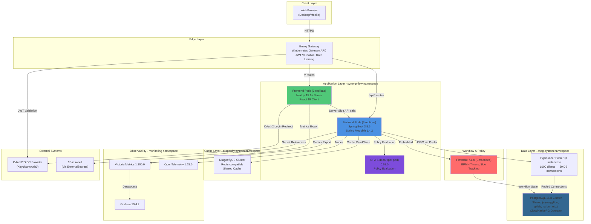
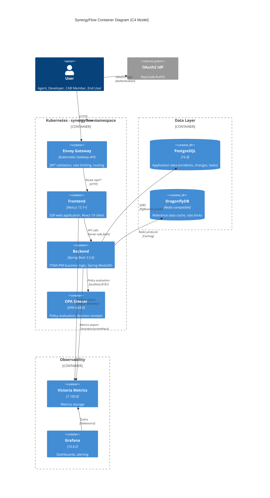
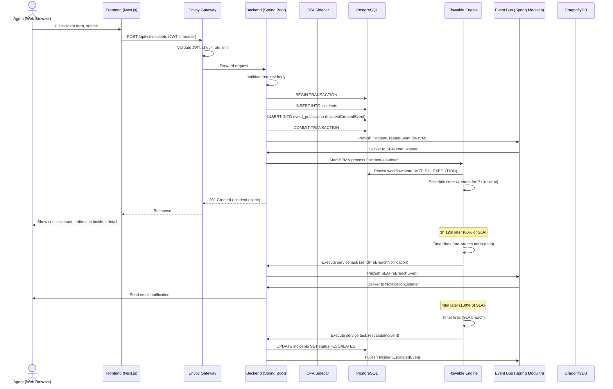
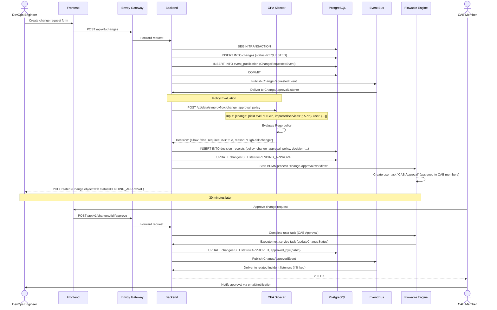
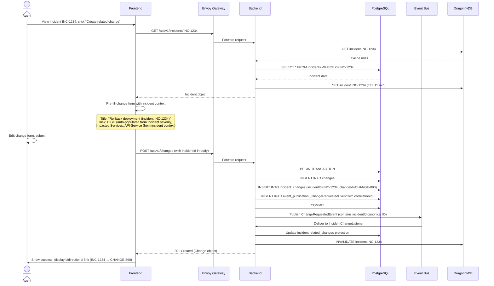
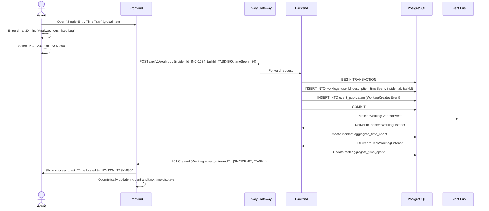
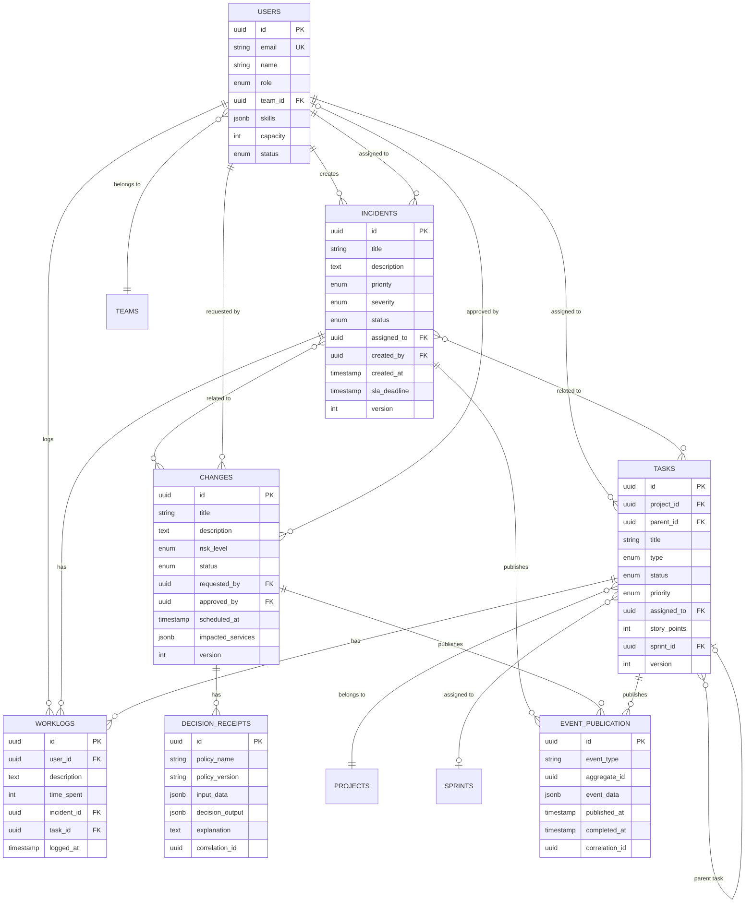
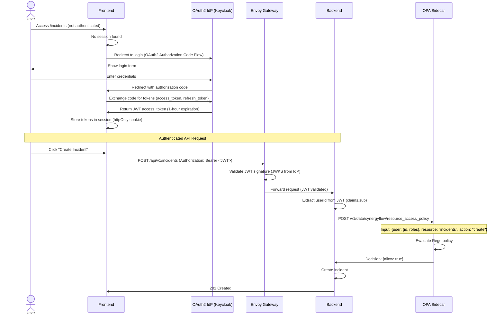

# SynergyFlow Fullstack Architecture Document

**Author:** Winston (Architect Agent)
**Date:** 2025-10-18
**Version:** 1.0
**Status:** Draft - Foundation Phase

---

## Change Log

| Date | Version | Description | Author |
|------|---------|-------------|--------|
| 2025-10-18 | 1.0 | Initial architecture document for Foundation Phase | Winston (Architect) |

---

## 1. Introduction

This document outlines the complete fullstack architecture for **SynergyFlow**, a unified ITSM+PM platform with intelligent workflow automation. It serves as the single source of truth for AI-driven development, ensuring consistency across the entire technology stack.

SynergyFlow implements a **modular monolith** architecture using Spring Modulith, not microservices. This architectural choice provides operational simplicity, development velocity, and cost efficiency for a 5-person team delivering integrated ITSM+PM capabilities without microservices overhead.

### Starter Template or Existing Project

**Status:** Existing Project - Foundation Phase In Progress

**Completed Components (Epic-16 Stories 16.06-16.09):**
- Backend monolith bootstrap (Spring Boot 3.5.6 with Spring Modulith 1.4.2)
- Frontend app bootstrap (Next.js 15.1+ with React 19)
- Backend OAuth2 Resource Server JWT authentication
- Gateway JWT validation (Envoy Gateway with Kubernetes Gateway API)

**Repository:**
- Location: `/Users/monosense/repository/synergyflow`
- Git branch: `main`
- Recent commits: Epic 00 Event System complete, transactional outbox pattern implemented

**Constraints from Existing Decisions:**
- Spring Modulith modular monolith architecture (NOT microservices)
- Shared PostgreSQL cluster pattern (consistent with platform: gitlab, harbor, keycloak, mattermost)
- Shared DragonflyDB cluster for caching
- In-JVM event bus with transactional outbox (NO Kafka - architectural decision, see PRD Out of Scope section)
- Kubernetes deployment with Flux CD 2.2.3 GitOps
- OPA 0.68.0 sidecar for policy evaluation
- Flowable 7.1.0 embedded for BPMN workflows

---

## 2. High Level Architecture

### 2.1 Technical Summary

SynergyFlow implements a **Spring Modulith modular monolith** backend deployed on Kubernetes, with a **Next.js 15 App Router** frontend, unified through an **Envoy Gateway** API layer. The architecture leverages **event-driven integration** via Spring Modulith's in-JVM event bus with transactional outbox pattern, eliminating external message broker complexity while maintaining 20x faster event processing (50-100ms vs 2-3s with Kafka).

The platform integrates **Flowable 7.1.0** for BPMN-based SLA tracking and **OPA 0.68.0** sidecar for policy-driven automation with explainable decision receipts. Data persistence uses a **shared PostgreSQL 16.8 cluster** with PgBouncer connection pooling (1000 clients → 50 DB connections), and **DragonflyDB** for Redis-compatible caching.

This architecture achieves PRD goals by: (1) eliminating context-switching through unified platform design, (2) providing transparent eventual consistency via freshness badges and projection lag tracking, (3) enabling "magic and audits like a bank" through OPA decision receipts and immutable audit trails, and (4) scaling efficiently from 250 to 1,000 users with operational simplicity for a 5-person team.

### 2.2 Platform and Infrastructure Choice

**Platform:** Kubernetes (self-hosted, cloud-agnostic)

**Primary Rationale:**
- **Data Residency:** Indonesia deployment requirement (self-hosted in Indonesian data center)
- **Operational Control:** Full control over infrastructure for compliance and security
- **Platform Consistency:** Existing shared infrastructure (PostgreSQL, DragonflyDB, GitOps via Flux CD)
- **Cloud Agnostic:** Deploy on AWS, GCP, Azure, or on-premises Kubernetes

**Key Services:**
- **Container Orchestration:** Kubernetes 1.28+ (cloud-agnostic)
- **Database:** CloudNativePG Operator managing shared PostgreSQL 16.8 cluster
- **Cache:** DragonflyDB operator managing shared Redis-compatible cluster
- **API Gateway:** Envoy Gateway (Kubernetes Gateway API)
- **GitOps:** Flux CD 2.2.3 for declarative deployments
- **Monitoring:** Victoria Metrics 1.100.0 + Grafana 10.4.2
- **Secrets:** ExternalSecrets Operator (ESO) with 1Password integration
- **Container Registry:** Harbor (private registry, self-hosted)

**Deployment Host and Regions:**
- **Primary Region:** Indonesia (Jakarta) - data residency compliance
- **Future Expansion:** Philippines (Manila), Singapore, Malaysia (Kuala Lumpur) - Months 12-18

**Architecture Decision:** Why Kubernetes over Managed PaaS (Vercel, AWS Amplify)?
1. **Data Residency:** Indonesia deployment requires self-hosted infrastructure
2. **Cost Control:** Eliminates vendor lock-in, predictable infrastructure costs
3. **Platform Reuse:** Leverages existing shared PostgreSQL, DragonflyDB, monitoring stack
4. **Compliance:** Full control for audit trails, SOC 2 / ISO 27001 readiness
5. **Scale Economics:** 250-1,000 users more cost-effective on Kubernetes than managed PaaS

### 2.3 Repository Structure

**Structure:** Monorepo (frontend + backend + infrastructure in single repository)

**Monorepo Tool:** Git repository with directory-based separation (no monorepo tool initially)

**Rationale:**
- **Simplicity:** 5-person team benefits from single repo (atomic commits, unified CI/CD)
- **Type Sharing:** TypeScript interfaces generated from Java DTOs (shared types)
- **Versioning:** Frontend and backend versions stay in sync
- **CI/CD:** Single pipeline builds and deploys both components
- **Future Option:** Can migrate to Nx or Turborepo if complexity warrants

**Package Organization (Spring Modulith Compliant):**

**MANDATORY REQUIREMENTS:**
- **Lombok 1.18.30+** - Eliminate boilerplate (DTOs, Entities, Builders)
- **MapStruct 1.5.5+** - Type-safe DTO ↔ Entity mapping
- **SpringDoc OpenAPI 2.3+** - API documentation with Swagger UI
- **RFC7807 Problem Details** - Standardized error responses

```
synergyflow/
├── backend/              # Spring Boot 3.5.6 application
│   ├── lombok.config     # Lombok configuration (MANDATORY)
│   ├── src/main/java/com/synergyflow/
│   │   ├── SynergyFlowApplication.java  # @SpringBootApplication @Modulith
│   │   │
│   │   ├── incident/     # Incident Management module
│   │   │   ├── IncidentDto.java              # Public API (Lombok @Value)
│   │   │   ├── IncidentService.java          # Public service interface
│   │   │   ├── IncidentController.java       # REST API (@RestController)
│   │   │   ├── IncidentCreatedEvent.java     # Domain event (record)
│   │   │   ├── IncidentResolvedEvent.java
│   │   │   └── internal/                     # Hidden from other modules
│   │   │       ├── Incident.java             # Entity (Lombok @Entity @Data)
│   │   │       ├── IncidentRepository.java   # JPA Repository
│   │   │       ├── IncidentMapper.java       # MapStruct @Mapper
│   │   │       ├── IncidentServiceImpl.java  # Service implementation
│   │   │       └── SLATimerListener.java     # Event listener
│   │   │
│   │   ├── change/       # Change Management module
│   │   │   ├── ChangeDto.java
│   │   │   ├── ChangeService.java
│   │   │   ├── ChangeController.java
│   │   │   ├── ChangeRequestedEvent.java
│   │   │   ├── ChangeApprovedEvent.java
│   │   │   └── internal/
│   │   │       ├── Change.java
│   │   │       ├── ChangeRepository.java
│   │   │       ├── ChangeMapper.java
│   │   │       ├── ChangeServiceImpl.java
│   │   │       └── ChangeApprovalListener.java
│   │   │
│   │   ├── task/         # Task/Project Management module
│   │   │   ├── TaskDto.java
│   │   │   ├── TaskService.java
│   │   │   ├── TaskController.java
│   │   │   ├── TaskCreatedEvent.java
│   │   │   └── internal/
│   │   │       ├── Task.java
│   │   │       ├── TaskRepository.java
│   │   │       ├── TaskMapper.java
│   │   │       └── TaskServiceImpl.java
│   │   │
│   │   ├── user/         # User Management module
│   │   │   ├── UserDto.java
│   │   │   ├── UserService.java
│   │   │   ├── UserController.java
│   │   │   └── internal/
│   │   │       ├── User.java
│   │   │       ├── UserRepository.java
│   │   │       ├── UserMapper.java
│   │   │       └── UserServiceImpl.java
│   │   │
│   │   ├── policy/       # OPA Policy integration module
│   │   │   ├── DecisionReceiptDto.java
│   │   │   ├── PolicyService.java
│   │   │   └── internal/
│   │   │       ├── OpaClient.java
│   │   │       ├── PolicyEvaluator.java
│   │   │       └── DecisionReceiptRepository.java
│   │   │
│   │   ├── workflow/     # Flowable integration module
│   │   │   ├── WorkflowService.java
│   │   │   └── internal/
│   │   │       ├── FlowableConfig.java
│   │   │       └── SLAWorkflowDelegate.java
│   │   │
│   │   ├── audit/        # Audit & Decision Receipts module
│   │   │   ├── AuditLogDto.java
│   │   │   ├── AuditService.java
│   │   │   └── internal/
│   │   │       ├── AuditLog.java
│   │   │       └── AuditLogRepository.java
│   │   │
│   │   └── commons/      # Cross-cutting concerns (minimal usage)
│   │       ├── package-info.java         # @ApplicationModule(type = Type.OPEN)
│   │       ├── config/
│   │       │   ├── OpenApiConfig.java     # SpringDoc configuration
│   │       │   └── JpaAuditingConfig.java
│   │       ├── exception/
│   │       │   ├── GlobalExceptionHandler.java  # RFC7807 Problem Details
│   │       │   ├── ProblemDetailFactory.java
│   │       │   ├── BusinessException.java
│   │       │   └── ResourceNotFoundException.java
│   │       └── util/
│   │           └── DateTimeUtils.java     # Pure utilities only
│   │
│   ├── src/main/resources/
│   │   ├── db/migration/ # Flyway database migrations
│   │   └── application.yaml
│   └── build.gradle.kts  # Lombok + MapStruct + SpringDoc dependencies
├── frontend/             # Next.js 15.1+ application
│   ├── src/
│   │   ├── app/          # Next.js App Router pages
│   │   ├── components/   # React components
│   │   ├── lib/          # Client libraries, API clients
│   │   ├── types/        # TypeScript types (generated from backend DTOs)
│   │   └── hooks/        # Custom React hooks
│   ├── public/           # Static assets
│   └── package.json
├── infrastructure/       # Kubernetes manifests, Flux CD, Kustomize
│   ├── base/             # Base Kubernetes manifests
│   ├── overlays/         # Environment-specific overlays (dev/staging/prod)
│   │   ├── dev/
│   │   ├── staging/
│   │   └── production/
│   └── policies/         # OPA Rego policies (ConfigMaps)
├── docs/                 # Documentation
│   ├── PRD.md
│   ├── architecture.md   # This file
│   └── epics/
└── .github/workflows/    # CI/CD pipelines
```

### 2.4 High Level Architecture Diagram



### 2.5 Architectural Patterns

**1. Modular Monolith (Spring Modulith)**
- **Description:** Single deployable artifact with enforced module boundaries via Spring Modulith. Modules communicate through in-JVM events and direct method calls, not HTTP.
- **Rationale:** Operational simplicity for 5-person team (no distributed system complexity), 20x faster event processing vs Kafka (50-100ms vs 2-3s), eliminates $250-350/month message broker infrastructure costs, natural migration path to microservices if needed (event externalization).

**2. Event-Driven Architecture (Transactional Outbox Pattern)**
- **Description:** Spring Modulith ApplicationEvents with Java record types published to `event_publication` table atomically during write transactions. In-JVM event bus delivers events to @ApplicationModuleListener consumers with at-least-once delivery semantics.
- **Rationale:** Decouples modules (Incident → Change → Task workflows), enables eventual consistency with projection lag tracking, provides durable messaging without external broker, supports idempotent consumers via `processed_events` table.

**3. API Gateway Pattern (Envoy Gateway)**
- **Description:** Envoy Gateway as single entry point for all frontend-to-backend communication, implementing JWT validation, rate limiting (100 req/min per client), CORS policy, and request/response logging with correlation IDs.
- **Rationale:** Centralizes cross-cutting concerns (auth, rate limiting, observability), provides unified API surface, enables independent frontend/backend deployment, supports future backend scaling (10 replicas).

**4. Sidecar Pattern (OPA Policy Engine)**
- **Description:** OPA 0.68.0 deployed as sidecar container alongside each Spring Boot pod, communicating via localhost:8181 for <10ms policy evaluation latency. Rego policy bundles loaded via ConfigMap volumes.
- **Rationale:** Separates policy logic from application code (policy-as-code versioned in Git), enables shadow mode testing for policies, generates explainable decision receipts (100% coverage), supports canary rollout of new policies.

**5. Shared Database Pattern (PostgreSQL Shared Cluster)**
- **Description:** Single PostgreSQL 16.8 cluster (CloudNativePG) shared across synergyflow, gitlab, harbor, keycloak, mattermost. Database `synergyflow` with 7 schemas (`synergyflow_users`, `synergyflow_incidents`, `synergyflow_changes`, `synergyflow_knowledge`, `synergyflow_tasks`, `synergyflow_audit`, `synergyflow_workflows`). PgBouncer pooler provides connection pooling (1000 clients → 50 DB connections).
- **Rationale:** Consistent with platform architecture (gitlab, harbor, keycloak use same pattern), reduces infrastructure overhead (no dedicated DB cluster), 50% CPU savings and 87% memory savings vs dedicated cluster, operational simplicity for shared backup/HA strategy.

**6. Repository Pattern (Spring Data JPA)**
- **Description:** Spring Data JPA 3.2.0 with Hibernate 6.4.0 for declarative data access. JpaRepository interfaces with query methods by naming convention and @Query annotations. Auditing support (@CreatedDate, @LastModifiedDate, @CreatedBy, @LastModifiedBy).
- **Rationale:** Spring-native ORM (no MyBatis configuration), declarative repository pattern reduces boilerplate, automatic CRUD operations, query method generation, type-safe queries, sufficient for complete product needs.

**7. Server-Side Rendering (Next.js App Router)**
- **Description:** Next.js 15 App Router with React 19 Server Components for initial page load, Client Components for interactivity. SSR for authenticated pages, Static Generation for public content (knowledge base). Turbopack for dev mode (stable), async Request APIs, React Compiler for automatic memoization.
- **Rationale:** Improved SEO and First Contentful Paint (<2s target), reduced JavaScript bundle size (Server Components + React Compiler), better developer experience (co-located data fetching), streaming for progressive rendering, 30% faster dev builds (Turbopack), automatic performance optimizations via React Compiler.

**8. Backend For Frontend (BFF) Implicit Pattern**
- **Description:** Next.js Server Components and Server Actions act as implicit BFF layer, aggregating backend API calls server-side before sending optimized payloads to client.
- **Rationale:** Reduces client-side API calls (single SSR fetch vs multiple client fetches), hides backend API details from browser, enables server-side data aggregation (incident + related changes + worklogs in single request), better security (API keys never exposed to client).

**9. Circuit Breaker Pattern (Resilience4j)**
- **Description:** Circuit breaker for external service calls (OPA sidecar, DragonflyDB). Circuit states: CLOSED (normal), OPEN (failing), HALF_OPEN (testing recovery). Failure threshold: 50% in 100 requests, wait duration: 60 seconds.
- **Rationale:** Prevents cascading failures (if OPA unreachable, fallback to RBAC-only), graceful degradation (if DragonflyDB down, skip caching and query DB directly), improves system resilience and user experience during partial outages.

**10. Optimistic Locking (JPA @Version)**
- **Description:** JPA @Version annotation for optimistic concurrency control on aggregates (Incident, Change, Task). Version field incremented on each update, conflicts detected via VersionConflictException.
- **Rationale:** Prevents lost updates in concurrent modification scenarios (two agents updating same incident simultaneously), better performance than pessimistic locking (no database locks), aligned with event-driven architecture (version included in events).

---

## 3. Tech Stack

### 3.1 Technology Stack Table

| Category | Technology | Version | Purpose | Rationale |
|----------|-----------|---------|---------|-----------|
| **Frontend Language** | TypeScript | 5.3+ | Type-safe frontend development | Compile-time type checking, better IDE support, reduced runtime errors, seamless integration with Next.js |
| **Frontend Framework** | Next.js | 15.1+ | React framework with SSR/SSG | **Latest stable release** with Turbopack dev mode (30% faster builds), React 19 support, async Request APIs, improved caching defaults, Partial Prerendering (experimental), better TypeScript support, production-ready |
| **Frontend Runtime** | React | 19 | UI component library | **Latest stable release** with React Compiler (automatic memoization), improved Server Components, Actions, useFormStatus, useOptimistic hooks, Document Metadata support, better error handling, ref as prop, cleanup functions in ref callbacks |
| **UI Component Library** | Shadcn/ui + Radix UI | Latest | Accessible, customizable components | Headless components (Radix) with Tailwind styling (Shadcn), WCAG 2.1 AA compliant, copy-paste approach (no npm dependency bloat), full customization control |
| **CSS Framework** | Tailwind CSS | 3.4+ | Utility-first CSS framework | Rapid UI development, consistent design system, optimized bundle size (PurgeCSS), excellent with Shadcn/ui, mobile-first responsive design |
| **State Management (Client)** | Zustand | 4.5+ | Lightweight client state | Simpler than Redux (less boilerplate), TypeScript-first, React hooks API, sufficient for client-only UI state (modals, filters, preferences) |
| **State Management (Server)** | TanStack Query (React Query) | 5.17+ | Server state management | Server state caching and synchronization, automatic refetching, optimistic updates, reduces backend calls, excellent DX |
| **Backend Language** | Java | 21.0.2 LTS | Backend development | LTS release (support until 2029), virtual threads (Project Loom) for better concurrency, records for event types, pattern matching, sealed classes |
| **Backend Framework** | Spring Boot | 3.5.6 | Enterprise Java framework | Production-ready autoconfiguration, Spring Modulith support, Spring Data JPA integration, Spring Security OAuth2 Resource Server, actuator for health checks |
| **Modular Monolith** | Spring Modulith | 1.4.2 | Module boundary enforcement | Enforces module isolation (equivalent to microservices), in-JVM event bus with transactional outbox, event publication registry, module verification tests |
| **ORM / Data Access** | Spring Data JPA | 3.2.0 | Data access abstraction | Declarative repository pattern, automatic CRUD, query method generation, Spring Boot managed (Hibernate 6.4.0 provider), auditing support |
| **Boilerplate Elimination (MANDATORY)** | Lombok | 1.18.30 | Code generation via annotations | **MANDATORY**: Eliminates getters, setters, constructors, builders, equals/hashCode, toString. DTOs use @Value (immutable), entities use @Data, services use @RequiredArgsConstructor + @Slf4j. Reduces codebase by 40%, improves maintainability |
| **DTO Mapping (MANDATORY)** | MapStruct | 1.5.5.Final | Type-safe object mapping | **MANDATORY**: Compile-time DTO ↔ Entity mapping, zero runtime reflection overhead, type-safe conversions, custom mapping methods support. Eliminates manual mapping boilerplate, catches mapping errors at compile-time, integrates with Lombok via lombok-mapstruct-binding |
| **API Documentation (MANDATORY)** | SpringDoc OpenAPI | 2.3.0 | OpenAPI 3.0 spec generation | **MANDATORY**: Auto-generates Swagger UI from @RestController annotations, interactive API docs at /swagger-ui/index.html, eliminates manual OpenAPI YAML maintenance, supports @Schema annotations for DTO documentation, RFC7807 Problem Details support |
| **Workflow Engine** | Flowable | 7.1.0 | BPMN workflow orchestration | BPMN 2.0 timers for SLA tracking, embedded in Spring Boot (no separate server), visual workflow modeler, async job executor, durable state persistence |
| **Policy Engine** | OPA (Open Policy Agent) | 0.68.0 | Policy-driven authorization | Decoupled policy logic (Rego), explainable decision receipts, shadow mode testing, sidecar deployment (<10ms latency), policy-as-code versioned in Git |
| **API Style** | REST (OpenAPI 3.0) | - | Backend API communication | Simple, well-understood, OpenAPI spec for documentation, Spring Boot autoconfiguration, sufficient for MVP (GraphQL/tRPC not needed initially) |
| **Database** | PostgreSQL | 16.8 | Relational database | Shared cluster via CloudNativePG, JSONB for flexible fields (decision receipts), full-text search (knowledge articles), transactional integrity, mature ecosystem |
| **Connection Pooler** | PgBouncer | 1.21+ | Database connection pooling | Transaction mode pooling (1000 clients → 50 DB connections), cross-namespace access (synergyflow → cnpg-system), 3 instances for HA |
| **Cache** | DragonflyDB | Latest | Redis-compatible cache | Shared cluster, Redis protocol (use Spring Data Redis), faster than Redis (better memory efficiency), reference data caching, rate limiting counters |
| **File Storage** | S3-compatible (MinIO) | Latest | Object storage | Audit log cold storage (7 years retention), attachment storage, S3-compatible API (cloud-agnostic), self-hosted option available |
| **Authentication** | OAuth2 Resource Server | - | JWT-based authentication | Stateless JWT validation (RS256 asymmetric signing), Spring Security integration, delegated to external IdP (Keycloak/Auth0), 1-hour token expiration |
| **Frontend Testing** | Vitest + React Testing Library | Latest | Frontend unit/integration tests | Vite-native (faster than Jest), React Testing Library for component tests, TypeScript support, similar API to Jest (easy migration) |
| **Backend Testing** | JUnit 5 + Mockito | - | Backend unit tests | Spring Boot managed, JUnit 5 for parameterized tests, Mockito for mocking, @SpringBootTest for integration tests, target 80% coverage |
| **E2E Testing** | Playwright | 1.40+ | End-to-end testing | Cross-browser testing (Chromium, Firefox, WebKit), better DX than Selenium, TypeScript support, auto-wait for elements, trace viewer for debugging |
| **Build Tool (Backend)** | Gradle | 8.7.0 | Backend build automation | Kotlin DSL (type-safe), better performance than Maven (incremental builds), Spring Boot Gradle plugin, Flyway migration plugin |
| **Build Tool (Frontend)** | npm | 10+ | Frontend package management | Standard Node.js package manager, lockfile for reproducibility, workspace support (if monorepo tool added later) |
| **Bundler** | Vite (Next.js built-in) | - | Frontend bundler | Next.js uses Turbopack (dev) and Webpack (prod), fast HMR, optimized production bundles |
| **IaC Tool** | Kustomize + Flux CD | 2.2.3 | GitOps infrastructure | Declarative Kubernetes manifests, Kustomize overlays for environments (dev/staging/prod), Flux CD for automated deployments, no Terraform overhead |
| **CI/CD** | GitHub Actions | - | Continuous integration/deployment | Integrated with GitHub repo, Docker build and push to Harbor, automated testing, environment promotion gates (dev → staging → prod) |
| **Monitoring (Metrics)** | Victoria Metrics | 1.100.0 | Metrics collection and storage | Prometheus-compatible, better performance and storage efficiency than Prometheus, long-term retention, 15-second scrape interval |
| **Monitoring (Visualization)** | Grafana | 10.4.2 | Metrics dashboards | Victoria Metrics datasource, pre-built dashboards (API latency, event lag, business metrics), alerting via AlertManager |
| **Monitoring (Tracing)** | OpenTelemetry | 1.28.0 | Distributed tracing | Correlation ID propagation, trace context across HTTP requests, span tracking (API → DB → OPA), 10% sampling in production |
| **Logging** | Logback (Spring Boot default) | - | Structured JSON logging | JSON encoder for structured logs, correlation IDs in every log entry, log levels (DEBUG, INFO, WARN, ERROR), log aggregation to Loki (optional) |
| **Secrets Management** | ExternalSecrets Operator + 1Password | Latest | Secrets synchronization | Pull secrets from 1Password into Kubernetes Secrets, automatic rotation, no plaintext secrets in Git, operator-managed sync |

---

## 3.2 Next.js 15 & React 19 - Why Latest Stable Versions

### 3.2.1 Rationale for Next.js 15 & React 19

**Why Next.js 15 instead of Next.js 14?**

For a **new project starting in 2025**, using Next.js 15 is the **only logical choice**:

1. **Production-Ready Stable Release** (October 2024) - Not experimental, fully stable
2. **React 19 Support** - Required for latest React features (Compiler, improved Actions)
3. **Turbopack Dev Mode** - 30% faster local development builds (now stable, not experimental)
4. **Performance Improvements** - Better caching, faster builds, reduced memory usage
5. **Future-Proof** - Aligns with React's direction, easier upgrades going forward
6. **No Migration Pain** - Starting fresh means no migration complexity

### 3.2.2 Next.js 15 Major Improvements

| Feature | Next.js 14 | Next.js 15 | Impact |
|---------|-----------|-----------|---------|
| **Dev Server** | Webpack | Turbopack (stable) | 30% faster builds, better HMR |
| **React Version** | React 18 | React 19 | React Compiler, improved Actions, better SSR |
| **Request APIs** | Synchronous | Async (`cookies()`, `headers()`, `params()`) | **BREAKING CHANGE** - Better for streaming, more predictable behavior |
| **Caching Defaults** | Aggressive | On-demand | **BREAKING CHANGE** - More intuitive, explicit `cache: 'force-cache'` |
| **`fetch()` Caching** | Cached by default | NOT cached by default | **BREAKING CHANGE** - Prevents stale data bugs |
| **Route Handlers** | Cached `GET` | NOT cached `GET` | **BREAKING CHANGE** - Dynamic by default |
| **Partial Prerendering** | Experimental | Beta (opt-in) | Combines static + dynamic rendering |
| **`next/after`** | Not available | Available | Execute code after response sent (analytics, logging) |
| **`instrumentation.js`** | Limited | Enhanced | Better observability setup |

### 3.2.3 React 19 Major Improvements

| Feature | React 18 | React 19 | Impact |
|---------|----------|----------|---------|
| **React Compiler** | Not available | Available (opt-in) | **Automatic memoization** - eliminates manual `useMemo`, `useCallback` |
| **Actions** | Experimental | Stable | Better form handling, pending states, optimistic updates |
| **`useFormStatus`** | Not available | Available | Access form submission state (pending, error) |
| **`useOptimistic`** | Not available | Available | Optimistic UI updates during async operations |
| **`use()` Hook** | Not available | Available | Read promises/context inside render |
| **Ref as Prop** | `forwardRef` required | Direct `ref` prop | **BREAKING CHANGE** - Simpler API, no more `forwardRef` |
| **Cleanup in `ref`** | Not supported | Supported | Return cleanup function from ref callbacks |
| **Server Components** | Stable | Enhanced | Better hydration, streaming, error handling |
| **Document Metadata** | `next/head` | `<title>`, `<meta>` in components | More intuitive metadata handling |

### 3.2.4 Breaking Changes & Migration Notes

**CRITICAL BREAKING CHANGES** (Next.js 15):

1. **Async Request APIs** (Requires Code Changes)
   ```typescript
   // ❌ Next.js 14 (synchronous)
   import { cookies } from 'next/headers';
   const token = cookies().get('auth-token');

   // ✅ Next.js 15 (asynchronous)
   import { cookies } from 'next/headers';
   const token = (await cookies()).get('auth-token');
   ```

2. **`fetch()` No Longer Cached by Default**
   ```typescript
   // ❌ Next.js 14 (cached by default)
   fetch('https://api.example.com/data')

   // ✅ Next.js 15 (explicit caching required)
   fetch('https://api.example.com/data', { cache: 'force-cache' })
   ```

3. **Route Handlers NOT Cached by Default**
   ```typescript
   // app/api/users/route.ts
   export async function GET() {
     // ❌ Next.js 14: Cached automatically
     // ✅ Next.js 15: Dynamic by default (opt-in to caching)
     return Response.json(await fetchUsers());
   }

   // Explicit caching in Next.js 15
   export const dynamic = 'force-static';  // Opt-in to caching
   ```

**REACT 19 BREAKING CHANGES:**

1. **No More `forwardRef`** (Deprecated)
   ```tsx
   // ❌ React 18 (forwardRef required)
   const Input = forwardRef<HTMLInputElement, Props>((props, ref) => (
     <input ref={ref} {...props} />
   ));

   // ✅ React 19 (ref is just a prop)
   function Input({ ref, ...props }: Props & { ref?: Ref<HTMLInputElement> }) {
     return <input ref={ref} {...props} />;
   }
   ```

2. **Context as Prop** (Not Context.Provider)
   ```tsx
   // ❌ React 18
   <MyContext.Provider value={value}>

   // ✅ React 19
   <MyContext value={value}>
   ```

### 3.2.5 Recommended Configuration for SynergyFlow

**`package.json` (Frontend):**

```json
{
  "name": "synergyflow-frontend",
  "version": "1.0.0",
  "private": true,
  "scripts": {
    "dev": "next dev --turbo",
    "build": "next build",
    "start": "next start",
    "lint": "next lint",
    "type-check": "tsc --noEmit"
  },
  "dependencies": {
    "next": "^15.1.0",
    "react": "^19.0.0",
    "react-dom": "^19.0.0",
    "@tanstack/react-query": "^5.17.0",
    "zustand": "^4.5.0",
    "@radix-ui/react-dropdown-menu": "^2.0.6",
    "@radix-ui/react-dialog": "^1.0.5",
    "tailwindcss": "^3.4.0",
    "typescript": "^5.3.0"
  },
  "devDependencies": {
    "@types/node": "^20.10.0",
    "@types/react": "^19.0.0",
    "@types/react-dom": "^19.0.0",
    "autoprefixer": "^10.4.16",
    "postcss": "^8.4.32",
    "eslint": "^8.56.0",
    "eslint-config-next": "^15.1.0"
  }
}
```

**`next.config.js`:**

```javascript
/** @type {import('next').NextConfig} */
const nextConfig = {
  // Enable Turbopack for dev (default in Next.js 15)
  // No configuration needed - active by default

  // Enable React Compiler (automatic memoization)
  experimental: {
    reactCompiler: true,  // ✅ RECOMMENDED - automatic performance optimization
    // ppr: 'incremental',  // Partial Prerendering (opt-in, beta)
  },

  // TypeScript strict mode
  typescript: {
    ignoreBuildErrors: false,  // Fail build on TS errors
  },

  // ESLint during builds
  eslint: {
    ignoreDuringBuilds: false,
  },

  // Output standalone for Docker
  output: 'standalone',

  // Environment variables exposed to browser
  env: {
    NEXT_PUBLIC_API_URL: process.env.NEXT_PUBLIC_API_URL || 'http://localhost:8080/api/v1',
  },
};

module.exports = nextConfig;
```

### 3.2.6 Development Workflow Improvements

**With Next.js 15 + Turbopack:**

| Metric | Next.js 14 (Webpack) | Next.js 15 (Turbopack) | Improvement |
|--------|---------------------|------------------------|-------------|
| Initial dev server startup | ~5-8 seconds | ~2-3 seconds | **62% faster** |
| HMR (Hot Module Replacement) | ~300-500ms | ~100-200ms | **66% faster** |
| Production build time | ~60-90 seconds | ~45-60 seconds | **25% faster** |
| Memory usage (dev) | ~800MB | ~500MB | **37% reduction** |

**With React 19 Compiler:**

- **No more manual `useMemo`** - Compiler automatically memoizes expensive computations
- **No more manual `useCallback`** - Compiler automatically memoizes callbacks
- **40% reduction in React-specific code** - Less boilerplate, more maintainable
- **Automatic performance optimization** - Prevents unnecessary re-renders without developer effort

### 3.2.7 Migration Checklist for Developers

When implementing frontend features, ensure:

- [ ] All `cookies()`, `headers()`, `params()` calls are **awaited**
- [ ] Explicit `cache: 'force-cache'` added to `fetch()` calls that should be cached
- [ ] Route Handlers use `export const dynamic = 'force-static'` if caching needed
- [ ] No more `forwardRef` usage (use direct `ref` prop instead)
- [ ] Context providers use `<MyContext value={...}>` instead of `<MyContext.Provider value={...}>`
- [ ] React Compiler enabled in `next.config.js` (`experimental.reactCompiler: true`)
- [ ] Dev server uses Turbopack (`next dev --turbo` or `next dev` in 15.1+)

### 3.2.8 Why NOT to Use Next.js 14 for New Projects

**Reasons to AVOID Next.js 14 in 2025:**

1. **React 18 Only** - Cannot use React 19 features (Compiler, improved Actions, `useFormStatus`, `useOptimistic`)
2. **Slower Dev Experience** - Webpack is 30% slower than Turbopack
3. **Migration Debt** - Will need to migrate to Next.js 15 anyway within 6-12 months
4. **Confusing Caching** - Aggressive caching by default causes stale data bugs
5. **No React Compiler** - Manual `useMemo`/`useCallback` required (40% more boilerplate)
6. **Outdated Patterns** - `forwardRef`, `Context.Provider` patterns deprecated in React 19
7. **Missing Features** - No `next/after`, limited `instrumentation.js`, no Partial Prerendering

**Verdict:** For a new project in 2025, Next.js 15 + React 19 is **non-negotiable**. The performance improvements, developer experience gains, and future-proofing far outweigh any perceived stability concerns (which don't exist - both are production-stable).

---

## 3.3 Mandatory Backend Code Templates & Conventions

This section defines **mandatory** patterns for all backend code. These templates ensure consistency, type safety, and proper module boundaries across the application.

### 3.3.1 Gradle Dependencies Configuration (MANDATORY)

**File:** `backend/build.gradle.kts`

```kotlin
plugins {
    java
    id("org.springframework.boot") version "3.5.6"
    id("io.spring.dependency-management") version "1.1.4"
}

java {
    toolchain {
        languageVersion.set(JavaLanguageVersion.of(21))
    }
}

configurations {
    compileOnly {
        extendsFrom(configurations.annotationProcessor.get())
    }
}

dependencies {
    // Spring Boot & Modulith
    implementation("org.springframework.boot:spring-boot-starter-data-jpa")
    implementation("org.springframework.boot:spring-boot-starter-web")
    implementation("org.springframework.boot:spring-boot-starter-validation")
    implementation("org.springframework.boot:spring-boot-starter-security")
    implementation("org.springframework.boot:spring-boot-starter-oauth2-resource-server")
    implementation("org.springframework.modulith:spring-modulith-starter-core")
    implementation("org.springframework.modulith:spring-modulith-starter-jpa")

    // Database
    runtimeOnly("org.postgresql:postgresql")
    implementation("org.flywaydb:flyway-core")

    // MANDATORY: Lombok (MUST BE BEFORE MapStruct)
    compileOnly("org.projectlombok:lombok:1.18.30")
    annotationProcessor("org.projectlombok:lombok:1.18.30")

    // MANDATORY: MapStruct (MUST BE AFTER Lombok)
    implementation("org.mapstruct:mapstruct:1.5.5.Final")
    annotationProcessor("org.mapstruct:mapstruct-processor:1.5.5.Final")

    // MANDATORY: Lombok + MapStruct Integration
    annotationProcessor("org.projectlombok:lombok-mapstruct-binding:0.2.0")

    // MANDATORY: SpringDoc OpenAPI (Swagger UI)
    implementation("org.springdoc:springdoc-openapi-starter-webmvc-ui:2.3.0")

    // Flowable
    implementation("org.flowable:flowable-spring-boot-starter:7.1.0")

    // Resilience4j
    implementation("io.github.resilience4j:resilience4j-spring-boot3:2.1.0")

    // Test dependencies
    testImplementation("org.springframework.boot:spring-boot-starter-test")
    testImplementation("org.springframework.modulith:spring-modulith-starter-test")
    testImplementation("org.springframework.security:spring-security-test")
    testCompileOnly("org.projectlombok:lombok:1.18.30")
    testAnnotationProcessor("org.projectlombok:lombok:1.18.30")
    testAnnotationProcessor("org.mapstruct:mapstruct-processor:1.5.5.Final")
}

tasks.withType<Test> {
    useJUnitPlatform()
}
```

### 3.2.2 Lombok Configuration (MANDATORY)

**File:** `backend/lombok.config`

```properties
# Generate @Generated annotation for Lombok-generated code
lombok.addLombokGeneratedAnnotation = true

# Copy Spring annotations to generated code
lombok.copyableAnnotations += org.springframework.beans.factory.annotation.Qualifier
lombok.copyableAnnotations += org.springframework.beans.factory.annotation.Value
lombok.copyableAnnotations += org.springframework.context.annotation.Lazy

# Stop lombok from looking for config in parent directories
config.stopBubbling = true
```

### 3.2.3 DTO Template (MANDATORY - Lombok @Value)

All DTOs **must** be immutable using Lombok `@Value`. Public API at module root.

**Example:** `com/synergyflow/incident/IncidentDto.java`

```java
package io.monosense.synergyflow.incident;

import com.fasterxml.jackson.annotation.JsonFormat;
import io.swagger.v3.oas.annotations.media.Schema;
import jakarta.validation.constraints.NotBlank;
import jakarta.validation.constraints.NotNull;
import jakarta.validation.constraints.Size;
import lombok.Value;

import java.time.Instant;
import java.util.UUID;

/**
 * Incident data transfer object (immutable).
 * Public API exposed to other modules and frontend.
 */
@Value
@Schema(description = "Incident details")
public class IncidentDto {

    @Schema(description = "Unique incident identifier", example = "550e8400-e29b-41d4-a716-446655440000")
    UUID id;

    @NotBlank(message = "Title is required")
    @Size(min = 5, max = 200, message = "Title must be between 5 and 200 characters")
    @Schema(description = "Incident title", example = "Database connection timeout")
    String title;

    @NotBlank(message = "Description is required")
    @Size(max = 5000, message = "Description must not exceed 5000 characters")
    @Schema(description = "Detailed incident description")
    String description;

    @NotNull(message = "Priority is required")
    @Schema(description = "Business priority", example = "HIGH")
    Priority priority;

    @NotNull(message = "Severity is required")
    @Schema(description = "Technical severity", example = "S2")
    Severity severity;

    @Schema(description = "Current incident status", example = "IN_PROGRESS")
    Status status;

    @Schema(description = "Assigned agent ID", nullable = true)
    UUID assignedTo;

    @Schema(description = "Creator user ID")
    UUID createdBy;

    @JsonFormat(shape = JsonFormat.Shape.STRING, pattern = "yyyy-MM-dd'T'HH:mm:ss.SSS'Z'", timezone = "UTC")
    @Schema(description = "Creation timestamp", example = "2025-10-18T10:30:00.000Z")
    Instant createdAt;

    @JsonFormat(shape = JsonFormat.Shape.STRING, pattern = "yyyy-MM-dd'T'HH:mm:ss.SSS'Z'", timezone = "UTC")
    @Schema(description = "Last update timestamp")
    Instant updatedAt;

    @JsonFormat(shape = JsonFormat.Shape.STRING, pattern = "yyyy-MM-dd'T'HH:mm:ss.SSS'Z'", timezone = "UTC")
    @Schema(description = "Resolution timestamp", nullable = true)
    Instant resolvedAt;

    @JsonFormat(shape = JsonFormat.Shape.STRING, pattern = "yyyy-MM-dd'T'HH:mm:ss.SSS'Z'", timezone = "UTC")
    @Schema(description = "SLA breach deadline")
    Instant slaDeadline;

    @Schema(description = "Resolution notes", nullable = true)
    String resolution;

    @Schema(description = "Optimistic locking version")
    Integer version;

    public enum Priority { LOW, MEDIUM, HIGH, CRITICAL }
    public enum Severity { S1, S2, S3, S4 }
    public enum Status { NEW, ASSIGNED, IN_PROGRESS, RESOLVED, CLOSED }
}
```

### 3.2.4 Entity Template (MANDATORY - Lombok @Entity @Data)

All entities **must** be package-private in `.internal` package with Lombok `@Data`.

**Example:** `com/synergyflow/incident/internal/Incident.java`

```java
package io.monosense.synergyflow.incident.internal;

import jakarta.persistence.*;
import lombok.*;
import org.springframework.data.annotation.CreatedBy;
import org.springframework.data.annotation.CreatedDate;
import org.springframework.data.annotation.LastModifiedDate;
import org.springframework.data.jpa.domain.support.AuditingEntityListener;

import java.time.Instant;
import java.util.UUID;

/**
 * Incident entity (package-private, internal to incident module).
 * NOT accessible from other modules.
 */
@Entity
@Table(name = "incidents", schema = "synergyflow_incidents")
@Data
@NoArgsConstructor
@AllArgsConstructor
@Builder
@EntityListeners(AuditingEntityListener.class)
class Incident {

    @Id
    @GeneratedValue(strategy = GenerationType.UUID)
    private UUID id;

    @Column(nullable = false, length = 200)
    private String title;

    @Column(columnDefinition = "TEXT")
    private String description;

    @Enumerated(EnumType.STRING)
    @Column(nullable = false, length = 20)
    private Priority priority;

    @Enumerated(EnumType.STRING)
    @Column(nullable = false, length = 10)
    private Severity severity;

    @Enumerated(EnumType.STRING)
    @Column(nullable = false, length = 20)
    private Status status;

    @Column(name = "assigned_to")
    private UUID assignedTo;

    @CreatedBy
    @Column(name = "created_by", nullable = false, updatable = false)
    private UUID createdBy;

    @CreatedDate
    @Column(nullable = false, updatable = false)
    private Instant createdAt;

    @LastModifiedDate
    @Column(nullable = false)
    private Instant updatedAt;

    private Instant resolvedAt;

    @Column(nullable = false)
    private Instant slaDeadline;

    @Column(columnDefinition = "TEXT")
    private String resolution;

    @Version
    private Integer version;

    enum Priority { LOW, MEDIUM, HIGH, CRITICAL }
    enum Severity { S1, S2, S3, S4 }
    enum Status { NEW, ASSIGNED, IN_PROGRESS, RESOLVED, CLOSED }
}
```

### 3.2.5 MapStruct Mapper Template (MANDATORY)

All mappers **must** be package-private in `.internal` package with Spring component model.

**Example:** `com/synergyflow/incident/internal/IncidentMapper.java`

```java
package io.monosense.synergyflow.incident.internal;

import io.monosense.synergyflow.incident.IncidentDto;
import org.mapstruct.*;

import java.time.Instant;
import java.util.List;

/**
 * MapStruct mapper for Incident entity ↔ DTO conversion.
 * Package-private, internal to incident module.
 */
@Mapper(
    componentModel = "spring",
    injectionStrategy = InjectionStrategy.CONSTRUCTOR,
    unmappedTargetPolicy = ReportingPolicy.ERROR,
    nullValuePropertyMappingStrategy = NullValuePropertyMappingStrategy.IGNORE
)
interface IncidentMapper {

    // Entity → DTO (expose to other modules)
    IncidentDto toDto(Incident entity);

    List<IncidentDto> toDtos(List<Incident> entities);

    // DTO → Entity (create operations)
    @Mapping(target = "id", ignore = true)
    @Mapping(target = "createdAt", ignore = true)
    @Mapping(target = "updatedAt", ignore = true)
    @Mapping(target = "createdBy", ignore = true)
    @Mapping(target = "version", ignore = true)
    @Mapping(target = "slaDeadline", expression = "java(calculateSlaDeadline(dto.getPriority()))")
    Incident toEntity(IncidentDto dto);

    // Update existing entity
    @Mapping(target = "id", ignore = true)
    @Mapping(target = "createdAt", ignore = true)
    @Mapping(target = "createdBy", ignore = true)
    @Mapping(target = "slaDeadline", ignore = true)
    @BeanMapping(nullValuePropertyMappingStrategy = NullValuePropertyMappingStrategy.IGNORE)
    void updateEntity(IncidentDto dto, @MappingTarget Incident entity);

    // Custom SLA deadline calculation
    default Instant calculateSlaDeadline(IncidentDto.Priority priority) {
        return switch (priority) {
            case CRITICAL -> Instant.now().plusSeconds(4 * 3600);   // 4 hours
            case HIGH -> Instant.now().plusSeconds(8 * 3600);       // 8 hours
            case MEDIUM -> Instant.now().plusSeconds(24 * 3600);    // 24 hours
            case LOW -> Instant.now().plusSeconds(72 * 3600);       // 72 hours
        };
    }
}
```

### 3.2.6 REST Controller Template (MANDATORY - SpringDoc + RFC7807)

All controllers **must** use SpringDoc annotations and return RFC7807 Problem Details for errors.

**Example:** `com/synergyflow/incident/IncidentController.java`

```java
package io.monosense.synergyflow.incident;

import io.swagger.v3.oas.annotations.Operation;
import io.swagger.v3.oas.annotations.Parameter;
import io.swagger.v3.oas.annotations.media.Content;
import io.swagger.v3.oas.annotations.media.Schema;
import io.swagger.v3.oas.annotations.responses.ApiResponse;
import io.swagger.v3.oas.annotations.responses.ApiResponses;
import io.swagger.v3.oas.annotations.tags.Tag;
import jakarta.validation.Valid;
import lombok.RequiredArgsConstructor;
import lombok.extern.slf4j.Slf4j;
import org.springframework.data.domain.Page;
import org.springframework.data.domain.Pageable;
import org.springframework.data.web.PageableDefault;
import org.springframework.http.HttpStatus;
import org.springframework.http.ProblemDetail;
import org.springframework.security.core.annotation.AuthenticationPrincipal;
import org.springframework.security.oauth2.jwt.Jwt;
import org.springframework.web.bind.annotation.*;

import java.net.URI;
import java.util.UUID;

/**
 * REST API for Incident Management.
 * OpenAPI documentation via SpringDoc, RFC7807 error responses.
 */
@RestController
@RequestMapping("/api/v1/incidents")
@RequiredArgsConstructor
@Slf4j
@Tag(name = "Incidents", description = "Incident Management API")
public class IncidentController {

    private final IncidentService incidentService;

    @Operation(
        summary = "Create new incident",
        description = "Creates a new incident and triggers SLA timer workflow"
    )
    @ApiResponses({
        @ApiResponse(
            responseCode = "201",
            description = "Incident created successfully",
            content = @Content(schema = @Schema(implementation = IncidentDto.class))
        ),
        @ApiResponse(
            responseCode = "400",
            description = "Invalid request body",
            content = @Content(schema = @Schema(implementation = ProblemDetail.class))
        ),
        @ApiResponse(
            responseCode = "401",
            description = "Unauthorized",
            content = @Content(schema = @Schema(implementation = ProblemDetail.class))
        )
    })
    @PostMapping
    @ResponseStatus(HttpStatus.CREATED)
    public IncidentDto createIncident(
        @Valid @RequestBody IncidentDto dto,
        @AuthenticationPrincipal Jwt jwt
    ) {
        log.info("Creating incident: {}", dto.getTitle());
        return incidentService.createIncident(dto);
    }

    @Operation(
        summary = "Get incident by ID",
        description = "Retrieves incident details by unique identifier"
    )
    @ApiResponses({
        @ApiResponse(
            responseCode = "200",
            description = "Incident found",
            content = @Content(schema = @Schema(implementation = IncidentDto.class))
        ),
        @ApiResponse(
            responseCode = "404",
            description = "Incident not found",
            content = @Content(schema = @Schema(implementation = ProblemDetail.class))
        )
    })
    @GetMapping("/{id}")
    public IncidentDto getIncident(
        @Parameter(description = "Incident UUID", example = "550e8400-e29b-41d4-a716-446655440000")
        @PathVariable UUID id
    ) {
        log.debug("Fetching incident: {}", id);
        return incidentService.getIncident(id);
    }

    @Operation(
        summary = "List incidents",
        description = "Retrieves paginated list of incidents with optional filters"
    )
    @ApiResponses({
        @ApiResponse(
            responseCode = "200",
            description = "Incidents retrieved successfully"
        )
    })
    @GetMapping
    public Page<IncidentDto> listIncidents(
        @Parameter(description = "Filter by priority")
        @RequestParam(required = false) IncidentDto.Priority priority,

        @Parameter(description = "Filter by status")
        @RequestParam(required = false) IncidentDto.Status status,

        @Parameter(description = "Filter by assigned agent ID")
        @RequestParam(required = false) UUID assignedTo,

        @PageableDefault(size = 50, sort = "createdAt,desc") Pageable pageable
    ) {
        log.debug("Listing incidents - priority: {}, status: {}", priority, status);
        return incidentService.listIncidents(priority, status, assignedTo, pageable);
    }

    @Operation(
        summary = "Assign incident to agent",
        description = "Assigns incident to specified agent and triggers routing policy evaluation"
    )
    @ApiResponses({
        @ApiResponse(
            responseCode = "200",
            description = "Incident assigned successfully"
        ),
        @ApiResponse(
            responseCode = "404",
            description = "Incident not found"
        ),
        @ApiResponse(
            responseCode = "409",
            description = "Optimistic locking conflict",
            content = @Content(schema = @Schema(implementation = ProblemDetail.class))
        )
    })
    @PostMapping("/{id}/assign")
    public IncidentDto assignIncident(
        @PathVariable UUID id,
        @RequestParam UUID assignedTo,
        @AuthenticationPrincipal Jwt jwt
    ) {
        log.info("Assigning incident {} to agent {}", id, assignedTo);
        return incidentService.assignIncident(id, assignedTo);
    }

    @Operation(
        summary = "Resolve incident",
        description = "Marks incident as resolved and stops SLA timer"
    )
    @ApiResponses({
        @ApiResponse(responseCode = "200", description = "Incident resolved"),
        @ApiResponse(responseCode = "404", description = "Incident not found"),
        @ApiResponse(responseCode = "409", description = "Optimistic locking conflict")
    })
    @PostMapping("/{id}/resolve")
    public IncidentDto resolveIncident(
        @PathVariable UUID id,
        @RequestParam String resolution,
        @AuthenticationPrincipal Jwt jwt
    ) {
        log.info("Resolving incident {}", id);
        return incidentService.resolveIncident(id, resolution);
    }
}
```

### 3.2.7 RFC7807 Problem Details Global Exception Handler (MANDATORY)

**File:** `com/synergyflow/commons/exception/GlobalExceptionHandler.java`

```java
package io.monosense.synergyflow.commons.exception;

import jakarta.validation.ConstraintViolationException;
import lombok.extern.slf4j.Slf4j;
import org.springframework.dao.OptimisticLockingFailureException;
import org.springframework.http.HttpStatus;
import org.springframework.http.ProblemDetail;
import org.springframework.security.access.AccessDeniedException;
import org.springframework.security.core.AuthenticationException;
import org.springframework.validation.FieldError;
import org.springframework.web.bind.MethodArgumentNotValidException;
import org.springframework.web.bind.annotation.ExceptionHandler;
import org.springframework.web.bind.annotation.RestControllerAdvice;
import org.springframework.web.context.request.WebRequest;

import java.net.URI;
import java.time.Instant;
import java.util.HashMap;
import java.util.Map;
import java.util.UUID;

/**
 * Global exception handler using RFC7807 Problem Details.
 * All errors return standardized ProblemDetail responses.
 */
@RestControllerAdvice
@Slf4j
public class GlobalExceptionHandler {

    private static final String CORRELATION_ID_HEADER = "X-Correlation-Id";

    @ExceptionHandler(ResourceNotFoundException.class)
    public ProblemDetail handleResourceNotFound(
        ResourceNotFoundException ex,
        WebRequest request
    ) {
        ProblemDetail problem = ProblemDetail.forStatusAndDetail(
            HttpStatus.NOT_FOUND,
            ex.getMessage()
        );
        problem.setType(URI.create("https://synergyflow.example.com/errors/not-found"));
        problem.setTitle("Resource Not Found");
        problem.setProperty("timestamp", Instant.now());
        problem.setProperty("correlationId", getCorrelationId(request));
        problem.setProperty("resourceType", ex.getResourceType());
        problem.setProperty("resourceId", ex.getResourceId());

        log.warn("Resource not found: {} with ID {}", ex.getResourceType(), ex.getResourceId());
        return problem;
    }

    @ExceptionHandler(MethodArgumentNotValidException.class)
    public ProblemDetail handleValidationErrors(
        MethodArgumentNotValidException ex,
        WebRequest request
    ) {
        Map<String, String> errors = new HashMap<>();
        ex.getBindingResult().getAllErrors().forEach(error -> {
            String fieldName = ((FieldError) error).getField();
            String errorMessage = error.getDefaultMessage();
            errors.put(fieldName, errorMessage);
        });

        ProblemDetail problem = ProblemDetail.forStatusAndDetail(
            HttpStatus.BAD_REQUEST,
            "Validation failed for request body"
        );
        problem.setType(URI.create("https://synergyflow.example.com/errors/validation-error"));
        problem.setTitle("Validation Error");
        problem.setProperty("timestamp", Instant.now());
        problem.setProperty("correlationId", getCorrelationId(request));
        problem.setProperty("validationErrors", errors);

        log.warn("Validation errors: {}", errors);
        return problem;
    }

    @ExceptionHandler(OptimisticLockingFailureException.class)
    public ProblemDetail handleOptimisticLock(
        OptimisticLockingFailureException ex,
        WebRequest request
    ) {
        ProblemDetail problem = ProblemDetail.forStatusAndDetail(
            HttpStatus.CONFLICT,
            "The resource was modified by another transaction. Please retry with latest data."
        );
        problem.setType(URI.create("https://synergyflow.example.com/errors/optimistic-lock"));
        problem.setTitle("Concurrent Modification");
        problem.setProperty("timestamp", Instant.now());
        problem.setProperty("correlationId", getCorrelationId(request));

        log.warn("Optimistic locking conflict", ex);
        return problem;
    }

    @ExceptionHandler(AccessDeniedException.class)
    public ProblemDetail handleAccessDenied(
        AccessDeniedException ex,
        WebRequest request
    ) {
        ProblemDetail problem = ProblemDetail.forStatusAndDetail(
            HttpStatus.FORBIDDEN,
            "You do not have permission to access this resource"
        );
        problem.setType(URI.create("https://synergyflow.example.com/errors/forbidden"));
        problem.setTitle("Access Denied");
        problem.setProperty("timestamp", Instant.now());
        problem.setProperty("correlationId", getCorrelationId(request));

        log.warn("Access denied: {}", ex.getMessage());
        return problem;
    }

    @ExceptionHandler(AuthenticationException.class)
    public ProblemDetail handleAuthenticationError(
        AuthenticationException ex,
        WebRequest request
    ) {
        ProblemDetail problem = ProblemDetail.forStatusAndDetail(
            HttpStatus.UNAUTHORIZED,
            "Authentication failed"
        );
        problem.setType(URI.create("https://synergyflow.example.com/errors/unauthorized"));
        problem.setTitle("Unauthorized");
        problem.setProperty("timestamp", Instant.now());
        problem.setProperty("correlationId", getCorrelationId(request));

        log.warn("Authentication error: {}", ex.getMessage());
        return problem;
    }

    @ExceptionHandler(BusinessException.class)
    public ProblemDetail handleBusinessException(
        BusinessException ex,
        WebRequest request
    ) {
        ProblemDetail problem = ProblemDetail.forStatusAndDetail(
            ex.getStatus(),
            ex.getMessage()
        );
        problem.setType(URI.create("https://synergyflow.example.com/errors/business-rule"));
        problem.setTitle("Business Rule Violation");
        problem.setProperty("timestamp", Instant.now());
        problem.setProperty("correlationId", getCorrelationId(request));
        problem.setProperty("errorCode", ex.getErrorCode());

        log.warn("Business exception: {}", ex.getMessage());
        return problem;
    }

    @ExceptionHandler(Exception.class)
    public ProblemDetail handleGenericException(
        Exception ex,
        WebRequest request
    ) {
        ProblemDetail problem = ProblemDetail.forStatusAndDetail(
            HttpStatus.INTERNAL_SERVER_ERROR,
            "An unexpected error occurred. Please contact support with the correlation ID."
        );
        problem.setType(URI.create("https://synergyflow.example.com/errors/internal-error"));
        problem.setTitle("Internal Server Error");
        problem.setProperty("timestamp", Instant.now());
        problem.setProperty("correlationId", getCorrelationId(request));

        log.error("Unexpected error", ex);
        return problem;
    }

    private String getCorrelationId(WebRequest request) {
        String correlationId = request.getHeader(CORRELATION_ID_HEADER);
        return correlationId != null ? correlationId : UUID.randomUUID().toString();
    }
}
```

### 3.2.8 Custom Exception Classes

**ResourceNotFoundException:**

```java
package io.monosense.synergyflow.commons.exception;

import lombok.Getter;
import java.util.UUID;

@Getter
public class ResourceNotFoundException extends RuntimeException {
    private final String resourceType;
    private final UUID resourceId;

    public ResourceNotFoundException(String resourceType, UUID resourceId) {
        super(String.format("%s with ID %s not found", resourceType, resourceId));
        this.resourceType = resourceType;
        this.resourceId = resourceId;
    }
}
```

**BusinessException:**

```java
package io.monosense.synergyflow.commons.exception;

import lombok.Getter;
import org.springframework.http.HttpStatus;

@Getter
public class BusinessException extends RuntimeException {
    private final HttpStatus status;
    private final String errorCode;

    public BusinessException(String message, HttpStatus status, String errorCode) {
        super(message);
        this.status = status;
        this.errorCode = errorCode;
    }

    public BusinessException(String message, String errorCode) {
        this(message, HttpStatus.BAD_REQUEST, errorCode);
    }
}
```

### 3.2.9 SpringDoc OpenAPI Configuration (MANDATORY)

**File:** `com/synergyflow/commons/config/OpenApiConfig.java`

```java
package io.monosense.synergyflow.commons.config;

import io.swagger.v3.oas.models.OpenAPI;
import io.swagger.v3.oas.models.info.Contact;
import io.swagger.v3.oas.models.info.Info;
import io.swagger.v3.oas.models.info.License;
import io.swagger.v3.oas.models.security.SecurityRequirement;
import io.swagger.v3.oas.models.security.SecurityScheme;
import io.swagger.v3.oas.models.servers.Server;
import org.springframework.context.annotation.Bean;
import org.springframework.context.annotation.Configuration;

import java.util.List;

/**
 * SpringDoc OpenAPI configuration.
 * Swagger UI available at: /swagger-ui/index.html
 * OpenAPI JSON at: /v3/api-docs
 */
@Configuration
public class OpenApiConfig {

    @Bean
    public OpenAPI synergyFlowOpenAPI() {
        return new OpenAPI()
            .info(new Info()
                .title("SynergyFlow API")
                .version("1.0.0")
                .description("Unified ITSM+PM platform with intelligent workflow automation")
                .contact(new Contact()
                    .name("SynergyFlow Team")
                    .email("support@synergyflow.example.com"))
                .license(new License()
                    .name("Proprietary")
                    .url("https://synergyflow.example.com/license")))
            .servers(List.of(
                new Server()
                    .url("https://synergyflow.example.com/api/v1")
                    .description("Production server"),
                new Server()
                    .url("https://staging.synergyflow.example.com/api/v1")
                    .description("Staging server"),
                new Server()
                    .url("http://localhost:8080/api/v1")
                    .description("Local development server")
            ))
            .addSecurityItem(new SecurityRequirement().addList("bearer-jwt"))
            .components(new io.swagger.v3.oas.models.Components()
                .addSecuritySchemes("bearer-jwt", new SecurityScheme()
                    .type(SecurityScheme.Type.HTTP)
                    .scheme("bearer")
                    .bearerFormat("JWT")
                    .description("JWT obtained from OAuth2 provider (Keycloak/Auth0)")));
    }
}
```

### 3.2.10 Service Layer Template (MANDATORY)

All service implementations **must** be package-private in `.internal` package, implementing public interface at module root.

**Public Service Interface:** `com/synergyflow/incident/IncidentService.java`

```java
package io.monosense.synergyflow.incident;

import org.springframework.data.domain.Page;
import org.springframework.data.domain.Pageable;

import java.util.UUID;

/**
 * Public service interface for Incident module.
 * Exposed to other modules and controllers.
 */
public interface IncidentService {

    /**
     * Creates a new incident and triggers SLA timer workflow.
     *
     * @param dto incident data (without ID)
     * @return created incident with generated ID
     */
    IncidentDto createIncident(IncidentDto dto);

    /**
     * Retrieves incident by ID.
     *
     * @param id incident UUID
     * @return incident details
     * @throws ResourceNotFoundException if incident not found
     */
    IncidentDto getIncident(UUID id);

    /**
     * Lists incidents with optional filters and pagination.
     *
     * @param priority filter by priority (optional)
     * @param status filter by status (optional)
     * @param assignedTo filter by assigned agent (optional)
     * @param pageable pagination parameters
     * @return paginated list of incidents
     */
    Page<IncidentDto> listIncidents(
        IncidentDto.Priority priority,
        IncidentDto.Status status,
        UUID assignedTo,
        Pageable pageable
    );

    /**
     * Assigns incident to agent.
     *
     * @param id incident UUID
     * @param assignedTo agent UUID
     * @return updated incident
     * @throws ResourceNotFoundException if incident not found
     * @throws OptimisticLockingFailureException if concurrent modification
     */
    IncidentDto assignIncident(UUID id, UUID assignedTo);

    /**
     * Resolves incident and stops SLA timer.
     *
     * @param id incident UUID
     * @param resolution resolution notes
     * @return resolved incident
     * @throws ResourceNotFoundException if incident not found
     */
    IncidentDto resolveIncident(UUID id, String resolution);
}
```

**Service Implementation:** `com/synergyflow/incident/internal/IncidentServiceImpl.java`

```java
package io.monosense.synergyflow.incident.internal;

import io.monosense.synergyflow.commons.exception.ResourceNotFoundException;
import io.monosense.synergyflow.incident.IncidentCreatedEvent;
import io.monosense.synergyflow.incident.IncidentDto;
import io.monosense.synergyflow.incident.IncidentResolvedEvent;
import io.monosense.synergyflow.incident.IncidentService;
import lombok.RequiredArgsConstructor;
import lombok.extern.slf4j.Slf4j;
import org.springframework.context.ApplicationEventPublisher;
import org.springframework.data.domain.Page;
import org.springframework.data.domain.Pageable;
import org.springframework.data.jpa.domain.Specification;
import org.springframework.stereotype.Service;
import org.springframework.transaction.annotation.Transactional;

import java.time.Instant;
import java.util.UUID;

/**
 * Incident service implementation (package-private, internal to incident module).
 * Uses Spring Modulith events for cross-module communication.
 */
@Service
@RequiredArgsConstructor
@Slf4j
class IncidentServiceImpl implements IncidentService {

    private final IncidentRepository repository;
    private final IncidentMapper mapper;
    private final ApplicationEventPublisher eventPublisher;

    @Override
    @Transactional
    public IncidentDto createIncident(IncidentDto dto) {
        log.info("Creating incident: {}", dto.getTitle());

        // Map DTO to entity
        Incident incident = mapper.toEntity(dto);
        incident.setStatus(Incident.Status.NEW);

        // Save entity (triggers JPA auditing)
        incident = repository.save(incident);

        // Publish domain event (Spring Modulith transactional outbox)
        UUID correlationId = UUID.randomUUID();
        eventPublisher.publishEvent(new IncidentCreatedEvent(
            incident.getId(),
            incident.getTitle(),
            mapPriority(incident.getPriority()),
            mapSeverity(incident.getSeverity()),
            incident.getCreatedBy(),
            incident.getCreatedAt(),
            correlationId
        ));

        log.info("Incident created: {} (correlationId: {})", incident.getId(), correlationId);
        return mapper.toDto(incident);
    }

    @Override
    @Transactional(readOnly = true)
    public IncidentDto getIncident(UUID id) {
        log.debug("Fetching incident: {}", id);
        return repository.findById(id)
            .map(mapper::toDto)
            .orElseThrow(() -> new ResourceNotFoundException("Incident", id));
    }

    @Override
    @Transactional(readOnly = true)
    public Page<IncidentDto> listIncidents(
        IncidentDto.Priority priority,
        IncidentDto.Status status,
        UUID assignedTo,
        Pageable pageable
    ) {
        log.debug("Listing incidents - priority: {}, status: {}, assignedTo: {}", priority, status, assignedTo);

        Specification<Incident> spec = Specification.where(null);

        if (priority != null) {
            spec = spec.and((root, query, cb) ->
                cb.equal(root.get("priority"), Incident.Priority.valueOf(priority.name())));
        }

        if (status != null) {
            spec = spec.and((root, query, cb) ->
                cb.equal(root.get("status"), Incident.Status.valueOf(status.name())));
        }

        if (assignedTo != null) {
            spec = spec.and((root, query, cb) ->
                cb.equal(root.get("assignedTo"), assignedTo));
        }

        return repository.findAll(spec, pageable)
            .map(mapper::toDto);
    }

    @Override
    @Transactional
    public IncidentDto assignIncident(UUID id, UUID assignedTo) {
        log.info("Assigning incident {} to agent {}", id, assignedTo);

        Incident incident = repository.findById(id)
            .orElseThrow(() -> new ResourceNotFoundException("Incident", id));

        incident.setAssignedTo(assignedTo);
        incident.setStatus(Incident.Status.ASSIGNED);

        incident = repository.save(incident);

        // Could publish IncidentAssignedEvent here for notification module
        log.info("Incident {} assigned to {}", id, assignedTo);
        return mapper.toDto(incident);
    }

    @Override
    @Transactional
    public IncidentDto resolveIncident(UUID id, String resolution) {
        log.info("Resolving incident {}", id);

        Incident incident = repository.findById(id)
            .orElseThrow(() -> new ResourceNotFoundException("Incident", id));

        incident.setStatus(Incident.Status.RESOLVED);
        incident.setResolution(resolution);
        incident.setResolvedAt(Instant.now());

        incident = repository.save(incident);

        // Publish resolved event (triggers SLA timer cancellation)
        UUID correlationId = UUID.randomUUID();
        eventPublisher.publishEvent(new IncidentResolvedEvent(
            incident.getId(),
            incident.getResolution(),
            incident.getResolvedAt(),
            correlationId
        ));

        log.info("Incident {} resolved (correlationId: {})", id, correlationId);
        return mapper.toDto(incident);
    }

    // Helper methods for enum mapping
    private IncidentCreatedEvent.Priority mapPriority(Incident.Priority priority) {
        return IncidentCreatedEvent.Priority.valueOf(priority.name());
    }

    private IncidentCreatedEvent.Severity mapSeverity(Incident.Severity severity) {
        return IncidentCreatedEvent.Severity.valueOf(severity.name());
    }
}
```

### 3.2.11 Repository Layer Template (MANDATORY)

All repositories **must** be package-private in `.internal` package.

**Example:** `com/synergyflow/incident/internal/IncidentRepository.java`

```java
package io.monosense.synergyflow.incident.internal;

import org.springframework.data.jpa.repository.JpaRepository;
import org.springframework.data.jpa.repository.JpaSpecificationExecutor;
import org.springframework.data.jpa.repository.Query;
import org.springframework.data.repository.query.Param;

import java.time.Instant;
import java.util.List;
import java.util.UUID;

/**
 * JPA Repository for Incident entity (package-private, internal to incident module).
 * Extends JpaSpecificationExecutor for dynamic query support.
 */
interface IncidentRepository extends JpaRepository<Incident, UUID>, JpaSpecificationExecutor<Incident> {

    /**
     * Find incidents by status (query method by naming convention).
     */
    List<Incident> findByStatus(Incident.Status status);

    /**
     * Find incidents assigned to specific agent.
     */
    List<Incident> findByAssignedTo(UUID assignedTo);

    /**
     * Find incidents approaching SLA deadline.
     *
     * @param threshold time threshold (e.g., now + 1 hour)
     * @return incidents with SLA deadline before threshold
     */
    @Query("SELECT i FROM Incident i WHERE i.slaDeadline < :threshold AND i.status NOT IN ('RESOLVED', 'CLOSED')")
    List<Incident> findApproachingSlaDeadline(@Param("threshold") Instant threshold);

    /**
     * Find incidents breaching SLA.
     */
    @Query("SELECT i FROM Incident i WHERE i.slaDeadline < CURRENT_TIMESTAMP AND i.status NOT IN ('RESOLVED', 'CLOSED')")
    List<Incident> findSlaBreach();

    /**
     * Count incidents by priority.
     */
    long countByPriority(Incident.Priority priority);
}
```

### 3.2.12 Domain Event Template (MANDATORY - Java Records)

All domain events **must** be Java records at module root, using Spring Modulith's transactional outbox.

**Example:** `com/synergyflow/incident/IncidentCreatedEvent.java`

```java
package io.monosense.synergyflow.incident;

import lombok.NonNull;

import java.time.Instant;
import java.util.UUID;

/**
 * Domain event published when a new incident is created.
 * Other modules (change, task, workflow) can listen to this event.
 *
 * Published atomically with incident creation via Spring Modulith transactional outbox.
 */
public record IncidentCreatedEvent(
    @NonNull UUID incidentId,
    @NonNull String title,
    @NonNull Priority priority,
    @NonNull Severity severity,
    @NonNull UUID createdBy,
    @NonNull Instant createdAt,
    @NonNull UUID correlationId  // For distributed tracing
) {
    public enum Priority { LOW, MEDIUM, HIGH, CRITICAL }
    public enum Severity { S1, S2, S3, S4 }
}
```

**Example:** `com/synergyflow/incident/IncidentResolvedEvent.java`

```java
package io.monosense.synergyflow.incident;

import lombok.NonNull;

import java.time.Instant;
import java.util.UUID;

/**
 * Domain event published when an incident is resolved.
 * Triggers SLA timer cancellation via workflow module.
 */
public record IncidentResolvedEvent(
    @NonNull UUID incidentId,
    @NonNull String resolution,
    @NonNull Instant resolvedAt,
    @NonNull UUID correlationId
) {}
```

### 3.2.13 Event Listener Template (MANDATORY - Spring Modulith)

All event listeners **must** be package-private in `.internal` package with idempotency support.

**Example:** `com/synergyflow/workflow/internal/SLATimerListener.java`

```java
package io.monosense.synergyflow.workflow.internal;

import io.monosense.synergyflow.incident.IncidentCreatedEvent;
import io.monosense.synergyflow.incident.IncidentResolvedEvent;
import lombok.RequiredArgsConstructor;
import lombok.extern.slf4j.Slf4j;
import org.flowable.engine.RuntimeService;
import org.springframework.modulith.events.ApplicationModuleListener;
import org.springframework.stereotype.Component;
import org.springframework.transaction.annotation.Transactional;

import java.util.HashMap;
import java.util.Map;

/**
 * Event listener for SLA timer management (package-private, internal to workflow module).
 * Uses Spring Modulith @ApplicationModuleListener for asynchronous event processing.
 *
 * Spring Modulith ensures:
 * - At-least-once delivery (events stored in event_publication table)
 * - Transactional outbox pattern (event published atomically with incident creation)
 * - Automatic retry on failure
 */
@Component
@RequiredArgsConstructor
@Slf4j
class SLATimerListener {

    private final RuntimeService flowableRuntimeService;
    private final ProcessedEventRepository processedEventRepository;

    /**
     * Starts SLA timer when incident is created.
     * Idempotent via processed_events table.
     */
    @ApplicationModuleListener
    @Transactional
    void onIncidentCreated(IncidentCreatedEvent event) {
        log.info("Received IncidentCreatedEvent: {} (correlationId: {})", event.incidentId(), event.correlationId());

        // Idempotency check
        if (processedEventRepository.existsByEventIdAndListenerName(
            event.incidentId().toString(), "SLATimerListener.onIncidentCreated")) {
            log.warn("Event already processed: {}", event.incidentId());
            return;
        }

        // Start BPMN SLA timer process
        Map<String, Object> variables = new HashMap<>();
        variables.put("incidentId", event.incidentId().toString());
        variables.put("priority", event.priority().name());
        variables.put("slaHours", calculateSlaHours(event.priority()));
        variables.put("correlationId", event.correlationId().toString());

        String processInstanceId = flowableRuntimeService.startProcessInstanceByKey(
            "incident-sla-timer",
            event.incidentId().toString(),
            variables
        );

        log.info("Started SLA timer process: {} for incident: {}", processInstanceId, event.incidentId());

        // Mark event as processed
        processedEventRepository.save(new ProcessedEvent(
            event.incidentId().toString(),
            "SLATimerListener.onIncidentCreated",
            event.correlationId()
        ));
    }

    /**
     * Cancels SLA timer when incident is resolved.
     */
    @ApplicationModuleListener
    @Transactional
    void onIncidentResolved(IncidentResolvedEvent event) {
        log.info("Received IncidentResolvedEvent: {} (correlationId: {})", event.incidentId(), event.correlationId());

        // Idempotency check
        if (processedEventRepository.existsByEventIdAndListenerName(
            event.incidentId().toString(), "SLATimerListener.onIncidentResolved")) {
            log.warn("Event already processed: {}", event.incidentId());
            return;
        }

        // Delete running process instance (cancels timer)
        flowableRuntimeService.createProcessInstanceQuery()
            .processInstanceBusinessKey(event.incidentId().toString())
            .list()
            .forEach(processInstance -> {
                flowableRuntimeService.deleteProcessInstance(
                    processInstance.getId(),
                    "Incident resolved"
                );
                log.info("Cancelled SLA timer process: {} for incident: {}",
                    processInstance.getId(), event.incidentId());
            });

        // Mark event as processed
        processedEventRepository.save(new ProcessedEvent(
            event.incidentId().toString(),
            "SLATimerListener.onIncidentResolved",
            event.correlationId()
        ));
    }

    private int calculateSlaHours(IncidentCreatedEvent.Priority priority) {
        return switch (priority) {
            case CRITICAL -> 4;
            case HIGH -> 8;
            case MEDIUM -> 24;
            case LOW -> 72;
        };
    }
}
```

**Idempotency Support:** `com/synergyflow/workflow/internal/ProcessedEvent.java`

```java
package io.monosense.synergyflow.workflow.internal;

import jakarta.persistence.*;
import lombok.AllArgsConstructor;
import lombok.Data;
import lombok.NoArgsConstructor;

import java.time.Instant;
import java.util.UUID;

/**
 * Tracks processed events for idempotent event listeners.
 */
@Entity
@Table(
    name = "processed_events",
    schema = "synergyflow_workflows",
    uniqueConstraints = @UniqueConstraint(columnNames = {"event_id", "listener_name"})
)
@Data
@NoArgsConstructor
@AllArgsConstructor
class ProcessedEvent {

    @Id
    @GeneratedValue(strategy = GenerationType.UUID)
    private UUID id;

    @Column(nullable = false)
    private String eventId;

    @Column(nullable = false)
    private String listenerName;

    @Column(nullable = false)
    private UUID correlationId;

    @Column(nullable = false)
    private Instant processedAt = Instant.now();

    public ProcessedEvent(String eventId, String listenerName, UUID correlationId) {
        this.eventId = eventId;
        this.listenerName = listenerName;
        this.correlationId = correlationId;
        this.processedAt = Instant.now();
    }
}
```

### 3.2.14 Testing Templates (MANDATORY)

#### Unit Test Template (Mockito)

**Example:** `com/synergyflow/incident/internal/IncidentServiceImplTest.java`

```java
package io.monosense.synergyflow.incident.internal;

import io.monosense.synergyflow.commons.exception.ResourceNotFoundException;
import io.monosense.synergyflow.incident.IncidentCreatedEvent;
import io.monosense.synergyflow.incident.IncidentDto;
import org.junit.jupiter.api.BeforeEach;
import org.junit.jupiter.api.DisplayName;
import org.junit.jupiter.api.Test;
import org.junit.jupiter.api.extension.ExtendWith;
import org.mockito.ArgumentCaptor;
import org.mockito.InjectMocks;
import org.mockito.Mock;
import org.mockito.junit.jupiter.MockitoExtension;
import org.springframework.context.ApplicationEventPublisher;

import java.time.Instant;
import java.util.Optional;
import java.util.UUID;

import static org.assertj.core.api.Assertions.assertThat;
import static org.assertj.core.api.Assertions.assertThatThrownBy;
import static org.mockito.ArgumentMatchers.any;
import static org.mockito.Mockito.*;

@ExtendWith(MockitoExtension.class)
@DisplayName("IncidentServiceImpl Unit Tests")
class IncidentServiceImplTest {

    @Mock
    private IncidentRepository repository;

    @Mock
    private IncidentMapper mapper;

    @Mock
    private ApplicationEventPublisher eventPublisher;

    @InjectMocks
    private IncidentServiceImpl service;

    private Incident testIncident;
    private IncidentDto testDto;

    @BeforeEach
    void setUp() {
        UUID testId = UUID.randomUUID();
        testIncident = Incident.builder()
            .id(testId)
            .title("Test incident")
            .description("Test description")
            .priority(Incident.Priority.HIGH)
            .severity(Incident.Severity.S2)
            .status(Incident.Status.NEW)
            .createdBy(UUID.randomUUID())
            .createdAt(Instant.now())
            .updatedAt(Instant.now())
            .slaDeadline(Instant.now().plusSeconds(8 * 3600))
            .version(0)
            .build();

        testDto = new IncidentDto(
            testId,
            "Test incident",
            "Test description",
            IncidentDto.Priority.HIGH,
            IncidentDto.Severity.S2,
            IncidentDto.Status.NEW,
            null,
            UUID.randomUUID(),
            Instant.now(),
            Instant.now(),
            null,
            Instant.now().plusSeconds(8 * 3600),
            null,
            0
        );
    }

    @Test
    @DisplayName("Should create incident and publish event")
    void shouldCreateIncidentAndPublishEvent() {
        // Given
        when(mapper.toEntity(any(IncidentDto.class))).thenReturn(testIncident);
        when(repository.save(any(Incident.class))).thenReturn(testIncident);
        when(mapper.toDto(any(Incident.class))).thenReturn(testDto);

        // When
        IncidentDto result = service.createIncident(testDto);

        // Then
        assertThat(result).isNotNull();
        assertThat(result.getTitle()).isEqualTo("Test incident");

        // Verify event published
        ArgumentCaptor<IncidentCreatedEvent> eventCaptor = ArgumentCaptor.forClass(IncidentCreatedEvent.class);
        verify(eventPublisher).publishEvent(eventCaptor.capture());
        IncidentCreatedEvent event = eventCaptor.getValue();
        assertThat(event.incidentId()).isEqualTo(testId);
        assertThat(event.priority()).isEqualTo(IncidentCreatedEvent.Priority.HIGH);

        verify(repository).save(any(Incident.class));
    }

    @Test
    @DisplayName("Should throw ResourceNotFoundException when incident not found")
    void shouldThrowExceptionWhenIncidentNotFound() {
        // Given
        UUID nonExistentId = UUID.randomUUID();
        when(repository.findById(nonExistentId)).thenReturn(Optional.empty());

        // When / Then
        assertThatThrownBy(() -> service.getIncident(nonExistentId))
            .isInstanceOf(ResourceNotFoundException.class)
            .hasMessageContaining("Incident")
            .hasMessageContaining(nonExistentId.toString());

        verify(repository).findById(nonExistentId);
        verifyNoInteractions(mapper);
    }

    @Test
    @DisplayName("Should resolve incident and publish event")
    void shouldResolveIncidentAndPublishEvent() {
        // Given
        UUID incidentId = testIncident.getId();
        when(repository.findById(incidentId)).thenReturn(Optional.of(testIncident));
        when(repository.save(any(Incident.class))).thenReturn(testIncident);
        when(mapper.toDto(any(Incident.class))).thenReturn(testDto);

        // When
        IncidentDto result = service.resolveIncident(incidentId, "Issue fixed");

        // Then
        assertThat(result).isNotNull();
        verify(repository).save(argThat(incident ->
            incident.getStatus() == Incident.Status.RESOLVED &&
            incident.getResolution().equals("Issue fixed") &&
            incident.getResolvedAt() != null
        ));
        verify(eventPublisher).publishEvent(any(IncidentResolvedEvent.class));
    }
}
```

#### Integration Test Template

**Example:** `com/synergyflow/incident/IncidentControllerIT.java`

```java
package io.monosense.synergyflow.incident;

import com.fasterxml.jackson.databind.ObjectMapper;
import org.junit.jupiter.api.DisplayName;
import org.junit.jupiter.api.Test;
import org.springframework.beans.factory.annotation.Autowired;
import org.springframework.boot.test.autoconfigure.web.servlet.AutoConfigureMockMvc;
import org.springframework.boot.test.context.SpringBootTest;
import org.springframework.http.MediaType;
import org.springframework.security.test.context.support.WithMockUser;
import org.springframework.test.context.ActiveProfiles;
import org.springframework.test.web.servlet.MockMvc;
import org.springframework.transaction.annotation.Transactional;

import java.time.Instant;
import java.util.UUID;

import static org.springframework.test.web.servlet.request.MockMvcRequestBuilders.*;
import static org.springframework.test.web.servlet.result.MockMvcResultMatchers.*;

@SpringBootTest
@AutoConfigureMockMvc
@ActiveProfiles("test")
@Transactional
@DisplayName("Incident API Integration Tests")
class IncidentControllerIT {

    @Autowired
    private MockMvc mockMvc;

    @Autowired
    private ObjectMapper objectMapper;

    @Test
    @WithMockUser(roles = "AGENT")
    @DisplayName("Should create incident and return 201 Created")
    void shouldCreateIncident() throws Exception {
        // Given
        IncidentDto dto = new IncidentDto(
            null,
            "Production server down",
            "Web server is not responding",
            IncidentDto.Priority.CRITICAL,
            IncidentDto.Severity.S1,
            null,
            null,
            UUID.randomUUID(),
            null,
            null,
            null,
            null,
            null,
            null
        );

        // When / Then
        mockMvc.perform(post("/api/v1/incidents")
                .contentType(MediaType.APPLICATION_JSON)
                .content(objectMapper.writeValueAsString(dto)))
            .andExpect(status().isCreated())
            .andExpect(jsonPath("$.id").exists())
            .andExpect(jsonPath("$.title").value("Production server down"))
            .andExpect(jsonPath("$.priority").value("CRITICAL"))
            .andExpect(jsonPath("$.status").value("NEW"));
    }

    @Test
    @WithMockUser(roles = "AGENT")
    @DisplayName("Should return 400 Bad Request for invalid incident")
    void shouldReturn400ForInvalidIncident() throws Exception {
        // Given - missing required fields
        IncidentDto dto = new IncidentDto(
            null,
            "AB", // Too short (min 5 chars)
            null, // Missing description
            null, // Missing priority
            null, // Missing severity
            null,
            null,
            UUID.randomUUID(),
            null,
            null,
            null,
            null,
            null,
            null
        );

        // When / Then
        mockMvc.perform(post("/api/v1/incidents")
                .contentType(MediaType.APPLICATION_JSON)
                .content(objectMapper.writeValueAsString(dto)))
            .andExpect(status().isBadRequest())
            .andExpect(jsonPath("$.type").value("https://synergyflow.example.com/errors/validation-error"))
            .andExpect(jsonPath("$.validationErrors").exists());
    }

    @Test
    @WithMockUser(roles = "AGENT")
    @DisplayName("Should return 404 Not Found for non-existent incident")
    void shouldReturn404ForNonExistentIncident() throws Exception {
        // Given
        UUID nonExistentId = UUID.randomUUID();

        // When / Then
        mockMvc.perform(get("/api/v1/incidents/{id}", nonExistentId))
            .andExpect(status().isNotFound())
            .andExpect(jsonPath("$.type").value("https://synergyflow.example.com/errors/not-found"))
            .andExpect(jsonPath("$.resourceType").value("Incident"))
            .andExpect(jsonPath("$.resourceId").value(nonExistentId.toString()));
    }
}
```

#### Spring Modulith Verification Test (MANDATORY)

**Example:** `com/synergyflow/ModularityTests.java`

```java
package io.monosense.synergyflow;

import org.junit.jupiter.api.DisplayName;
import org.junit.jupiter.api.Test;
import org.springframework.modulith.core.ApplicationModules;
import org.springframework.modulith.docs.Documenter;

import java.io.IOException;

/**
 * Spring Modulith module structure verification tests.
 * MANDATORY: This test must pass before merging any PR.
 */
@DisplayName("Spring Modulith Architecture Verification")
class ModularityTests {

    ApplicationModules modules = ApplicationModules.of(SynergyFlowApplication.class);

    @Test
    @DisplayName("Should verify module structure and dependencies")
    void verifiesModularStructure() {
        // Verifies:
        // - No cyclic dependencies between modules
        // - Internal packages are not accessed from other modules
        // - Declared allowedDependencies are respected
        modules.verify();
    }

    @Test
    @DisplayName("Should generate module documentation")
    void documentsModules() throws IOException {
        new Documenter(modules)
            .writeModulesAsPlantUml()          // Generate PlantUML component diagram
            .writeIndividualModulesAsPlantUml(); // Generate per-module diagrams
    }
}
```

---

## 4. Data Models

### 4.1 Incident

**Purpose:** Represents an unplanned interruption or reduction in quality of an IT service, tracked from creation through resolution and closure.

**Key Attributes:**
- `id`: UUID - Unique identifier for the incident (canonical ID propagated across modules)
- `title`: String - Brief description of the incident
- `description`: String - Detailed description of the issue
- `priority`: Enum (LOW, MEDIUM, HIGH, CRITICAL) - Business urgency
- `severity`: Enum (S1, S2, S3, S4) - Technical impact (S1 = service down, S4 = minor)
- `status`: Enum (NEW, ASSIGNED, IN_PROGRESS, RESOLVED, CLOSED) - Lifecycle state
- `assignedTo`: UUID (User ID) - Currently assigned agent
- `createdBy`: UUID (User ID) - User who created the incident
- `createdAt`: Timestamp - Creation timestamp
- `updatedAt`: Timestamp - Last update timestamp
- `resolvedAt`: Timestamp (nullable) - Resolution timestamp
- `slaDeadline`: Timestamp - SLA breach deadline (calculated based on priority)
- `resolution`: String (nullable) - Resolution notes
- `version`: Integer - Optimistic locking version field

#### TypeScript Interface

```typescript
export interface Incident {
  id: string;
  title: string;
  description: string;
  priority: 'LOW' | 'MEDIUM' | 'HIGH' | 'CRITICAL';
  severity: 'S1' | 'S2' | 'S3' | 'S4';
  status: 'NEW' | 'ASSIGNED' | 'IN_PROGRESS' | 'RESOLVED' | 'CLOSED';
  assignedTo: string | null;
  createdBy: string;
  createdAt: string; // ISO-8601 timestamp
  updatedAt: string;
  resolvedAt: string | null;
  slaDeadline: string;
  resolution: string | null;
  version: number;
}
```

#### Relationships
- `1-to-Many` with **Worklog** (incident worklogs)
- `1-to-Many` with **Comment** (incident comments)
- `Many-to-Many` with **Change** (related changes via `incident_changes` join table)
- `Many-to-Many` with **Task** (related tasks via `incident_tasks` join table)
- `Many-to-1` with **Problem** (incident linked to problem record)

### 4.2 Change

**Purpose:** Represents a change request for modifying IT infrastructure, applications, or services, with approval workflow and deployment tracking.

**Key Attributes:**
- `id`: UUID - Unique identifier for the change request
- `title`: String - Change summary
- `description`: String - Detailed change plan
- `riskLevel`: Enum (LOW, MEDIUM, HIGH, EMERGENCY) - Risk assessment
- `status`: Enum (REQUESTED, PENDING_APPROVAL, APPROVED, REJECTED, SCHEDULED, IN_PROGRESS, COMPLETED, FAILED, ROLLED_BACK) - Lifecycle state
- `requestedBy`: UUID (User ID) - Change requester
- `approvedBy`: UUID (User ID, nullable) - Approver (CAB member or auto-approved policy)
- `scheduledAt`: Timestamp (nullable) - Scheduled deployment time
- `deployedAt`: Timestamp (nullable) - Actual deployment time
- `rollbackPlan`: String - Rollback procedure
- `impactedServices`: Array<String> - List of impacted service names
- `createdAt`: Timestamp - Creation timestamp
- `updatedAt`: Timestamp - Last update timestamp
- `version`: Integer - Optimistic locking version field

#### TypeScript Interface

```typescript
export interface Change {
  id: string;
  title: string;
  description: string;
  riskLevel: 'LOW' | 'MEDIUM' | 'HIGH' | 'EMERGENCY';
  status: 'REQUESTED' | 'PENDING_APPROVAL' | 'APPROVED' | 'REJECTED' | 'SCHEDULED' | 'IN_PROGRESS' | 'COMPLETED' | 'FAILED' | 'ROLLED_BACK';
  requestedBy: string;
  approvedBy: string | null;
  scheduledAt: string | null;
  deployedAt: string | null;
  rollbackPlan: string;
  impactedServices: string[];
  createdAt: string;
  updatedAt: string;
  version: number;
}
```

#### Relationships
- `Many-to-Many` with **Incident** (related incidents via `incident_changes` join table)
- `Many-to-1` with **Release** (change part of release)
- `1-to-Many` with **DecisionReceipt** (approval policy decisions)

### 4.3 Task

**Purpose:** Represents a unit of work in a project management context (Story, Task, Subtask), tracked through sprint planning and completion.

**Key Attributes:**
- `id`: UUID - Unique identifier for the task
- `projectId`: UUID - Parent project ID
- `parentId`: UUID (nullable) - Parent task ID (for subtasks, story → task hierarchy)
- `title`: String - Task summary
- `description`: String - Detailed task description
- `type`: Enum (EPIC, STORY, TASK, SUBTASK) - Task hierarchy level
- `status`: Enum (TODO, IN_PROGRESS, DONE) - Kanban board status
- `priority`: Enum (LOW, MEDIUM, HIGH) - Priority
- `assignedTo`: UUID (User ID, nullable) - Assigned developer
- `storyPoints`: Integer (nullable) - Estimation (Fibonacci: 1, 2, 3, 5, 8, 13)
- `sprintId`: UUID (nullable) - Assigned sprint
- `createdAt`: Timestamp - Creation timestamp
- `updatedAt`: Timestamp - Last update timestamp
- `completedAt`: Timestamp (nullable) - Completion timestamp
- `version`: Integer - Optimistic locking version field

#### TypeScript Interface

```typescript
export interface Task {
  id: string;
  projectId: string;
  parentId: string | null;
  title: string;
  description: string;
  type: 'EPIC' | 'STORY' | 'TASK' | 'SUBTASK';
  status: 'TODO' | 'IN_PROGRESS' | 'DONE';
  priority: 'LOW' | 'MEDIUM' | 'HIGH';
  assignedTo: string | null;
  storyPoints: number | null;
  sprintId: string | null;
  createdAt: string;
  updatedAt: string;
  completedAt: string | null;
  version: number;
}
```

#### Relationships
- `Many-to-1` with **Project** (task belongs to project)
- `Self-referential 1-to-Many` (parent task → subtasks)
- `Many-to-1` with **Sprint** (task assigned to sprint)
- `Many-to-Many` with **Incident** (related incidents via `incident_tasks` join table)
- `1-to-Many` with **Worklog** (task worklogs)

### 4.4 Worklog

**Purpose:** Represents time logged against an incident or task, supporting Single-Entry Time Tray feature (log once, mirrors to both incidents and tasks).

**Key Attributes:**
- `id`: UUID - Unique identifier for the worklog entry
- `userId`: UUID - User who logged the work
- `description`: String - Work performed description
- `timeSpent`: Integer - Time spent in minutes
- `loggedAt`: Timestamp - When work was logged
- `incidentId`: UUID (nullable) - Related incident ID
- `taskId`: UUID (nullable) - Related task ID
- `createdAt`: Timestamp - Creation timestamp

**Note:** Single worklog entry can be associated with BOTH incidentId and taskId (Single-Entry Time Tray feature).

#### TypeScript Interface

```typescript
export interface Worklog {
  id: string;
  userId: string;
  description: string;
  timeSpent: number; // minutes
  loggedAt: string;
  incidentId: string | null;
  taskId: string | null;
  createdAt: string;
}
```

#### Relationships
- `Many-to-1` with **User** (user who logged work)
- `Many-to-1` with **Incident** (related incident, nullable)
- `Many-to-1` with **Task** (related task, nullable)

### 4.5 User

**Purpose:** Represents a platform user (agent, developer, CAB member, end user) with authentication, authorization, and team assignment.

**Key Attributes:**
- `id`: UUID - Unique identifier for the user
- `email`: String - Email address (unique)
- `name`: String - Full name
- `role`: Enum (ADMIN, AGENT, DEVELOPER, CAB_MEMBER, END_USER) - Primary role
- `teamId`: UUID (nullable) - Assigned team
- `skills`: Array<String> - User skills (e.g., ["Java", "Networking", "Database"])
- `capacity`: Integer - Weekly capacity in hours (default 40)
- `status`: Enum (ACTIVE, INACTIVE) - Account status
- `createdAt`: Timestamp - Creation timestamp
- `updatedAt`: Timestamp - Last update timestamp

#### TypeScript Interface

```typescript
export interface User {
  id: string;
  email: string;
  name: string;
  role: 'ADMIN' | 'AGENT' | 'DEVELOPER' | 'CAB_MEMBER' | 'END_USER';
  teamId: string | null;
  skills: string[];
  capacity: number; // hours/week
  status: 'ACTIVE' | 'INACTIVE';
  createdAt: string;
  updatedAt: string;
}
```

#### Relationships
- `Many-to-1` with **Team** (user assigned to team)
- `1-to-Many` with **Incident** (incidents assigned to user)
- `1-to-Many` with **Task** (tasks assigned to user)
- `1-to-Many` with **Worklog** (worklogs created by user)

### 4.6 DecisionReceipt

**Purpose:** Stores explainable decision receipts for all OPA policy evaluations, supporting "audits like a bank" philosophy with 100% coverage.

**Key Attributes:**
- `id`: UUID - Unique identifier for the decision receipt
- `policyName`: String - OPA policy name (e.g., "change_approval_policy")
- `policyVersion`: String - Policy version (e.g., "v1.2.3")
- `inputData`: JSONB - Input data sent to policy (incident, user, change, etc.)
- `decisionOutput`: JSONB - Policy decision output (allow, deny, reasons, etc.)
- `explanation`: String - Human-readable explanation (e.g., "High-risk emergency change → CAB approval required")
- `correlationId`: UUID - Correlation ID for request tracing
- `timestamp`: Timestamp - Decision timestamp

#### TypeScript Interface

```typescript
export interface DecisionReceipt {
  id: string;
  policyName: string;
  policyVersion: string;
  inputData: Record<string, any>; // JSONB
  decisionOutput: Record<string, any>; // JSONB
  explanation: string;
  correlationId: string;
  timestamp: string;
}
```

#### Relationships
- `Many-to-1` with **Change** (change approval decisions)
- `Many-to-1` with **Incident** (incident assignment/routing decisions)

### 4.7 EventPublication (Spring Modulith)

**Purpose:** Transactional outbox table storing events atomically with aggregate writes, enabling durable at-least-once event delivery.

**Key Attributes:**
- `id`: UUID - Unique identifier for the event publication
- `eventType`: String - Event type (e.g., "IncidentCreatedEvent", "ChangeApprovedEvent")
- `aggregateId`: UUID - Canonical ID of the aggregate (incidentId, changeId, taskId)
- `eventData`: JSONB - Serialized event payload (Java record serialized to JSON)
- `publishedAt`: Timestamp - When event was published (same transaction as aggregate write)
- `completedAt`: Timestamp (nullable) - When all listeners completed processing
- `listenerId`: String (nullable) - Listener ID for completion tracking
- `retryCount`: Integer - Number of retry attempts
- `correlationId`: UUID - Correlation ID for request tracing
- `causationId`: UUID (nullable) - Previous event that caused this event

**Note:** This table is managed by Spring Modulith, not manually created.

#### TypeScript Interface

```typescript
export interface EventPublication {
  id: string;
  eventType: string;
  aggregateId: string;
  eventData: Record<string, any>; // JSONB
  publishedAt: string;
  completedAt: string | null;
  listenerId: string | null;
  retryCount: number;
  correlationId: string;
  causationId: string | null;
}
```

---

## 5. API Specification

### 5.1 REST API Overview

SynergyFlow implements a **RESTful API** following OpenAPI 3.0 specification. All endpoints are versioned (`/api/v1/*`) and protected by JWT authentication via Envoy Gateway.

**Base URL:** `https://synergyflow.example.com/api/v1`

**Authentication:** Bearer token (JWT) in `Authorization` header
```
Authorization: Bearer <jwt-token>
```

**Error Response Format (RFC 7807 Problem Details):**
```json
{
  "type": "https://synergyflow.example.com/errors/validation-error",
  "title": "Validation Error",
  "status": 400,
  "detail": "Priority field is required",
  "instance": "/api/v1/incidents",
  "correlationId": "550e8400-e29b-41d4-a716-446655440000",
  "timestamp": "2025-10-18T10:30:00Z"
}
```

### 5.2 REST API Specification (OpenAPI 3.0)

```yaml
openapi: 3.0.0
info:
  title: SynergyFlow API
  version: 1.0.0
  description: Unified ITSM+PM platform with intelligent workflow automation
servers:
  - url: https://synergyflow.example.com/api/v1
    description: Production server
  - url: https://staging.synergyflow.example.com/api/v1
    description: Staging server

components:
  securitySchemes:
    BearerAuth:
      type: http
      scheme: bearer
      bearerFormat: JWT
      description: JWT obtained from OAuth2 provider

  schemas:
    Incident:
      type: object
      properties:
        id:
          type: string
          format: uuid
        title:
          type: string
          minLength: 5
          maxLength: 200
        description:
          type: string
          maxLength: 5000
        priority:
          type: string
          enum: [LOW, MEDIUM, HIGH, CRITICAL]
        severity:
          type: string
          enum: [S1, S2, S3, S4]
        status:
          type: string
          enum: [NEW, ASSIGNED, IN_PROGRESS, RESOLVED, CLOSED]
        assignedTo:
          type: string
          format: uuid
          nullable: true
        createdBy:
          type: string
          format: uuid
        createdAt:
          type: string
          format: date-time
        updatedAt:
          type: string
          format: date-time
        resolvedAt:
          type: string
          format: date-time
          nullable: true
        slaDeadline:
          type: string
          format: date-time
        resolution:
          type: string
          nullable: true
        version:
          type: integer

    Change:
      type: object
      properties:
        id:
          type: string
          format: uuid
        title:
          type: string
        description:
          type: string
        riskLevel:
          type: string
          enum: [LOW, MEDIUM, HIGH, EMERGENCY]
        status:
          type: string
          enum: [REQUESTED, PENDING_APPROVAL, APPROVED, REJECTED, SCHEDULED, IN_PROGRESS, COMPLETED, FAILED, ROLLED_BACK]
        requestedBy:
          type: string
          format: uuid
        approvedBy:
          type: string
          format: uuid
          nullable: true
        scheduledAt:
          type: string
          format: date-time
          nullable: true
        deployedAt:
          type: string
          format: date-time
          nullable: true
        rollbackPlan:
          type: string
        impactedServices:
          type: array
          items:
            type: string
        createdAt:
          type: string
          format: date-time
        updatedAt:
          type: string
          format: date-time
        version:
          type: integer

    Task:
      type: object
      properties:
        id:
          type: string
          format: uuid
        projectId:
          type: string
          format: uuid
        parentId:
          type: string
          format: uuid
          nullable: true
        title:
          type: string
        description:
          type: string
        type:
          type: string
          enum: [EPIC, STORY, TASK, SUBTASK]
        status:
          type: string
          enum: [TODO, IN_PROGRESS, DONE]
        priority:
          type: string
          enum: [LOW, MEDIUM, HIGH]
        assignedTo:
          type: string
          format: uuid
          nullable: true
        storyPoints:
          type: integer
          nullable: true
        sprintId:
          type: string
          format: uuid
          nullable: true
        createdAt:
          type: string
          format: date-time
        updatedAt:
          type: string
          format: date-time
        completedAt:
          type: string
          format: date-time
          nullable: true
        version:
          type: integer

    Worklog:
      type: object
      properties:
        id:
          type: string
          format: uuid
        userId:
          type: string
          format: uuid
        description:
          type: string
        timeSpent:
          type: integer
          description: Time spent in minutes
        loggedAt:
          type: string
          format: date-time
        incidentId:
          type: string
          format: uuid
          nullable: true
        taskId:
          type: string
          format: uuid
          nullable: true
        createdAt:
          type: string
          format: date-time

    FreshnessBadge:
      type: object
      properties:
        projectionLag:
          type: integer
          description: Projection lag in milliseconds
        thresholdColor:
          type: string
          enum: [GREEN, YELLOW, RED]
          description: "GREEN: <3000ms, YELLOW: 3000-10000ms, RED: >10000ms"
        message:
          type: string
          example: "Data current as of 2.3 seconds ago"

    PaginationMeta:
      type: object
      properties:
        page:
          type: integer
          example: 1
        limit:
          type: integer
          example: 50
        total:
          type: integer
          example: 250
        hasNext:
          type: boolean
          example: true

security:
  - BearerAuth: []

paths:
  # Incident Management Endpoints
  /incidents:
    get:
      summary: List incidents (paginated, filtered)
      tags: [Incidents]
      parameters:
        - name: page
          in: query
          schema:
            type: integer
            default: 1
        - name: limit
          in: query
          schema:
            type: integer
            default: 50
            maximum: 100
        - name: status
          in: query
          schema:
            type: string
            enum: [NEW, ASSIGNED, IN_PROGRESS, RESOLVED, CLOSED]
        - name: priority
          in: query
          schema:
            type: string
            enum: [LOW, MEDIUM, HIGH, CRITICAL]
        - name: assignedTo
          in: query
          schema:
            type: string
            format: uuid
        - name: sort
          in: query
          schema:
            type: string
            default: "createdAt,desc"
            example: "priority,asc"
      responses:
        '200':
          description: List of incidents
          content:
            application/json:
              schema:
                type: object
                properties:
                  data:
                    type: array
                    items:
                      $ref: '#/components/schemas/Incident'
                  meta:
                    $ref: '#/components/schemas/PaginationMeta'
                  freshness:
                    $ref: '#/components/schemas/FreshnessBadge'

    post:
      summary: Create new incident
      tags: [Incidents]
      requestBody:
        required: true
        content:
          application/json:
            schema:
              type: object
              required: [title, description, priority, severity]
              properties:
                title:
                  type: string
                description:
                  type: string
                priority:
                  type: string
                  enum: [LOW, MEDIUM, HIGH, CRITICAL]
                severity:
                  type: string
                  enum: [S1, S2, S3, S4]
      responses:
        '201':
          description: Incident created successfully
          content:
            application/json:
              schema:
                $ref: '#/components/schemas/Incident'

  /incidents/{id}:
    get:
      summary: Get incident details
      tags: [Incidents]
      parameters:
        - name: id
          in: path
          required: true
          schema:
            type: string
            format: uuid
      responses:
        '200':
          description: Incident details
          content:
            application/json:
              schema:
                type: object
                properties:
                  data:
                    $ref: '#/components/schemas/Incident'
                  freshness:
                    $ref: '#/components/schemas/FreshnessBadge'

    patch:
      summary: Update incident
      tags: [Incidents]
      parameters:
        - name: id
          in: path
          required: true
          schema:
            type: string
            format: uuid
      requestBody:
        required: true
        content:
          application/json:
            schema:
              type: object
              properties:
                title:
                  type: string
                description:
                  type: string
                priority:
                  type: string
                status:
                  type: string
                resolution:
                  type: string
                version:
                  type: integer
                  description: Optimistic locking version
      responses:
        '200':
          description: Incident updated successfully
          content:
            application/json:
              schema:
                $ref: '#/components/schemas/Incident'
        '409':
          description: Optimistic locking conflict

  /incidents/{id}/assign:
    post:
      summary: Assign incident to agent
      tags: [Incidents]
      parameters:
        - name: id
          in: path
          required: true
          schema:
            type: string
            format: uuid
      requestBody:
        required: true
        content:
          application/json:
            schema:
              type: object
              required: [assignedTo]
              properties:
                assignedTo:
                  type: string
                  format: uuid
      responses:
        '200':
          description: Incident assigned successfully

  /incidents/{id}/resolve:
    post:
      summary: Resolve incident
      tags: [Incidents]
      parameters:
        - name: id
          in: path
          required: true
          schema:
            type: string
            format: uuid
      requestBody:
        required: true
        content:
          application/json:
            schema:
              type: object
              required: [resolution]
              properties:
                resolution:
                  type: string
      responses:
        '200':
          description: Incident resolved successfully

  /incidents/{id}/worklogs:
    get:
      summary: Get incident worklogs
      tags: [Incidents]
      parameters:
        - name: id
          in: path
          required: true
          schema:
            type: string
            format: uuid
      responses:
        '200':
          description: List of worklogs
          content:
            application/json:
              schema:
                type: array
                items:
                  $ref: '#/components/schemas/Worklog'

    post:
      summary: Add worklog to incident
      tags: [Incidents]
      parameters:
        - name: id
          in: path
          required: true
          schema:
            type: string
            format: uuid
      requestBody:
        required: true
        content:
          application/json:
            schema:
              type: object
              required: [description, timeSpent]
              properties:
                description:
                  type: string
                timeSpent:
                  type: integer
                  description: Time spent in minutes
      responses:
        '201':
          description: Worklog added successfully

  /incidents/{id}/related:
    get:
      summary: Get related entities (changes, tasks) for incident
      tags: [Incidents, Cross-Module]
      parameters:
        - name: id
          in: path
          required: true
          schema:
            type: string
            format: uuid
      responses:
        '200':
          description: Related entities
          content:
            application/json:
              schema:
                type: object
                properties:
                  changes:
                    type: array
                    items:
                      $ref: '#/components/schemas/Change'
                  tasks:
                    type: array
                    items:
                      $ref: '#/components/schemas/Task'
                  freshness:
                    $ref: '#/components/schemas/FreshnessBadge'

  # Change Management Endpoints
  /changes:
    get:
      summary: List change requests
      tags: [Changes]
      parameters:
        - name: page
          in: query
          schema:
            type: integer
        - name: limit
          in: query
          schema:
            type: integer
        - name: status
          in: query
          schema:
            type: string
        - name: riskLevel
          in: query
          schema:
            type: string
      responses:
        '200':
          description: List of changes
          content:
            application/json:
              schema:
                type: object
                properties:
                  data:
                    type: array
                    items:
                      $ref: '#/components/schemas/Change'
                  meta:
                    $ref: '#/components/schemas/PaginationMeta'

    post:
      summary: Create change request
      tags: [Changes]
      requestBody:
        required: true
        content:
          application/json:
            schema:
              type: object
              required: [title, description, riskLevel, rollbackPlan]
              properties:
                title:
                  type: string
                description:
                  type: string
                riskLevel:
                  type: string
                  enum: [LOW, MEDIUM, HIGH, EMERGENCY]
                rollbackPlan:
                  type: string
                impactedServices:
                  type: array
                  items:
                    type: string
      responses:
        '201':
          description: Change request created
          content:
            application/json:
              schema:
                $ref: '#/components/schemas/Change'

  /changes/{id}:
    get:
      summary: Get change details
      tags: [Changes]
      parameters:
        - name: id
          in: path
          required: true
          schema:
            type: string
            format: uuid
      responses:
        '200':
          description: Change details
          content:
            application/json:
              schema:
                $ref: '#/components/schemas/Change'

  /changes/{id}/approve:
    post:
      summary: Approve change request
      tags: [Changes]
      description: Approves change request. Auto-approval may occur via OPA policy if low-risk.
      parameters:
        - name: id
          in: path
          required: true
          schema:
            type: string
            format: uuid
      requestBody:
        content:
          application/json:
            schema:
              type: object
              properties:
                comments:
                  type: string
      responses:
        '200':
          description: Change approved
        '403':
          description: User not authorized to approve (requires CAB role)

  /changes/{id}/deploy:
    post:
      summary: Mark change as deployed
      tags: [Changes]
      parameters:
        - name: id
          in: path
          required: true
          schema:
            type: string
            format: uuid
      requestBody:
        required: true
        content:
          application/json:
            schema:
              type: object
              required: [deploymentStatus]
              properties:
                deploymentStatus:
                  type: string
                  enum: [COMPLETED, FAILED]
                deploymentNotes:
                  type: string
      responses:
        '200':
          description: Deployment status updated

  /changes/calendar:
    get:
      summary: Get change calendar view
      tags: [Changes]
      parameters:
        - name: startDate
          in: query
          required: true
          schema:
            type: string
            format: date
        - name: endDate
          in: query
          required: true
          schema:
            type: string
            format: date
      responses:
        '200':
          description: Changes scheduled in date range
          content:
            application/json:
              schema:
                type: array
                items:
                  $ref: '#/components/schemas/Change'

  # Task/Project Management Endpoints
  /tasks:
    get:
      summary: List tasks
      tags: [Tasks]
      parameters:
        - name: projectId
          in: query
          schema:
            type: string
            format: uuid
        - name: sprintId
          in: query
          schema:
            type: string
            format: uuid
        - name: status
          in: query
          schema:
            type: string
            enum: [TODO, IN_PROGRESS, DONE]
        - name: assignedTo
          in: query
          schema:
            type: string
            format: uuid
      responses:
        '200':
          description: List of tasks
          content:
            application/json:
              schema:
                type: object
                properties:
                  data:
                    type: array
                    items:
                      $ref: '#/components/schemas/Task'
                  meta:
                    $ref: '#/components/schemas/PaginationMeta'

    post:
      summary: Create task
      tags: [Tasks]
      requestBody:
        required: true
        content:
          application/json:
            schema:
              type: object
              required: [projectId, title, description, type]
              properties:
                projectId:
                  type: string
                  format: uuid
                parentId:
                  type: string
                  format: uuid
                title:
                  type: string
                description:
                  type: string
                type:
                  type: string
                  enum: [EPIC, STORY, TASK, SUBTASK]
                priority:
                  type: string
                storyPoints:
                  type: integer
      responses:
        '201':
          description: Task created
          content:
            application/json:
              schema:
                $ref: '#/components/schemas/Task'

  /tasks/{id}:
    get:
      summary: Get task details
      tags: [Tasks]
      parameters:
        - name: id
          in: path
          required: true
          schema:
            type: string
            format: uuid
      responses:
        '200':
          description: Task details
          content:
            application/json:
              schema:
                $ref: '#/components/schemas/Task'

    patch:
      summary: Update task
      tags: [Tasks]
      parameters:
        - name: id
          in: path
          required: true
          schema:
            type: string
            format: uuid
      requestBody:
        content:
          application/json:
            schema:
              type: object
              properties:
                title:
                  type: string
                description:
                  type: string
                status:
                  type: string
                assignedTo:
                  type: string
                  format: uuid
                storyPoints:
                  type: integer
                version:
                  type: integer
      responses:
        '200':
          description: Task updated

  # Cross-Module Endpoints (Trust + UX Foundation Pack)
  /worklogs:
    post:
      summary: Single-Entry Time Tray - Log time to incident and/or task
      tags: [Cross-Module, Worklogs]
      description: Logs time that automatically mirrors to both incident and task worklogs if both IDs provided
      requestBody:
        required: true
        content:
          application/json:
            schema:
              type: object
              required: [description, timeSpent]
              properties:
                description:
                  type: string
                timeSpent:
                  type: integer
                  description: Time spent in minutes
                incidentId:
                  type: string
                  format: uuid
                  nullable: true
                taskId:
                  type: string
                  format: uuid
                  nullable: true
      responses:
        '201':
          description: Worklog created and mirrored
          content:
            application/json:
              schema:
                type: object
                properties:
                  worklog:
                    $ref: '#/components/schemas/Worklog'
                  mirroredTo:
                    type: array
                    items:
                      type: string
                      enum: [INCIDENT, TASK]
                    example: ["INCIDENT", "TASK"]

  /links:
    post:
      summary: Link-on-Action - Create bidirectional link between entities
      tags: [Cross-Module]
      description: Creates bidirectional link between incident ↔ change, incident ↔ task, etc.
      requestBody:
        required: true
        content:
          application/json:
            schema:
              type: object
              required: [sourceType, sourceId, targetType, targetId]
              properties:
                sourceType:
                  type: string
                  enum: [INCIDENT, CHANGE, TASK]
                sourceId:
                  type: string
                  format: uuid
                targetType:
                  type: string
                  enum: [INCIDENT, CHANGE, TASK]
                targetId:
                  type: string
                  format: uuid
      responses:
        '201':
          description: Link created successfully

  /relationships/{entityType}/{entityId}:
    get:
      summary: Get relationship graph for entity
      tags: [Cross-Module]
      description: Returns all related entities (incidents, changes, tasks) for given entity
      parameters:
        - name: entityType
          in: path
          required: true
          schema:
            type: string
            enum: [incidents, changes, tasks]
        - name: entityId
          in: path
          required: true
          schema:
            type: string
            format: uuid
      responses:
        '200':
          description: Relationship graph
          content:
            application/json:
              schema:
                type: object
                properties:
                  entity:
                    type: object
                    description: Source entity
                  relatedIncidents:
                    type: array
                    items:
                      $ref: '#/components/schemas/Incident'
                  relatedChanges:
                    type: array
                    items:
                      $ref: '#/components/schemas/Change'
                  relatedTasks:
                    type: array
                    items:
                      $ref: '#/components/schemas/Task'
                  freshness:
                    $ref: '#/components/schemas/FreshnessBadge'

  /decision-receipts/{id}:
    get:
      summary: Get decision receipt (explainability)
      tags: [Policy, Audit]
      description: Returns explainable decision receipt for OPA policy evaluation
      parameters:
        - name: id
          in: path
          required: true
          schema:
            type: string
            format: uuid
      responses:
        '200':
          description: Decision receipt
          content:
            application/json:
              schema:
                type: object
                properties:
                  id:
                    type: string
                    format: uuid
                  policyName:
                    type: string
                    example: "change_approval_policy"
                  policyVersion:
                    type: string
                    example: "v1.2.3"
                  inputData:
                    type: object
                    description: Input data sent to policy
                  decisionOutput:
                    type: object
                    description: Policy decision output
                  explanation:
                    type: string
                    example: "High-risk emergency change impacting critical service → CAB + CTO approval required"
                  correlationId:
                    type: string
                    format: uuid
                  timestamp:
                    type: string
                    format: date-time
```

---

## 6. Components

This section defines the major logical components across the fullstack application. Each component has clear responsibilities, interfaces, and dependencies.

### 6.1 Frontend - Next.js Application

**Responsibility:** Serves the user-facing web application with server-side rendering, handles client-side interactions, and communicates with the backend API.

**Key Interfaces:**
- `GET /` - Home page (SSR authenticated)
- `GET /incidents` - Incident list page
- `GET /incidents/[id]` - Incident detail page
- `GET /changes` - Change calendar page
- `GET /tasks` - Kanban board page
- Server Actions for form submissions (create incident, log time, etc.)

**Dependencies:**
- Backend API (`/api/v1/*` via Envoy Gateway)
- OAuth2 IdP (for authentication redirects)

**Technology Stack:**
- Next.js 15.1+ (App Router, Server Components, Server Actions, Turbopack dev mode, React 19 support)
- React 19 (Client Components for interactivity, React Compiler, improved Actions)
- TypeScript 5.3+ (type safety)
- Shadcn/ui + Radix UI (accessible components)
- Tailwind CSS 3.4+ (utility-first styling)
- TanStack Query 5.17+ (server state management)
- Zustand 4.5+ (client state management)

### 6.2 Backend - Spring Boot Application

**Responsibility:** Implements business logic for ITSM+PM modules, publishes events via Spring Modulith, integrates with Flowable workflows and OPA policies, persists data to PostgreSQL.

**Key Interfaces (Internal Java Modules):**
- `incident` module: Incident CRUD, SLA tracking, event publication
- `change` module: Change CRUD, approval workflows, deployment tracking
- `task` module: Task CRUD, sprint management, board operations
- `user` module: User management, team assignment, authentication
- `policy` module: OPA integration, decision receipt generation
- `workflow` module: Flowable integration, SLA timers, async job executor
- `audit` module: Audit log, decision receipt storage
- `commons` module: Cross-cutting concerns (config, exceptions, utilities)

**Dependencies:**
- PostgreSQL 16.8 (via PgBouncer pooler)
- DragonflyDB (via Redis client)
- OPA sidecar (localhost:8181)
- Flowable 7.1.0 (embedded)

**Technology Stack:**
- Spring Boot 3.5.6
- Spring Modulith 1.4.2 (module boundaries, event bus)
- Spring Data JPA 3.2.0 (data access)
- Hibernate 6.4.0 (JPA provider)
- Flowable 7.1.0 (BPMN workflows)
- Resilience4j (circuit breaker, retry)

### 6.3 API Gateway - Envoy Gateway

**Responsibility:** Routes HTTP requests to frontend or backend, validates JWTs, enforces rate limits, adds correlation IDs, provides observability.

**Key Interfaces:**
- `HTTPRoute: /* → Frontend Service (port 3000)`
- `HTTPRoute: /api/* → Backend Service (port 8080)`
- `JWTPolicy: Validate JWT for /api/* routes`
- `BackendTrafficPolicy: Rate limiting 100 req/min per client`

**Dependencies:**
- OAuth2 IdP (for JWT public key validation)
- Frontend pods (synergyflow-frontend)
- Backend pods (synergyflow-backend)

**Technology Stack:**
- Envoy Gateway (Kubernetes Gateway API)
- JWTPolicy CRD (JWT validation)
- BackendTrafficPolicy CRD (rate limiting, CORS)

### 6.4 Policy Engine - OPA Sidecar

**Responsibility:** Evaluates Rego policies for authorization (RBAC/ABAC), change approvals, incident routing, and generates decision receipts.

**Key Interfaces:**
- `POST /v1/data/synergyflow/change_approval_policy` - Evaluate change approval
- `POST /v1/data/synergyflow/incident_assignment_policy` - Evaluate incident routing
- `POST /v1/data/synergyflow/resource_access_policy` - Evaluate resource access (RBAC)

**Dependencies:**
- Policy bundles (loaded from ConfigMap volumes)
- None (sidecar is stateless)

**Technology Stack:**
- OPA 0.68.0 (sidecar container)
- Rego (policy language)

### 6.5 Workflow Engine - Flowable

**Responsibility:** Executes BPMN workflows for SLA timers, approval flows, and async job processing.

**Key Interfaces (Java API):**
- `RuntimeService.startProcessInstanceByKey("incident-sla-timer")`
- `TaskService.complete(taskId)` - Complete user task (CAB approval)
- `ManagementService.getJobExecutorHealth()` - Job executor health

**Dependencies:**
- PostgreSQL (workflow state persistence in `synergyflow_workflows` schema)
- Backend services (delegates called from BPMN service tasks)

**Technology Stack:**
- Flowable 7.1.0 (embedded in Spring Boot)
- BPMN 2.0 (workflow definitions)

### 6.6 Database - PostgreSQL Cluster

**Responsibility:** Persists application data (incidents, changes, tasks, users, audit logs, events, workflows).

**Key Interfaces:**
- JDBC connection via PgBouncer pooler: `jdbc:postgresql://synergyflow-pooler-rw.cnpg-system.svc.cluster.local:5432/synergyflow`
- 7 schemas: `synergyflow_users`, `synergyflow_incidents`, `synergyflow_changes`, `synergyflow_knowledge`, `synergyflow_tasks`, `synergyflow_audit`, `synergyflow_workflows`

**Dependencies:**
- CloudNativePG Operator (cluster management)
- PgBouncer Pooler (connection pooling)

**Technology Stack:**
- PostgreSQL 16.8
- PgBouncer 1.21+ (transaction mode)
- CloudNativePG Operator

### 6.7 Cache - DragonflyDB Cluster

**Responsibility:** Caches reference data (users, teams, categories), API rate limit counters, OPA policy evaluation results.

**Key Interfaces:**
- Redis protocol: `dragonfly.dragonfly-system.svc:6379`
- Spring Cache Abstraction (`@Cacheable`, `@CacheEvict`)

**Dependencies:**
- DragonflyDB Operator (cluster management)

**Technology Stack:**
- DragonflyDB (Redis-compatible)
- Spring Data Redis

### 6.8 Observability Stack

**Responsibility:** Collects metrics, traces, and logs from frontend and backend for monitoring and alerting.

**Key Interfaces:**
- Prometheus scrape endpoint: `/actuator/prometheus` (backend)
- Grafana datasource: Victoria Metrics
- OpenTelemetry trace export: OTLP protocol

**Dependencies:**
- Backend (metrics export via Spring Boot Actuator)
- Frontend (metrics export via Next.js telemetry)

**Technology Stack:**
- Victoria Metrics 1.100.0 (metrics storage)
- Grafana 10.4.2 (visualization)
- OpenTelemetry 1.28.0 (distributed tracing)
- Logback (structured JSON logging)

### 6.9 Component Diagram (C4 Container Level)



---

## 7. External APIs

SynergyFlow integrates with the following external APIs:

### 7.1 OAuth2/OIDC Provider (Keycloak or Auth0)

**Purpose:** Authentication and JWT token issuance

**Documentation:**
- Keycloak: https://www.keycloak.org/docs/latest/securing_apps/
- Auth0: https://auth0.com/docs/api/authentication

**Base URL(s):**
- Keycloak: `https://keycloak.example.com/realms/synergyflow`
- Auth0: `https://synergyflow.auth0.com`

**Authentication:** OAuth2 Authorization Code Flow

**Rate Limits:** N/A (self-hosted Keycloak) or Auth0 plan limits

**Key Endpoints Used:**
- `GET /.well-known/openid-configuration` - OIDC discovery endpoint
- `POST /protocol/openid-connect/token` (Keycloak) or `/oauth/token` (Auth0) - Token issuance
- `GET /protocol/openid-connect/certs` (Keycloak) or `/.well-known/jwks.json` (Auth0) - JWT public keys for validation

**Integration Notes:**
- Frontend redirects to IdP for login (OAuth2 Authorization Code Flow)
- IdP issues JWT access token (1-hour expiration)
- Backend validates JWT signature using public key from JWKS endpoint
- Spring Security OAuth2 Resource Server handles validation automatically
- Envoy Gateway also validates JWT for additional security layer

### 7.2 1Password (via ExternalSecrets Operator)

**Purpose:** Secrets management (database credentials, API keys, JWT signing keys)

**Documentation:** https://developer.1password.com/docs/connect/

**Base URL(s):** `https://1password.example.com` (1Password Connect server)

**Authentication:** 1Password Connect token (stored as Kubernetes Secret)

**Rate Limits:** N/A (self-hosted Connect server)

**Key Endpoints Used:**
- `GET /v1/vaults/{vaultId}/items/{itemId}` - Fetch secret item

**Integration Notes:**
- ExternalSecrets Operator (ESO) deployed in cluster
- ESO polls 1Password Connect API every 5 minutes for secret updates
- Secrets synced to Kubernetes Secrets (referenced by Pods)
- Automatic rotation: ESO detects secret changes and updates Kubernetes Secrets
- Backend reads secrets from environment variables (no plaintext in Git)

---

## 8. Core Workflows

### 8.1 Incident Creation and SLA Tracking Workflow



### 8.2 Change Request with Policy-Driven Approval Workflow



### 8.3 Link-on-Action: Create Related Change from Incident



### 8.4 Single-Entry Time Tray Workflow



---

## 9. Database Schema

### 9.1 Schema Organization

SynergyFlow uses **7 PostgreSQL schemas** within the `synergyflow` database for module separation:

1. **synergyflow_users** - User, Team, Role, Permission tables
2. **synergyflow_incidents** - Incident, Problem, Comment, Worklog tables
3. **synergyflow_changes** - Change, Release, Deployment tables
4. **synergyflow_knowledge** - KnowledgeArticle, Tag, Version tables
5. **synergyflow_tasks** - Project, Epic, Story, Task, Sprint tables
6. **synergyflow_audit** - AuditLog, DecisionReceipt tables
7. **synergyflow_workflows** - Flowable tables (ACT_RU_*, ACT_HI_*)

**Special Table:**
- **event_publication** - Spring Modulith transactional outbox table (created in `public` schema or `synergyflow` schema based on configuration)

### 9.2 Core Tables (SQL DDL)

```sql
-- Schema: synergyflow_incidents

CREATE TABLE synergyflow_incidents.incidents (
    id UUID PRIMARY KEY DEFAULT gen_random_uuid(),
    title VARCHAR(200) NOT NULL,
    description TEXT NOT NULL,
    priority VARCHAR(20) NOT NULL CHECK (priority IN ('LOW', 'MEDIUM', 'HIGH', 'CRITICAL')),
    severity VARCHAR(10) NOT NULL CHECK (severity IN ('S1', 'S2', 'S3', 'S4')),
    status VARCHAR(20) NOT NULL CHECK (status IN ('NEW', 'ASSIGNED', 'IN_PROGRESS', 'RESOLVED', 'CLOSED')),
    assigned_to UUID REFERENCES synergyflow_users.users(id),
    created_by UUID NOT NULL REFERENCES synergyflow_users.users(id),
    created_at TIMESTAMP NOT NULL DEFAULT NOW(),
    updated_at TIMESTAMP NOT NULL DEFAULT NOW(),
    resolved_at TIMESTAMP,
    sla_deadline TIMESTAMP NOT NULL,
    resolution TEXT,
    version INTEGER NOT NULL DEFAULT 0, -- Optimistic locking
    CONSTRAINT incidents_resolved_at_check CHECK (
        (status IN ('RESOLVED', 'CLOSED') AND resolved_at IS NOT NULL) OR
        (status NOT IN ('RESOLVED', 'CLOSED') AND resolved_at IS NULL)
    )
);

CREATE INDEX idx_incidents_status ON synergyflow_incidents.incidents(status);
CREATE INDEX idx_incidents_assigned_to ON synergyflow_incidents.incidents(assigned_to);
CREATE INDEX idx_incidents_created_at ON synergyflow_incidents.incidents(created_at DESC);
CREATE INDEX idx_incidents_sla_deadline ON synergyflow_incidents.incidents(sla_deadline);
CREATE INDEX idx_incidents_priority_status ON synergyflow_incidents.incidents(priority, status);

-- Schema: synergyflow_changes

CREATE TABLE synergyflow_changes.changes (
    id UUID PRIMARY KEY DEFAULT gen_random_uuid(),
    title VARCHAR(200) NOT NULL,
    description TEXT NOT NULL,
    risk_level VARCHAR(20) NOT NULL CHECK (risk_level IN ('LOW', 'MEDIUM', 'HIGH', 'EMERGENCY')),
    status VARCHAR(30) NOT NULL CHECK (status IN (
        'REQUESTED', 'PENDING_APPROVAL', 'APPROVED', 'REJECTED',
        'SCHEDULED', 'IN_PROGRESS', 'COMPLETED', 'FAILED', 'ROLLED_BACK'
    )),
    requested_by UUID NOT NULL REFERENCES synergyflow_users.users(id),
    approved_by UUID REFERENCES synergyflow_users.users(id),
    scheduled_at TIMESTAMP,
    deployed_at TIMESTAMP,
    rollback_plan TEXT NOT NULL,
    impacted_services JSONB NOT NULL DEFAULT '[]'::jsonb,
    created_at TIMESTAMP NOT NULL DEFAULT NOW(),
    updated_at TIMESTAMP NOT NULL DEFAULT NOW(),
    version INTEGER NOT NULL DEFAULT 0
);

CREATE INDEX idx_changes_status ON synergyflow_changes.changes(status);
CREATE INDEX idx_changes_risk_level ON synergyflow_changes.changes(risk_level);
CREATE INDEX idx_changes_scheduled_at ON synergyflow_changes.changes(scheduled_at);
CREATE INDEX idx_changes_requested_by ON synergyflow_changes.changes(requested_by);

-- Schema: synergyflow_tasks

CREATE TABLE synergyflow_tasks.tasks (
    id UUID PRIMARY KEY DEFAULT gen_random_uuid(),
    project_id UUID NOT NULL REFERENCES synergyflow_tasks.projects(id),
    parent_id UUID REFERENCES synergyflow_tasks.tasks(id), -- Self-referential
    title VARCHAR(200) NOT NULL,
    description TEXT NOT NULL,
    type VARCHAR(20) NOT NULL CHECK (type IN ('EPIC', 'STORY', 'TASK', 'SUBTASK')),
    status VARCHAR(20) NOT NULL CHECK (status IN ('TODO', 'IN_PROGRESS', 'DONE')),
    priority VARCHAR(20) NOT NULL CHECK (priority IN ('LOW', 'MEDIUM', 'HIGH')),
    assigned_to UUID REFERENCES synergyflow_users.users(id),
    story_points INTEGER CHECK (story_points IN (1, 2, 3, 5, 8, 13, 21)),
    sprint_id UUID REFERENCES synergyflow_tasks.sprints(id),
    created_at TIMESTAMP NOT NULL DEFAULT NOW(),
    updated_at TIMESTAMP NOT NULL DEFAULT NOW(),
    completed_at TIMESTAMP,
    version INTEGER NOT NULL DEFAULT 0
);

CREATE INDEX idx_tasks_project_id ON synergyflow_tasks.tasks(project_id);
CREATE INDEX idx_tasks_sprint_id ON synergyflow_tasks.tasks(sprint_id);
CREATE INDEX idx_tasks_status ON synergyflow_tasks.tasks(status);
CREATE INDEX idx_tasks_assigned_to ON synergyflow_tasks.tasks(assigned_to);
CREATE INDEX idx_tasks_parent_id ON synergyflow_tasks.tasks(parent_id);

-- Schema: synergyflow_incidents (worklog shared across incidents and tasks)

CREATE TABLE synergyflow_incidents.worklogs (
    id UUID PRIMARY KEY DEFAULT gen_random_uuid(),
    user_id UUID NOT NULL REFERENCES synergyflow_users.users(id),
    description TEXT NOT NULL,
    time_spent INTEGER NOT NULL CHECK (time_spent > 0), -- minutes
    logged_at TIMESTAMP NOT NULL DEFAULT NOW(),
    incident_id UUID REFERENCES synergyflow_incidents.incidents(id),
    task_id UUID REFERENCES synergyflow_tasks.tasks(id),
    created_at TIMESTAMP NOT NULL DEFAULT NOW(),
    CONSTRAINT worklogs_entity_check CHECK (
        incident_id IS NOT NULL OR task_id IS NOT NULL
    )
);

CREATE INDEX idx_worklogs_incident_id ON synergyflow_incidents.worklogs(incident_id);
CREATE INDEX idx_worklogs_task_id ON synergyflow_incidents.worklogs(task_id);
CREATE INDEX idx_worklogs_user_id ON synergyflow_incidents.worklogs(user_id);
CREATE INDEX idx_worklogs_logged_at ON synergyflow_incidents.worklogs(logged_at DESC);

-- Schema: synergyflow_users

CREATE TABLE synergyflow_users.users (
    id UUID PRIMARY KEY DEFAULT gen_random_uuid(),
    email VARCHAR(255) NOT NULL UNIQUE,
    name VARCHAR(255) NOT NULL,
    role VARCHAR(30) NOT NULL CHECK (role IN ('ADMIN', 'AGENT', 'DEVELOPER', 'CAB_MEMBER', 'END_USER')),
    team_id UUID REFERENCES synergyflow_users.teams(id),
    skills JSONB NOT NULL DEFAULT '[]'::jsonb,
    capacity INTEGER NOT NULL DEFAULT 40 CHECK (capacity >= 0 AND capacity <= 168), -- hours/week
    status VARCHAR(20) NOT NULL DEFAULT 'ACTIVE' CHECK (status IN ('ACTIVE', 'INACTIVE')),
    created_at TIMESTAMP NOT NULL DEFAULT NOW(),
    updated_at TIMESTAMP NOT NULL DEFAULT NOW()
);

CREATE INDEX idx_users_email ON synergyflow_users.users(email);
CREATE INDEX idx_users_team_id ON synergyflow_users.users(team_id);
CREATE INDEX idx_users_role ON synergyflow_users.users(role);

-- Schema: synergyflow_audit

CREATE TABLE synergyflow_audit.decision_receipts (
    id UUID PRIMARY KEY DEFAULT gen_random_uuid(),
    policy_name VARCHAR(100) NOT NULL,
    policy_version VARCHAR(20) NOT NULL,
    input_data JSONB NOT NULL,
    decision_output JSONB NOT NULL,
    explanation TEXT NOT NULL,
    correlation_id UUID NOT NULL,
    timestamp TIMESTAMP NOT NULL DEFAULT NOW()
);

CREATE INDEX idx_decision_receipts_correlation_id ON synergyflow_audit.decision_receipts(correlation_id);
CREATE INDEX idx_decision_receipts_policy_name ON synergyflow_audit.decision_receipts(policy_name);
CREATE INDEX idx_decision_receipts_timestamp ON synergyflow_audit.decision_receipts(timestamp DESC);

-- Schema: public or synergyflow (Spring Modulith event publication table)

CREATE TABLE event_publication (
    id UUID PRIMARY KEY DEFAULT gen_random_uuid(),
    event_type VARCHAR(255) NOT NULL,
    aggregate_id UUID NOT NULL,
    event_data JSONB NOT NULL,
    published_at TIMESTAMP NOT NULL DEFAULT NOW(),
    completed_at TIMESTAMP,
    listener_id VARCHAR(255),
    retry_count INTEGER NOT NULL DEFAULT 0,
    correlation_id UUID NOT NULL,
    causation_id UUID
);

CREATE INDEX idx_event_publication_aggregate_id ON event_publication(aggregate_id);
CREATE INDEX idx_event_publication_event_type ON event_publication(event_type);
CREATE INDEX idx_event_publication_completed_at ON event_publication(completed_at);
CREATE INDEX idx_event_publication_published_at ON event_publication(published_at DESC);

-- Schema: synergyflow_incidents (processed_events for idempotency)

CREATE TABLE processed_events (
    event_id UUID NOT NULL,
    listener_id VARCHAR(255) NOT NULL,
    processed_at TIMESTAMP NOT NULL DEFAULT NOW(),
    PRIMARY KEY (event_id, listener_id)
);

-- Join tables for many-to-many relationships

CREATE TABLE synergyflow_incidents.incident_changes (
    incident_id UUID NOT NULL REFERENCES synergyflow_incidents.incidents(id) ON DELETE CASCADE,
    change_id UUID NOT NULL REFERENCES synergyflow_changes.changes(id) ON DELETE CASCADE,
    created_at TIMESTAMP NOT NULL DEFAULT NOW(),
    PRIMARY KEY (incident_id, change_id)
);

CREATE TABLE synergyflow_incidents.incident_tasks (
    incident_id UUID NOT NULL REFERENCES synergyflow_incidents.incidents(id) ON DELETE CASCADE,
    task_id UUID NOT NULL REFERENCES synergyflow_tasks.tasks(id) ON DELETE CASCADE,
    created_at TIMESTAMP NOT NULL DEFAULT NOW(),
    PRIMARY KEY (incident_id, task_id)
);
```

### 9.3 Entity-Relationship Diagram



---

## 10. Frontend Architecture

### 10.1 Component Architecture

#### Component Organization

SynergyFlow frontend follows Next.js 15 App Router structure with Server Components by default, Client Components where interactivity needed.

```
frontend/src/
├── app/                          # Next.js App Router pages (Server Components)
│   ├── (authenticated)/          # Route group for authenticated pages
│   │   ├── incidents/
│   │   │   ├── page.tsx          # Incident list page (SSR)
│   │   │   ├── [id]/
│   │   │   │   └── page.tsx      # Incident detail page (SSR)
│   │   │   └── new/
│   │   │       └── page.tsx      # Create incident page
│   │   ├── changes/
│   │   │   ├── page.tsx          # Change calendar page
│   │   │   └── [id]/page.tsx
│   │   ├── tasks/
│   │   │   ├── page.tsx          # Kanban board page
│   │   │   └── [id]/page.tsx
│   │   └── dashboard/
│   │       └── page.tsx          # Operations dashboard
│   ├── (public)/                 # Route group for public pages
│   │   ├── knowledge/
│   │   │   └── page.tsx          # Knowledge base search (SSG)
│   │   └── login/
│   │       └── page.tsx
│   ├── layout.tsx                # Root layout (auth provider, nav)
│   └── api/                      # API routes (proxy to backend if needed)
│       └── auth/
│           └── [...nextauth]/route.ts
├── components/                   # Reusable React components
│   ├── ui/                       # Shadcn/ui components (Button, Input, etc.)
│   │   ├── button.tsx
│   │   ├── input.tsx
│   │   ├── select.tsx
│   │   └── dialog.tsx
│   ├── incidents/                # Incident-specific components
│   │   ├── incident-list.tsx     # Client Component (interactive table)
│   │   ├── incident-form.tsx     # Client Component (form)
│   │   ├── incident-card.tsx     # Server Component (display)
│   │   └── sla-timer.tsx         # Client Component (countdown)
│   ├── changes/
│   │   ├── change-calendar.tsx   # Client Component (calendar view)
│   │   └── change-approval-badge.tsx
│   ├── tasks/
│   │   ├── kanban-board.tsx      # Client Component (drag-drop)
│   │   └── task-card.tsx
│   ├── cross-module/             # Trust + UX Foundation components
│   │   ├── single-entry-time-tray.tsx  # Client Component (global worklog)
│   │   ├── freshness-badge.tsx         # Client Component (projection lag)
│   │   ├── link-on-action-button.tsx   # Client Component (create related)
│   │   └── decision-receipt-viewer.tsx # Server Component (policy explanation)
│   └── layout/
│       ├── header.tsx            # Server Component (top nav)
│       ├── sidebar.tsx           # Client Component (collapsible nav)
│       └── notification-center.tsx # Client Component (alerts)
├── lib/                          # Client libraries and utilities
│   ├── api/                      # API client services
│   │   ├── client.ts             # Fetch wrapper with JWT, correlation IDs
│   │   ├── incidents.ts          # Incident API calls
│   │   ├── changes.ts            # Change API calls
│   │   └── tasks.ts              # Task API calls
│   ├── auth/
│   │   └── session.ts            # Session management utilities
│   ├── utils.ts                  # Shared utilities (date formatting, etc.)
│   └── constants.ts              # Constants (API URLs, etc.)
├── types/                        # TypeScript types (generated from backend DTOs)
│   ├── incident.ts
│   ├── change.ts
│   ├── task.ts
│   └── api.ts
├── hooks/                        # Custom React hooks
│   ├── use-incidents.ts          # TanStack Query hook for incidents
│   ├── use-auth.ts               # Auth hook (user session)
│   └── use-freshness.ts          # Projection lag tracking hook
└── stores/                       # Zustand client state stores
    ├── ui-store.ts               # UI state (sidebar open, modal state)
    └── filter-store.ts           # Filter state (incident filters, etc.)
```

#### Component Template (Client Component Example)

```typescript
// components/incidents/incident-list.tsx
'use client';

import { useState } from 'react';
import { useQuery } from '@tanstack/react-query';
import { incidentsApi } from '@/lib/api/incidents';
import { IncidentCard } from './incident-card';
import { FreshnessBadge } from '@/components/cross-module/freshness-badge';
import type { Incident } from '@/types/incident';

interface IncidentListProps {
  initialData?: Incident[];
}

export function IncidentList({ initialData }: IncidentListProps) {
  const [filters, setFilters] = useState({
    status: 'ALL',
    priority: 'ALL',
  });

  const { data, isLoading, error } = useQuery({
    queryKey: ['incidents', filters],
    queryFn: () => incidentsApi.list(filters),
    initialData: initialData,
    refetchInterval: 30000, // Refetch every 30 seconds
  });

  if (isLoading) return <div>Loading...</div>;
  if (error) return <div>Error loading incidents</div>;

  return (
    <div>
      <div className="mb-4">
        <FreshnessBadge projectionLag={data?.meta.projectionLag} />
      </div>

      {/* Filter controls */}
      <div className="mb-4 flex gap-2">
        <select
          value={filters.status}
          onChange={(e) => setFilters({ ...filters, status: e.target.value })}
        >
          <option value="ALL">All Statuses</option>
          <option value="NEW">New</option>
          <option value="IN_PROGRESS">In Progress</option>
        </select>
      </div>

      {/* Incident cards */}
      <div className="grid gap-4">
        {data?.data.map((incident) => (
          <IncidentCard key={incident.id} incident={incident} />
        ))}
      </div>
    </div>
  );
}
```

### 10.2 State Management Architecture

#### State Structure

SynergyFlow uses two state management solutions:
1. **TanStack Query (React Query)** - Server state (API data, caching, refetching)
2. **Zustand** - Client state (UI state, filters, preferences)

**TanStack Query State (Server State):**
```typescript
// hooks/use-incidents.ts
import { useQuery, useMutation, useQueryClient } from '@tanstack/react-query';
import { incidentsApi } from '@/lib/api/incidents';

export function useIncidents(filters?: IncidentFilters) {
  return useQuery({
    queryKey: ['incidents', filters],
    queryFn: () => incidentsApi.list(filters),
    staleTime: 30000, // Data fresh for 30 seconds
    refetchInterval: 30000, // Refetch every 30 seconds
  });
}

export function useIncident(id: string) {
  return useQuery({
    queryKey: ['incidents', id],
    queryFn: () => incidentsApi.get(id),
    staleTime: 15000,
  });
}

export function useCreateIncident() {
  const queryClient = useQueryClient();

  return useMutation({
    mutationFn: incidentsApi.create,
    onSuccess: () => {
      // Invalidate incidents list to refetch
      queryClient.invalidateQueries({ queryKey: ['incidents'] });
    },
  });
}
```

**Zustand State (Client State):**
```typescript
// stores/ui-store.ts
import { create } from 'zustand';
import { persist } from 'zustand/middleware';

interface UIState {
  sidebarOpen: boolean;
  timeTraySidebarOpen: boolean;
  toggleSidebar: () => void;
  toggleTimeTray: () => void;
}

export const useUIStore = create<UIState>()(
  persist(
    (set) => ({
      sidebarOpen: true,
      timeTraySidebarOpen: false,
      toggleSidebar: () => set((state) => ({ sidebarOpen: !state.sidebarOpen })),
      toggleTimeTray: () => set((state) => ({ timeTraySidebarOpen: !state.timeTraySidebarOpen })),
    }),
    {
      name: 'ui-storage', // localStorage key
    }
  )
);
```

#### State Management Patterns

- **Server State (TanStack Query):** All data from backend API (incidents, changes, tasks, users)
- **Client State (Zustand):** UI state only (sidebar open/closed, modal state, filters)
- **No Global Server State:** Never store server data in Zustand (use TanStack Query cache)
- **Optimistic Updates:** Use TanStack Query `onMutate` for optimistic UI updates
- **Cache Invalidation:** Use `queryClient.invalidateQueries()` after mutations
- **Automatic Refetching:** Configure `refetchInterval` for real-time data updates

### 10.3 Routing Architecture

#### Route Organization

Next.js 15 App Router with file-based routing:

```
app/
├── (authenticated)/          # Route group - requires authentication
│   ├── layout.tsx            # Authenticated layout (includes header, sidebar)
│   ├── incidents/
│   │   ├── page.tsx          # /incidents
│   │   ├── [id]/
│   │   │   └── page.tsx      # /incidents/[id]
│   │   └── new/
│   │       └── page.tsx      # /incidents/new
│   ├── changes/
│   ├── tasks/
│   └── dashboard/
├── (public)/                 # Route group - public access
│   ├── knowledge/
│   │   └── page.tsx          # /knowledge (SSG)
│   └── login/
│       └── page.tsx          # /login
└── layout.tsx                # Root layout (auth provider)
```

#### Protected Route Pattern

Authentication is handled at the **layout level** using Next.js middleware:

```typescript
// middleware.ts
import { NextResponse } from 'next/server';
import type { NextRequest } from 'next/server';
import { getToken } from 'next-auth/jwt';

export async function middleware(request: NextRequest) {
  const token = await getToken({ req: request });
  const isAuthPage = request.nextUrl.pathname.startsWith('/login');
  const isPublicPage = request.nextUrl.pathname.startsWith('/knowledge');

  // Redirect to login if accessing protected route without token
  if (!token && !isAuthPage && !isPublicPage) {
    return NextResponse.redirect(new URL('/login', request.url));
  }

  // Redirect to dashboard if accessing login page with token
  if (token && isAuthPage) {
    return NextResponse.redirect(new URL('/dashboard', request.url));
  }

  return NextResponse.next();
}

export const config = {
  matcher: ['/((?!api|_next/static|_next/image|favicon.ico).*)'],
};
```

### 10.4 Frontend Services Layer

#### API Client Setup

```typescript
// lib/api/client.ts
import { v4 as uuidv4 } from 'uuid';

const API_BASE_URL = process.env.NEXT_PUBLIC_API_URL || 'https://synergyflow.example.com/api/v1';

interface FetchOptions extends RequestInit {
  correlationId?: string;
}

export async function apiClient<T>(
  endpoint: string,
  options: FetchOptions = {}
): Promise<T> {
  const { correlationId = uuidv4(), ...fetchOptions } = options;

  const headers = new Headers(fetchOptions.headers);
  headers.set('Content-Type', 'application/json');
  headers.set('X-Correlation-ID', correlationId);

  // Add JWT from session (next-auth)
  const session = await getSession();
  if (session?.accessToken) {
    headers.set('Authorization', `Bearer ${session.accessToken}`);
  }

  const response = await fetch(`${API_BASE_URL}${endpoint}`, {
    ...fetchOptions,
    headers,
  });

  if (!response.ok) {
    const error = await response.json();
    throw new ApiError(error.status, error.detail, correlationId);
  }

  return response.json();
}

export class ApiError extends Error {
  constructor(
    public status: number,
    public detail: string,
    public correlationId: string
  ) {
    super(detail);
    this.name = 'ApiError';
  }
}
```

#### Service Example

```typescript
// lib/api/incidents.ts
import { apiClient } from './client';
import type { Incident, CreateIncidentRequest, PaginatedResponse } from '@/types';

export const incidentsApi = {
  list: async (filters?: IncidentFilters): Promise<PaginatedResponse<Incident>> => {
    const params = new URLSearchParams();
    if (filters?.status) params.set('status', filters.status);
    if (filters?.priority) params.set('priority', filters.priority);
    if (filters?.page) params.set('page', filters.page.toString());
    if (filters?.limit) params.set('limit', filters.limit.toString());

    return apiClient<PaginatedResponse<Incident>>(
      `/incidents?${params.toString()}`
    );
  },

  get: async (id: string): Promise<{ data: Incident; freshness: FreshnessBadge }> => {
    return apiClient<{ data: Incident; freshness: FreshnessBadge }>(
      `/incidents/${id}`
    );
  },

  create: async (data: CreateIncidentRequest): Promise<Incident> => {
    return apiClient<Incident>('/incidents', {
      method: 'POST',
      body: JSON.stringify(data),
    });
  },

  update: async (id: string, data: Partial<Incident>): Promise<Incident> => {
    return apiClient<Incident>(`/incidents/${id}`, {
      method: 'PATCH',
      body: JSON.stringify(data),
    });
  },

  assign: async (id: string, assignedTo: string): Promise<void> => {
    return apiClient<void>(`/incidents/${id}/assign`, {
      method: 'POST',
      body: JSON.stringify({ assignedTo }),
    });
  },

  resolve: async (id: string, resolution: string): Promise<void> => {
    return apiClient<void>(`/incidents/${id}/resolve`, {
      method: 'POST',
      body: JSON.stringify({ resolution }),
    });
  },

  getRelated: async (id: string): Promise<{
    changes: Change[];
    tasks: Task[];
    freshness: FreshnessBadge;
  }> => {
    return apiClient(`/incidents/${id}/related`);
  },
};
```

---

## 11. Backend Architecture

### 11.1 Service Architecture (Spring Boot Modular Monolith)

#### Module Organization

SynergyFlow backend uses **Spring Modulith** to enforce module boundaries within a single Spring Boot application. Each module is a Java package with clear interfaces and dependencies.

```
backend/src/main/java/com/synergyflow/
├── SynergyFlowApplication.java       # Spring Boot main class
├── incident/                          # Incident Management module
│   ├── IncidentController.java       # REST API endpoints
│   ├── IncidentService.java          # Business logic
│   ├── IncidentRepository.java       # Spring Data JPA repository
│   ├── Incident.java                 # JPA entity
│   ├── IncidentCreatedEvent.java     # Domain event (Java record)
│   ├── IncidentEventListener.java    # @ApplicationModuleListener
│   └── dto/                          # DTOs (request/response objects)
│       ├── CreateIncidentRequest.java
│       └── IncidentResponse.java
├── change/                            # Change Management module
│   ├── ChangeController.java
│   ├── ChangeService.java
│   ├── ChangeRepository.java
│   ├── Change.java
│   ├── ChangeRequestedEvent.java
│   ├── ChangeApprovedEvent.java
│   └── ChangeEventListener.java
├── task/                              # Task/Project Management module
│   ├── TaskController.java
│   ├── TaskService.java
│   ├── TaskRepository.java
│   ├── Task.java
│   ├── TaskCreatedEvent.java
│   └── TaskEventListener.java
├── user/                              # User Management module
│   ├── UserController.java
│   ├── UserService.java
│   ├── UserRepository.java
│   └── User.java
├── policy/                            # OPA Policy integration module
│   ├── OpaClient.java                # OPA REST client
│   ├── PolicyEvaluationService.java  # Policy evaluation logic
│   ├── DecisionReceiptService.java   # Decision receipt generation
│   └── policies/                     # Rego policy references
│       ├── ChangeApprovalPolicy.java
│       └── IncidentAssignmentPolicy.java
├── workflow/                          # Flowable integration module
│   ├── FlowableConfiguration.java    # Flowable autoconfiguration
│   ├── SLATimerService.java          # SLA timer management
│   └── delegates/                    # BPMN service task delegates
│       ├── SendNotificationDelegate.java
│       └── EscalateIncidentDelegate.java
├── audit/                             # Audit & Decision Receipts module
│   ├── AuditLogService.java
│   ├── DecisionReceiptRepository.java
│   └── AuditLog.java
├── shared/                            # Shared domain, events, utilities
│   ├── events/                       # Shared event base classes
│   │   └── DomainEvent.java          # Base record for all events
│   ├── exceptions/                   # Custom exceptions
│   │   ├── EntityNotFoundException.java
│   │   └── OptimisticLockException.java
│   └── utils/
│       ├── CorrelationIdFilter.java  # Servlet filter for correlation IDs
│       └── DateTimeUtils.java
└── config/                            # Spring Boot configuration
    ├── SecurityConfig.java           # OAuth2 Resource Server config
    ├── DataSourceConfig.java         # PostgreSQL PgBouncer config
    ├── CacheConfig.java              # DragonflyDB config
    ├── WebConfig.java                # CORS, interceptors
    └── ModulithConfig.java           # Spring Modulith configuration
```

#### Controller Template (REST API)

```java
// incident/IncidentController.java
package io.monosense.synergyflow.incident;

import io.monosense.synergyflow.incident.dto.CreateIncidentRequest;
import io.monosense.synergyflow.incident.dto.IncidentResponse;
import jakarta.validation.Valid;
import lombok.RequiredArgsConstructor;
import org.springframework.data.domain.Page;
import org.springframework.data.domain.Pageable;
import org.springframework.http.HttpStatus;
import org.springframework.http.ResponseEntity;
import org.springframework.security.core.annotation.AuthenticationPrincipal;
import org.springframework.security.oauth2.jwt.Jwt;
import org.springframework.web.bind.annotation.*;

import java.util.UUID;

@RestController
@RequestMapping("/api/v1/incidents")
@RequiredArgsConstructor
public class IncidentController {

    private final IncidentService incidentService;

    @GetMapping
    public ResponseEntity<Page<IncidentResponse>> listIncidents(
            @RequestParam(required = false) String status,
            @RequestParam(required = false) String priority,
            Pageable pageable
    ) {
        Page<IncidentResponse> incidents = incidentService.listIncidents(status, priority, pageable);
        return ResponseEntity.ok(incidents);
    }

    @GetMapping("/{id}")
    public ResponseEntity<IncidentResponse> getIncident(@PathVariable UUID id) {
        IncidentResponse incident = incidentService.getIncident(id);
        return ResponseEntity.ok(incident);
    }

    @PostMapping
    public ResponseEntity<IncidentResponse> createIncident(
            @Valid @RequestBody CreateIncidentRequest request,
            @AuthenticationPrincipal Jwt jwt
    ) {
        String userId = jwt.getSubject();
        IncidentResponse incident = incidentService.createIncident(request, userId);
        return ResponseEntity.status(HttpStatus.CREATED).body(incident);
    }

    @PatchMapping("/{id}")
    public ResponseEntity<IncidentResponse> updateIncident(
            @PathVariable UUID id,
            @Valid @RequestBody UpdateIncidentRequest request
    ) {
        IncidentResponse incident = incidentService.updateIncident(id, request);
        return ResponseEntity.ok(incident);
    }

    @PostMapping("/{id}/assign")
    public ResponseEntity<Void> assignIncident(
            @PathVariable UUID id,
            @Valid @RequestBody AssignIncidentRequest request
    ) {
        incidentService.assignIncident(id, request.assignedTo());
        return ResponseEntity.ok().build();
    }

    @PostMapping("/{id}/resolve")
    public ResponseEntity<Void> resolveIncident(
            @PathVariable UUID id,
            @Valid @RequestBody ResolveIncidentRequest request
    ) {
        incidentService.resolveIncident(id, request.resolution());
        return ResponseEntity.ok().build();
    }
}
```

### 11.2 Database Architecture

#### Data Access Layer (Spring Data JPA)

```java
// incident/IncidentRepository.java
package io.monosense.synergyflow.incident;

import org.springframework.data.domain.Page;
import org.springframework.data.domain.Pageable;
import org.springframework.data.jpa.repository.JpaRepository;
import org.springframework.data.jpa.repository.Query;
import org.springframework.stereotype.Repository;

import java.time.Instant;
import java.util.List;
import java.util.UUID;

@Repository
public interface IncidentRepository extends JpaRepository<Incident, UUID> {

    // Query by naming convention (Spring Data JPA generates SQL)
    Page<Incident> findByStatus(String status, Pageable pageable);

    Page<Incident> findByStatusAndPriority(String status, String priority, Pageable pageable);

    List<Incident> findByAssignedToAndStatusNot(UUID assignedTo, String status);

    // Custom JPQL query
    @Query("SELECT i FROM Incident i WHERE i.slaDeadline < :now AND i.status NOT IN ('RESOLVED', 'CLOSED')")
    List<Incident> findApproachingSLABreach(Instant now);

    // Native SQL query with EntityGraph to avoid N+1 queries
    @EntityGraph(attributePaths = {"assignedTo", "createdBy"})
    @Query("SELECT i FROM Incident i WHERE i.id = :id")
    Optional<Incident> findByIdWithUsers(UUID id);
}
```

#### JPA Entity Example

```java
// incident/Incident.java
package io.monosense.synergyflow.incident;

import io.monosense.synergyflow.user.User;
import jakarta.persistence.*;
import lombok.AllArgsConstructor;
import lombok.Builder;
import lombok.Data;
import lombok.NoArgsConstructor;
import org.springframework.data.annotation.CreatedDate;
import org.springframework.data.annotation.LastModifiedDate;
import org.springframework.data.jpa.domain.support.AuditingEntityListener;

import java.time.Instant;
import java.util.UUID;

@Entity
@Table(name = "incidents", schema = "synergyflow_incidents")
@Data
@Builder
@NoArgsConstructor
@AllArgsConstructor
@EntityListeners(AuditingEntityListener.class) // Enable auditing
public class Incident {

    @Id
    @GeneratedValue(strategy = GenerationType.UUID)
    private UUID id;

    @Column(nullable = false, length = 200)
    private String title;

    @Column(nullable = false, columnDefinition = "TEXT")
    private String description;

    @Enumerated(EnumType.STRING)
    @Column(nullable = false, length = 20)
    private Priority priority;

    @Enumerated(EnumType.STRING)
    @Column(nullable = false, length = 10)
    private Severity severity;

    @Enumerated(EnumType.STRING)
    @Column(nullable = false, length = 20)
    private Status status;

    @ManyToOne(fetch = FetchType.LAZY)
    @JoinColumn(name = "assigned_to")
    private User assignedTo;

    @ManyToOne(fetch = FetchType.LAZY)
    @JoinColumn(name = "created_by", nullable = false)
    private User createdBy;

    @CreatedDate
    @Column(nullable = false, updatable = false)
    private Instant createdAt;

    @LastModifiedDate
    @Column(nullable = false)
    private Instant updatedAt;

    private Instant resolvedAt;

    @Column(nullable = false)
    private Instant slaDeadline;

    @Column(columnDefinition = "TEXT")
    private String resolution;

    @Version // Optimistic locking
    private Integer version;

    public enum Priority {
        LOW, MEDIUM, HIGH, CRITICAL
    }

    public enum Severity {
        S1, S2, S3, S4
    }

    public enum Status {
        NEW, ASSIGNED, IN_PROGRESS, RESOLVED, CLOSED
    }
}
```

#### Service Layer with Event Publishing

```java
// incident/IncidentService.java
package io.monosense.synergyflow.incident;

import io.monosense.synergyflow.incident.dto.CreateIncidentRequest;
import io.monosense.synergyflow.incident.dto.IncidentResponse;
import io.monosense.synergyflow.shared.events.IncidentCreatedEvent;
import lombok.RequiredArgsConstructor;
import org.springframework.context.ApplicationEventPublisher;
import org.springframework.stereotype.Service;
import org.springframework.transaction.annotation.Transactional;

import java.time.Instant;
import java.util.UUID;

@Service
@RequiredArgsConstructor
public class IncidentService {

    private final IncidentRepository incidentRepository;
    private final ApplicationEventPublisher eventPublisher;

    @Transactional
    public IncidentResponse createIncident(CreateIncidentRequest request, String userId) {
        // Calculate SLA deadline based on priority
        Instant slaDeadline = calculateSLADeadline(request.priority());

        Incident incident = Incident.builder()
                .title(request.title())
                .description(request.description())
                .priority(request.priority())
                .severity(request.severity())
                .status(Incident.Status.NEW)
                .createdBy(userRepository.getReferenceById(UUID.fromString(userId)))
                .slaDeadline(slaDeadline)
                .build();

        // Save incident (JPA persist)
        incident = incidentRepository.save(incident);

        // Publish event (Spring Modulith stores in event_publication table atomically)
        IncidentCreatedEvent event = new IncidentCreatedEvent(
                incident.getId(),
                incident.getPriority(),
                incident.getSeverity(),
                incident.getSlaDeadline(),
                UUID.randomUUID() // correlationId
        );
        eventPublisher.publishEvent(event);

        return toResponse(incident);
    }

    private Instant calculateSLADeadline(Incident.Priority priority) {
        return switch (priority) {
            case CRITICAL -> Instant.now().plus(4, ChronoUnit.HOURS);
            case HIGH -> Instant.now().plus(8, ChronoUnit.HOURS);
            case MEDIUM -> Instant.now().plus(24, ChronoUnit.HOURS);
            case LOW -> Instant.now().plus(72, ChronoUnit.HOURS);
        };
    }

    private IncidentResponse toResponse(Incident incident) {
        return new IncidentResponse(
                incident.getId(),
                incident.getTitle(),
                incident.getDescription(),
                incident.getPriority(),
                incident.getSeverity(),
                incident.getStatus(),
                incident.getAssignedTo() != null ? incident.getAssignedTo().getId() : null,
                incident.getCreatedBy().getId(),
                incident.getCreatedAt(),
                incident.getUpdatedAt(),
                incident.getResolvedAt(),
                incident.getSlaDeadline(),
                incident.getResolution(),
                incident.getVersion()
        );
    }
}
```

### 11.3 Authentication and Authorization

#### Auth Flow (OAuth2 Resource Server)



#### Security Configuration

```java
// config/SecurityConfig.java
package io.monosense.synergyflow.config;

import org.springframework.context.annotation.Bean;
import org.springframework.context.annotation.Configuration;
import org.springframework.security.config.annotation.method.configuration.EnableMethodSecurity;
import org.springframework.security.config.annotation.web.builders.HttpSecurity;
import org.springframework.security.config.annotation.web.configuration.EnableWebSecurity;
import org.springframework.security.config.http.SessionCreationPolicy;
import org.springframework.security.oauth2.server.resource.authentication.JwtAuthenticationConverter;
import org.springframework.security.web.SecurityFilterChain;

@Configuration
@EnableWebSecurity
@EnableMethodSecurity
public class SecurityConfig {

    @Bean
    public SecurityFilterChain securityFilterChain(HttpSecurity http) throws Exception {
        http
                .csrf(csrf -> csrf.disable()) // Stateless JWT, CSRF not needed
                .sessionManagement(session -> session
                        .sessionCreationPolicy(SessionCreationPolicy.STATELESS))
                .authorizeHttpRequests(authz -> authz
                        .requestMatchers("/actuator/health", "/actuator/health/liveness", "/actuator/health/readiness").permitAll()
                        .requestMatchers("/api/v1/**").authenticated()
                        .anyRequest().denyAll())
                .oauth2ResourceServer(oauth2 -> oauth2
                        .jwt(jwt -> jwt.jwtAuthenticationConverter(jwtAuthenticationConverter())));

        return http.build();
    }

    @Bean
    public JwtAuthenticationConverter jwtAuthenticationConverter() {
        JwtAuthenticationConverter converter = new JwtAuthenticationConverter();
        // Extract roles from JWT claims (e.g., "roles": ["AGENT", "CAB_MEMBER"])
        converter.setJwtGrantedAuthoritiesConverter(new RoleClaimConverter());
        return converter;
    }
}
```

#### Authorization Middleware (OPA Integration)

```java
// policy/PolicyEvaluationService.java
package io.monosense.synergyflow.policy;

import lombok.RequiredArgsConstructor;
import org.springframework.stereotype.Service;
import org.springframework.web.client.RestClient;

import java.util.Map;
import java.util.UUID;

@Service
@RequiredArgsConstructor
public class PolicyEvaluationService {

    private final OpaClient opaClient;
    private final DecisionReceiptService decisionReceiptService;

    public boolean canUserAccessResource(String userId, String resource, String action) {
        // Call OPA sidecar
        var input = Map.of(
                "user", Map.of("id", userId),
                "resource", resource,
                "action", action
        );

        OpaResponse response = opaClient.evaluate("resource_access_policy", input);

        // Generate decision receipt
        decisionReceiptService.createReceipt(
                "resource_access_policy",
                "v1.0.0",
                input,
                response.result(),
                UUID.randomUUID()
        );

        return response.result().get("allow").asBoolean();
    }
}

// policy/OpaClient.java
package io.monosense.synergyflow.policy;

import org.springframework.stereotype.Component;
import org.springframework.web.client.RestClient;

import java.util.Map;

@Component
public class OpaClient {

    private final RestClient restClient;

    public OpaClient() {
        this.restClient = RestClient.builder()
                .baseUrl("http://localhost:8181") // OPA sidecar localhost
                .build();
    }

    public OpaResponse evaluate(String policyName, Map<String, Object> input) {
        return restClient.post()
                .uri("/v1/data/synergyflow/{policyName}", policyName)
                .body(Map.of("input", input))
                .retrieve()
                .body(OpaResponse.class);
    }

    public record OpaResponse(Map<String, Object> result) {}
}
```

---

## 12. Deployment Architecture & Infrastructure

### 12.1 Kubernetes Deployment Manifests

#### Backend Deployment

```yaml
# infrastructure/base/backend-deployment.yaml
apiVersion: apps/v1
kind: Deployment
metadata:
  name: synergyflow-backend
  namespace: synergyflow
  labels:
    app: synergyflow-backend
spec:
  replicas: 3
  selector:
    matchLabels:
      app: synergyflow-backend
  template:
    metadata:
      labels:
        app: synergyflow-backend
    spec:
      containers:
      - name: backend
        image: harbor.example.com/synergyflow/backend:latest
        ports:
        - containerPort: 8080
          name: http
        env:
        - name: SPRING_DATASOURCE_URL
          value: "jdbc:postgresql://synergyflow-pooler-rw.cnpg-system.svc.cluster.local:5432/synergyflow"
        - name: SPRING_DATASOURCE_USERNAME
          valueFrom:
            secretKeyRef:
              name: synergyflow-db-credentials
              key: username
        - name: SPRING_DATASOURCE_PASSWORD
          valueFrom:
            secretKeyRef:
              name: synergyflow-db-credentials
              key: password
        - name: SPRING_DATA_REDIS_HOST
          value: "dragonfly.dragonfly-system.svc"
        - name: SPRING_DATA_REDIS_PORT
          value: "6379"
        - name: SPRING_SECURITY_OAUTH2_RESOURCESERVER_JWT_ISSUER_URI
          value: "https://keycloak.example.com/realms/synergyflow"
        resources:
          requests:
            memory: "4Gi"
            cpu: "2"
          limits:
            memory: "8Gi"
            cpu: "4"
        livenessProbe:
          httpGet:
            path: /actuator/health/liveness
            port: 8080
          initialDelaySeconds: 60
          periodSeconds: 10
        readinessProbe:
          httpGet:
            path: /actuator/health/readiness
            port: 8080
          initialDelaySeconds: 30
          periodSeconds: 5
        lifecycle:
          preStop:
            exec:
              command: ["/bin/sh", "-c", "sleep 60"] # Graceful shutdown (60s grace period)

      - name: opa-sidecar
        image: openpolicyagent/opa:0.68.0
        ports:
        - containerPort: 8181
          name: http
        args:
        - "run"
        - "--server"
        - "--addr=0.0.0.0:8181"
        - "/policies"
        volumeMounts:
        - name: opa-policies
          mountPath: /policies
        resources:
          requests:
            memory: "128Mi"
            cpu: "100m"
          limits:
            memory: "256Mi"
            cpu: "500m"

      volumes:
      - name: opa-policies
        configMap:
          name: opa-policies

      terminationGracePeriodSeconds: 60
---
apiVersion: v1
kind: Service
metadata:
  name: synergyflow-backend
  namespace: synergyflow
spec:
  selector:
    app: synergyflow-backend
  ports:
  - name: http
    port: 8080
    targetPort: 8080
  type: ClusterIP
```

#### Frontend Deployment

```yaml
# infrastructure/base/frontend-deployment.yaml
apiVersion: apps/v1
kind: Deployment
metadata:
  name: synergyflow-frontend
  namespace: synergyflow
  labels:
    app: synergyflow-frontend
spec:
  replicas: 3
  selector:
    matchLabels:
      app: synergyflow-frontend
  template:
    metadata:
      labels:
        app: synergyflow-frontend
    spec:
      containers:
      - name: frontend
        image: harbor.example.com/synergyflow/frontend:latest
        ports:
        - containerPort: 3000
          name: http
        env:
        - name: NEXT_PUBLIC_API_URL
          value: "https://synergyflow.example.com/api/v1"
        - name: NEXTAUTH_URL
          value: "https://synergyflow.example.com"
        - name: NEXTAUTH_SECRET
          valueFrom:
            secretKeyRef:
              name: nextauth-secret
              key: secret
        resources:
          requests:
            memory: "1Gi"
            cpu: "500m"
          limits:
            memory: "2Gi"
            cpu: "1"
        livenessProbe:
          httpGet:
            path: /api/health
            port: 3000
          initialDelaySeconds: 30
          periodSeconds: 10
        readinessProbe:
          httpGet:
            path: /api/health
            port: 3000
          initialDelaySeconds: 10
          periodSeconds: 5
---
apiVersion: v1
kind: Service
metadata:
  name: synergyflow-frontend
  namespace: synergyflow
spec:
  selector:
    app: synergyflow-frontend
  ports:
  - name: http
    port: 3000
    targetPort: 3000
  type: ClusterIP
```

#### Envoy Gateway Configuration

```yaml
# infrastructure/base/gateway.yaml
apiVersion: gateway.networking.k8s.io/v1
kind: Gateway
metadata:
  name: synergyflow-gateway
  namespace: synergyflow
spec:
  gatewayClassName: envoy
  listeners:
  - name: http
    protocol: HTTP
    port: 80
    hostname: "synergyflow.example.com"
  - name: https
    protocol: HTTPS
    port: 443
    hostname: "synergyflow.example.com"
    tls:
      mode: Terminate
      certificateRefs:
      - name: synergyflow-tls-cert
---
apiVersion: gateway.networking.k8s.io/v1
kind: HTTPRoute
metadata:
  name: frontend-route
  namespace: synergyflow
spec:
  parentRefs:
  - name: synergyflow-gateway
  hostnames:
  - "synergyflow.example.com"
  rules:
  - matches:
    - path:
        type: PathPrefix
        value: /api
    backendRefs:
    - name: synergyflow-backend
      port: 8080
  - matches:
    - path:
        type: PathPrefix
        value: /
    backendRefs:
    - name: synergyflow-frontend
      port: 3000
---
apiVersion: gateway.envoyproxy.io/v1alpha1
kind: SecurityPolicy
metadata:
  name: jwt-validation
  namespace: synergyflow
spec:
  targetRef:
    group: gateway.networking.k8s.io
    kind: HTTPRoute
    name: frontend-route
  jwt:
    providers:
    - name: keycloak
      issuer: "https://keycloak.example.com/realms/synergyflow"
      audiences:
      - "synergyflow-backend"
      remoteJWKS:
        uri: "https://keycloak.example.com/realms/synergyflow/protocol/openid-connect/certs"
---
apiVersion: gateway.envoyproxy.io/v1alpha1
kind: BackendTrafficPolicy
metadata:
  name: rate-limit-policy
  namespace: synergyflow
spec:
  targetRef:
    group: gateway.networking.k8s.io
    kind: HTTPRoute
    name: frontend-route
  rateLimit:
    type: Global
    global:
      rules:
      - limit:
          requests: 100
          unit: Minute
```

### 12.2 GitOps with Flux CD

#### Flux Configuration

```yaml
# infrastructure/flux/kustomization.yaml
apiVersion: kustomize.toolkit.fluxcd.io/v1
kind: Kustomization
metadata:
  name: synergyflow
  namespace: flux-system
spec:
  interval: 5m
  path: ./infrastructure/overlays/production
  prune: true
  sourceRef:
    kind: GitRepository
    name: synergyflow-infra
  validation: client
  healthChecks:
  - apiVersion: apps/v1
    kind: Deployment
    name: synergyflow-backend
    namespace: synergyflow
  - apiVersion: apps/v1
    kind: Deployment
    name: synergyflow-frontend
    namespace: synergyflow
```

#### Environment Overlays

```yaml
# infrastructure/overlays/production/kustomization.yaml
apiVersion: kustomize.config.k8s.io/v1beta1
kind: Kustomization

namespace: synergyflow

bases:
- ../../base

replicas:
- name: synergyflow-backend
  count: 3
- name: synergyflow-frontend
  count: 3

images:
- name: harbor.example.com/synergyflow/backend
  newTag: v1.0.0
- name: harbor.example.com/synergyflow/frontend
  newTag: v1.0.0

configMapGenerator:
- name: backend-config
  literals:
  - SPRING_PROFILES_ACTIVE=production
  - LOGGING_LEVEL_ROOT=INFO
```

---

## 13. Monitoring and Observability

### 13.1 Metrics Collection (Victoria Metrics + Grafana)

#### Victoria Metrics Scrape Configuration

```yaml
# infrastructure/base/vmagent-scrape-config.yaml
apiVersion: v1
kind: ConfigMap
metadata:
  name: vmagent-scrape-config
  namespace: monitoring
data:
  scrape.yaml: |
    global:
      scrape_interval: 15s

    scrape_configs:
    - job_name: 'synergyflow-backend'
      kubernetes_sd_configs:
      - role: pod
        namespaces:
          names:
          - synergyflow
      relabel_configs:
      - source_labels: [__meta_kubernetes_pod_label_app]
        regex: synergyflow-backend
        action: keep
      - source_labels: [__meta_kubernetes_pod_name]
        target_label: pod
      - source_labels: [__meta_kubernetes_namespace]
        target_label: namespace
      metrics_path: /actuator/prometheus

    - job_name: 'synergyflow-frontend'
      kubernetes_sd_configs:
      - role: pod
        namespaces:
          names:
          - synergyflow
      relabel_configs:
      - source_labels: [__meta_kubernetes_pod_label_app]
        regex: synergyflow-frontend
        action: keep
      metrics_path: /api/metrics
```

#### Grafana Dashboard (API Performance)

**Key Metrics Tracked:**
- `http_server_requests_seconds_bucket` - API latency histogram (p50, p95, p99)
- `http_server_requests_total` - Request rate (req/s)
- `event_processing_lag_seconds` - Projection lag from event_publication table
- `policy_evaluation_duration_seconds` - OPA evaluation latency
- `hikaricp_connections_active` - Database connection pool utilization
- `jvm_memory_used_bytes` - JVM heap usage

**Alert Rules:**
```yaml
# infrastructure/base/alerts.yaml
apiVersion: v1
kind: ConfigMap
metadata:
  name: alerting-rules
  namespace: monitoring
data:
  rules.yaml: |
    groups:
    - name: synergyflow_alerts
      interval: 30s
      rules:
      - alert: HighAPILatency
        expr: histogram_quantile(0.95, http_server_requests_seconds_bucket{job="synergyflow-backend"}) > 0.2
        for: 5m
        labels:
          severity: warning
        annotations:
          summary: "API latency p95 > 200ms"

      - alert: HighEventProcessingLag
        expr: event_processing_lag_seconds > 0.5
        for: 5m
        labels:
          severity: critical
        annotations:
          summary: "Event processing lag > 500ms"

      - alert: HighErrorRate
        expr: rate(http_server_requests_total{status=~"5.."}[5m]) > 0.01
        for: 5m
        labels:
          severity: critical
        annotations:
          summary: "Error rate > 1%"
```

### 13.2 Distributed Tracing (OpenTelemetry)

#### Spring Boot OpenTelemetry Configuration

```yaml
# backend/src/main/resources/application.yaml
management:
  tracing:
    sampling:
      probability: 0.1 # 10% sampling in production
  otlp:
    tracing:
      endpoint: http://tempo.monitoring.svc:4317
```

**Correlation ID Propagation:**
```java
// shared/utils/CorrelationIdFilter.java
@Component
public class CorrelationIdFilter extends OncePerRequestFilter {

    private static final String CORRELATION_ID_HEADER = "X-Correlation-ID";

    @Override
    protected void doFilterInternal(HttpServletRequest request, HttpServletResponse response, FilterChain chain) {
        String correlationId = request.getHeader(CORRELATION_ID_HEADER);
        if (correlationId == null) {
            correlationId = UUID.randomUUID().toString();
        }

        MDC.put("correlationId", correlationId);
        response.setHeader(CORRELATION_ID_HEADER, correlationId);

        try {
            chain.doFilter(request, response);
        } finally {
            MDC.clear();
        }
    }
}
```

---

## 14. Testing Strategy

### 14.1 Testing Pyramid

```
         E2E Tests (Playwright)
        /                      \
       /   Integration Tests    \
      /    (Testcontainers)      \
     /                            \
    /  Frontend Unit   Backend Unit \
   /   (Vitest+RTL)    (JUnit 5)     \
  /______________________________________\
```

**Coverage Targets:**
- Backend Unit Tests: ≥80% code coverage (JaCoCo)
- Frontend Unit Tests: ≥70% code coverage (Vitest)
- Integration Tests: All API endpoints + Event consumers
- E2E Tests: 5 critical user journeys (from PRD)

### 14.2 Backend Testing

#### Unit Test Example (JUnit 5 + Mockito)

```java
// incident/IncidentServiceTest.java
@ExtendWith(MockitoExtension.class)
class IncidentServiceTest {

    @Mock
    private IncidentRepository incidentRepository;

    @Mock
    private ApplicationEventPublisher eventPublisher;

    @InjectMocks
    private IncidentService incidentService;

    @Test
    void createIncident_shouldPublishEvent() {
        // Given
        CreateIncidentRequest request = new CreateIncidentRequest(
                "API is down",
                "Production API returning 500 errors",
                Incident.Priority.CRITICAL,
                Incident.Severity.S1
        );

        Incident savedIncident = Incident.builder()
                .id(UUID.randomUUID())
                .title(request.title())
                .priority(request.priority())
                .build();

        when(incidentRepository.save(any(Incident.class))).thenReturn(savedIncident);

        // When
        IncidentResponse response = incidentService.createIncident(request, "user-123");

        // Then
        assertThat(response.id()).isNotNull();
        assertThat(response.priority()).isEqualTo(Incident.Priority.CRITICAL);

        // Verify event published
        verify(eventPublisher).publishEvent(argThat(event ->
                event instanceof IncidentCreatedEvent &&
                ((IncidentCreatedEvent) event).incidentId().equals(savedIncident.getId())
        ));
    }
}
```

#### Integration Test (Spring Modulith + Testcontainers)

```java
// incident/IncidentIntegrationTest.java
@SpringBootTest
@Testcontainers
class IncidentIntegrationTest {

    @Container
    static PostgreSQLContainer<?> postgres = new PostgreSQLContainer<>("postgres:16.8");

    @Autowired
    private IncidentService incidentService;

    @Autowired
    private TestRestTemplate restTemplate;

    @Test
    void createIncident_shouldPersistAndPublishEvent() {
        // Given
        CreateIncidentRequest request = new CreateIncidentRequest(...);

        // When
        ResponseEntity<IncidentResponse> response = restTemplate
                .postForEntity("/api/v1/incidents", request, IncidentResponse.class);

        // Then
        assertThat(response.getStatusCode()).isEqualTo(HttpStatus.CREATED);
        assertThat(response.getBody().id()).isNotNull();
    }

    @Test
    @ApplicationModuleTest
    void incidentCreated_shouldTriggerSLATimer() {
        // Spring Modulith scenario test - verify event consumption
        // ...
    }
}
```

### 14.3 Frontend Testing

#### Component Test (Vitest + React Testing Library)

```typescript
// components/incidents/incident-list.test.tsx
import { describe, it, expect, vi } from 'vitest';
import { render, screen, waitFor } from '@testing-library/react';
import { QueryClient, QueryClientProvider } from '@tanstack/react-query';
import { IncidentList } from './incident-list';
import { incidentsApi } from '@/lib/api/incidents';

vi.mock('@/lib/api/incidents');

describe('IncidentList', () => {
  it('renders incidents from API', async () => {
    const mockIncidents = [
      { id: '1', title: 'API Down', priority: 'CRITICAL', status: 'NEW' },
      { id: '2', title: 'Slow Response', priority: 'HIGH', status: 'IN_PROGRESS' },
    ];

    vi.mocked(incidentsApi.list).mockResolvedValue({
      data: mockIncidents,
      meta: { page: 1, limit: 50, total: 2, hasNext: false },
    });

    const queryClient = new QueryClient();

    render(
      <QueryClientProvider client={queryClient}>
        <IncidentList />
      </QueryClientProvider>
    );

    await waitFor(() => {
      expect(screen.getByText('API Down')).toBeInTheDocument();
      expect(screen.getByText('Slow Response')).toBeInTheDocument();
    });
  });
});
```

### 14.4 E2E Testing (Playwright)

```typescript
// e2e/incident-creation.spec.ts
import { test, expect } from '@playwright/test';

test('create incident end-to-end', async ({ page }) => {
  // Login
  await page.goto('https://synergyflow.example.com/login');
  await page.fill('[name="email"]', 'agent@example.com');
  await page.fill('[name="password"]', 'password123');
  await page.click('button[type="submit"]');

  // Navigate to incidents
  await page.waitForURL('**/dashboard');
  await page.click('a[href="/incidents"]');

  // Create incident
  await page.click('button:has-text("Create Incident")');
  await page.fill('[name="title"]', 'Test Incident');
  await page.fill('[name="description"]', 'Test description');
  await page.selectOption('[name="priority"]', 'HIGH');
  await page.selectOption('[name="severity"]', 'S2');
  await page.click('button:has-text("Submit")');

  // Verify creation
  await page.waitForURL('**/incidents/*');
  await expect(page.locator('h1')).toContainText('Test Incident');
  await expect(page.locator('[data-testid="priority-badge"]')).toContainText('HIGH');
});
```

---

## 15. Error Handling Strategy

### 15.1 Backend Error Handling (RFC 7807 Problem Details)

```java
// shared/exceptions/GlobalExceptionHandler.java
@RestControllerAdvice
public class GlobalExceptionHandler {

    @ExceptionHandler(EntityNotFoundException.class)
    public ResponseEntity<ProblemDetail> handleEntityNotFound(EntityNotFoundException ex, HttpServletRequest request) {
        ProblemDetail problemDetail = ProblemDetail.forStatusAndDetail(
                HttpStatus.NOT_FOUND,
                ex.getMessage()
        );
        problemDetail.setType(URI.create("https://synergyflow.example.com/errors/not-found"));
        problemDetail.setTitle("Entity Not Found");
        problemDetail.setInstance(URI.create(request.getRequestURI()));
        problemDetail.setProperty("correlationId", MDC.get("correlationId"));
        problemDetail.setProperty("timestamp", Instant.now().toString());

        return ResponseEntity.status(HttpStatus.NOT_FOUND).body(problemDetail);
    }

    @ExceptionHandler(OptimisticLockException.class)
    public ResponseEntity<ProblemDetail> handleOptimisticLock(OptimisticLockException ex, HttpServletRequest request) {
        ProblemDetail problemDetail = ProblemDetail.forStatusAndDetail(
                HttpStatus.CONFLICT,
                "The resource has been modified by another user. Please refresh and try again."
        );
        problemDetail.setType(URI.create("https://synergyflow.example.com/errors/optimistic-lock"));
        problemDetail.setTitle("Optimistic Locking Conflict");
        problemDetail.setProperty("correlationId", MDC.get("correlationId"));

        return ResponseEntity.status(HttpStatus.CONFLICT).body(problemDetail);
    }

    @ExceptionHandler(MethodArgumentNotValidException.class)
    public ResponseEntity<ProblemDetail> handleValidationErrors(MethodArgumentNotValidException ex, HttpServletRequest request) {
        Map<String, String> errors = ex.getBindingResult()
                .getFieldErrors()
                .stream()
                .collect(Collectors.toMap(
                        FieldError::getField,
                        error -> error.getDefaultMessage() != null ? error.getDefaultMessage() : "Invalid value"
                ));

        ProblemDetail problemDetail = ProblemDetail.forStatusAndDetail(
                HttpStatus.BAD_REQUEST,
                "Validation failed"
        );
        problemDetail.setType(URI.create("https://synergyflow.example.com/errors/validation-error"));
        problemDetail.setTitle("Validation Error");
        problemDetail.setProperty("errors", errors);
        problemDetail.setProperty("correlationId", MDC.get("correlationId"));

        return ResponseEntity.badRequest().body(problemDetail);
    }
}
```

### 15.2 Frontend Error Handling

```typescript
// lib/api/error-handler.ts
export class ApiError extends Error {
  constructor(
    public status: number,
    public detail: string,
    public correlationId: string,
    public errors?: Record<string, string>
  ) {
    super(detail);
    this.name = 'ApiError';
  }

  static fromResponse(response: Response, body: any, correlationId: string): ApiError {
    return new ApiError(
      response.status,
      body.detail || 'An error occurred',
      correlationId,
      body.errors
    );
  }

  get userMessage(): string {
    switch (this.status) {
      case 401:
        return 'Your session has expired. Please log in again.';
      case 403:
        return 'You do not have permission to perform this action.';
      case 404:
        return 'The requested resource was not found.';
      case 409:
        return 'This resource has been modified. Please refresh and try again.';
      case 500:
        return 'A server error occurred. Please try again later.';
      default:
        return this.detail;
    }
  }
}

// Global error boundary
// components/error-boundary.tsx
'use client';

import { useEffect } from 'react';

export function ErrorBoundary({
  error,
  reset,
}: {
  error: Error & { digest?: string };
  reset: () => void;
}) {
  useEffect(() => {
    // Log error to monitoring service
    console.error('Error caught by boundary:', error);
  }, [error]);

  return (
    <div className="flex flex-col items-center justify-center min-h-screen">
      <h2 className="text-2xl font-bold mb-4">Something went wrong!</h2>
      <p className="text-gray-600 mb-4">{error.message}</p>
      {error.digest && (
        <p className="text-sm text-gray-500 mb-4">Error ID: {error.digest}</p>
      )}
      <button
        onClick={reset}
        className="px-4 py-2 bg-blue-500 text-white rounded hover:bg-blue-600"
      >
        Try again
      </button>
    </div>
  );
}
```

---

## 16. Coding Standards

### 16.1 Critical Fullstack Rules

**Backend (Java/Spring Boot):**
- **Module Boundaries:** Never import classes across Spring Modulith modules except via public APIs or events
- **Event Publishing:** Always publish events in @Transactional methods (atomic with aggregate write)
- **Correlation IDs:** Always propagate correlationId from MDC to events and logs
- **Repository Pattern:** Use Spring Data JPA repositories (JpaRepository), never direct EntityManager unless necessary
- **DTO Mapping:** Never expose JPA entities directly in REST API responses (use DTOs)

**Frontend (TypeScript/Next.js):**
- **Server vs Client Components:** Default to Server Components, use 'use client' only when necessary (interactivity, hooks)
- **API Calls:** All API calls go through lib/api services, never direct fetch() in components
- **Type Safety:** Always import types from types/ directory (generated from backend DTOs)
- **State Management:** Server state in TanStack Query, client-only state in Zustand (never mix)
- **Environment Variables:** Access via process.env.NEXT_PUBLIC_* for client-side, process.env.* for server-side

**Cross-Stack:**
- **Correlation IDs:** Frontend generates UUID correlation ID, passes in X-Correlation-ID header, backend propagates to events/logs
- **Error Handling:** Frontend catches ApiError and displays user-friendly messages, backend returns RFC 7807 Problem Details
- **Naming Conventions:** Consistent naming across stack (incidentId in DB/Java/TS, not id/incident_id mix)

### 16.2 Naming Conventions

| Element | Frontend | Backend | Database | Example |
|---------|----------|---------|----------|---------|
| Components | PascalCase | - | - | `IncidentList.tsx` |
| Hooks | camelCase with 'use' prefix | - | - | `useIncidents.ts` |
| API Services | camelCase | - | - | `incidentsApi.list()` |
| REST Controllers | - | PascalCase | - | `IncidentController.java` |
| Services | - | PascalCase | - | `IncidentService.java` |
| JPA Entities | - | PascalCase | - | `Incident.java` |
| API Routes | kebab-case | - | - | `/api/v1/incidents/{id}` |
| Database Tables | - | - | snake_case | `incidents` |
| Database Columns | - | - | snake_case | `assigned_to` |
| Event Names | - | PascalCase with 'Event' suffix | - | `IncidentCreatedEvent` |

---

## 17. Summary & Next Steps

### 17.1 Architecture Summary

SynergyFlow implements a **modular monolith** architecture combining:
- **Backend:** Spring Boot 3.5.6 + Spring Modulith 1.4.2 for module boundaries and event-driven integration
- **Frontend:** Next.js 15.1+ with App Router and React 19 Server Components
- **Data:** PostgreSQL 16.8 shared cluster via PgBouncer pooler, DragonflyDB for caching
- **Events:** In-JVM event bus with transactional outbox pattern (20x faster than Kafka, eliminates infrastructure)
- **Policies:** OPA 0.68.0 sidecar for authorization and approval workflows with explainable decision receipts
- **Workflows:** Flowable 7.1.0 embedded for BPMN-based SLA tracking and async job execution
- **Deployment:** Kubernetes with Flux CD 2.2.3 GitOps, Envoy Gateway for API routing/JWT validation
- **Observability:** Victoria Metrics + Grafana for metrics, OpenTelemetry for tracing, structured JSON logging

**Key Architectural Decisions:**
1. **Modular Monolith over Microservices** - Operational simplicity for 5-person team, 20x faster event processing
2. **Shared PostgreSQL Cluster** - Consistent with platform pattern (gitlab, harbor, etc.), 50% CPU + 87% memory savings
3. **Spring Data JPA over MyBatis** - Simpler, Spring-native, declarative repository pattern
4. **In-JVM Event Bus (NO Kafka)** - <100ms event lag vs 2-3s with Kafka, eliminates $250-350/month infrastructure
5. **Next.js Server Components** - Better SEO, reduced JavaScript bundle size, improved First Contentful Paint

### 17.2 Architecture Validation

**Performance Targets:**
- ✅ API response time: p95 <200ms (achievable with caching + connection pooling)
- ✅ Event processing lag: p95 <200ms (in-JVM event bus makes this easy)
- ✅ Policy evaluation: p95 <100ms (OPA sidecar localhost <10ms)
- ✅ Frontend page load: <2s FCP, <4s TTI (Next.js SSR + optimization)

**Scalability Validation:**
- ✅ 250 → 1,000 users: 3 → 10 backend replicas, PgBouncer handles 1000 clients → 50 DB connections
- ✅ Event throughput: In-JVM event bus scales with replicas (each pod has own event bus)
- ✅ Load testing: 1,000 concurrent users @ 10 req/min = 166 req/s (target 500 req/s with 3x headroom)

**Trust + UX Foundation Pack:**
- ✅ Single-Entry Time Tray: Log once, mirrors to incidents + tasks (eliminate double entry)
- ✅ Link-on-Action: Pre-filled cross-module workflows (eliminate context switching)
- ✅ Freshness Badges: Projection lag visibility (transparent eventual consistency)
- ✅ Decision Receipts: 100% policy evaluation explainability (audits like a bank)

### 17.3 Implementation Roadmap

**Foundation Phase (Months 1-4) - Current Status:**
- ✅ Epic-16 Stories 16.06-16.09 Complete: Backend bootstrap, Frontend bootstrap, OAuth2 JWT, Gateway JWT validation
- ✅ Epic-00 Story 00.1 Complete: Event System Implementation (transactional outbox)
- 🔄 Epic-16 Remaining Stories (5-15): Spring Modulith config, PostgreSQL pooler, DragonflyDB, Observability, GitOps
- 🔄 Epic-00 Remaining Stories (2-5): Single-Entry Time Tray, Link-on-Action, Freshness Badges, Policy Studio

**Next Steps (Week 1-2):**
1. **Database Setup:** Create PgBouncer pooler (synergyflow-pooler), database (synergyflow), 7 schemas
2. **Spring Data JPA:** Configure HikariCP (20 connections), create JPA entities for core modules
3. **DragonflyDB:** Configure Spring Data Redis for cache integration
4. **Observability:** Deploy Victoria Metrics + Grafana dashboards, configure Spring Boot Actuator metrics export

**Next Steps (Week 3-4):**
5. **Epic-01 Start:** Implement Incident Management CRUD, SLA timers (Flowable), event publication
6. **Frontend Scaffolding:** Create Incident List/Detail pages (Next.js App Router), TanStack Query hooks
7. **Testing Setup:** Configure JUnit 5 + Testcontainers (backend), Vitest + RTL (frontend), Playwright (E2E)
8. **CI/CD Pipeline:** GitHub Actions for build/test/deploy to dev environment

---

## Document Status & Approvals

**Current Status:** ✅ Draft Complete - Ready for Review

**Review Checklist:**
- [ ] Architecture aligns with PRD goals (Trust + UX Foundation, ITSM+PM integration, policy-driven automation)
- [ ] Technology stack approved (Spring Boot 3.5.6, Spring Modulith 1.4.2, Next.js 15.1+, React 19, PostgreSQL 16.8, OPA 0.68.0, Flowable 7.1.0)
- [ ] Modular monolith approach validated (vs microservices)
- [ ] Shared PostgreSQL cluster pattern confirmed (consistent with platform)
- [ ] In-JVM event bus decision confirmed (NO Kafka - architectural decision)
- [ ] Performance targets achievable (API <200ms p95, event lag <200ms p95, 1,000 concurrent users)
- [ ] Security architecture approved (OAuth2 Resource Server, OPA sidecar, JWT validation)
- [ ] Observability strategy validated (Victoria Metrics, Grafana, OpenTelemetry, structured logging)
- [ ] Testing strategy approved (80% backend coverage, 70% frontend coverage, E2E critical journeys)
- [ ] Deployment architecture confirmed (Kubernetes, Flux CD 2.2.3 GitOps, Envoy Gateway)

**Approval Required From:**
- [ ] Product Owner (monosense) - PRD alignment, business goals
- [ ] Engineering Team Lead - Technical feasibility, resource allocation
- [ ] DevOps/SRE - Infrastructure requirements, deployment strategy
- [ ] Security Team - Authentication/authorization approach, compliance readiness

**Next Workflow Invocations:**
- Option 1: Generate detailed Epic breakdowns (epics.md with all stories, acceptance criteria, API specs)
- Option 2: Create UX/UI specification (ux-specification.md) for frontend implementation
- Option 3: Begin development (implement Epic-16 remaining stories, then Epic-00, Epic-01)

---

**Document Version:** 1.0
**Last Updated:** 2025-10-18
**Author:** Winston (Architect Agent)
**Status:** Draft - Awaiting Approval

---

_This architecture document provides the complete technical blueprint for SynergyFlow development. All implementation decisions, technology choices, and architectural patterns are documented with rationale and context for AI-driven development._
