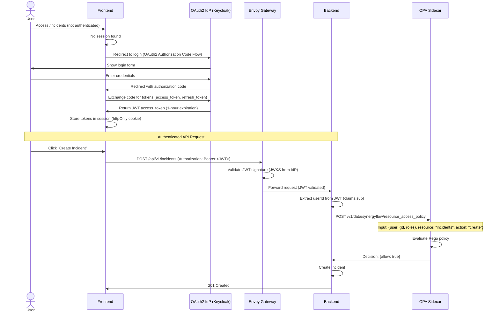

# 11. Backend Architecture

## 11.1 Service Architecture (Spring Boot Modular Monolith)

### Module Organization

SynergyFlow backend uses **Spring Modulith** to enforce module boundaries within a single Spring Boot application. Each module is a Java package with clear interfaces and dependencies.

```
backend/src/main/java/com/synergyflow/
├── SynergyFlowApplication.java       # Spring Boot main class
├── incident/                          # Incident Management module
│   ├── IncidentController.java       # REST API endpoints
│   ├── IncidentService.java          # Business logic
│   ├── IncidentRepository.java       # Spring Data JPA repository
│   ├── Incident.java                 # JPA entity
│   ├── IncidentCreatedEvent.java     # Domain event (Java record)
│   ├── IncidentEventListener.java    # @ApplicationModuleListener
│   └── dto/                          # DTOs (request/response objects)
│       ├── CreateIncidentRequest.java
│       └── IncidentResponse.java
├── change/                            # Change Management module
│   ├── ChangeController.java
│   ├── ChangeService.java
│   ├── ChangeRepository.java
│   ├── Change.java
│   ├── ChangeRequestedEvent.java
│   ├── ChangeApprovedEvent.java
│   └── ChangeEventListener.java
├── task/                              # Task/Project Management module
│   ├── TaskController.java
│   ├── TaskService.java
│   ├── TaskRepository.java
│   ├── Task.java
│   ├── TaskCreatedEvent.java
│   └── TaskEventListener.java
├── user/                              # User Management module
│   ├── UserController.java
│   ├── UserService.java
│   ├── UserRepository.java
│   └── User.java
├── policy/                            # OPA Policy integration module
│   ├── OpaClient.java                # OPA REST client
│   ├── PolicyEvaluationService.java  # Policy evaluation logic
│   ├── DecisionReceiptService.java   # Decision receipt generation
│   └── policies/                     # Rego policy references
│       ├── ChangeApprovalPolicy.java
│       └── IncidentAssignmentPolicy.java
├── workflow/                          # Flowable integration module
│   ├── FlowableConfiguration.java    # Flowable autoconfiguration
│   ├── SLATimerService.java          # SLA timer management
│   └── delegates/                    # BPMN service task delegates
│       ├── SendNotificationDelegate.java
│       └── EscalateIncidentDelegate.java
├── audit/                             # Audit & Decision Receipts module
│   ├── AuditLogService.java
│   ├── DecisionReceiptRepository.java
│   └── AuditLog.java
├── shared/                            # Shared domain, events, utilities
│   ├── events/                       # Shared event base classes
│   │   └── DomainEvent.java          # Base record for all events
│   ├── exceptions/                   # Custom exceptions
│   │   ├── EntityNotFoundException.java
│   │   └── OptimisticLockException.java
│   └── utils/
│       ├── CorrelationIdFilter.java  # Servlet filter for correlation IDs
│       └── DateTimeUtils.java
└── config/                            # Spring Boot configuration
    ├── SecurityConfig.java           # OAuth2 Resource Server config
    ├── DataSourceConfig.java         # PostgreSQL PgBouncer config
    ├── CacheConfig.java              # DragonflyDB config
    ├── WebConfig.java                # CORS, interceptors
    └── ModulithConfig.java           # Spring Modulith configuration
```

### Controller Template (REST API)

```java
// incident/IncidentController.java
package io.monosense.synergyflow.incident;

import io.monosense.synergyflow.incident.dto.CreateIncidentRequest;
import io.monosense.synergyflow.incident.dto.IncidentResponse;
import jakarta.validation.Valid;
import lombok.RequiredArgsConstructor;
import org.springframework.data.domain.Page;
import org.springframework.data.domain.Pageable;
import org.springframework.http.HttpStatus;
import org.springframework.http.ResponseEntity;
import org.springframework.security.core.annotation.AuthenticationPrincipal;
import org.springframework.security.oauth2.jwt.Jwt;
import org.springframework.web.bind.annotation.*;

import java.util.UUID;

@RestController
@RequestMapping("/api/v1/incidents")
@RequiredArgsConstructor
public class IncidentController {

    private final IncidentService incidentService;

    @GetMapping
    public ResponseEntity<Page<IncidentResponse>> listIncidents(
            @RequestParam(required = false) String status,
            @RequestParam(required = false) String priority,
            Pageable pageable
    ) {
        Page<IncidentResponse> incidents = incidentService.listIncidents(status, priority, pageable);
        return ResponseEntity.ok(incidents);
    }

    @GetMapping("/{id}")
    public ResponseEntity<IncidentResponse> getIncident(@PathVariable UUID id) {
        IncidentResponse incident = incidentService.getIncident(id);
        return ResponseEntity.ok(incident);
    }

    @PostMapping
    public ResponseEntity<IncidentResponse> createIncident(
            @Valid @RequestBody CreateIncidentRequest request,
            @AuthenticationPrincipal Jwt jwt
    ) {
        String userId = jwt.getSubject();
        IncidentResponse incident = incidentService.createIncident(request, userId);
        return ResponseEntity.status(HttpStatus.CREATED).body(incident);
    }

    @PatchMapping("/{id}")
    public ResponseEntity<IncidentResponse> updateIncident(
            @PathVariable UUID id,
            @Valid @RequestBody UpdateIncidentRequest request
    ) {
        IncidentResponse incident = incidentService.updateIncident(id, request);
        return ResponseEntity.ok(incident);
    }

    @PostMapping("/{id}/assign")
    public ResponseEntity<Void> assignIncident(
            @PathVariable UUID id,
            @Valid @RequestBody AssignIncidentRequest request
    ) {
        incidentService.assignIncident(id, request.assignedTo());
        return ResponseEntity.ok().build();
    }

    @PostMapping("/{id}/resolve")
    public ResponseEntity<Void> resolveIncident(
            @PathVariable UUID id,
            @Valid @RequestBody ResolveIncidentRequest request
    ) {
        incidentService.resolveIncident(id, request.resolution());
        return ResponseEntity.ok().build();
    }
}
```

## 11.2 Database Architecture

### Data Access Layer (Spring Data JPA)

```java
// incident/IncidentRepository.java
package io.monosense.synergyflow.incident;

import org.springframework.data.domain.Page;
import org.springframework.data.domain.Pageable;
import org.springframework.data.jpa.repository.JpaRepository;
import org.springframework.data.jpa.repository.Query;
import org.springframework.stereotype.Repository;

import java.time.Instant;
import java.util.List;
import java.util.UUID;

@Repository
public interface IncidentRepository extends JpaRepository<Incident, UUID> {

    // Query by naming convention (Spring Data JPA generates SQL)
    Page<Incident> findByStatus(String status, Pageable pageable);

    Page<Incident> findByStatusAndPriority(String status, String priority, Pageable pageable);

    List<Incident> findByAssignedToAndStatusNot(UUID assignedTo, String status);

    // Custom JPQL query
    @Query("SELECT i FROM Incident i WHERE i.slaDeadline < :now AND i.status NOT IN ('RESOLVED', 'CLOSED')")
    List<Incident> findApproachingSLABreach(Instant now);

    // Native SQL query with EntityGraph to avoid N+1 queries
    @EntityGraph(attributePaths = {"assignedTo", "createdBy"})
    @Query("SELECT i FROM Incident i WHERE i.id = :id")
    Optional<Incident> findByIdWithUsers(UUID id);
}
```

### JPA Entity Example

```java
// incident/Incident.java
package io.monosense.synergyflow.incident;

import io.monosense.synergyflow.user.User;
import jakarta.persistence.*;
import lombok.AllArgsConstructor;
import lombok.Builder;
import lombok.Data;
import lombok.NoArgsConstructor;
import org.springframework.data.annotation.CreatedDate;
import org.springframework.data.annotation.LastModifiedDate;
import org.springframework.data.jpa.domain.support.AuditingEntityListener;

import java.time.Instant;
import java.util.UUID;

@Entity
@Table(name = "incidents", schema = "synergyflow_incidents")
@Data
@Builder
@NoArgsConstructor
@AllArgsConstructor
@EntityListeners(AuditingEntityListener.class) // Enable auditing
public class Incident {

    @Id
    @GeneratedValue(strategy = GenerationType.UUID)
    private UUID id;

    @Column(nullable = false, length = 200)
    private String title;

    @Column(nullable = false, columnDefinition = "TEXT")
    private String description;

    @Enumerated(EnumType.STRING)
    @Column(nullable = false, length = 20)
    private Priority priority;

    @Enumerated(EnumType.STRING)
    @Column(nullable = false, length = 10)
    private Severity severity;

    @Enumerated(EnumType.STRING)
    @Column(nullable = false, length = 20)
    private Status status;

    @ManyToOne(fetch = FetchType.LAZY)
    @JoinColumn(name = "assigned_to")
    private User assignedTo;

    @ManyToOne(fetch = FetchType.LAZY)
    @JoinColumn(name = "created_by", nullable = false)
    private User createdBy;

    @CreatedDate
    @Column(nullable = false, updatable = false)
    private Instant createdAt;

    @LastModifiedDate
    @Column(nullable = false)
    private Instant updatedAt;

    private Instant resolvedAt;

    @Column(nullable = false)
    private Instant slaDeadline;

    @Column(columnDefinition = "TEXT")
    private String resolution;

    @Version // Optimistic locking
    private Integer version;

    public enum Priority {
        LOW, MEDIUM, HIGH, CRITICAL
    }

    public enum Severity {
        S1, S2, S3, S4
    }

    public enum Status {
        NEW, ASSIGNED, IN_PROGRESS, RESOLVED, CLOSED
    }
}
```

### Service Layer with Event Publishing

```java
// incident/IncidentService.java
package io.monosense.synergyflow.incident;

import io.monosense.synergyflow.incident.dto.CreateIncidentRequest;
import io.monosense.synergyflow.incident.dto.IncidentResponse;
import io.monosense.synergyflow.shared.events.IncidentCreatedEvent;
import lombok.RequiredArgsConstructor;
import org.springframework.context.ApplicationEventPublisher;
import org.springframework.stereotype.Service;
import org.springframework.transaction.annotation.Transactional;

import java.time.Instant;
import java.util.UUID;

@Service
@RequiredArgsConstructor
public class IncidentService {

    private final IncidentRepository incidentRepository;
    private final ApplicationEventPublisher eventPublisher;

    @Transactional
    public IncidentResponse createIncident(CreateIncidentRequest request, String userId) {
        // Calculate SLA deadline based on priority
        Instant slaDeadline = calculateSLADeadline(request.priority());

        Incident incident = Incident.builder()
                .title(request.title())
                .description(request.description())
                .priority(request.priority())
                .severity(request.severity())
                .status(Incident.Status.NEW)
                .createdBy(userRepository.getReferenceById(UUID.fromString(userId)))
                .slaDeadline(slaDeadline)
                .build();

        // Save incident (JPA persist)
        incident = incidentRepository.save(incident);

        // Publish event (Spring Modulith stores in event_publication table atomically)
        IncidentCreatedEvent event = new IncidentCreatedEvent(
                incident.getId(),
                incident.getPriority(),
                incident.getSeverity(),
                incident.getSlaDeadline(),
                UUID.randomUUID() // correlationId
        );
        eventPublisher.publishEvent(event);

        return toResponse(incident);
    }

    private Instant calculateSLADeadline(Incident.Priority priority) {
        return switch (priority) {
            case CRITICAL -> Instant.now().plus(4, ChronoUnit.HOURS);
            case HIGH -> Instant.now().plus(8, ChronoUnit.HOURS);
            case MEDIUM -> Instant.now().plus(24, ChronoUnit.HOURS);
            case LOW -> Instant.now().plus(72, ChronoUnit.HOURS);
        };
    }

    private IncidentResponse toResponse(Incident incident) {
        return new IncidentResponse(
                incident.getId(),
                incident.getTitle(),
                incident.getDescription(),
                incident.getPriority(),
                incident.getSeverity(),
                incident.getStatus(),
                incident.getAssignedTo() != null ? incident.getAssignedTo().getId() : null,
                incident.getCreatedBy().getId(),
                incident.getCreatedAt(),
                incident.getUpdatedAt(),
                incident.getResolvedAt(),
                incident.getSlaDeadline(),
                incident.getResolution(),
                incident.getVersion()
        );
    }
}
```

## 11.3 Authentication and Authorization

### Auth Flow (OAuth2 Resource Server)



### Security Configuration

```java
// config/SecurityConfig.java
package io.monosense.synergyflow.config;

import org.springframework.context.annotation.Bean;
import org.springframework.context.annotation.Configuration;
import org.springframework.security.config.annotation.method.configuration.EnableMethodSecurity;
import org.springframework.security.config.annotation.web.builders.HttpSecurity;
import org.springframework.security.config.annotation.web.configuration.EnableWebSecurity;
import org.springframework.security.config.http.SessionCreationPolicy;
import org.springframework.security.oauth2.server.resource.authentication.JwtAuthenticationConverter;
import org.springframework.security.web.SecurityFilterChain;

@Configuration
@EnableWebSecurity
@EnableMethodSecurity
public class SecurityConfig {

    @Bean
    public SecurityFilterChain securityFilterChain(HttpSecurity http) throws Exception {
        http
                .csrf(csrf -> csrf.disable()) // Stateless JWT, CSRF not needed
                .sessionManagement(session -> session
                        .sessionCreationPolicy(SessionCreationPolicy.STATELESS))
                .authorizeHttpRequests(authz -> authz
                        .requestMatchers("/actuator/health", "/actuator/health/liveness", "/actuator/health/readiness").permitAll()
                        .requestMatchers("/api/v1/**").authenticated()
                        .anyRequest().denyAll())
                .oauth2ResourceServer(oauth2 -> oauth2
                        .jwt(jwt -> jwt.jwtAuthenticationConverter(jwtAuthenticationConverter())));

        return http.build();
    }

    @Bean
    public JwtAuthenticationConverter jwtAuthenticationConverter() {
        JwtAuthenticationConverter converter = new JwtAuthenticationConverter();
        // Extract roles from JWT claims (e.g., "roles": ["AGENT", "CAB_MEMBER"])
        converter.setJwtGrantedAuthoritiesConverter(new RoleClaimConverter());
        return converter;
    }
}
```

### Authorization Middleware (OPA Integration)

```java
// policy/PolicyEvaluationService.java
package io.monosense.synergyflow.policy;

import lombok.RequiredArgsConstructor;
import org.springframework.stereotype.Service;
import org.springframework.web.client.RestClient;

import java.util.Map;
import java.util.UUID;

@Service
@RequiredArgsConstructor
public class PolicyEvaluationService {

    private final OpaClient opaClient;
    private final DecisionReceiptService decisionReceiptService;

    public boolean canUserAccessResource(String userId, String resource, String action) {
        // Call OPA sidecar
        var input = Map.of(
                "user", Map.of("id", userId),
                "resource", resource,
                "action", action
        );

        OpaResponse response = opaClient.evaluate("resource_access_policy", input);

        // Generate decision receipt
        decisionReceiptService.createReceipt(
                "resource_access_policy",
                "v1.0.0",
                input,
                response.result(),
                UUID.randomUUID()
        );

        return response.result().get("allow").asBoolean();
    }
}

// policy/OpaClient.java
package io.monosense.synergyflow.policy;

import org.springframework.stereotype.Component;
import org.springframework.web.client.RestClient;

import java.util.Map;

@Component
public class OpaClient {

    private final RestClient restClient;

    public OpaClient() {
        this.restClient = RestClient.builder()
                .baseUrl("http://localhost:8181") // OPA sidecar localhost
                .build();
    }

    public OpaResponse evaluate(String policyName, Map<String, Object> input) {
        return restClient.post()
                .uri("/v1/data/synergyflow/{policyName}", policyName)
                .body(Map.of("input", input))
                .retrieve()
                .body(OpaResponse.class);
    }

    public record OpaResponse(Map<String, Object> result) {}
}
```

---
