# 18. UX Specification

**Version:** 1.0
**Last Updated:** 2025-10-18
**Status:** Draft

---

## 18.1 Overview

This UX specification defines the user experience patterns, design principles, and interaction models for SynergyFlow. It is a **focused, pragmatic document** that captures the essential UX decisions needed to build a cohesive, trustworthy, and efficient ITSM+PM platform.

**Scope:**
- Design principles and philosophy
- Design tokens (colors, spacing, typography)
- Component patterns and reusable UI elements
- Key user flows (5-7 critical workflows)
- Responsive design strategy
- Accessibility requirements
- Performance budget (UX perspective)

**Out of Scope:**
- Pixel-perfect mockups (we'll iterate during implementation)
- Exhaustive component library (Shadcn/ui provides foundation)
- Marketing website design
- Email template designs

---

## 18.2 Design Principles

SynergyFlow follows **10 core UX principles** that guide all design and implementation decisions:

### 1. "Quiet Brain" Experience - Minimize Cognitive Load

**Philosophy:** Users should focus on work, not tool navigation. The interface anticipates needs, surfaces relevant information proactively, and reduces decision fatigue.

**Implementation:**
- Unified "My Work" view aggregates incidents, tasks, approvals across both ITSM and PM modules
- Smart notifications: only alert on urgent items (SLA breach imminent, approvals required)
- Contextual actions: show only relevant actions based on current state

**Anti-patterns to avoid:**
- ❌ Notification spam
- ❌ Tab clutter
- ❌ Redundant confirmation dialogs
- ❌ Complex multi-step wizards for simple tasks

---

### 2. Trust Through Transparency - Make the Invisible Visible

**Philosophy:** Build user trust by making system behavior transparent and explainable, especially for automation and eventual consistency.

**Implementation:**
- **Freshness badges** show projection lag ("Data current as of 2.3 seconds ago")
- **Decision receipts** explain every automated action ("Why was this auto-approved? → Low-risk standard change, Policy v1.2.3")
- **Audit trails** accessible for all critical actions
- **Event timeline** shows system activity in human-readable format

**Anti-patterns to avoid:**
- ❌ "Black box" automation
- ❌ Hidden system state
- ❌ Unexplained failures
- ❌ Silent background updates without user awareness

---

### 3. Single-Entry Paradigm - Eliminate Duplicate Work

**Philosophy:** Users should never enter the same data twice. The system intelligently mirrors and propagates information across modules.

**Implementation:**
- **Single-Entry Time Tray:** log work once, mirrors to incidents and tasks automatically
- **Link-on-Action:** "Create related change" pre-fills context from incident
- **Event-driven data propagation:** incident status updates auto-sync to related tasks
- **Smart defaults:** pre-populate forms with context from related entities

**Anti-patterns to avoid:**
- ❌ Forcing users to copy-paste data
- ❌ Manually sync information between modules
- ❌ Maintaining duplicate records

---

### 4. Cross-Module Coherence - One Platform, One Mental Model

**Philosophy:** The interface should feel like one cohesive platform, not separate ITSM and PM tools stitched together.

**Implementation:**
- **Unified navigation:** single top bar with consistent menu structure across modules
- **Single search:** "INC-001" or "STORY-42" finds entities regardless of module
- **Single notification center:** all alerts in one place
- **Consistent terminology:** "Assigned to", "Status", "Priority" mean the same thing everywhere

**Anti-patterns to avoid:**
- ❌ Module-specific navigation paradigms
- ❌ Inconsistent terminology
- ❌ Disconnected search experiences

---

### 5. Progressive Disclosure - Simple by Default, Powerful When Needed

**Philosophy:** The interface should be simple for common tasks, with advanced features accessible but not overwhelming.

**Implementation:**
- **Incident form:** show only required fields by default, "Advanced" expander for optional fields
- **Policy Studio:** visual editor for basic policies, code editor for advanced Rego
- **Dashboard widgets:** pre-configured templates, custom builder for power users
- **Keyboard shortcuts:** hidden by default, revealed with `?` key

**Anti-patterns to avoid:**
- ❌ Overwhelming forms with 50 fields
- ❌ Exposing internal complexity to end users
- ❌ Hiding critical features behind obscure menus

---

### 6. Automation with Autonomy - Intelligent Defaults, User Control

**Philosophy:** The system should automate intelligently while preserving user override capability for exceptions.

**Implementation:**
- **Auto-routing** suggests optimal agent, user can manually override
- **Policy-driven auto-approval** for low-risk changes, user can escalate to CAB
- **SLA timers** auto-escalate approaching breaches, user can snooze/reassign
- **All automation is transparent** with decision receipts

**Anti-patterns to avoid:**
- ❌ Rigid automation without override
- ❌ Forcing users into automated workflows they distrust
- ❌ Automation without explanation

---

### 7. Mobile-First Responsive - Work Anywhere, Any Device

**Philosophy:** The interface should adapt gracefully to mobile, tablet, and desktop viewports without feature compromise.

**Implementation:**
- **Mobile web UI** with responsive breakpoints (320px, 768px, 1024px, 1440px)
- **Touch-friendly controls:** 44px minimum tap target size
- **Swipe gestures** for common actions (swipe to dismiss notification)
- **Priority-based mobile layout:** most critical information above fold

**Anti-patterns to avoid:**
- ❌ Desktop-only features
- ❌ Requiring horizontal scrolling on mobile
- ❌ Tiny tap targets (<44px)
- ❌ Complex interactions requiring mouse hover

---

### 8. Accessibility First - Inclusive Design for All Users

**Philosophy:** The interface should be fully accessible to users with disabilities, supporting keyboard, screen readers, and assistive technologies.

**Implementation:**
- **Full keyboard navigation:** tab order follows visual hierarchy
- **ARIA labels** for all interactive elements
- **Color contrast:** WCAG 2.1 AA compliant (4.5:1 for normal text)
- **Screen reader announcements** for dynamic updates
- **Focus indicators** clearly visible

**Anti-patterns to avoid:**
- ❌ Mouse-only interactions
- ❌ Color-only information encoding
- ❌ Unlabeled form controls
- ❌ Invisible focus states

---

### 9. Contextual Help - Learn by Doing, Not Reading Manuals

**Philosophy:** Users should discover features through contextual guidance, not external documentation.

**Implementation:**
- **Tooltips** on hover/focus with brief explanations
- **Guided tours** for first-time users
- **Empty state guidance:** "No incidents yet. Create your first incident to get started."
- **In-app help center** with contextual articles

**Anti-patterns to avoid:**
- ❌ Cryptic error messages
- ❌ Requiring external documentation
- ❌ Jargon without explanation

---

### 10. Feedback and Confirmation - Make Actions Predictable

**Philosophy:** Users should always know the result of their actions immediately, with clear feedback for success, errors, and in-progress states.

**Implementation:**
- **Toast notifications** for success (3-second auto-dismiss)
- **Inline validation** for forms (immediate feedback)
- **Loading states** for async actions ("Saving..." with spinner)
- **Confirmation dialogs** for destructive actions

**Anti-patterns to avoid:**
- ❌ Silent failures
- ❌ Ambiguous "saved" messages
- ❌ Long delays without feedback
- ❌ Destructive actions without confirmation

---

## 18.3 Design Tokens

Design tokens are the atomic design decisions that create visual consistency across the platform.

### Color Palette

**Primary Colors (Brand Identity):**
```css
--color-primary-50:  #EFF6FF;  /* Lightest blue */
--color-primary-100: #DBEAFE;
--color-primary-200: #BFDBFE;
--color-primary-300: #93C5FD;
--color-primary-400: #60A5FA;
--color-primary-500: #3B82F6;  /* Primary brand color */
--color-primary-600: #2563EB;
--color-primary-700: #1D4ED8;  /* Primary hover/active */
--color-primary-800: #1E40AF;
--color-primary-900: #1E3A8A;  /* Darkest blue */
```

**Semantic Colors (Status & Feedback):**
```css
/* Success - Green */
--color-success-50:  #F0FDF4;
--color-success-500: #10B981;  /* Success state */
--color-success-700: #047857;  /* Success hover */

/* Warning - Yellow */
--color-warning-50:  #FFFBEB;
--color-warning-500: #F59E0B;  /* Warning state */
--color-warning-700: #B45309;  /* Warning hover */

/* Error - Red */
--color-error-50:  #FEF2F2;
--color-error-500: #EF4444;  /* Error state */
--color-error-700: #B91C1C;  /* Error hover */

/* Info - Blue */
--color-info-50:  #F0F9FF;
--color-info-500: #0EA5E9;  /* Info state */
--color-info-700: #0369A1;  /* Info hover */
```

**Neutral Colors (UI Foundation):**
```css
--color-neutral-0:   #FFFFFF;  /* Pure white */
--color-neutral-50:  #F9FAFB;  /* Background light */
--color-neutral-100: #F3F4F6;  /* Background subtle */
--color-neutral-200: #E5E7EB;  /* Border light */
--color-neutral-300: #D1D5DB;  /* Border default */
--color-neutral-400: #9CA3AF;  /* Text muted */
--color-neutral-500: #6B7280;  /* Text secondary */
--color-neutral-600: #4B5563;  /* Text primary */
--color-neutral-700: #374151;  /* Text heading */
--color-neutral-800: #1F2937;  /* Text strong */
--color-neutral-900: #111827;  /* Text darkest */
```

**Priority/Severity Colors (Domain-Specific):**
```css
/* Incident Priority */
--color-priority-low:      #10B981;  /* Green */
--color-priority-medium:   #F59E0B;  /* Yellow */
--color-priority-high:     #F97316;  /* Orange */
--color-priority-critical: #EF4444;  /* Red */

/* SLA Status */
--color-sla-safe:        #10B981;  /* >30% time remaining */
--color-sla-warning:     #F59E0B;  /* 10-30% time remaining */
--color-sla-critical:    #EF4444;  /* <10% time remaining */
--color-sla-breached:    #DC2626;  /* Past deadline */

/* Freshness Badge */
--color-fresh-green:   #10B981;  /* <3 seconds */
--color-fresh-yellow:  #F59E0B;  /* 3-10 seconds */
--color-fresh-red:     #EF4444;  /* >10 seconds */
```

### Typography

**Font Family:**
```css
--font-sans: 'Inter', system-ui, -apple-system, sans-serif;
--font-mono: 'JetBrains Mono', 'Fira Code', monospace;
```

**Font Sizes (Tailwind-compatible):**
```css
--text-xs:   0.75rem;   /* 12px - Labels, captions */
--text-sm:   0.875rem;  /* 14px - Body text small */
--text-base: 1rem;      /* 16px - Body text default */
--text-lg:   1.125rem;  /* 18px - Lead text */
--text-xl:   1.25rem;   /* 20px - H5 */
--text-2xl:  1.5rem;    /* 24px - H4 */
--text-3xl:  1.875rem;  /* 30px - H3 */
--text-4xl:  2.25rem;   /* 36px - H2 */
--text-5xl:  3rem;      /* 48px - H1 */
```

**Font Weights:**
```css
--font-normal:    400;  /* Regular text */
--font-medium:    500;  /* Slightly emphasized */
--font-semibold:  600;  /* Buttons, headings */
--font-bold:      700;  /* Strong emphasis */
```

**Line Heights:**
```css
--leading-tight:  1.25;  /* Headings */
--leading-normal: 1.5;   /* Body text */
--leading-relaxed: 1.75; /* Comfortable reading */
```

### Spacing Scale

**Tailwind-compatible spacing (rem-based):**
```css
--space-1:  0.25rem;   /* 4px */
--space-2:  0.5rem;    /* 8px */
--space-3:  0.75rem;   /* 12px */
--space-4:  1rem;      /* 16px */
--space-5:  1.25rem;   /* 20px */
--space-6:  1.5rem;    /* 24px */
--space-8:  2rem;      /* 32px */
--space-10: 2.5rem;    /* 40px */
--space-12: 3rem;      /* 48px */
--space-16: 4rem;      /* 64px */
--space-20: 5rem;      /* 80px */
```

**Common usage:**
- `space-1, space-2`: Icon padding, tight gaps
- `space-3, space-4`: Form field gaps, list items
- `space-6, space-8`: Section spacing, card padding
- `space-12, space-16`: Page sections, major layout gaps

### Border Radius

```css
--radius-sm:   0.25rem;  /* 4px - Small elements */
--radius-md:   0.375rem; /* 6px - Default (buttons, inputs) */
--radius-lg:   0.5rem;   /* 8px - Cards, panels */
--radius-xl:   0.75rem;  /* 12px - Large cards */
--radius-full: 9999px;   /* Fully rounded (badges, avatars) */
```

### Shadows

```css
--shadow-sm: 0 1px 2px 0 rgb(0 0 0 / 0.05);
--shadow-md: 0 4px 6px -1px rgb(0 0 0 / 0.1);
--shadow-lg: 0 10px 15px -3px rgb(0 0 0 / 0.1);
--shadow-xl: 0 20px 25px -5px rgb(0 0 0 / 0.1);
```

### Animation Durations

```css
--duration-fast:   150ms;  /* Micro-interactions */
--duration-normal: 250ms;  /* Default transitions */
--duration-slow:   350ms;  /* Modal open/close */
```

---

## 18.4 Component Patterns

### Component Library Foundation

SynergyFlow uses **Shadcn/ui + Radix UI** as the base component library, providing:
- WCAG 2.1 AA accessible components
- Headless Radix primitives with Tailwind styling
- Copy-paste approach (no npm dependency bloat)
- Full customization control

**Core Shadcn/ui components used:**
- Button, Input, Select, Textarea
- Dialog (Modal), Sheet (Drawer), Popover
- Table, Card, Badge, Avatar
- Dropdown Menu, Command (⌘K search)
- Toast (notifications), Alert
- Tabs, Accordion, Separator

### Custom Cross-Module Components

#### 1. Freshness Badge

**Purpose:** Display data currency and projection lag to build trust in eventual consistency.

**Visual Design:**
```
┌─────────────────────────────────┐
│ 🟢 Current (2.3s ago)           │  <- Green: <3s
│ 🟡 Updating (7.1s ago)          │  <- Yellow: 3-10s
│ 🔴 Stale (15.2s ago)            │  <- Red: >10s
└─────────────────────────────────┘
```

**Component API:**
```typescript
interface FreshnessBadgeProps {
  projectionLag: number; // milliseconds
  variant?: 'default' | 'compact';
  showIcon?: boolean;
}

// Usage
<FreshnessBadge projectionLag={2300} />
```

**Behavior:**
- Updates in real-time (every second)
- Color transitions smoothly between thresholds
- Tooltip shows detailed explanation: "This data is 2.3 seconds old. It reflects the system state as of [timestamp]."
- Compact variant shows only colored dot + time

---

#### 2. Single-Entry Time Tray

**Purpose:** Global worklog entry UI that mirrors time to multiple entities.

**Visual Design:**
```
┌───────────────────────────────────────────────────────────┐
│ Log Time                                          [Close X]│
├───────────────────────────────────────────────────────────┤
│ Description:                                              │
│ ┌─────────────────────────────────────────────────────┐  │
│ │ Analyzed logs, identified deployment correlation   │  │
│ └─────────────────────────────────────────────────────┘  │
│                                                           │
│ Time Spent:  [30]  minutes                               │
│                                                           │
│ Link to:                                                  │
│ ☑ INC-1234: Production API returning 500 errors         │
│ ☑ TASK-890: Debug production issue                      │
│ ☐ CHANGE-567: Deploy hotfix                             │
│                                                           │
│ [Cancel]                            [Log Time to 2 items]│
└───────────────────────────────────────────────────────────┘
```

**Component API:**
```typescript
interface SingleEntryTimeTrayProps {
  isOpen: boolean;
  onClose: () => void;
  onSubmit: (entry: TimeEntry) => Promise<void>;
  availableEntities?: Entity[]; // Auto-populated from context
}

interface TimeEntry {
  description: string;
  timeSpent: number; // minutes
  linkedEntities: string[]; // IDs of incidents/tasks/changes
}
```

**Behavior:**
- Accessible via top navigation "⏱ Log Time" button
- Keyboard shortcut: `Ctrl+Shift+T` (Windows) / `Cmd+Shift+T` (Mac)
- Auto-suggests entities from current page context
- Shows confirmation toast: "Time logged to INC-1234, TASK-890"
- Optimistically updates time displays in UI

---

#### 3. Link-on-Action Button

**Purpose:** Create related entities with auto-populated context and bidirectional linking.

**Visual Design:**
```
┌──────────────────────────────────────────┐
│ INC-1234: Production API 500 errors     │
│ Status: In Progress  │  Priority: High  │
├──────────────────────────────────────────┤
│ Description: API Gateway returning...    │
│                                          │
│ [➕ Create Related Change]  [➕ Task]    │
└──────────────────────────────────────────┘
```

**Component API:**
```typescript
interface LinkOnActionButtonProps {
  sourceEntity: Entity;
  targetEntityType: 'CHANGE' | 'TASK' | 'INCIDENT' | 'PROBLEM';
  onCreated: (newEntity: Entity) => void;
}
```

**Behavior:**
- Opens pre-filled form in modal/drawer
- Context auto-populated:
  - Change title: "Rollback deployment (incident INC-1234)"
  - Risk level: Inherited from incident severity
  - Impacted services: From incident context
- Establishes bidirectional link on creation
- Shows success: "Change CHANGE-890 created and linked to INC-1234"

---

#### 4. Decision Receipt Viewer

**Purpose:** Display explainable policy decisions to build trust in automation.

**Visual Design:**
```
┌──────────────────────────────────────────────────────────┐
│ 📋 Decision Receipt                                      │
├──────────────────────────────────────────────────────────┤
│ Decision: REQUIRES CAB APPROVAL                          │
│ Policy: change_approval_policy v1.2.3                    │
│ Evaluated: 2025-10-18 14:32:15 UTC                       │
│                                                           │
│ Reason:                                                   │
│ High-risk emergency change impacting critical service    │
│ (API-Service) → CAB + CTO approval required              │
│                                                           │
│ Input Data:                                               │
│ • Risk Level: HIGH                                        │
│ • Impacted Services: API-Service, Auth-Service            │
│ • Scheduled Time: 2025-10-18 16:00 UTC                   │
│ • Business Hours: Yes                                     │
│                                                           │
│ [View Full Policy] [View Audit Trail]                    │
└──────────────────────────────────────────────────────────┘
```

**Component API:**
```typescript
interface DecisionReceiptViewerProps {
  receiptId: string;
  variant?: 'inline' | 'modal';
}
```

**Behavior:**
- Inline variant shows in form/card
- Modal variant opens full details
- "View Full Policy" opens policy code in read-only editor
- "View Audit Trail" shows historical decisions for same policy

---

#### 5. SLA Timer Display

**Purpose:** Show time remaining until SLA breach with visual urgency indicators.

**Visual Design:**
```
┌───────────────────────────┐
│ ⏱️  3h 47m remaining       │  <- Green: >30% time left
│ 🟢 On Track               │
└───────────────────────────┘

┌───────────────────────────┐
│ ⏱️  28m remaining          │  <- Yellow: 10-30% time left
│ 🟡 Approaching Breach     │
└───────────────────────────┘

┌───────────────────────────┐
│ ⏱️  6m remaining           │  <- Red: <10% time left
│ 🔴 URGENT                 │
└───────────────────────────┘

┌───────────────────────────┐
│ ⏱️  BREACHED (12m ago)     │  <- Dark red: Past deadline
│ 🔴 SLA Missed             │
└───────────────────────────┘
```

**Component API:**
```typescript
interface SLATimerDisplayProps {
  deadline: Date;
  createdAt: Date;
  variant?: 'default' | 'compact' | 'badge';
}
```

**Behavior:**
- Updates every second (real-time countdown)
- Color transitions at thresholds (30%, 10%, 0%)
- Tooltip shows absolute deadline: "SLA deadline: Oct 18, 2025 at 6:00 PM"
- Compact variant shows only time + colored indicator

---

#### 6. Work Graph Relationship Panel

**Purpose:** Display related entities across modules with freshness indicators.

**Visual Design:**
```
┌────────────────────────────────────────────────────────┐
│ 🔗 Related Items                                       │
│ 🟢 Current (0.8s ago)                                  │
├────────────────────────────────────────────────────────┤
│ Changes (2)                                            │
│  • CHANGE-890: Rollback deployment           [View →] │
│  • CHANGE-567: Deploy API v2.1.0             [View →] │
│                                                        │
│ Tasks (1)                                              │
│  • TASK-890: Debug production issue          [View →] │
│                                                        │
│ Worklogs (3)                                           │
│  • Alice logged 30m - 5 minutes ago          [View →] │
│  • Bob logged 1h - 2 hours ago               [View →] │
│  • Charlie logged 45m - 3 hours ago          [View →] │
│                                                        │
│ [+ Create Related Change] [+ Create Related Task]     │
└────────────────────────────────────────────────────────┘
```

**Component API:**
```typescript
interface WorkGraphRelationshipPanelProps {
  entityId: string;
  entityType: 'INCIDENT' | 'CHANGE' | 'TASK';
  showCreateActions?: boolean;
}
```

**Behavior:**
- Fetches related entities via API
- Displays freshness badge at top
- Groups by relationship type
- Link-on-action buttons at bottom
- Real-time updates via event stream

---

### Form Patterns

#### Standard Form Layout

```
┌────────────────────────────────────────────────┐
│ Create Incident                     [Close ✕]  │
├────────────────────────────────────────────────┤
│                                                │
│ Title *                                        │
│ ┌──────────────────────────────────────────┐  │
│ │ Production API returning 500 errors      │  │
│ └──────────────────────────────────────────┘  │
│                                                │
│ Description *                                  │
│ ┌──────────────────────────────────────────┐  │
│ │ API Gateway started returning 500s...    │  │
│ │                                          │  │
│ └──────────────────────────────────────────┘  │
│                                                │
│ Priority *                                     │
│ ┌──────────────────────────────────────────┐  │
│ │ High ▼                                   │  │
│ └──────────────────────────────────────────┘  │
│                                                │
│ ▼ Advanced Options                            │
│                                                │
│ [Cancel]                          [Create]     │
└────────────────────────────────────────────────┘
```

**Principles:**
- Required fields marked with `*`
- Inline validation (immediate feedback)
- Progressive disclosure ("Advanced Options" collapsed by default)
- Primary action (Create) on right, secondary (Cancel) on left
- Form fits in modal/drawer without scrolling (common fields)

---

## 18.5 Key User Flows

### Flow 1: Incident Creation and Response


**Key UX Elements:**
1. **Freshness Badge**: "Data current as of 1.2 seconds ago" (green)
2. **SLA Timer**: "3h 47m remaining" (yellow - approaching breach)
3. **Work Graph Panel**: Shows related CHANGE-567 automatically
4. **Single-Entry Time Tray**: Log once, mirrors to incident and task
5. **Link-on-Action**: "Create related change" pre-fills form
6. **Decision Receipt**: Explains why CAB approval needed

**Performance Targets:**
- Incident detail page load: <2s
- Time tray submit: <500ms
- Create related change: <3s (including pre-fill)
- Policy evaluation: <100ms

---

### Flow 2: Change Request with Policy-Driven Approval

```mermaid
flowchart TD
    Start([DevOps engineer<br/>needs to deploy]) --> CreateChange[Click 'New Change']
    CreateChange --> FillForm[Fill change form:<br/>Title, Description, Risk]
    FillForm --> SelectRisk{Risk Level<br/>Selection}

    SelectRisk -->|Low| LowRisk[Low risk selected<br/>1-5 services]
    SelectRisk -->|High| HighRisk[High risk selected<br/>15 services]

    LowRisk --> SubmitLow[Submit change request]
    HighRisk --> SubmitHigh[Submit change request]

    SubmitLow --> PolicyLow{OPA Policy<br/>Evaluation: <10ms}
    SubmitHigh --> PolicyHigh{OPA Policy<br/>Evaluation: <10ms}

    PolicyLow --> AutoApprove[✅ Auto-Approved<br/>Decision receipt shown]
    PolicyHigh --> RequireCAB[⚠️ Requires CAB Approval<br/>Decision receipt shown]

    AutoApprove --> Schedule[Schedule deployment<br/>Change calendar updated]
    RequireCAB --> CABView[CAB member<br/>receives notification]

    CABView --> ReviewReceipt[Review decision receipt:<br/>Why CAB required?]
    ReviewReceipt --> CABDecision{CAB<br/>Decision}

    CABDecision -->|Approve| Approved[Change approved<br/>ChangeApprovedEvent]
    CABDecision -->|Reject| Rejected[Change rejected<br/>with reason]

    Approved --> Schedule
    Rejected --> Notify[Notify requester<br/>Rejection reason shown]

    Schedule --> CalendarCheck{Conflict<br/>Detection}
    CalendarCheck -->|Conflict| ConflictWarning[Warning shown:<br/>Overlaps CHANGE-702]
    CalendarCheck -->|No Conflict| NoConflict[Calendar slot confirmed]

    ConflictWarning --> Override{User<br/>Override?}
    Override -->|Yes| NoConflict
    Override -->|No| Reschedule[Reschedule change]

    NoConflict --> Deploy[Deployment executed<br/>Status: In Progress]
    Deploy --> Success{Deployment<br/>Result}

    Success -->|Success| Completed[✅ Status: Completed<br/>ChangeCompletedEvent]
    Success -->|Failure| Failed[❌ Status: Failed<br/>Rollback initiated]

    Completed --> End([Audit trail complete])
    Failed --> End
    Notify --> End
```



**Key UX Elements:**
1. **Risk Selector**: Visual indicators for Low/Medium/High/Emergency
2. **Policy Evaluation Feedback**: "Evaluating policy..." spinner, <100ms
3. **Decision Receipt**: Inline display of approval decision reasoning
4. **Change Calendar**: Conflict detection with visual warnings
5. **Audit Timeline**: Full history of approvals, deployments, events

---

### Flow 3: Single-Entry Time Logging


**Key UX Elements:**
1. **Global Accessibility**: Top nav + keyboard shortcut
2. **Context-Aware Suggestions**: Auto-selects entities from current page
3. **Multi-Select**: Check multiple incidents/tasks simultaneously
4. **Optimistic Updates**: Time displays update immediately
5. **Toast Confirmation**: "Time logged to INC-1234, TASK-890"
6. **Freshness Updates**: Badges reflect new data currency

---

### Flow 4: Link-on-Action Cross-Module Workflow

```mermaid
flowchart TD
    Start([Agent viewing<br/>INC-1234 detail]) --> ViewIncident[Incident detail page<br/>shows related items panel]
    ViewIncident --> ClickCreate[Click 'Create Related Change'<br/>button]
    ClickCreate --> ModalOpen[Modal opens with<br/>pre-filled change form]

    ModalOpen --> AutoFill[Auto-populated fields:<br/>Title, Risk, Services]
    AutoFill --> ShowContext[Context banner:<br/>'Creating from INC-1234']
    ShowContext --> ReviewPrefill[Review pre-filled data:<br/>Title: 'Rollback (INC-1234)']

    ReviewPrefill --> EditFields[Edit/add additional fields:<br/>Rollback plan, Schedule]
    EditFields --> Submit[Click 'Create Change']
    Submit --> APICreate[API: POST /api/v1/changes<br/>with incidentId]

    APICreate --> Transaction{Database<br/>Transaction}
    Transaction --> InsertChange[INSERT INTO changes]
    Transaction --> InsertLink[INSERT INTO incident_changes<br/>Bidirectional link]
    Transaction --> InsertEvent[INSERT INTO event_publication<br/>ChangeRequestedEvent]
    Transaction --> Commit[COMMIT]

    Commit --> EventBus[Event bus delivers<br/>ChangeRequestedEvent]
    EventBus --> IncidentListener[IncidentChangeListener<br/>receives event]
    IncidentListener --> UpdateProjection[Update incident<br/>related_changes projection]
    UpdateProjection --> InvalidateCache[Invalidate cache:<br/>incident:INC-1234]

    InvalidateCache --> Success[✅ 201 Created<br/>CHANGE-890 returned]
    Success --> CloseModal[Modal closes]
    CloseModal --> Toast[Toast: 'Change CHANGE-890 created<br/>and linked to INC-1234']
    Toast --> RefreshPanel[Work Graph panel refreshes<br/>Shows new CHANGE-890]
    RefreshPanel --> Freshness[Freshness badge:<br/>'0.08s ago' green]
    Freshness --> End([Bidirectional link<br/>established])
```

**Key UX Elements:**
1. **Context Banner**: "Creating from INC-1234" shown in modal
2. **Pre-Filled Form**: Title, risk, services auto-populated
3. **Editable Pre-Fill**: User can modify suggested values
4. **Optimistic Panel Update**: Related items panel updates immediately
5. **Success Toast**: "Change CHANGE-890 created and linked to INC-1234"
6. **Freshness Badge**: Shows data currency after link creation

---

### Flow 5: Dashboard Monitoring and SLA Management

```mermaid
flowchart TD
    Start([Incident manager<br/>starts workday]) --> OpenDashboard[Navigate to<br/>Operations Dashboard]
    OpenDashboard --> LoadWidgets[Widgets load:<br/>Live tiles with event stream]
    LoadWidgets --> ShowMetrics[Metrics displayed:<br/>Incident count, SLA %, MTTR]

    ShowMetrics --> FreshnessCheck[Freshness badge:<br/>'2.1s ago' green]
    FreshnessCheck --> ScanWidgets[Scan widgets for<br/>anomalies]
    ScanWidgets --> SLAWidget{SLA Breach<br/>Risk Widget}

    SLAWidget --> ShowRisks[⚠️ 3 incidents<br/>approaching breach]
    ShowRisks --> DrillDown[Click widget to<br/>drill down]
    DrillDown --> IncidentList[List view opens:<br/>INC-1341 (18m remaining)]

    IncidentList --> SelectIncident[Click INC-1341<br/>to view details]
    SelectIncident --> ViewDetails[Incident detail page<br/>Priority: P1, Assigned: Alice]
    ViewDetails --> CheckWorkload[Check assignee workload:<br/>Alice: 5 open incidents]
    CheckWorkload --> Decision{Reassign?}

    Decision -->|Yes| SelectNewAgent[Select new agent:<br/>Bob (2 open incidents)]
    Decision -->|No| Monitor[Continue monitoring]

    SelectNewAgent --> Reassign[Click 'Reassign to Bob']
    Reassign --> ConfirmDialog[Confirmation dialog:<br/>'Reassign INC-1341 to Bob?']
    ConfirmDialog --> Confirm[Click 'Confirm']
    Confirm --> APIReassign[API: PATCH /api/v1/incidents/{id}<br/>assignedTo: Bob]

    APIReassign --> Success[✅ Reassignment successful<br/>IncidentAssignedEvent]
    Success --> Notification[Bob receives notification:<br/>'INC-1341 assigned (18m left)']
    Notification --> UpdateDashboard[Dashboard widget updates<br/>Risk count: 3 → 2]
    UpdateDashboard --> FreshnessUpdate[Freshness badge:<br/>'0.3s ago' green]

    FreshnessUpdate --> Analytics[Review weekly MTTR trend:<br/>↓25% improvement]
    Analytics --> Attribution[Identify driver:<br/>Time Tray adoption 85%]
    Attribution --> End([Data-driven insight<br/>from dashboard])
```

**Key UX Elements:**
1. **Live Tiles**: Real-time updates via event stream
2. **Freshness Badge**: Per-widget data currency
3. **Drill-Down**: Click widget → detailed list view
4. **Contextual Actions**: "Reassign" available on detail page
5. **Confirmation Dialog**: Prevent accidental reassignments
6. **Toast Notifications**: "INC-1341 reassigned to Bob"
7. **Trend Charts**: Visual MTTR trends over time

---

## 18.6 Responsive Design Strategy

### Breakpoints

```css
/* Mobile First Approach */
--breakpoint-sm: 640px;   /* Landscape phones */
--breakpoint-md: 768px;   /* Tablets */
--breakpoint-lg: 1024px;  /* Laptops */
--breakpoint-xl: 1280px;  /* Desktops */
--breakpoint-2xl: 1536px; /* Large desktops */
```

### Layout Patterns by Breakpoint

**Mobile (320px - 639px):**
- Single column layout
- Collapsible sidebar (drawer from left)
- Bottom tab navigation for main sections
- Cards stack vertically
- Tables convert to card list view
- Time Tray: full-screen modal
- Work Graph: accordion with collapsed sections

**Tablet (640px - 1023px):**
- Two column layout (70/30 split)
- Sidebar toggleable via hamburger menu
- Top navigation bar with dropdowns
- Cards in 2-column grid
- Tables with horizontal scroll if needed
- Time Tray: right drawer (50% width)
- Work Graph: side panel

**Desktop (1024px+):**
- Three column layout (20/60/20 split)
- Fixed sidebar navigation (left)
- Top bar with breadcrumbs
- Cards in 3-column grid
- Tables full width with all columns
- Time Tray: right drawer (33% width)
- Work Graph: fixed side panel (right)

### Touch Target Sizes

**All interactive elements:**
- Minimum: 44x44px (Apple HIG, WCAG guideline)
- Preferred: 48x48px for primary actions
- Spacing: 8px minimum between targets

**Button sizes:**
```css
--button-sm: 32px height (secondary actions)
--button-md: 40px height (default)
--button-lg: 48px height (primary CTAs)
```

### Mobile-Specific Interactions

**Swipe Gestures:**
- Swipe right: Open sidebar navigation
- Swipe left on notification: Dismiss
- Swipe left on list item: Reveal actions (Delete, Archive)
- Pull down: Refresh data

**Bottom Sheets:**
- Use for mobile action menus
- Swipe down to dismiss
- Backdrop click to close

**Floating Action Button (FAB):**
- Primary action on mobile (e.g., "Create Incident")
- Fixed bottom right
- Expands to action menu if multiple options

---

## 18.7 Accessibility Requirements

### WCAG 2.1 Level AA Compliance

#### Color Contrast Ratios

**Normal text (16px / 1rem):**
- Minimum: 4.5:1 contrast ratio
- Example: `#374151` text on `#FFFFFF` background = 10.8:1 ✅

**Large text (24px / 1.5rem or 18px bold):**
- Minimum: 3:1 contrast ratio
- Example: `#6B7280` text on `#FFFFFF` background = 4.6:1 ✅

**UI Components (buttons, inputs):**
- Minimum: 3:1 contrast ratio with adjacent colors
- Example: `#3B82F6` button on `#FFFFFF` background = 4.5:1 ✅

**Testing Tools:**
- Use axe DevTools browser extension
- Validate designs with Color Contrast Analyzer
- Automated checks in CI pipeline (axe-core)

---

#### Keyboard Navigation

**Focus Indicators:**
- Visible focus ring on all interactive elements
- 2px solid outline with 2px offset
- Color: `--color-primary-500` (#3B82F6)
- Exception: If custom focus style provides equivalent visibility

**Tab Order:**
- Logical reading order (top-to-bottom, left-to-right)
- Skip links: "Skip to main content" at top
- Modal/dialog traps focus within (can't tab out to background)

**Keyboard Shortcuts:**
```
Global:
- ? : Show keyboard shortcuts help
- Ctrl/Cmd + K : Open command palette (⌘K search)
- Ctrl/Cmd + Shift + T : Open Time Tray
- Esc : Close modal/drawer/popover

Navigation:
- Ctrl/Cmd + / : Focus search bar
- Ctrl/Cmd + [ : Previous page (browser back)
- Ctrl/Cmd + ] : Next page (browser forward)

Incident List:
- J : Next incident
- K : Previous incident
- Enter : Open selected incident
- E : Edit selected incident

Forms:
- Ctrl/Cmd + Enter : Submit form
- Esc : Cancel / Close form
```

---

#### Screen Reader Support

**ARIA Labels:**
- All interactive elements have accessible names
- Use `aria-label` or `aria-labelledby` for icon-only buttons
- Example: `<button aria-label="Close dialog">✕</button>`

**ARIA Live Regions:**
- Toast notifications: `role="status" aria-live="polite"`
- Error messages: `role="alert" aria-live="assertive"`
- SLA timer updates: `aria-live="polite" aria-atomic="true"`

**ARIA Landmarks:**
```html
<header role="banner">...</header>
<nav role="navigation" aria-label="Main navigation">...</nav>
<main role="main">...</main>
<aside role="complementary" aria-label="Related items">...</aside>
<footer role="contentinfo">...</footer>
```

**Form Accessibility:**
- All inputs have associated `<label>` elements
- Error messages linked via `aria-describedby`
- Required fields marked with `aria-required="true"` and visual `*`
- Example:
```html
<label for="incident-title">Title *</label>
<input
  id="incident-title"
  type="text"
  aria-required="true"
  aria-invalid="false"
  aria-describedby="title-error"
/>
<span id="title-error" role="alert">Title is required</span>
```

---

#### Dynamic Content Announcements

**Screen reader announcements for:**
- Incident assigned: "Incident INC-1234 assigned to Alice"
- SLA breach warning: "Warning: Incident INC-1341 approaching SLA breach in 15 minutes"
- Time logged: "Time logged to incident INC-1234 and task TASK-890"
- Form validation: "Title field is required"
- Page load completion: "Incident list loaded, 23 items"

**Implementation:**
```typescript
// Announce utility
function announce(message: string, priority: 'polite' | 'assertive' = 'polite') {
  const liveRegion = document.getElementById('sr-announcements');
  liveRegion.setAttribute('aria-live', priority);
  liveRegion.textContent = message;

  // Clear after 1 second
  setTimeout(() => { liveRegion.textContent = ''; }, 1000);
}
```

---

## 18.8 Performance Budget (UX Perspective)

### Page Load Performance

**First Contentful Paint (FCP):**
- Target: <1.8 seconds
- Budget: 2 seconds maximum

**Largest Contentful Paint (LCP):**
- Target: <2.5 seconds
- Budget: 3 seconds maximum

**Time to Interactive (TTI):**
- Target: <3.8 seconds
- Budget: 4 seconds maximum

**Cumulative Layout Shift (CLS):**
- Target: <0.1
- Budget: 0.25 maximum

---

### Interaction Performance

**Button Click to Feedback:**
- Target: <100ms (visual feedback)
- Budget: 150ms maximum
- Implementation: Optimistic UI updates, loading states

**Form Submission:**
- Target: <500ms (API response)
- Budget: 1 second maximum
- Implementation: Loading spinner, disable button during submit

**Search Results:**
- Target: <300ms (first results visible)
- Budget: 500ms maximum
- Implementation: Debounce (250ms), skeleton loaders

**Page Navigation:**
- Target: <200ms (perceived navigation)
- Budget: 300ms maximum
- Implementation: Next.js instant navigation, loading states

---

### Data Loading Strategies

**Initial Page Load:**
- Server-side rendering (SSR) for initial HTML
- Critical CSS inlined in `<head>`
- Above-fold content prioritized
- Non-critical resources lazy loaded

**Subsequent Interactions:**
- TanStack Query for server state caching (stale-while-revalidate)
- Optimistic updates for mutations
- Background refetching (30-second intervals for real-time data)
- Skeleton loaders during fetch

**Real-Time Updates:**
- Event stream for live dashboard tiles
- Freshness badges update every second
- SLA timers countdown in real-time (client-side)
- Projection lag updates via API polling (5-second interval)

---

### Asset Optimization

**Images:**
- Next.js Image component (automatic optimization)
- WebP format with fallback
- Lazy loading below fold
- Responsive images (srcset)

**JavaScript:**
- Code splitting per route (Next.js automatic)
- Dynamic imports for modals/heavy components
- Tree shaking (remove unused code)
- Target bundle: <200KB initial JS

**CSS:**
- Tailwind CSS purge (remove unused classes)
- Critical CSS inline
- Target: <50KB initial CSS

---

## 18.9 Internationalization (i18n) Considerations

### Supported Languages (Initial Release)

1. **English (en-US)** - Primary language
2. **Bahasa Indonesia (id-ID)** - Target market
3. **Tagalog (tl-PH)** - APAC expansion

### i18n Implementation Strategy

**Framework:** Next.js i18n + next-intl

**Translation Keys Structure:**
```typescript
// en-US.json
{
  "common": {
    "save": "Save",
    "cancel": "Cancel",
    "delete": "Delete",
    "loading": "Loading..."
  },
  "incident": {
    "title": "Incident",
    "createNew": "Create Incident",
    "priority": {
      "low": "Low",
      "medium": "Medium",
      "high": "High",
      "critical": "Critical"
    },
    "status": {
      "new": "New",
      "assigned": "Assigned",
      "inProgress": "In Progress",
      "resolved": "Resolved",
      "closed": "Closed"
    }
  },
  "time": {
    "minutes": "{count, plural, one {# minute} other {# minutes}}",
    "hoursRemaining": "{hours}h {minutes}m remaining"
  }
}
```

**RTL Support:** Not required for initial languages (all LTR)

**Date/Time Formatting:**
- Use `Intl.DateTimeFormat` for locale-aware formatting
- Example: "Oct 18, 2025" (en-US) vs "18 Okt 2025" (id-ID)

---

## 18.10 Error Handling and Empty States

### Error States

**Form Validation Errors:**
```
┌────────────────────────────────────┐
│ Title *                            │
│ ┌────────────────────────────────┐ │
│ │                                │ │ <- Empty field
│ └────────────────────────────────┘ │
│ ❌ Title is required               │ <- Inline error
└────────────────────────────────────┘
```

**API Errors:**
```
┌──────────────────────────────────────────────────┐
│ ⚠️ Failed to load incidents                      │
│                                                  │
│ We couldn't fetch the incident list. This might │
│ be a temporary network issue.                   │
│                                                  │
│ [Try Again]  [Report Issue]                     │
└──────────────────────────────────────────────────┘
```

**Toast Error:**
```
🔴 Failed to create incident
   Please try again. If the problem persists, contact support.
   [Dismiss]
```

---

### Empty States

**No Incidents:**
```
┌──────────────────────────────────────────────────┐
│             📋                                   │
│                                                  │
│    No incidents yet                              │
│                                                  │
│    Create your first incident to get started    │
│    with incident management.                     │
│                                                  │
│    [Create Incident]                             │
└──────────────────────────────────────────────────┘
```

**No Search Results:**
```
┌──────────────────────────────────────────────────┐
│             🔍                                   │
│                                                  │
│    No results found for "API 500"               │
│                                                  │
│    Try adjusting your search terms or filters.  │
│                                                  │
│    [Clear Filters]                               │
└──────────────────────────────────────────────────┘
```

**No Related Items:**
```
┌──────────────────────────────────────────────────┐
│ 🔗 Related Items                                 │
│ 🟢 Current (0.8s ago)                            │
├──────────────────────────────────────────────────┤
│                                                  │
│    No related changes or tasks yet               │
│                                                  │
│    [+ Create Related Change]                     │
└──────────────────────────────────────────────────┘
```

---

## 18.11 Loading States and Skeleton Screens

### Skeleton Loaders

**Incident List Loading:**
```
┌────────────────────────────────────────┐
│ ▓▓▓▓▓▓▓▓▓▓▓▓▓▓▓▓▓▓▓▓▓▓▓▓▓▓▓▓          │
│ ▓▓▓▓▓▓▓▓▓▓▓▓▓▓▓▓▓▓                    │
│                                        │
│ ▓▓▓▓▓▓▓▓▓▓▓▓▓▓▓▓▓▓▓▓▓▓▓▓▓▓▓▓          │
│ ▓▓▓▓▓▓▓▓▓▓▓▓▓▓▓▓▓▓                    │
│                                        │
│ ▓▓▓▓▓▓▓▓▓▓▓▓▓▓▓▓▓▓▓▓▓▓▓▓▓▓▓▓          │
│ ▓▓▓▓▓▓▓▓▓▓▓▓▓▓▓▓▓▓                    │
└────────────────────────────────────────┘
```

**Card Skeleton:**
```
┌────────────────────────────────────────┐
│ ▓▓▓▓▓▓▓▓▓▓▓▓▓▓▓                       │
│                                        │
│ ▓▓▓▓▓▓▓▓▓▓▓▓▓▓▓▓▓▓▓▓▓▓▓▓▓▓▓▓▓▓▓▓▓▓▓  │
│ ▓▓▓▓▓▓▓▓▓▓▓▓▓▓▓▓▓▓▓▓▓▓▓▓▓▓          │
│                                        │
│ ▓▓▓▓▓▓▓  ▓▓▓▓▓▓▓  ▓▓▓▓▓▓▓            │
└────────────────────────────────────────┘
```

**Implementation:**
```typescript
// Shadcn/ui Skeleton component
<Skeleton className="h-4 w-full" />
<Skeleton className="h-4 w-3/4" />
```

---

### Progress Indicators

**Determinate Progress:**
```
┌────────────────────────────────────────┐
│ Uploading attachments...               │
│ ████████████░░░░░░░░░░░░░░░░  45%     │
└────────────────────────────────────────┘
```

**Indeterminate Progress:**
```
┌────────────────────────────────────────┐
│ ⏳ Evaluating policy...                │
│ ░░░░████░░░░░░░░░░░░░░░░░░░░░░        │
└────────────────────────────────────────┘
```

**Spinner (Button Loading):**
```
[⟳ Creating...] <- Spinner icon + disabled state
```

---

## 18.12 Animation and Motion

### Animation Principles

1. **Purposeful:** Animations guide attention, indicate state changes
2. **Subtle:** Not distracting or overwhelming
3. **Fast:** Complete in 150-350ms
4. **Interruptible:** User actions can interrupt animations
5. **Reduced motion respect:** Honor `prefers-reduced-motion` setting

---

### Common Animations

**Fade In/Out:**
```css
@keyframes fadeIn {
  from { opacity: 0; }
  to { opacity: 1; }
}

.fade-in {
  animation: fadeIn 250ms ease-in-out;
}
```

**Slide In (Drawer/Modal):**
```css
@keyframes slideInRight {
  from { transform: translateX(100%); }
  to { transform: translateX(0); }
}

.drawer {
  animation: slideInRight 350ms cubic-bezier(0.4, 0, 0.2, 1);
}
```

**Toast Notification:**
```css
@keyframes toastSlideIn {
  from {
    transform: translateY(100%);
    opacity: 0;
  }
  to {
    transform: translateY(0);
    opacity: 1;
  }
}

.toast {
  animation: toastSlideIn 250ms ease-out;
}
```

**Skeleton Pulse:**
```css
@keyframes pulse {
  0%, 100% { opacity: 1; }
  50% { opacity: 0.5; }
}

.skeleton {
  animation: pulse 2s cubic-bezier(0.4, 0, 0.6, 1) infinite;
}
```

---

### Reduced Motion

```css
@media (prefers-reduced-motion: reduce) {
  *,
  *::before,
  *::after {
    animation-duration: 0.01ms !important;
    animation-iteration-count: 1 !important;
    transition-duration: 0.01ms !important;
  }
}
```

---

## 18.13 Implementation Checklist

### Phase 1: Foundation (Months 1-2)

- [ ] Set up design tokens in Tailwind config
- [ ] Install and configure Shadcn/ui base components
- [ ] Create layout components (Header, Sidebar, Main)
- [ ] Implement responsive navigation (mobile drawer)
- [ ] Build Freshness Badge component
- [ ] Build SLA Timer Display component
- [ ] Set up i18n with next-intl
- [ ] Configure accessibility testing (axe DevTools)

### Phase 2: Core Components (Months 2-3)

- [ ] Single-Entry Time Tray component
- [ ] Link-on-Action Button component
- [ ] Decision Receipt Viewer component
- [ ] Work Graph Relationship Panel component
- [ ] Form patterns and validation
- [ ] Empty states and error states
- [ ] Loading states and skeleton screens
- [ ] Toast notification system

### Phase 3: User Flows (Months 3-4)

- [ ] Incident creation and detail flow
- [ ] Change request and approval flow
- [ ] Time logging flow (end-to-end)
- [ ] Link-on-action workflow (end-to-end)
- [ ] Dashboard with live tiles
- [ ] Search and filter functionality
- [ ] Keyboard navigation implementation
- [ ] Screen reader testing

### Phase 4: Polish and Optimization (Month 4)

- [ ] Performance optimization (meet LCP, FCP targets)
- [ ] Animation and micro-interactions
- [ ] Dark mode implementation (if desired)
- [ ] Accessibility audit (WCAG 2.1 AA)
- [ ] Cross-browser testing (Chrome, Firefox, Safari, Edge)
- [ ] Mobile responsiveness testing
- [ ] User acceptance testing (UAT)
- [ ] Documentation for component library

---

## 18.14 Open Questions and Future Considerations

### Open Questions (To be resolved during implementation)

1. **Dark Mode:** Should we implement dark mode in MVP? (Low priority, can defer)
2. **Offline Support:** Should we add PWA offline capabilities? (Defer to post-MVP)
3. **Custom Themes:** Should organizations be able to customize brand colors? (Defer to multi-tenant phase)
4. **Drag-and-Drop Priority:** Which drag-and-drop library? (react-beautiful-dnd vs dnd-kit)

### Future UX Enhancements (Post-MVP)

1. **Command Palette (⌘K):**
   - Global search across all entities
   - Quick actions ("Create incident", "Log time")
   - Keyboard-driven workflow

2. **Customizable Dashboards:**
   - Drag-and-drop widget arrangement
   - Widget size configuration
   - Personal vs team dashboards

3. **Collaborative Features:**
   - Real-time collaboration indicators ("Alice is viewing this incident")
   - Commenting with @mentions
   - Activity feed

4. **Advanced Visualizations:**
   - Timeline view for incident history
   - Gantt chart for change calendar
   - Network graph for CI relationships

5. **Mobile App (Native):**
   - iOS and Android apps
   - Push notifications
   - Offline mode with sync

---

## Document Status & Approvals

**Status:** Draft
**Version:** 1.0
**Last Updated:** 2025-10-18

**Approvals:**
- [ ] Product Owner: _________________________
- [ ] Lead Frontend Engineer: _________________________
- [ ] UX/UI Designer (if applicable): _________________________

**Change Log:**
- 2025-10-18: Initial creation (Winston the Architect)

---

**End of UX Specification**
