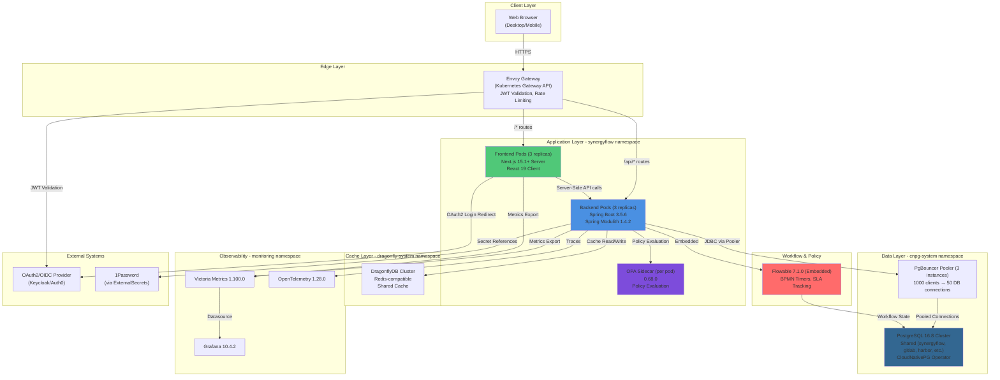

# 2. High Level Architecture

## 2.1 Technical Summary

SynergyFlow implements a **Spring Modulith modular monolith** backend deployed on Kubernetes, with a **Next.js 15 App Router** frontend, unified through an **Envoy Gateway** API layer. The architecture leverages **event-driven integration** via Spring Modulith's in-JVM event bus with transactional outbox pattern, eliminating external message broker complexity while maintaining 20x faster event processing (50-100ms vs 2-3s with Kafka).

The platform integrates **Flowable 7.1.0** for BPMN-based SLA tracking and **OPA 0.68.0** sidecar for policy-driven automation with explainable decision receipts. Data persistence uses a **shared PostgreSQL 16.8 cluster** with PgBouncer connection pooling (1000 clients → 50 DB connections), and **DragonflyDB** for Redis-compatible caching.

This architecture achieves PRD goals by: (1) eliminating context-switching through unified platform design, (2) providing transparent eventual consistency via freshness badges and projection lag tracking, (3) enabling "magic and audits like a bank" through OPA decision receipts and immutable audit trails, and (4) scaling efficiently from 250 to 1,000 users with operational simplicity for a 5-person team.

## 2.2 Platform and Infrastructure Choice

**Platform:** Kubernetes (self-hosted, cloud-agnostic)

**Primary Rationale:**
- **Data Residency:** Indonesia deployment requirement (self-hosted in Indonesian data center)
- **Operational Control:** Full control over infrastructure for compliance and security
- **Platform Consistency:** Existing shared infrastructure (PostgreSQL, DragonflyDB, GitOps via Flux CD)
- **Cloud Agnostic:** Deploy on AWS, GCP, Azure, or on-premises Kubernetes

**Key Services:**
- **Container Orchestration:** Kubernetes 1.28+ (cloud-agnostic)
- **Database:** CloudNativePG Operator managing shared PostgreSQL 16.8 cluster
- **Cache:** DragonflyDB operator managing shared Redis-compatible cluster
- **API Gateway:** Envoy Gateway (Kubernetes Gateway API)
- **GitOps:** Flux CD 2.2.3 for declarative deployments
- **Monitoring:** Victoria Metrics 1.100.0 + Grafana 10.4.2
- **Secrets:** ExternalSecrets Operator (ESO) with 1Password integration
- **Container Registry:** Harbor (private registry, self-hosted)

**Deployment Host and Regions:**
- **Primary Region:** Indonesia (Jakarta) - data residency compliance
- **Future Expansion:** Philippines (Manila), Singapore, Malaysia (Kuala Lumpur) - Months 12-18

**Architecture Decision:** Why Kubernetes over Managed PaaS (Vercel, AWS Amplify)?
1. **Data Residency:** Indonesia deployment requires self-hosted infrastructure
2. **Cost Control:** Eliminates vendor lock-in, predictable infrastructure costs
3. **Platform Reuse:** Leverages existing shared PostgreSQL, DragonflyDB, monitoring stack
4. **Compliance:** Full control for audit trails, SOC 2 / ISO 27001 readiness
5. **Scale Economics:** 250-1,000 users more cost-effective on Kubernetes than managed PaaS

## 2.3 Repository Structure

**Structure:** Monorepo (frontend + backend + infrastructure in single repository)

**Monorepo Tool:** Git repository with directory-based separation (no monorepo tool initially)

**Rationale:**
- **Simplicity:** 5-person team benefits from single repo (atomic commits, unified CI/CD)
- **Type Sharing:** TypeScript interfaces generated from Java DTOs (shared types)
- **Versioning:** Frontend and backend versions stay in sync
- **CI/CD:** Single pipeline builds and deploys both components
- **Future Option:** Can migrate to Nx or Turborepo if complexity warrants

**Package Organization (Spring Modulith Compliant):**

**MANDATORY REQUIREMENTS:**
- **Lombok 1.18.30+** - Eliminate boilerplate (DTOs, Entities, Builders)
- **MapStruct 1.5.5+** - Type-safe DTO ↔ Entity mapping
- **SpringDoc OpenAPI 2.3+** - API documentation with Swagger UI
- **RFC7807 Problem Details** - Standardized error responses

```
synergyflow/
├── backend/              # Spring Boot 3.5.6 application
│   ├── lombok.config     # Lombok configuration (MANDATORY)
│   ├── src/main/java/com/synergyflow/
│   │   ├── SynergyFlowApplication.java  # @SpringBootApplication @Modulith
│   │   │
│   │   ├── incident/     # Incident Management module
│   │   │   ├── IncidentDto.java              # Public API (Lombok @Value)
│   │   │   ├── IncidentService.java          # Public service interface
│   │   │   ├── IncidentController.java       # REST API (@RestController)
│   │   │   ├── IncidentCreatedEvent.java     # Domain event (record)
│   │   │   ├── IncidentResolvedEvent.java
│   │   │   └── internal/                     # Hidden from other modules
│   │   │       ├── Incident.java             # Entity (Lombok @Entity @Data)
│   │   │       ├── IncidentRepository.java   # JPA Repository
│   │   │       ├── IncidentMapper.java       # MapStruct @Mapper
│   │   │       ├── IncidentServiceImpl.java  # Service implementation
│   │   │       └── SLATimerListener.java     # Event listener
│   │   │
│   │   ├── change/       # Change Management module
│   │   │   ├── ChangeDto.java
│   │   │   ├── ChangeService.java
│   │   │   ├── ChangeController.java
│   │   │   ├── ChangeRequestedEvent.java
│   │   │   ├── ChangeApprovedEvent.java
│   │   │   └── internal/
│   │   │       ├── Change.java
│   │   │       ├── ChangeRepository.java
│   │   │       ├── ChangeMapper.java
│   │   │       ├── ChangeServiceImpl.java
│   │   │       └── ChangeApprovalListener.java
│   │   │
│   │   ├── task/         # Task/Project Management module
│   │   │   ├── TaskDto.java
│   │   │   ├── TaskService.java
│   │   │   ├── TaskController.java
│   │   │   ├── TaskCreatedEvent.java
│   │   │   └── internal/
│   │   │       ├── Task.java
│   │   │       ├── TaskRepository.java
│   │   │       ├── TaskMapper.java
│   │   │       └── TaskServiceImpl.java
│   │   │
│   │   ├── user/         # User Management module
│   │   │   ├── UserDto.java
│   │   │   ├── UserService.java
│   │   │   ├── UserController.java
│   │   │   └── internal/
│   │   │       ├── User.java
│   │   │       ├── UserRepository.java
│   │   │       ├── UserMapper.java
│   │   │       └── UserServiceImpl.java
│   │   │
│   │   ├── policy/       # OPA Policy integration module
│   │   │   ├── DecisionReceiptDto.java
│   │   │   ├── PolicyService.java
│   │   │   └── internal/
│   │   │       ├── OpaClient.java
│   │   │       ├── PolicyEvaluator.java
│   │   │       └── DecisionReceiptRepository.java
│   │   │
│   │   ├── workflow/     # Flowable integration module
│   │   │   ├── WorkflowService.java
│   │   │   └── internal/
│   │   │       ├── FlowableConfig.java
│   │   │       └── SLAWorkflowDelegate.java
│   │   │
│   │   ├── audit/        # Audit & Decision Receipts module
│   │   │   ├── AuditLogDto.java
│   │   │   ├── AuditService.java
│   │   │   └── internal/
│   │   │       ├── AuditLog.java
│   │   │       └── AuditLogRepository.java
│   │   │
│   │   └── commons/      # Cross-cutting concerns (minimal usage)
│   │       ├── package-info.java         # @ApplicationModule(type = Type.OPEN)
│   │       ├── config/
│   │       │   ├── OpenApiConfig.java     # SpringDoc configuration
│   │       │   └── JpaAuditingConfig.java
│   │       ├── exception/
│   │       │   ├── GlobalExceptionHandler.java  # RFC7807 Problem Details
│   │       │   ├── ProblemDetailFactory.java
│   │       │   ├── BusinessException.java
│   │       │   └── ResourceNotFoundException.java
│   │       └── util/
│   │           └── DateTimeUtils.java     # Pure utilities only
│   │
│   ├── src/main/resources/
│   │   ├── db/migration/ # Flyway database migrations
│   │   └── application.yaml
│   └── build.gradle.kts  # Lombok + MapStruct + SpringDoc dependencies
├── frontend/             # Next.js 15.1+ application
│   ├── src/
│   │   ├── app/          # Next.js App Router pages
│   │   ├── components/   # React components
│   │   ├── lib/          # Client libraries, API clients
│   │   ├── types/        # TypeScript types (generated from backend DTOs)
│   │   └── hooks/        # Custom React hooks
│   ├── public/           # Static assets
│   └── package.json
├── infrastructure/       # Kubernetes manifests, Flux CD, Kustomize
│   ├── base/             # Base Kubernetes manifests
│   ├── overlays/         # Environment-specific overlays (dev/staging/prod)
│   │   ├── dev/
│   │   ├── staging/
│   │   └── production/
│   └── policies/         # OPA Rego policies (ConfigMaps)
├── docs/                 # Documentation
│   ├── PRD.md
│   ├── architecture.md   # This file
│   └── epics/
└── .github/workflows/    # CI/CD pipelines
```

## 2.4 High Level Architecture Diagram



## 2.5 Architectural Patterns

**1. Modular Monolith (Spring Modulith)**
- **Description:** Single deployable artifact with enforced module boundaries via Spring Modulith. Modules communicate through in-JVM events and direct method calls, not HTTP.
- **Rationale:** Operational simplicity for 5-person team (no distributed system complexity), 20x faster event processing vs Kafka (50-100ms vs 2-3s), eliminates $250-350/month message broker infrastructure costs, natural migration path to microservices if needed (event externalization).

**2. Event-Driven Architecture (Transactional Outbox Pattern)**
- **Description:** Spring Modulith ApplicationEvents with Java record types published to `event_publication` table atomically during write transactions. In-JVM event bus delivers events to @ApplicationModuleListener consumers with at-least-once delivery semantics.
- **Rationale:** Decouples modules (Incident → Change → Task workflows), enables eventual consistency with projection lag tracking, provides durable messaging without external broker, supports idempotent consumers via `processed_events` table.

**3. API Gateway Pattern (Envoy Gateway)**
- **Description:** Envoy Gateway as single entry point for all frontend-to-backend communication, implementing JWT validation, rate limiting (100 req/min per client), CORS policy, and request/response logging with correlation IDs.
- **Rationale:** Centralizes cross-cutting concerns (auth, rate limiting, observability), provides unified API surface, enables independent frontend/backend deployment, supports future backend scaling (10 replicas).

**4. Sidecar Pattern (OPA Policy Engine)**
- **Description:** OPA 0.68.0 deployed as sidecar container alongside each Spring Boot pod, communicating via localhost:8181 for <10ms policy evaluation latency. Rego policy bundles loaded via ConfigMap volumes.
- **Rationale:** Separates policy logic from application code (policy-as-code versioned in Git), enables shadow mode testing for policies, generates explainable decision receipts (100% coverage), supports canary rollout of new policies.

**5. Shared Database Pattern (PostgreSQL Shared Cluster)**
- **Description:** Single PostgreSQL 16.8 cluster (CloudNativePG) shared across synergyflow, gitlab, harbor, keycloak, mattermost. Database `synergyflow` with 7 schemas (`synergyflow_users`, `synergyflow_incidents`, `synergyflow_changes`, `synergyflow_knowledge`, `synergyflow_tasks`, `synergyflow_audit`, `synergyflow_workflows`). PgBouncer pooler provides connection pooling (1000 clients → 50 DB connections).
- **Rationale:** Consistent with platform architecture (gitlab, harbor, keycloak use same pattern), reduces infrastructure overhead (no dedicated DB cluster), 50% CPU savings and 87% memory savings vs dedicated cluster, operational simplicity for shared backup/HA strategy.

**6. Repository Pattern (Spring Data JPA)**
- **Description:** Spring Data JPA 3.2.0 with Hibernate 6.4.0 for declarative data access. JpaRepository interfaces with query methods by naming convention and @Query annotations. Auditing support (@CreatedDate, @LastModifiedDate, @CreatedBy, @LastModifiedBy).
- **Rationale:** Spring-native ORM (no MyBatis configuration), declarative repository pattern reduces boilerplate, automatic CRUD operations, query method generation, type-safe queries, sufficient for complete product needs.

**7. Server-Side Rendering (Next.js App Router)**
- **Description:** Next.js 15 App Router with React 19 Server Components for initial page load, Client Components for interactivity. SSR for authenticated pages, Static Generation for public content (knowledge base). Turbopack for dev mode (stable), async Request APIs, React Compiler for automatic memoization.
- **Rationale:** Improved SEO and First Contentful Paint (<2s target), reduced JavaScript bundle size (Server Components + React Compiler), better developer experience (co-located data fetching), streaming for progressive rendering, 30% faster dev builds (Turbopack), automatic performance optimizations via React Compiler.

**8. Backend For Frontend (BFF) Implicit Pattern**
- **Description:** Next.js Server Components and Server Actions act as implicit BFF layer, aggregating backend API calls server-side before sending optimized payloads to client.
- **Rationale:** Reduces client-side API calls (single SSR fetch vs multiple client fetches), hides backend API details from browser, enables server-side data aggregation (incident + related changes + worklogs in single request), better security (API keys never exposed to client).

**9. Circuit Breaker Pattern (Resilience4j)**
- **Description:** Circuit breaker for external service calls (OPA sidecar, DragonflyDB). Circuit states: CLOSED (normal), OPEN (failing), HALF_OPEN (testing recovery). Failure threshold: 50% in 100 requests, wait duration: 60 seconds.
- **Rationale:** Prevents cascading failures (if OPA unreachable, fallback to RBAC-only), graceful degradation (if DragonflyDB down, skip caching and query DB directly), improves system resilience and user experience during partial outages.

**10. Optimistic Locking (JPA @Version)**
- **Description:** JPA @Version annotation for optimistic concurrency control on aggregates (Incident, Change, Task). Version field incremented on each update, conflicts detected via VersionConflictException.
- **Rationale:** Prevents lost updates in concurrent modification scenarios (two agents updating same incident simultaneously), better performance than pessimistic locking (no database locks), aligned with event-driven architecture (version included in events).

---
