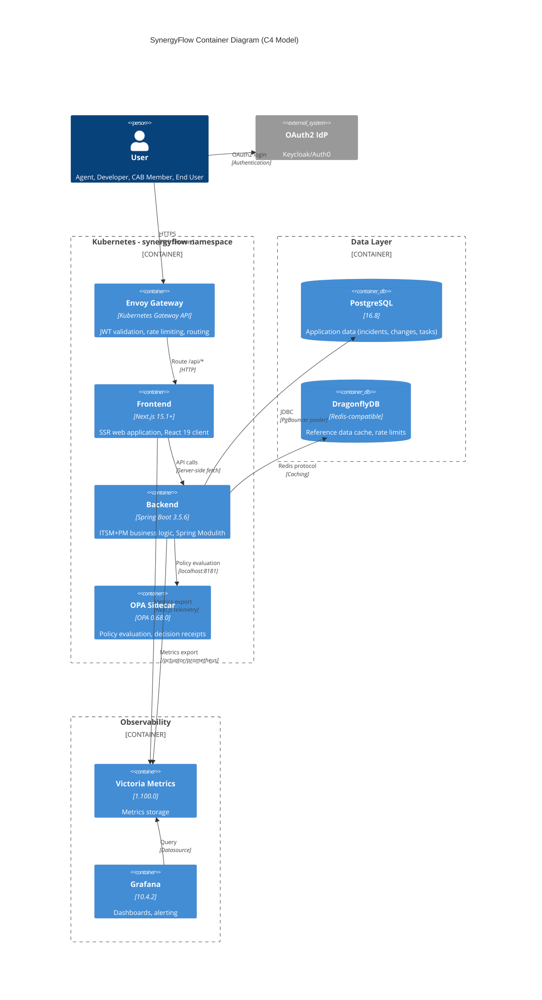

# 6. Components

This section defines the major logical components across the fullstack application. Each component has clear responsibilities, interfaces, and dependencies.

## 6.1 Frontend - Next.js Application

**Responsibility:** Serves the user-facing web application with server-side rendering, handles client-side interactions, and communicates with the backend API.

**Key Interfaces:**
- `GET /` - Home page (SSR authenticated)
- `GET /incidents` - Incident list page
- `GET /incidents/[id]` - Incident detail page
- `GET /changes` - Change calendar page
- `GET /tasks` - Kanban board page
- Server Actions for form submissions (create incident, log time, etc.)

**Dependencies:**
- Backend API (`/api/v1/*` via Envoy Gateway)
- OAuth2 IdP (for authentication redirects)

**Technology Stack:**
- Next.js 15.1+ (App Router, Server Components, Server Actions, Turbopack dev mode, React 19 support)
- React 19 (Client Components for interactivity, React Compiler, improved Actions)
- TypeScript 5.3+ (type safety)
- Shadcn/ui + Radix UI (accessible components)
- Tailwind CSS 3.4+ (utility-first styling)
- TanStack Query 5.17+ (server state management)
- Zustand 4.5+ (client state management)

## 6.2 Backend - Spring Boot Application

**Responsibility:** Implements business logic for ITSM+PM modules, publishes events via Spring Modulith, integrates with Flowable workflows and OPA policies, persists data to PostgreSQL.

**Key Interfaces (Internal Java Modules):**
- `incident` module: Incident CRUD, SLA tracking, event publication
- `change` module: Change CRUD, approval workflows, deployment tracking
- `task` module: Task CRUD, sprint management, board operations
- `user` module: User management, team assignment, authentication
- `policy` module: OPA integration, decision receipt generation
- `workflow` module: Flowable integration, SLA timers, async job executor
- `audit` module: Audit log, decision receipt storage
- `commons` module: Cross-cutting concerns (config, exceptions, utilities)

**Dependencies:**
- PostgreSQL 16.8 (via PgBouncer pooler)
- DragonflyDB (via Redis client)
- OPA sidecar (localhost:8181)
- Flowable 7.1.0 (embedded)

**Technology Stack:**
- Spring Boot 3.5.6
- Spring Modulith 1.4.2 (module boundaries, event bus)
- Spring Data JPA 3.2.0 (data access)
- Hibernate 6.4.0 (JPA provider)
- Flowable 7.1.0 (BPMN workflows)
- Resilience4j (circuit breaker, retry)

## 6.3 API Gateway - Envoy Gateway

**Responsibility:** Routes HTTP requests to frontend or backend, validates JWTs, enforces rate limits, adds correlation IDs, provides observability.

**Key Interfaces:**
- `HTTPRoute: /* → Frontend Service (port 3000)`
- `HTTPRoute: /api/* → Backend Service (port 8080)`
- `JWTPolicy: Validate JWT for /api/* routes`
- `BackendTrafficPolicy: Rate limiting 100 req/min per client`

**Dependencies:**
- OAuth2 IdP (for JWT public key validation)
- Frontend pods (synergyflow-frontend)
- Backend pods (synergyflow-backend)

**Technology Stack:**
- Envoy Gateway (Kubernetes Gateway API)
- JWTPolicy CRD (JWT validation)
- BackendTrafficPolicy CRD (rate limiting, CORS)

## 6.4 Policy Engine - OPA Sidecar

**Responsibility:** Evaluates Rego policies for authorization (RBAC/ABAC), change approvals, incident routing, and generates decision receipts.

**Key Interfaces:**
- `POST /v1/data/synergyflow/change_approval_policy` - Evaluate change approval
- `POST /v1/data/synergyflow/incident_assignment_policy` - Evaluate incident routing
- `POST /v1/data/synergyflow/resource_access_policy` - Evaluate resource access (RBAC)

**Dependencies:**
- Policy bundles (loaded from ConfigMap volumes)
- None (sidecar is stateless)

**Technology Stack:**
- OPA 0.68.0 (sidecar container)
- Rego (policy language)

## 6.5 Workflow Engine - Flowable

**Responsibility:** Executes BPMN workflows for SLA timers, approval flows, and async job processing.

**Key Interfaces (Java API):**
- `RuntimeService.startProcessInstanceByKey("incident-sla-timer")`
- `TaskService.complete(taskId)` - Complete user task (CAB approval)
- `ManagementService.getJobExecutorHealth()` - Job executor health

**Dependencies:**
- PostgreSQL (workflow state persistence in `synergyflow_workflows` schema)
- Backend services (delegates called from BPMN service tasks)

**Technology Stack:**
- Flowable 7.1.0 (embedded in Spring Boot)
- BPMN 2.0 (workflow definitions)

## 6.6 Database - PostgreSQL Cluster

**Responsibility:** Persists application data (incidents, changes, tasks, users, audit logs, events, workflows).

**Key Interfaces:**
- JDBC connection via PgBouncer pooler: `jdbc:postgresql://synergyflow-pooler-rw.cnpg-system.svc.cluster.local:5432/synergyflow`
- 7 schemas: `synergyflow_users`, `synergyflow_incidents`, `synergyflow_changes`, `synergyflow_knowledge`, `synergyflow_tasks`, `synergyflow_audit`, `synergyflow_workflows`

**Dependencies:**
- CloudNativePG Operator (cluster management)
- PgBouncer Pooler (connection pooling)

**Technology Stack:**
- PostgreSQL 16.8
- PgBouncer 1.21+ (transaction mode)
- CloudNativePG Operator

## 6.7 Cache - DragonflyDB Cluster

**Responsibility:** Caches reference data (users, teams, categories), API rate limit counters, OPA policy evaluation results.

**Key Interfaces:**
- Redis protocol: `dragonfly.dragonfly-system.svc:6379`
- Spring Cache Abstraction (`@Cacheable`, `@CacheEvict`)

**Dependencies:**
- DragonflyDB Operator (cluster management)

**Technology Stack:**
- DragonflyDB (Redis-compatible)
- Spring Data Redis

## 6.8 Observability Stack

**Responsibility:** Collects metrics, traces, and logs from frontend and backend for monitoring and alerting.

**Key Interfaces:**
- Prometheus scrape endpoint: `/actuator/prometheus` (backend)
- Grafana datasource: Victoria Metrics
- OpenTelemetry trace export: OTLP protocol

**Dependencies:**
- Backend (metrics export via Spring Boot Actuator)
- Frontend (metrics export via Next.js telemetry)

**Technology Stack:**
- Victoria Metrics 1.100.0 (metrics storage)
- Grafana 10.4.2 (visualization)
- OpenTelemetry 1.28.0 (distributed tracing)
- Logback (structured JSON logging)

## 6.9 Component Diagram (C4 Container Level)

---
