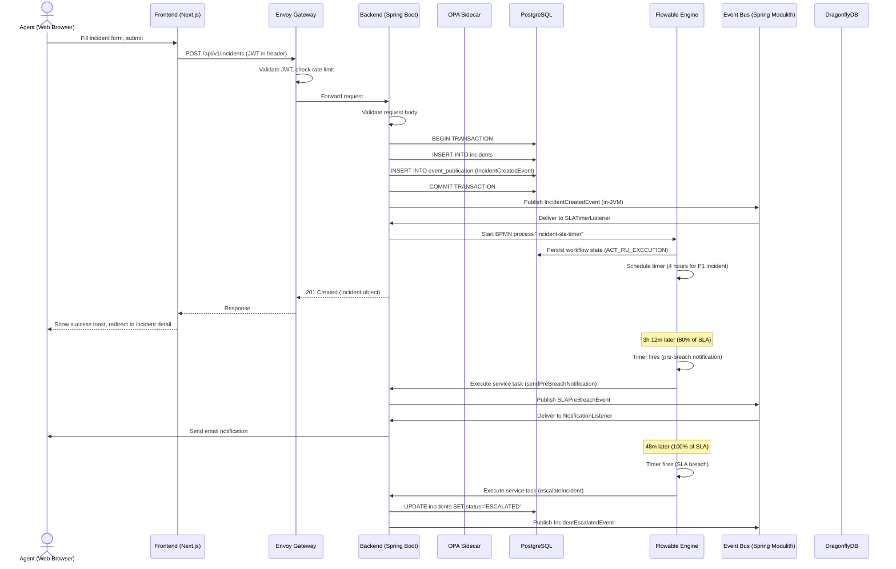
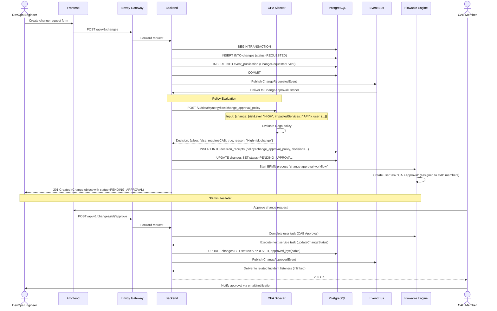
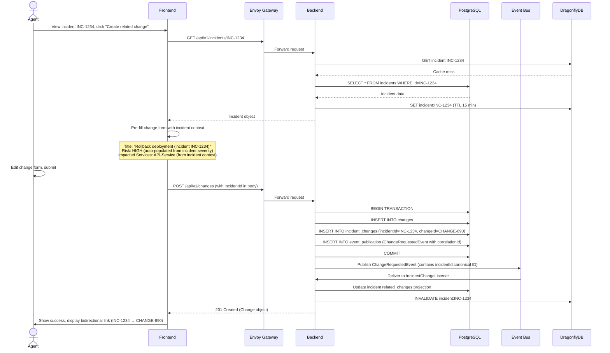
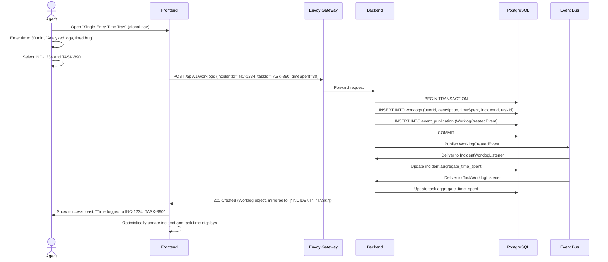

# 8. Core Workflows

## 8.1 Incident Creation and SLA Tracking Workflow

## 8.2 Change Request with Policy-Driven Approval Workflow

## 8.3 Link-on-Action: Create Related Change from Incident

## 8.4 Single-Entry Time Tray Workflow

---
