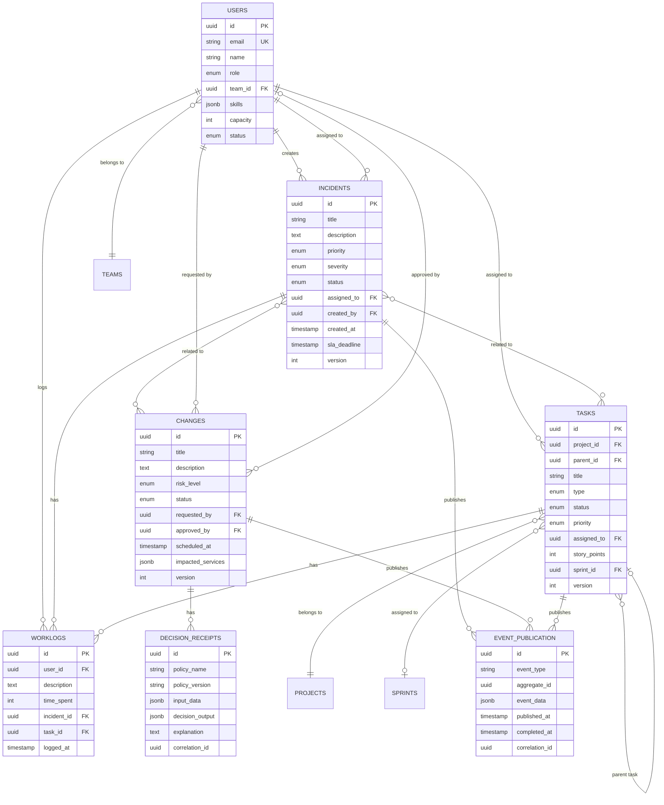

# 9. Database Schema

## 9.1 Schema Organization

SynergyFlow uses **7 PostgreSQL schemas** within the `synergyflow` database for module separation:

1. **synergyflow_users** - User, Team, Role, Permission tables
2. **synergyflow_incidents** - Incident, Problem, Comment, Worklog tables
3. **synergyflow_changes** - Change, Release, Deployment tables
4. **synergyflow_knowledge** - KnowledgeArticle, Tag, Version tables
5. **synergyflow_tasks** - Project, Epic, Story, Task, Sprint tables
6. **synergyflow_audit** - AuditLog, DecisionReceipt tables
7. **synergyflow_workflows** - Flowable tables (ACT_RU_*, ACT_HI_*)

**Special Table:**
- **event_publication** - Spring Modulith transactional outbox table (created in `public` schema or `synergyflow` schema based on configuration)

## 9.2 Core Tables (SQL DDL)

```sql
-- Schema: synergyflow_incidents

CREATE TABLE synergyflow_incidents.incidents (
    id UUID PRIMARY KEY DEFAULT gen_random_uuid(),
    title VARCHAR(200) NOT NULL,
    description TEXT NOT NULL,
    priority VARCHAR(20) NOT NULL CHECK (priority IN ('LOW', 'MEDIUM', 'HIGH', 'CRITICAL')),
    severity VARCHAR(10) NOT NULL CHECK (severity IN ('S1', 'S2', 'S3', 'S4')),
    status VARCHAR(20) NOT NULL CHECK (status IN ('NEW', 'ASSIGNED', 'IN_PROGRESS', 'RESOLVED', 'CLOSED')),
    assigned_to UUID REFERENCES synergyflow_users.users(id),
    created_by UUID NOT NULL REFERENCES synergyflow_users.users(id),
    created_at TIMESTAMP NOT NULL DEFAULT NOW(),
    updated_at TIMESTAMP NOT NULL DEFAULT NOW(),
    resolved_at TIMESTAMP,
    sla_deadline TIMESTAMP NOT NULL,
    resolution TEXT,
    version INTEGER NOT NULL DEFAULT 0, -- Optimistic locking
    CONSTRAINT incidents_resolved_at_check CHECK (
        (status IN ('RESOLVED', 'CLOSED') AND resolved_at IS NOT NULL) OR
        (status NOT IN ('RESOLVED', 'CLOSED') AND resolved_at IS NULL)
    )
);

CREATE INDEX idx_incidents_status ON synergyflow_incidents.incidents(status);
CREATE INDEX idx_incidents_assigned_to ON synergyflow_incidents.incidents(assigned_to);
CREATE INDEX idx_incidents_created_at ON synergyflow_incidents.incidents(created_at DESC);
CREATE INDEX idx_incidents_sla_deadline ON synergyflow_incidents.incidents(sla_deadline);
CREATE INDEX idx_incidents_priority_status ON synergyflow_incidents.incidents(priority, status);

-- Schema: synergyflow_changes

CREATE TABLE synergyflow_changes.changes (
    id UUID PRIMARY KEY DEFAULT gen_random_uuid(),
    title VARCHAR(200) NOT NULL,
    description TEXT NOT NULL,
    risk_level VARCHAR(20) NOT NULL CHECK (risk_level IN ('LOW', 'MEDIUM', 'HIGH', 'EMERGENCY')),
    status VARCHAR(30) NOT NULL CHECK (status IN (
        'REQUESTED', 'PENDING_APPROVAL', 'APPROVED', 'REJECTED',
        'SCHEDULED', 'IN_PROGRESS', 'COMPLETED', 'FAILED', 'ROLLED_BACK'
    )),
    requested_by UUID NOT NULL REFERENCES synergyflow_users.users(id),
    approved_by UUID REFERENCES synergyflow_users.users(id),
    scheduled_at TIMESTAMP,
    deployed_at TIMESTAMP,
    rollback_plan TEXT NOT NULL,
    impacted_services JSONB NOT NULL DEFAULT '[]'::jsonb,
    created_at TIMESTAMP NOT NULL DEFAULT NOW(),
    updated_at TIMESTAMP NOT NULL DEFAULT NOW(),
    version INTEGER NOT NULL DEFAULT 0
);

CREATE INDEX idx_changes_status ON synergyflow_changes.changes(status);
CREATE INDEX idx_changes_risk_level ON synergyflow_changes.changes(risk_level);
CREATE INDEX idx_changes_scheduled_at ON synergyflow_changes.changes(scheduled_at);
CREATE INDEX idx_changes_requested_by ON synergyflow_changes.changes(requested_by);

-- Schema: synergyflow_tasks

CREATE TABLE synergyflow_tasks.tasks (
    id UUID PRIMARY KEY DEFAULT gen_random_uuid(),
    project_id UUID NOT NULL REFERENCES synergyflow_tasks.projects(id),
    parent_id UUID REFERENCES synergyflow_tasks.tasks(id), -- Self-referential
    title VARCHAR(200) NOT NULL,
    description TEXT NOT NULL,
    type VARCHAR(20) NOT NULL CHECK (type IN ('EPIC', 'STORY', 'TASK', 'SUBTASK')),
    status VARCHAR(20) NOT NULL CHECK (status IN ('TODO', 'IN_PROGRESS', 'DONE')),
    priority VARCHAR(20) NOT NULL CHECK (priority IN ('LOW', 'MEDIUM', 'HIGH')),
    assigned_to UUID REFERENCES synergyflow_users.users(id),
    story_points INTEGER CHECK (story_points IN (1, 2, 3, 5, 8, 13, 21)),
    sprint_id UUID REFERENCES synergyflow_tasks.sprints(id),
    created_at TIMESTAMP NOT NULL DEFAULT NOW(),
    updated_at TIMESTAMP NOT NULL DEFAULT NOW(),
    completed_at TIMESTAMP,
    version INTEGER NOT NULL DEFAULT 0
);

CREATE INDEX idx_tasks_project_id ON synergyflow_tasks.tasks(project_id);
CREATE INDEX idx_tasks_sprint_id ON synergyflow_tasks.tasks(sprint_id);
CREATE INDEX idx_tasks_status ON synergyflow_tasks.tasks(status);
CREATE INDEX idx_tasks_assigned_to ON synergyflow_tasks.tasks(assigned_to);
CREATE INDEX idx_tasks_parent_id ON synergyflow_tasks.tasks(parent_id);

-- Schema: synergyflow_incidents (worklog shared across incidents and tasks)

CREATE TABLE synergyflow_incidents.worklogs (
    id UUID PRIMARY KEY DEFAULT gen_random_uuid(),
    user_id UUID NOT NULL REFERENCES synergyflow_users.users(id),
    description TEXT NOT NULL,
    time_spent INTEGER NOT NULL CHECK (time_spent > 0), -- minutes
    logged_at TIMESTAMP NOT NULL DEFAULT NOW(),
    incident_id UUID REFERENCES synergyflow_incidents.incidents(id),
    task_id UUID REFERENCES synergyflow_tasks.tasks(id),
    created_at TIMESTAMP NOT NULL DEFAULT NOW(),
    CONSTRAINT worklogs_entity_check CHECK (
        incident_id IS NOT NULL OR task_id IS NOT NULL
    )
);

CREATE INDEX idx_worklogs_incident_id ON synergyflow_incidents.worklogs(incident_id);
CREATE INDEX idx_worklogs_task_id ON synergyflow_incidents.worklogs(task_id);
CREATE INDEX idx_worklogs_user_id ON synergyflow_incidents.worklogs(user_id);
CREATE INDEX idx_worklogs_logged_at ON synergyflow_incidents.worklogs(logged_at DESC);

-- Schema: synergyflow_users

CREATE TABLE synergyflow_users.users (
    id UUID PRIMARY KEY DEFAULT gen_random_uuid(),
    email VARCHAR(255) NOT NULL UNIQUE,
    name VARCHAR(255) NOT NULL,
    role VARCHAR(30) NOT NULL CHECK (role IN ('ADMIN', 'AGENT', 'DEVELOPER', 'CAB_MEMBER', 'END_USER')),
    team_id UUID REFERENCES synergyflow_users.teams(id),
    skills JSONB NOT NULL DEFAULT '[]'::jsonb,
    capacity INTEGER NOT NULL DEFAULT 40 CHECK (capacity >= 0 AND capacity <= 168), -- hours/week
    status VARCHAR(20) NOT NULL DEFAULT 'ACTIVE' CHECK (status IN ('ACTIVE', 'INACTIVE')),
    created_at TIMESTAMP NOT NULL DEFAULT NOW(),
    updated_at TIMESTAMP NOT NULL DEFAULT NOW()
);

CREATE INDEX idx_users_email ON synergyflow_users.users(email);
CREATE INDEX idx_users_team_id ON synergyflow_users.users(team_id);
CREATE INDEX idx_users_role ON synergyflow_users.users(role);

-- Schema: synergyflow_audit

CREATE TABLE synergyflow_audit.decision_receipts (
    id UUID PRIMARY KEY DEFAULT gen_random_uuid(),
    policy_name VARCHAR(100) NOT NULL,
    policy_version VARCHAR(20) NOT NULL,
    input_data JSONB NOT NULL,
    decision_output JSONB NOT NULL,
    explanation TEXT NOT NULL,
    correlation_id UUID NOT NULL,
    timestamp TIMESTAMP NOT NULL DEFAULT NOW()
);

CREATE INDEX idx_decision_receipts_correlation_id ON synergyflow_audit.decision_receipts(correlation_id);
CREATE INDEX idx_decision_receipts_policy_name ON synergyflow_audit.decision_receipts(policy_name);
CREATE INDEX idx_decision_receipts_timestamp ON synergyflow_audit.decision_receipts(timestamp DESC);

-- Schema: public or synergyflow (Spring Modulith event publication table)

CREATE TABLE event_publication (
    id UUID PRIMARY KEY DEFAULT gen_random_uuid(),
    event_type VARCHAR(255) NOT NULL,
    aggregate_id UUID NOT NULL,
    event_data JSONB NOT NULL,
    published_at TIMESTAMP NOT NULL DEFAULT NOW(),
    completed_at TIMESTAMP,
    listener_id VARCHAR(255),
    retry_count INTEGER NOT NULL DEFAULT 0,
    correlation_id UUID NOT NULL,
    causation_id UUID
);

CREATE INDEX idx_event_publication_aggregate_id ON event_publication(aggregate_id);
CREATE INDEX idx_event_publication_event_type ON event_publication(event_type);
CREATE INDEX idx_event_publication_completed_at ON event_publication(completed_at);
CREATE INDEX idx_event_publication_published_at ON event_publication(published_at DESC);

-- Schema: synergyflow_incidents (processed_events for idempotency)

CREATE TABLE processed_events (
    event_id UUID NOT NULL,
    listener_id VARCHAR(255) NOT NULL,
    processed_at TIMESTAMP NOT NULL DEFAULT NOW(),
    PRIMARY KEY (event_id, listener_id)
);

-- Join tables for many-to-many relationships

CREATE TABLE synergyflow_incidents.incident_changes (
    incident_id UUID NOT NULL REFERENCES synergyflow_incidents.incidents(id) ON DELETE CASCADE,
    change_id UUID NOT NULL REFERENCES synergyflow_changes.changes(id) ON DELETE CASCADE,
    created_at TIMESTAMP NOT NULL DEFAULT NOW(),
    PRIMARY KEY (incident_id, change_id)
);

CREATE TABLE synergyflow_incidents.incident_tasks (
    incident_id UUID NOT NULL REFERENCES synergyflow_incidents.incidents(id) ON DELETE CASCADE,
    task_id UUID NOT NULL REFERENCES synergyflow_tasks.tasks(id) ON DELETE CASCADE,
    created_at TIMESTAMP NOT NULL DEFAULT NOW(),
    PRIMARY KEY (incident_id, task_id)
);
```

## 9.3 Entity-Relationship Diagram



---
