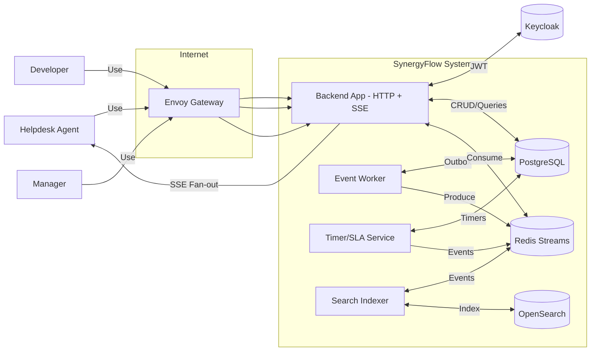
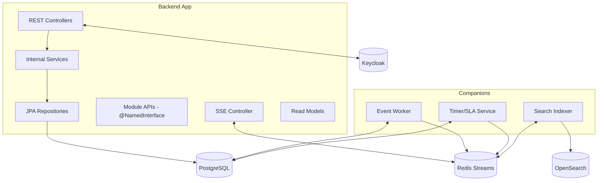
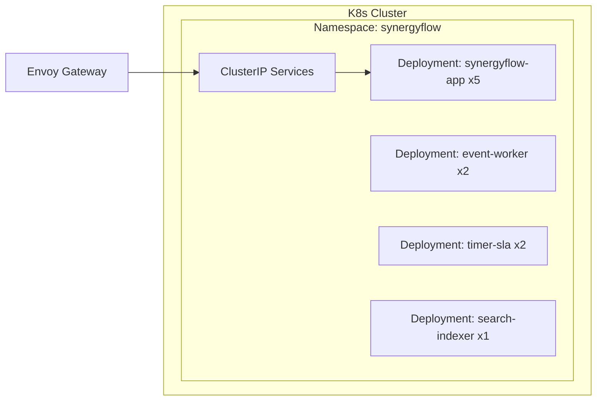
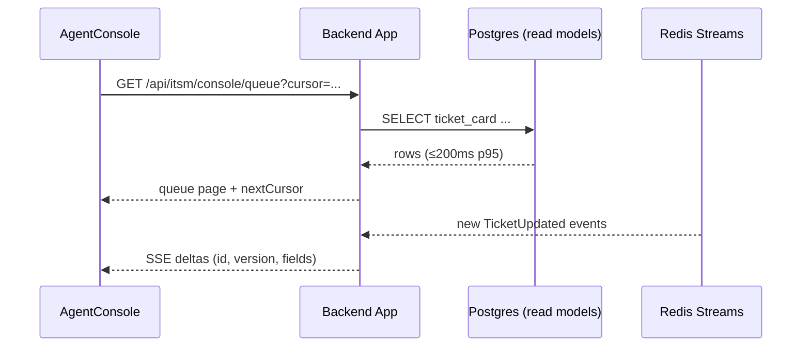
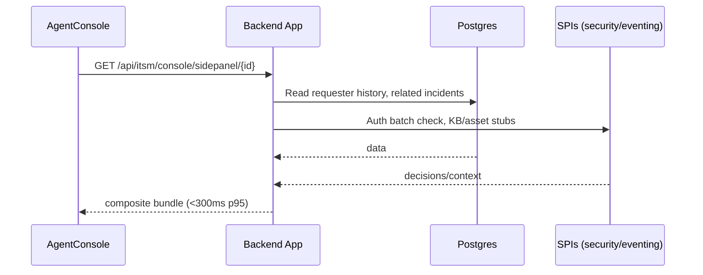
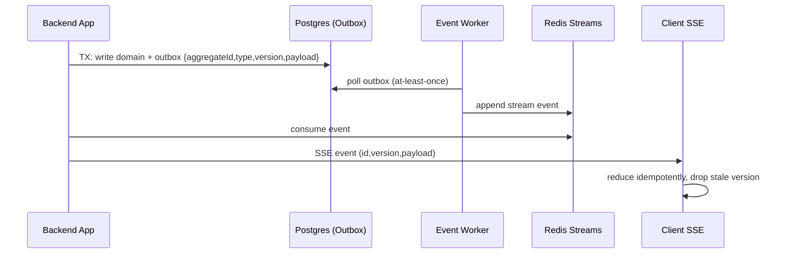

# Architecture Blueprint — SynergyFlow

Date: 2025-10-06
Owner: Architect

---

## C4 — System Context

## C4 — Containers

## C4 — Deployment

---

## Runtime Views

### Queue Load (Read Model → SSE)

### Side‑Panel Composite

### Outbox → SSE Fan‑out

