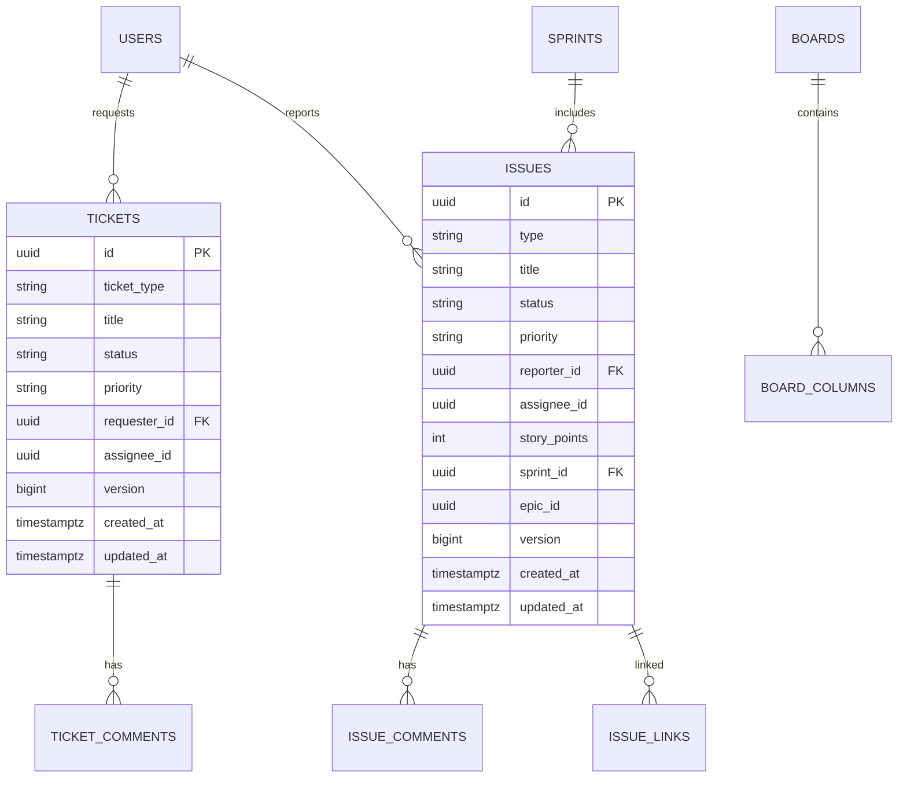

# Data Model v1 — SynergyFlow

Date: 2025-10-06
Owner: Architect

---

## ERD (High Level)

## Read Models (CQRS‑lite)

- `ticket_card`: queue rows for ITSM (denormalized, ≤6KB/row typical)
- `queue_row`: list view backing store
- `issue_card`: board card projection
- `board_view`: board with columns and ordered card IDs
- `sprint_summary`: burndown data points

## UUID Policy

- All primary keys are UUIDv7 (see `docs/uuidv7-implementation-guide.md`).

## Migrations

- Initial Flyway DDL at `docs/architecture/db/migrations/V1__core_schema.sql`.
