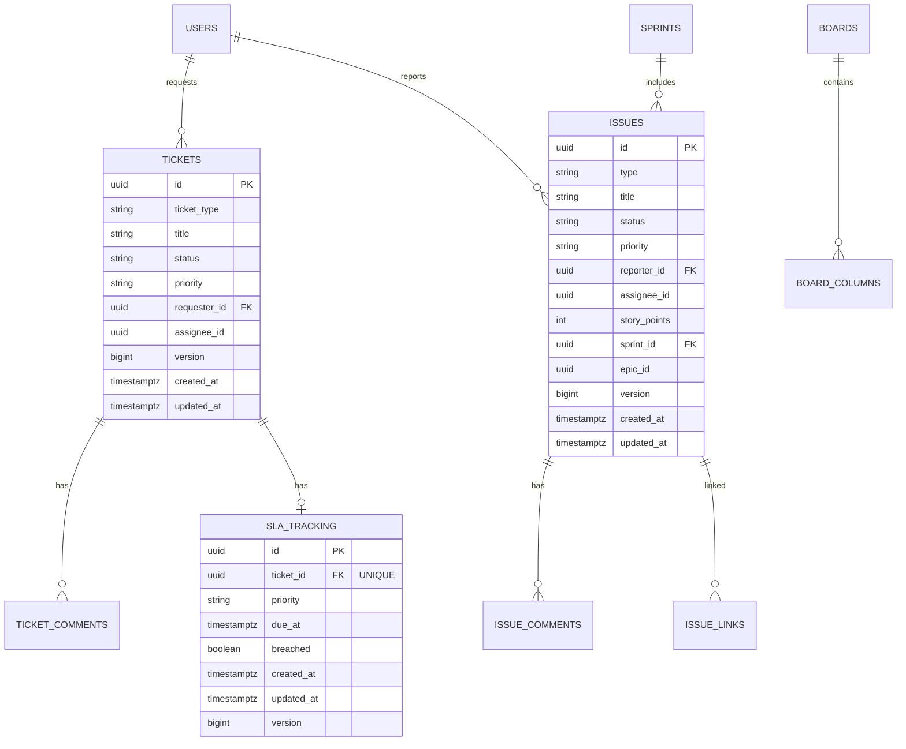

# Data Model v1 — SynergyFlow

Date: 2025-10-06
Owner: Architect

---

## ERD (High Level)



## Read Models (CQRS‑lite)

- `ticket_card`: queue rows for ITSM (denormalized, ≤6KB/row typical)
- `queue_row`: list view backing store
- `issue_card`: board card projection
- `board_view`: board with columns and ordered card IDs
- `sprint_summary`: burndown data points

## UUID Policy

- All primary keys are UUIDv7 (see `docs/uuidv7-implementation-guide.md`).

## Migrations

- Initial Flyway DDL at `docs/architecture/db/migrations/V1__core_schema.sql`
- V11: SLA tracking table (`backend/src/main/resources/db/migration/V11__create_sla_tracking_table.sql`)

## ITSM Module Tables

### sla_tracking

**Purpose:** Tracks SLA deadlines for ITSM incident tickets with priority-based duration calculation.

**Schema:**
```sql
CREATE TABLE sla_tracking (
    id                UUID PRIMARY KEY,
    ticket_id         UUID NOT NULL UNIQUE,
    priority          VARCHAR(20) NOT NULL,
    due_at            TIMESTAMP WITH TIME ZONE NOT NULL,
    breached          BOOLEAN DEFAULT FALSE,
    created_at        TIMESTAMP WITH TIME ZONE NOT NULL,
    updated_at        TIMESTAMP WITH TIME ZONE NOT NULL,
    version           BIGINT DEFAULT 0 NOT NULL,
    FOREIGN KEY (ticket_id) REFERENCES tickets(id) ON DELETE CASCADE
);

CREATE INDEX idx_sla_tracking_ticket_id ON sla_tracking(ticket_id);
CREATE INDEX idx_sla_tracking_due_at ON sla_tracking(due_at);
CREATE UNIQUE INDEX idx_sla_tracking_ticket_id_unique ON sla_tracking(ticket_id);
```

**Constraints:**
- 1:1 relationship with tickets (unique constraint on ticket_id)
- Cascade delete when ticket is deleted
- Optimistic locking via version field

**Indexes:**
- `idx_sla_tracking_ticket_id`: O(1) lookup by ticket ID
- `idx_sla_tracking_due_at`: Efficient breach detection queries (`WHERE due_at < NOW()`)

**Related:**
- Migration: `V11__create_sla_tracking_table.sql`
- Entity: `io.monosense.synergyflow.itsm.internal.domain.SlaTracking`
- Story: Story 2.3 - SLA Calculator and Tracking Integration
- ADR: ADR-011 - SLA Tracking with Priority-Based Deadlines
