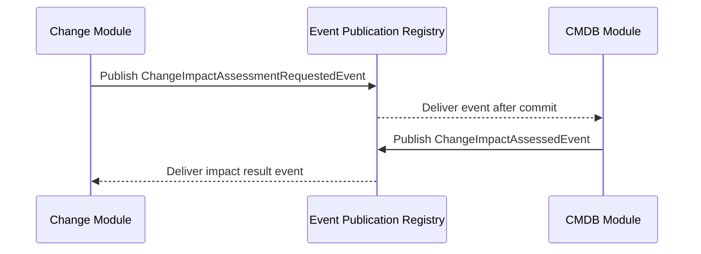

## Patterns
- Outbox (JDBC) with Spring Modulith event publication registry
- @ApplicationModuleListener with REQUIRES_NEW for reliability
- Externalization via Kafka with routing keys and headers

## Contracts
- Versioned events; add fields only, never break consumers
- Change↔CMDB impact assessment handshake for approvals

## SLOs
- <50ms publication latency; <500ms cross‑module propagation (p95)

## Change↔CMDB Impact Assessment (Sequence)

