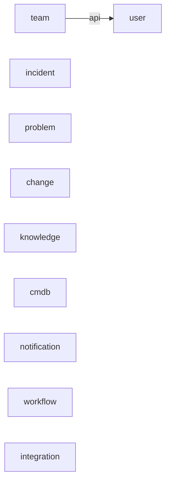

## Principles
- Event-only inter-module communication (no direct deps between ITIL modules).
- Only 'user' is a shared foundation module; 'team' depends on 'user' only.
- Named interfaces limited to external tooling; internal flow via events.

## Modules (Bounded Contexts)
- ITIL: incident, problem, change, knowledge, cmdb
- Core: user, team
- Infra: notification, workflow, integration

## Allowed Dependencies
- user: none
- team: user::api
- others: zero direct module dependencies (events only)

## Event Handshakes
- Change↔CMDB: ChangeImpactAssessmentRequestedEvent → ChangeImpactAssessedEvent (approval gating)

## Compliance
- ApplicationModules.verify() must pass in CI.
- Modulith actuator enabled for runtime inspection.

## Module Dependencies (Mermaid)

