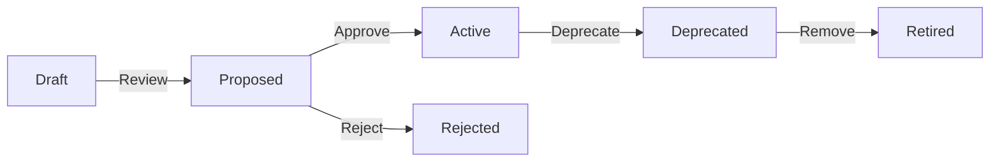

# SynergyFlow Contract Documentation

**Version:** 1.0.0
**Status:** Active
**Last Updated:** 2025-10-18

## Overview

This directory contains **formal contract specifications** for SynergyFlow, ensuring clear boundaries, version control, and backward compatibility across all system interfaces.

Contract documentation is **mandatory** for:
- ✅ API endpoints (REST APIs between frontend and backend)
- ✅ Event schemas (event-driven architecture)
- ✅ Database migrations (schema evolution)
- ✅ Module interfaces (Spring Modulith boundaries)

## Contract Documents

### 1. OpenAPI Specification (REST APIs)

**Document:** [openapi-v1.yaml](./openapi-v1.yaml)

**Purpose:** Defines REST API contracts between Next.js frontend and Spring Boot backend.

**Format:** OpenAPI 3.1.0 (YAML)

**Covers:**
- All REST endpoints (`/api/v1/*`)
- Request/response schemas
- Authentication (JWT Bearer)
- Error formats (RFC 7807 Problem Details)
- Pagination, sorting, filtering

**Tooling:**
- **Validation:** Spectral, OpenAPI Generator
- **Code Generation:** `openapi-generator-maven-plugin` (backend DTOs), `openapi-typescript` (frontend types)
- **Documentation:** Swagger UI (available at `/swagger-ui.html` in development)
- **Testing:** Postman, REST Assured

**Usage:**

```bash
# Validate OpenAPI spec
npx @stoplight/spectral-cli lint docs/contracts/openapi-v1.yaml

# Generate TypeScript types (frontend)
npx openapi-typescript docs/contracts/openapi-v1.yaml --output frontend/src/types/api.ts

# Generate Java DTOs (backend)
./gradlew openApiGenerate
```

**Versioning:**
- API versioned via URL path (`/api/v1`, `/api/v2`)
- Breaking changes require new major version
- Current version: `v1`

---

### 2. Event Contracts (AsyncAPI)

**Document:** [events-asyncapi.yaml](./events-asyncapi.yaml)

**Purpose:** Defines event schemas for event-driven architecture using Spring Modulith.

**Format:** AsyncAPI 3.0.0 (YAML)

**Covers:**
- All domain events (Incident, Change, Task, Worklog, User)
- Event metadata (eventId, correlationId, causationId, timestamp)
- Event channels (Java package names)
- Publisher/subscriber operations
- Event payloads and examples

**Event Naming Convention:**
- Pattern: `{Aggregate}{PastTenseAction}Event`
- Examples: `IncidentCreatedEvent`, `ChangeApprovedEvent`, `TaskCompletedEvent`

**Tooling:**
- **Validation:** AsyncAPI CLI
- **Documentation:** AsyncAPI Studio, Markdown generator
- **Code Generation:** Custom Java record generator (planned)

**Usage:**

```bash
# Validate AsyncAPI spec
npx @asyncapi/cli validate docs/contracts/events-asyncapi.yaml

# Generate AsyncAPI documentation
npx @asyncapi/cli generate fromTemplate docs/contracts/events-asyncapi.yaml @asyncapi/html-template -o docs/contracts/events-html
```

**Versioning:**
- Events versioned via `version` field in event payload
- Schema evolution via version-aware consumers
- Current version: `1` (all events)

---

### 3. Database Migration Contract

**Document:** [database-migration-contract.md](./database-migration-contract.md)

**Purpose:** Defines database schema migration strategy using Flyway.

**Format:** Markdown documentation + SQL migration files

**Covers:**
- Migration naming convention (`V{YYYY.MM.DD.HH.MM}__{description}.sql`)
- Schema organization (7 PostgreSQL schemas)
- Migration templates (CREATE TABLE, ADD COLUMN, ADD INDEX, etc.)
- Versioning strategy (timestamp-based)
- Expand-contract pattern (for breaking changes)
- Rollback procedures

**Migration File Location:**
```
backend/src/main/resources/db/migration/
```

**Tooling:**
- **Migration Tool:** Flyway 10.x
- **Validation:** Flyway checksum validation
- **Testing:** Flyway test migrations in CI/CD

**Usage:**

```bash
# Run migrations
./gradlew flywayMigrate

# Validate migrations
./gradlew flywayValidate

# Show migration status
./gradlew flywayInfo

# Repair migration checksum (use cautiously)
./gradlew flywayRepair
```

**Versioning:**
- Schema version tracked in `flyway_schema_history` table
- Migration versions: `YYYY.MM.DD.HH.MM` (timestamp-based)
- Current schema version: `2025.10.18`

---

### 4. Module Interface Contract

**Document:** [module-interface-contract.md](./module-interface-contract.md)

**Purpose:** Defines Spring Modulith module boundaries and interaction patterns.

**Format:** Markdown documentation

**Covers:**
- Module organization (8 modules: Incident, Change, Task, User, Policy, Workflow, Audit, Shared)
- Module responsibilities and public APIs
- Inter-module communication (events, service calls)
- Module dependency rules
- Event-driven vs. synchronous patterns
- Contract testing guidelines

**Modules:**
1. **Incident Module** - Incident lifecycle management
2. **Change Module** - Change request and deployment tracking
3. **Task Module** - Task/project management
4. **User Module** - User and team management
5. **Policy Module** - OPA policy evaluation
6. **Workflow Module** - Flowable workflow engine integration
7. **Audit Module** - Audit logs and decision receipts
8. **Shared Module** - Shared events, exceptions, utilities

**Tooling:**
- **Validation:** Spring Modulith verification tests, ArchUnit
- **Documentation:** Spring Modulith Documenter (generates PlantUML diagrams)

**Usage:**

```bash
# Run Spring Modulith verification tests
./gradlew test --tests ModulithVerificationTest

# Run ArchUnit boundary tests
./gradlew test --tests ModuleBoundaryTest

# Generate module documentation
./gradlew generateModulithDocs
```

**Versioning:**
- Module contracts versioned with application
- Event schema versions tracked independently
- Current version: `1.0.0`

---

## Contract Governance

### Contract Lifecycle



**States:**
- **Draft** - Contract under development (not yet enforced)
- **Proposed** - Contract ready for review (PR submitted)
- **Active** - Contract approved and enforced
- **Deprecated** - Contract marked for removal (still supported)
- **Retired** - Contract removed (no longer supported)
- **Rejected** - Contract proposal rejected

### Contract Review Process

#### 1. Contract Proposal (Pull Request)

**Required for:**
- New API endpoints
- New event schemas
- Database schema changes
- Module boundary changes

**PR Template:**

```markdown
## Contract Change Summary
- **Type:** [API | Event | Database | Module]
- **Change Type:** [Breaking | Backward-Compatible]
- **Affected Consumers:** [List modules/services affected]

## Changes
- [Detailed description of changes]

## Backward Compatibility
- [ ] Backward compatible
- [ ] Breaking change (requires version bump)

## Testing
- [ ] Contract tests added/updated
- [ ] Integration tests passing
- [ ] Consumer impact assessed

## Documentation
- [ ] OpenAPI spec updated
- [ ] AsyncAPI spec updated
- [ ] Database migration added
- [ ] Module contract updated
```

#### 2. Contract Review Checklist

**Reviewers must verify:**
- [ ] Contract follows naming conventions
- [ ] Versioning strategy applied correctly
- [ ] Backward compatibility maintained (or breaking change justified)
- [ ] Contract tests added
- [ ] Documentation updated
- [ ] Affected consumers notified
- [ ] Migration path defined (for breaking changes)

#### 3. Contract Approval

**Approvers:**
- **API Contracts:** Lead Backend Engineer + Lead Frontend Engineer
- **Event Contracts:** Backend Architect + Module Owners
- **Database Contracts:** Database Engineer + Backend Architect
- **Module Contracts:** Backend Architect + Module Owners

**Approval Criteria:**
- 2+ approvals from qualified reviewers
- All CI/CD checks passing
- Consumer impact assessment completed

### Breaking Changes

**Definition:** A breaking change is any change that requires consumers to update their code.

**Examples:**
- ❌ Removing REST endpoint
- ❌ Renaming event field
- ❌ Changing database column type
- ❌ Removing module public method

**Handling Breaking Changes:**

1. **Deprecation Period** (minimum 2 releases)
   - Add `@Deprecated` annotation
   - Add deprecation notice in documentation
   - Provide migration guide

2. **Versioning Strategy**
   - **API:** Increment major version (`v1` → `v2`)
   - **Events:** Add new event version field
   - **Database:** Use expand-contract pattern
   - **Modules:** Add new method, deprecate old

3. **Consumer Notification**
   - Notify affected teams via Slack/email
   - Update migration documentation
   - Provide code examples for migration

### Contract Testing

#### API Contract Tests

**Tool:** Spring Cloud Contract, REST Assured

```java
@SpringBootTest
@AutoConfigureMockMvc
class IncidentApiContractTest {

    @Test
    void createIncident_should_return_201_with_location_header() {
        given()
            .contentType("application/json")
            .body("""
                {
                    "title": "Test Incident",
                    "description": "Test description",
                    "priority": "HIGH",
                    "severity": "S2"
                }
                """)
        .when()
            .post("/api/v1/incidents")
        .then()
            .statusCode(201)
            .header("Location", notNullValue())
            .body("id", notNullValue())
            .body("title", equalTo("Test Incident"));
    }
}
```

#### Event Contract Tests

**Tool:** Spring Modulith Test Support

```java
@SpringBootTest
class IncidentEventContractTest {

    @Test
    void incidentCreatedEvent_should_match_contract() {
        IncidentCreatedEvent event = new IncidentCreatedEvent(
            UUID.randomUUID(),
            UUID.randomUUID(),
            Priority.HIGH,
            Severity.S2,
            Instant.now().plus(8, ChronoUnit.HOURS),
            UUID.randomUUID(),
            Instant.now(),
            1
        );

        // Verify event matches AsyncAPI schema
        assertThat(event.eventId()).isNotNull();
        assertThat(event.aggregateId()).isNotNull();
        assertThat(event.priority()).isIn(Priority.values());
        assertThat(event.version()).isEqualTo(1);
    }
}
```

#### Database Contract Tests

**Tool:** Flyway Test, Testcontainers

```java
@SpringBootTest
@Testcontainers
class DatabaseMigrationContractTest {

    @Container
    static PostgreSQLContainer<?> postgres = new PostgreSQLContainer<>("postgres:15");

    @Test
    void migrations_should_apply_without_errors() {
        Flyway flyway = Flyway.configure()
            .dataSource(postgres.getJdbcUrl(), postgres.getUsername(), postgres.getPassword())
            .load();

        MigrateResult result = flyway.migrate();

        assertThat(result.success).isTrue();
        assertThat(result.migrationsExecuted).isGreaterThan(0);
    }
}
```

#### Module Contract Tests

**Tool:** Spring Modulith, ArchUnit

```java
@SpringBootTest
class ModuleContractTest {

    @Test
    void modules_should_respect_boundaries() {
        ApplicationModules modules = ApplicationModules.of(SynergyFlowApplication.class);

        modules.verify();
    }

    @ArchTest
    static final ArchRule modules_should_not_access_other_repositories =
        noClasses()
            .that().resideInAPackage("..incident..")
            .should().dependOnClassesThat()
            .resideInAPackage("..change..")
            .andShould().haveSimpleNameEndingWith("Repository");
}
```

## Tooling and Automation

### CI/CD Integration

**Contract Validation in CI:**

```yaml
# .github/workflows/contract-validation.yml
name: Contract Validation

on: [pull_request]

jobs:
  validate-contracts:
    runs-on: ubuntu-latest
    steps:
      - uses: actions/checkout@v4

      - name: Validate OpenAPI Spec
        run: npx @stoplight/spectral-cli lint docs/contracts/openapi-v1.yaml

      - name: Validate AsyncAPI Spec
        run: npx @asyncapi/cli validate docs/contracts/events-asyncapi.yaml

      - name: Run Contract Tests
        run: ./gradlew test --tests '*ContractTest'

      - name: Run Module Boundary Tests
        run: ./gradlew test --tests 'ModuleBoundaryTest'
```

### Code Generation

**Backend (Spring Boot):**

```xml
<!-- pom.xml -->
<plugin>
    <groupId>org.openapitools</groupId>
    <artifactId>openapi-generator-maven-plugin</artifactId>
    <version>7.0.0</version>
    <executions>
        <execution>
            <goals>
                <goal>generate</goal>
            </goals>
            <configuration>
                <inputSpec>${project.basedir}/docs/contracts/openapi-v1.yaml</inputSpec>
                <generatorName>spring</generatorName>
                <configOptions>
                    <interfaceOnly>true</interfaceOnly>
                    <useSpringBoot3>true</useSpringBoot3>
                </configOptions>
            </configuration>
        </execution>
    </executions>
</plugin>
```

**Frontend (Next.js):**

```json
// package.json
{
  "scripts": {
    "generate:api-types": "openapi-typescript docs/contracts/openapi-v1.yaml --output src/types/api.ts"
  }
}
```

## Versioning Strategy Summary

| Contract Type | Versioning Approach | Breaking Change Strategy |
|---------------|---------------------|--------------------------|
| **REST API** | URL path (`/api/v1`, `/api/v2`) | New major version, deprecate old version |
| **Events** | `version` field in payload | Version-aware consumers, support multiple versions |
| **Database** | Timestamp (`YYYY.MM.DD.HH.MM`) | Expand-contract pattern (add new, migrate, remove old) |
| **Modules** | Application version (`1.0.0`) | Deprecate old method, add new method, remove after 2 releases |

## Contract Change Examples

### Example 1: Add New REST Endpoint (Backward-Compatible)

**Changes:**
1. Update `openapi-v1.yaml` with new endpoint
2. Add endpoint implementation in backend
3. Add contract test for new endpoint
4. Update frontend to consume new endpoint (optional)

**PR Checklist:**
- [x] OpenAPI spec updated
- [x] Backend implementation added
- [x] Contract test added
- [x] Backward compatible (no breaking changes)

### Example 2: Add New Event Field (Backward-Compatible)

**Changes:**
1. Update `events-asyncapi.yaml` with new field (nullable)
2. Update event record in backend
3. Update event consumers to handle new field (optional)

**PR Checklist:**
- [x] AsyncAPI spec updated
- [x] Event record updated
- [x] New field is nullable (backward compatible)
- [x] Contract test updated

### Example 3: Database Column Type Change (Breaking)

**Changes (Expand-Contract Pattern):**

**Phase 1: Expand**
```sql
-- V2025.11.01.10.00__add_incident_priority_new.sql
ALTER TABLE synergyflow_incidents.incidents
    ADD COLUMN priority_new VARCHAR(30);

UPDATE synergyflow_incidents.incidents
SET priority_new = priority;
```

**Phase 2: Dual-Write** (application writes to both columns)

**Phase 3: Contract**
```sql
-- V2025.11.15.10.00__drop_incident_priority_old.sql
ALTER TABLE synergyflow_incidents.incidents
    DROP COLUMN priority;

ALTER TABLE synergyflow_incidents.incidents
    RENAME COLUMN priority_new TO priority;
```

**PR Checklist:**
- [x] Expand migration added (Phase 1)
- [x] Dual-write application logic added (Phase 2)
- [x] Contract migration added (Phase 3)
- [x] Migration tested on staging
- [x] Rollback plan documented

## Monitoring and Metrics

### Contract Compliance Metrics

**Track:**
- API contract test coverage (target: 100% of endpoints)
- Event contract test coverage (target: 100% of events)
- Module boundary violations (target: 0)
- Migration success rate (target: 100%)

**Tools:**
- SonarQube (code coverage)
- ArchUnit (module boundary violations)
- Flyway (migration success rate)
- Custom Grafana dashboard (API/event metrics)

## References

- [OpenAPI Specification 3.1](https://spec.openapis.org/oas/v3.1.0)
- [AsyncAPI Specification 3.0](https://www.asyncapi.com/docs/reference/specification/v3.0.0)
- [Flyway Documentation](https://flywaydb.org/documentation/)
- [Spring Modulith Documentation](https://spring.io/projects/spring-modulith)
- [Contract Testing (Martin Fowler)](https://martinfowler.com/bliki/ContractTest.html)
- [Expand-Contract Pattern](https://openpracticelibrary.com/practice/expand-and-contract-pattern/)

## Contact

**Architecture Team:**
- Email: architecture@synergyflow.example.com
- Slack: #synergyflow-architecture

**Contract Reviews:**
- Submit PR to `docs/contracts/*`
- Tag reviewers: @backend-architect, @frontend-lead, @database-engineer
