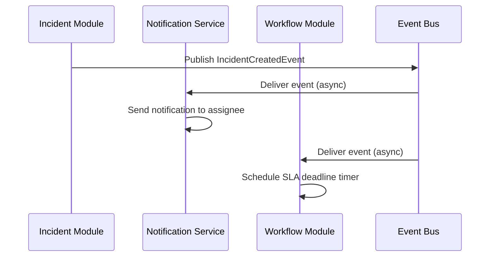

# Spring Modulith Module Interface Contract

**Version:** 1.0.0
**Status:** Active
**Last Updated:** 2025-10-18

## Overview

This document defines the **module interface contracts** for SynergyFlow's Spring Modulith architecture, ensuring clean module boundaries, explicit dependencies, and maintainable inter-module communication.

## Spring Modulith Architecture

SynergyFlow uses **Spring Modulith** to enforce module boundaries within a single Spring Boot application (modular monolith).

### Module Organization

```
backend/src/main/java/io/monosense/synergyflow/
├── incident/          # Incident Management Module
├── change/            # Change Management Module
├── task/              # Task/Project Management Module
├── user/              # User Management Module
├── policy/            # OPA Policy Integration Module
├── workflow/          # Flowable Workflow Engine Module
├── audit/             # Audit & Decision Receipts Module
└── shared/            # Shared Module (events, exceptions, utilities)
```

## Module Contract Principles

### 1. Module Autonomy

- ✅ Each module owns its own database schema
- ✅ Each module defines its own domain model (JPA entities)
- ✅ Each module publishes events for state changes
- ❌ Modules MUST NOT directly access other modules' repositories
- ❌ Modules MUST NOT directly instantiate other modules' entities

### 2. Communication via Events

**Primary Communication Pattern:** Event-driven (Spring Modulith ApplicationEvents)

- **Publish:** Modules publish domain events when state changes
- **Subscribe:** Modules subscribe to events from other modules via `@ApplicationModuleListener`
- **Guarantee:** At-least-once delivery (transactional outbox)

### 3. Explicit Dependencies

Modules declare dependencies via:
- **Java Packages:** Module structure enforces boundaries
- **modulith-docs:** Generate module dependency graph
- **ArchUnit Tests:** Validate module boundaries at build time

## Module Contracts

### Module 1: Incident Module

**Package:** `io.monosense.synergyflow.incident`

**Responsibilities:**
- Incident lifecycle management (create, assign, resolve, close)
- SLA deadline calculation and tracking
- Worklog management for incidents

**Public API (Exposed to Other Modules):**

#### Events Published

| Event | Trigger | Payload |
|-------|---------|---------|
| `IncidentCreatedEvent` | Incident created | `incidentId`, `priority`, `severity`, `slaDeadline` |
| `IncidentAssignedEvent` | Incident assigned to agent | `incidentId`, `assignedTo`, `assignedBy` |
| `IncidentResolvedEvent` | Incident resolved | `incidentId`, `resolution`, `resolvedBy`, `slaBreached` |
| `IncidentSLAApproachingEvent` | SLA 80% threshold reached | `incidentId`, `slaDeadline`, `minutesRemaining` |
| `IncidentSLABreachedEvent` | SLA deadline passed | `incidentId`, `slaDeadline`, `minutesOverdue` |

#### REST API Endpoints

See [OpenAPI Specification](./openapi-v1.yaml) for full API contract.

**Summary:**
- `GET /api/v1/incidents` - List incidents (paginated, filtered)
- `POST /api/v1/incidents` - Create incident
- `GET /api/v1/incidents/{id}` - Get incident details
- `PATCH /api/v1/incidents/{id}` - Update incident
- `POST /api/v1/incidents/{id}/assign` - Assign incident
- `POST /api/v1/incidents/{id}/resolve` - Resolve incident

**Dependencies:**

| Depends On | Why | How |
|------------|-----|-----|
| User Module | Get user details for assignment | Event subscription (`UserUpdatedEvent`) |
| Workflow Module | Trigger SLA escalation workflow | Event publication (`IncidentSLAApproachingEvent`) |
| Audit Module | Log incident state changes | Event publication (all incident events) |

**Database Schema:** `synergyflow_incidents`

**Tables Owned:**
- `incidents`
- `worklogs` (shared with Task module)
- `incident_changes` (join table)
- `incident_tasks` (join table)

---

### Module 2: Change Module

**Package:** `io.monosense.synergyflow.change`

**Responsibilities:**
- Change request lifecycle management
- Change approval workflow (integrated with OPA policy)
- Deployment tracking and rollback management

**Public API (Exposed to Other Modules):**

#### Events Published

| Event | Trigger | Payload |
|-------|---------|---------|
| `ChangeRequestedEvent` | Change request created | `changeId`, `riskLevel`, `requestedBy`, `impactedServices` |
| `ChangeApprovedEvent` | Change approved (manual or auto) | `changeId`, `approvedBy`, `autoApproved`, `decisionReceiptId` |
| `ChangeRejectedEvent` | Change rejected | `changeId`, `rejectedBy`, `reason` |
| `ChangeDeployedEvent` | Change deployed (success/failure) | `changeId`, `deploymentStatus`, `deploymentNotes` |

#### REST API Endpoints

See [OpenAPI Specification](./openapi-v1.yaml) for full API contract.

**Summary:**
- `GET /api/v1/changes` - List changes (paginated, filtered)
- `POST /api/v1/changes` - Create change request
- `GET /api/v1/changes/{id}` - Get change details
- `POST /api/v1/changes/{id}/approve` - Approve change (requires CAB role)
- `POST /api/v1/changes/{id}/deploy` - Mark change as deployed

**Dependencies:**

| Depends On | Why | How |
|------------|-----|-----|
| Policy Module | Evaluate approval requirements | Service call (`PolicyEvaluationService.canApproveChange()`) |
| User Module | Validate approver permissions | Event subscription (`UserRoleChangedEvent`) |
| Audit Module | Store decision receipts | Event publication (`ChangeApprovedEvent`) |
| Incident Module | Link incidents to failed deployments | Event subscription (`IncidentCreatedEvent`) |

**Database Schema:** `synergyflow_changes`

**Tables Owned:**
- `changes`
- `releases`
- `incident_changes` (join table, shared with Incident module)

---

### Module 3: Task Module

**Package:** `io.monosense.synergyflow.task`

**Responsibilities:**
- Task/project management (Epics, Stories, Tasks, Subtasks)
- Sprint planning and burndown tracking
- Worklog management for tasks

**Public API (Exposed to Other Modules):**

#### Events Published

| Event | Trigger | Payload |
|-------|---------|---------|
| `TaskCreatedEvent` | Task created | `taskId`, `projectId`, `type`, `assignedTo` |
| `TaskStatusChangedEvent` | Task status changed | `taskId`, `previousStatus`, `newStatus`, `changedBy` |
| `TaskCompletedEvent` | Task marked as DONE | `taskId`, `completedBy`, `storyPoints` |

#### REST API Endpoints

See [OpenAPI Specification](./openapi-v1.yaml) for full API contract.

**Summary:**
- `GET /api/v1/tasks` - List tasks (paginated, filtered)
- `POST /api/v1/tasks` - Create task
- `GET /api/v1/tasks/{id}` - Get task details
- `PATCH /api/v1/tasks/{id}` - Update task

**Dependencies:**

| Depends On | Why | How |
|------------|-----|-----|
| User Module | Validate task assignment | Event subscription (`UserUpdatedEvent`) |
| Incident Module | Link tasks to incidents | Event subscription (`IncidentCreatedEvent`) |
| Audit Module | Track task state changes | Event publication (all task events) |

**Database Schema:** `synergyflow_tasks`

**Tables Owned:**
- `tasks`
- `projects`
- `sprints`
- `worklogs` (shared with Incident module)
- `incident_tasks` (join table, shared with Incident module)

---

### Module 4: User Module

**Package:** `io.monosense.synergyflow.user`

**Responsibilities:**
- User management (CRUD operations)
- Team management
- Role and permission management

**Public API (Exposed to Other Modules):**

#### Events Published

| Event | Trigger | Payload |
|-------|---------|---------|
| `UserCreatedEvent` | User account created | `userId`, `email`, `role`, `teamId` |
| `UserUpdatedEvent` | User details updated | `userId`, `updatedFields` |
| `UserRoleChangedEvent` | User role changed | `userId`, `previousRole`, `newRole` |
| `UserDeactivatedEvent` | User account deactivated | `userId`, `deactivatedBy` |

#### Service API (for direct calls)

**Note:** User module allows **synchronous service calls** for read-only operations (exception to event-driven pattern).

```java
public interface UserService {
    /**
     * Get user by ID (read-only, cacheable)
     * Used for: Validating user existence, getting user details for display
     */
    Optional<UserResponse> getUserById(UUID userId);

    /**
     * Get users by team ID (read-only, cacheable)
     * Used for: Team assignment, workload balancing
     */
    List<UserResponse> getUsersByTeamId(UUID teamId);
}
```

**REST API Endpoints:**
- `GET /api/v1/users/{id}` - Get user details
- `GET /api/v1/users` - List users (paginated, filtered)
- `POST /api/v1/users` - Create user (admin only)
- `PATCH /api/v1/users/{id}` - Update user

**Dependencies:**

| Depends On | Why | How |
|------------|-----|-----|
| Audit Module | Log user management actions | Event publication (all user events) |

**Database Schema:** `synergyflow_users`

**Tables Owned:**
- `users`
- `teams`
- `roles`
- `permissions`

---

### Module 5: Policy Module

**Package:** `io.monosense.synergyflow.policy`

**Responsibilities:**
- OPA policy evaluation (change approval, incident assignment, etc.)
- Decision receipt generation (explainability)
- Policy versioning and management

**Public API (Exposed to Other Modules):**

#### Service API

```java
public interface PolicyEvaluationService {
    /**
     * Evaluate change approval policy
     * Returns: Decision (allow/deny) + required approvers
     */
    PolicyDecision evaluateChangeApproval(ChangeApprovalInput input);

    /**
     * Evaluate incident assignment policy
     * Returns: Recommended agent(s) based on skills, capacity, availability
     */
    PolicyDecision evaluateIncidentAssignment(IncidentAssignmentInput input);

    /**
     * Generate decision receipt for audit trail
     */
    DecisionReceipt createDecisionReceipt(String policyName, Object input, Object output);
}
```

**Events Published:**

| Event | Trigger | Payload |
|-------|---------|---------|
| `PolicyEvaluatedEvent` | Policy evaluated | `policyName`, `decisionReceiptId`, `decision` |

**Dependencies:**

| Depends On | Why | How |
|------------|-----|-----|
| Audit Module | Store decision receipts | Direct service call (`DecisionReceiptService.save()`) |
| OPA Sidecar | External policy engine | REST client (`http://localhost:8181`) |

**Database Schema:** None (stateless, uses Audit module for persistence)

---

### Module 6: Workflow Module

**Package:** `io.monosense.synergyflow.workflow`

**Responsibilities:**
- Flowable workflow engine integration
- SLA deadline timer management
- BPMN workflow execution

**Public API (Exposed to Other Modules):**

#### Service API

```java
public interface SLATimerService {
    /**
     * Schedule SLA deadline timer for incident
     */
    void scheduleSLATimer(UUID incidentId, Instant slaDeadline);

    /**
     * Cancel SLA timer (when incident resolved before deadline)
     */
    void cancelSLATimer(UUID incidentId);
}
```

**Events Published:**

| Event | Trigger | Payload |
|-------|---------|---------|
| `WorkflowStartedEvent` | BPMN workflow started | `workflowId`, `processInstanceId`, `variables` |
| `WorkflowCompletedEvent` | BPMN workflow completed | `workflowId`, `processInstanceId`, `outcome` |

**Dependencies:**

| Depends On | Why | How |
|------------|-----|-----|
| Incident Module | Trigger escalation on SLA approaching | Event subscription (`IncidentCreatedEvent`, `IncidentResolvedEvent`) |
| Change Module | Trigger approval workflow | Event subscription (`ChangeRequestedEvent`) |
| Flowable Engine | External workflow engine | Embedded Flowable library |

**Database Schema:** `synergyflow_workflows`

**Tables Owned:** Flowable-managed tables (`ACT_RU_*`, `ACT_HI_*`, etc.)

---

### Module 7: Audit Module

**Package:** `io.monosense.synergyflow.audit`

**Responsibilities:**
- Audit log persistence (all domain events)
- Decision receipt storage (OPA policy decisions)
- Compliance reporting

**Public API (Exposed to Other Modules):**

#### Service API

```java
public interface DecisionReceiptService {
    /**
     * Create decision receipt for policy evaluation
     */
    DecisionReceipt save(DecisionReceiptRequest request);

    /**
     * Get decision receipt by ID
     */
    Optional<DecisionReceipt> getById(UUID receiptId);
}

public interface AuditLogService {
    /**
     * Log domain event for audit trail
     */
    void logEvent(DomainEvent event);
}
```

**Events Subscribed:**

- **All domain events** from all modules (universal listener)
- Stores events in `audit_logs` table for compliance

**Dependencies:** None (leaf module)

**Database Schema:** `synergyflow_audit`

**Tables Owned:**
- `audit_logs`
- `decision_receipts`

---

### Module 8: Shared Module

**Package:** `io.monosense.synergyflow.shared`

**Responsibilities:**
- Shared domain events (base classes)
- Common exceptions
- Shared utilities (correlation ID filter, date/time utils)

**Public API (Exposed to All Modules):**

#### Base Classes

```java
// Base event record (all events extend this)
public record DomainEvent(
    UUID eventId,
    UUID aggregateId,
    UUID correlationId,
    UUID causationId,
    Instant timestamp,
    Integer version
) {}

// Base exception
public abstract class SynergyFlowException extends RuntimeException {
    private final String errorCode;
    private final UUID correlationId;
}
```

**Dependencies:** None (foundational module)

**Database Schema:** None

---

## Module Interaction Patterns

### Pattern 1: Event-Driven Communication (Primary)

**Use Case:** Incident created → Notify users → Schedule SLA timer



**Implementation:**

```java
// Incident Module (Publisher)
@Service
public class IncidentService {
    private final ApplicationEventPublisher eventPublisher;

    @Transactional
    public Incident createIncident(CreateIncidentRequest request) {
        Incident incident = incidentRepository.save(newIncident);

        // Publish event (stored atomically in event_publication table)
        eventPublisher.publishEvent(new IncidentCreatedEvent(
            UUID.randomUUID(), // eventId
            incident.getId(),  // aggregateId
            incident.getPriority(),
            incident.getSeverity(),
            incident.getSlaDeadline(),
            correlationId,
            Instant.now(),
            1 // version
        ));

        return incident;
    }
}

// Workflow Module (Subscriber)
@Service
public class SLATimerEventListener {

    @ApplicationModuleListener
    @Transactional
    public void onIncidentCreated(IncidentCreatedEvent event) {
        // Check idempotency (processed_events table)
        if (alreadyProcessed(event.eventId())) {
            return;
        }

        slaTimerService.scheduleSLATimer(event.incidentId(), event.slaDeadline());

        markAsProcessed(event.eventId(), "SLATimerEventListener");
    }
}
```

### Pattern 2: Synchronous Service Call (Exception)

**Use Case:** Get user details for assignment validation

**Allowed for:** Read-only operations on stable entities (User, Team)

```java
// Change Module
@Service
public class ChangeService {
    private final UserService userService; // Injected from User Module

    public Change approveChange(UUID changeId, UUID approverId) {
        // Synchronous call (read-only, cacheable)
        UserResponse approver = userService.getUserById(approverId)
            .orElseThrow(() -> new UserNotFoundException(approverId));

        // Validate approver has CAB_MEMBER role
        if (!approver.role().equals("CAB_MEMBER")) {
            throw new InsufficientPermissionsException("User lacks CAB_MEMBER role");
        }

        // Continue with approval...
    }
}
```

**Note:** Use caching to minimize performance impact:

```java
@Cacheable(value = "users", key = "#userId")
public Optional<UserResponse> getUserById(UUID userId) {
    return userRepository.findById(userId)
        .map(this::toResponse);
}
```

### Pattern 3: Policy Evaluation (Synchronous)

**Use Case:** Evaluate change approval requirements

```java
// Change Module
@Service
public class ChangeService {
    private final PolicyEvaluationService policyService;

    public Change requestChange(CreateChangeRequest request) {
        Change change = changeRepository.save(newChange);

        // Synchronous policy evaluation
        PolicyDecision decision = policyService.evaluateChangeApproval(
            new ChangeApprovalInput(
                change.getRiskLevel(),
                change.getImpactedServices(),
                requester.getRole()
            )
        );

        if (decision.autoApproved()) {
            change.setStatus(ChangeStatus.APPROVED);
            change.setApprovedBy("SYSTEM");
        } else {
            change.setStatus(ChangeStatus.PENDING_APPROVAL);
            // Notification sent via event subscription
        }

        return change;
    }
}
```

## Module Boundary Enforcement

### ArchUnit Tests

**Test:** Validate module dependencies

```java
@AnalyzeClasses(packages = "io.monosense.synergyflow")
public class ModuleBoundaryTest {

    @ArchTest
    static final ArchRule incident_module_should_only_depend_on_allowed_modules =
        classes()
            .that().resideInAPackage("..incident..")
            .should().onlyDependOnClassesThat()
            .resideInAnyPackage(
                "..incident..",
                "..shared..",
                "..user..",      // Allowed: User service calls
                "..workflow..",  // Allowed: SLA timer
                "..audit..",     // Allowed: Audit logging
                "java..",
                "org.springframework.."
            );

    @ArchTest
    static final ArchRule modules_should_not_access_other_repositories =
        noClasses()
            .that().resideInAPackage("..incident..")
            .should().dependOnClassesThat()
            .resideInAPackage("..change..")
            .andShould().haveSimpleNameEndingWith("Repository");
}
```

### Spring Modulith Verification

**Test:** Verify module structure

```java
@Test
void verifyModulithStructure() {
    ApplicationModules modules = ApplicationModules.of(SynergyFlowApplication.class);

    // Verify modules
    modules.verify();

    // Generate documentation
    new Documenter(modules)
        .writeDocumentation()
        .writeModulesAsPlantUml()
        .writeIndividualModulesAsPlantUml();
}
```

## Contract Testing

### Consumer-Driven Contract Tests

**Example:** Change Module consumes `IncidentCreatedEvent`

```java
// Incident Module (Producer)
@SpringBootTest
class IncidentEventContractTest {

    @Test
    void incidentCreatedEvent_should_have_required_fields() {
        IncidentCreatedEvent event = new IncidentCreatedEvent(
            UUID.randomUUID(),
            UUID.randomUUID(),
            Priority.HIGH,
            Severity.S2,
            Instant.now().plus(8, ChronoUnit.HOURS),
            UUID.randomUUID(),
            Instant.now(),
            1
        );

        // Verify contract
        assertThat(event.eventId()).isNotNull();
        assertThat(event.incidentId()).isNotNull();
        assertThat(event.priority()).isIn(Priority.values());
        assertThat(event.severity()).isIn(Severity.values());
        assertThat(event.slaDeadline()).isAfter(Instant.now());
    }
}

// Change Module (Consumer)
@SpringBootTest
class ChangeModuleIncidentEventConsumerTest {

    @Test
    void should_link_incident_to_failed_deployment() {
        // Simulate IncidentCreatedEvent consumption
        IncidentCreatedEvent event = new IncidentCreatedEvent(...);

        changeEventListener.onIncidentCreated(event);

        // Verify incident linked to change
        assertThat(changeRepository.findById(changeId))
            .hasValueSatisfying(change ->
                assertThat(change.getLinkedIncidents()).contains(event.incidentId())
            );
    }
}
```

## Versioning and Evolution

### Event Schema Versioning

**Strategy:** Version field in all events

```java
public record IncidentCreatedEvent(
    UUID eventId,
    UUID aggregateId,
    Priority priority,
    Severity severity,
    Instant slaDeadline,
    UUID correlationId,
    Instant timestamp,
    Integer version  // Schema version (start at 1)
) implements DomainEvent {}
```

**Evolution Example:**

```java
// Version 1 → Version 2 (add new field)
@ApplicationModuleListener
public void onIncidentCreated(IncidentCreatedEvent event) {
    if (event.version() == 1) {
        // Handle V1 event (missing new field)
        handleV1Event(event);
    } else if (event.version() == 2) {
        // Handle V2 event (with new field)
        handleV2Event(event);
    }
}
```

## References

- [Spring Modulith Documentation](https://spring.io/projects/spring-modulith)
- [ArchUnit Documentation](https://www.archunit.org/)
- [Event-Driven Architecture Patterns (Martin Fowler)](https://martinfowler.com/articles/201701-event-driven.html)
