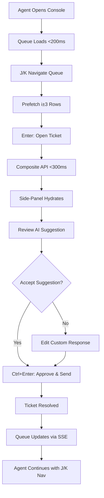
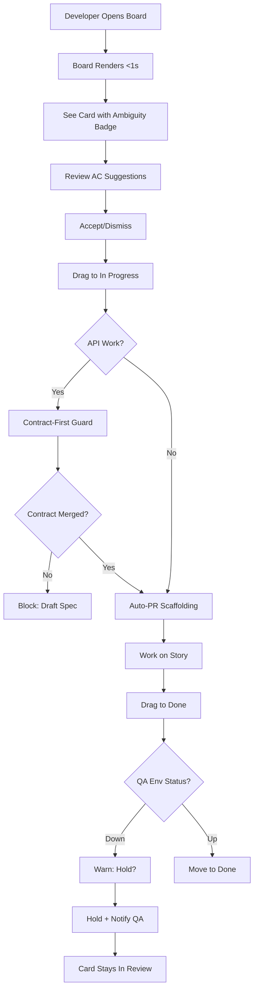
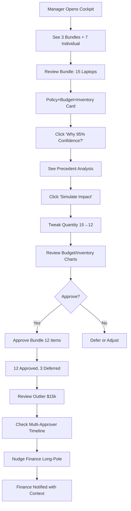

# SynergyFlow UX/UI Specification

_Generated on 2025-10-06 by monosense_

## Executive Summary

SynergyFlow is an enterprise ITSM & Project Management platform targeting 1,000 users (250 concurrent peak) with three breakthrough UX paradigms that redefine how helpdesk agents, developers, and managers work. This specification defines the user experience foundation for a dual-module platform (ITSM + PM) enhanced with AI-augmented workflow automation.

**Project Context:**
- **Level 4 Platform** - 120+ stories across 6 epics, 20-week implementation
- **Target Users:** 50 helpdesk agents, 200 developers, 100 managers, 650 employees
- **Primary Deployment:** Web responsive (desktop-optimized ≥1440px, tablet support ≥768px)
- **Technical Stack:** React 18 + TypeScript + Vite + Ant Design 5.x
- **Performance Targets:** Queue <200ms p95, side-panel <300ms p95, board render <1s for 100 cards

**Three Breakthrough Paradigms:**

1. **Zero-Hunt Agent Console** - "Approve Station, Not Research Desk"
   - Transforms agent experience from manual context-gathering to AI-assisted decision-making
   - Loft Layout: Priority Queue (left) | Action Canvas (center) | Autopilot Rail (right)
   - Success gates: Time-to-first-action −30%, first-touch resolution +20%

2. **Developer Copilot Board** - "Live Reasoning Surface, Not Static Task Tracker"
   - Card intelligence detects ambiguous ACs, warns of estimate risks, monitors QA environments
   - Auto-PR scaffolding in <3s (branch, template, CI, reviewers, test stubs)
   - Success gates: PR scaffolding <3s, QA guards ≥90% prevention, rework reduction −25%

3. **Approval Cockpit** - "Decision Engine, Not Table with Buttons"
   - Intelligent bundles group 12-15 requests by policy archetype + risk profile
   - Policy×Budget×Inventory composite context in single view
   - Simulation engine previews budget impact, stock depletion before approval
   - Success gates: Decision time p50 <12s, AI-assisted ≥60%, bundle efficiency 12-15 items

---

## 1. UX Goals and Principles

### 1.1 Target User Personas

**Primary Persona 1: Sarah - Helpdesk Agent**
- **Role:** IT Support Agent, 5 years experience
- **Daily Usage:** 8+ hours, handles 40-60 tickets daily
- **Goals:** Resolve tickets quickly, meet SLA targets (>95% compliance), minimize context-switching
- **Pain Points:**
  - Wastes 30% of time hunting for context (requester history, related tickets, KB articles)
  - Manual SLA tracking causes anxiety and missed escalations
  - Slow portal UIs designed for occasional users, not power users
- **Needs:**
  - Keyboard-first navigation (J/K/Enter/Ctrl+Enter)
  - Context prefetched before needed (i±3 row predictive loading)
  - AI-suggested resolutions with explainability ("Why?")
  - SLA countdown always visible with urgency indicators

**Primary Persona 2: Alex - Software Developer**
- **Role:** Full-Stack Developer, 3 years experience
- **Daily Usage:** 8+ hours, manages 15-20 issues per sprint
- **Goals:** Move stories efficiently through workflow, minimize rework, avoid blockers
- **Pain Points:**
  - Ambiguous acceptance criteria cause mid-sprint confusion and rework
  - PR setup is repetitive (branch naming, template, reviewers, CI checks)
  - Moving cards to "Done" when QA environment down stalls deployment
  - API work starts without contract definition leading to integration issues
- **Needs:**
  - Ambiguity detection on issue cards with AC suggestions
  - Auto-PR scaffolding that saves 5+ minutes per story
  - Environment awareness that prevents premature status changes
  - Contract-first guards that block API work until specs merge

**Primary Persona 3: David - Engineering Manager**
- **Role:** Engineering Manager, approves service requests and resource allocations
- **Daily Usage:** 2-3 hours, reviews 20-50 approval requests weekly
- **Goals:** Make informed decisions quickly, ensure policy compliance, manage budgets
- **Pain Points:**
  - Reviewing individual requests is time-consuming (2-3 min each)
  - Missing context requires hunting through budget spreadsheets, inventory systems
  - No precedent visibility - reinventing decisions made previously
  - Fear of budget overruns or policy violations after approval
- **Needs:**
  - Approval bundles that group similar requests for one-click approval
  - Composite context showing policy + budget + inventory in single view
  - Confidence scores based on historical precedents
  - Simulation mode to preview impact before approving

**Secondary Persona: Emily - General Employee**
- **Role:** Marketing Manager, occasional platform user
- **Daily Usage:** <1 hour monthly, submits service requests when needed
- **Goals:** Submit requests easily, track status, get quick approvals
- **Pain Points:** Complex forms, unclear approval timelines
- **Needs:** Simple service catalog, mobile-friendly approval tracking

### 1.2 Usability Goals

**Speed and Efficiency (Power User Priority):**
- **Zero-Hunt Console:** Reduce time-to-first-action by 30% through context prefetching and composite APIs
- **Copilot Board:** PR scaffolding completes in <3 seconds from card drag
- **Approval Cockpit:** Decision time p50 <12 seconds (vs 2-3 minutes manual)

**Error Prevention and Intelligence:**
- **Ambiguity Detection:** Flag ≥70% of risky cards with missing Given/When/Then or vague terms
- **QA/Env Guards:** Prevent ≥90% of premature "Done" moves when environments unavailable
- **Contract-First Compliance:** Block 100% of API work without merged OpenAPI specs
- **SLA Precision:** Zero missed escalations with <1s timer drift

**Cognitive Load Reduction:**
- **Composite Context:** Single API call returns all decision context (no tab-hunting)
- **Keyboard-First:** ≥80% of agents using J/K/Enter shortcuts by week 8
- **AI Explainability:** All AI suggestions show "Why?" reasoning to build trust

**Accessibility (WCAG 2.1 Level AA - Mandatory):**
- All interactive elements keyboard accessible
- Screen reader support with ARIA labels
- Color contrast ≥4.5:1 for text, ≥3:1 for UI components
- Focus indicators with 2px visible outline
- Dedicated accessibility audit sprint before UAT

### 1.3 Design Principles

**1. Physics > Features**
- Build for workload physics: hot-read/cool-write patterns, fan-out events, clock-precision timers
- UX Translation: Prefetch context before users ask, minimize round-trips, optimize for frequent actions

**2. AI as Copilot, Not Autopilot**
- Put AI in approval loop with explainability and escape hatches
- UX Translation: Show "Why?" for all AI suggestions, default to AI-assisted with manual override, build trust through transparency

**3. Combine > Add (Fusion Beats Fragmentation)**
- Policy×Budget×Inventory in one card vs 3 separate tabs
- UX Translation: Composite views that fuse related context, task-shaped interfaces spanning entities

**4. Composite Over CRUD**
- Task-shaped composite APIs are product surface; entity CRUD is plumbing
- UX Translation: Design screens around user workflows (approve ticket, plan sprint) not database tables

**5. Speed + Trust Through Progressive Disclosure**
- Surface critical context immediately, details on-demand
- UX Translation: Summary cards with drill-down, inline editing without modals, layered information density

---

## 2. Information Architecture

### 2.1 Site Map

```
SynergyFlow Platform
├── Dashboard (Unified ITSM + PM Overview)
│   ├── My Active Tickets (ITSM)
│   ├── My Active Issues (PM)
│   ├── Real-Time Activity Feed
│   └── Metrics Summary
│
├── ITSM Module
│   ├── Agent Console (Primary - Zero-Hunt Layout) ★
│   ├── Service Catalog (Employee Self-Service)
│   ├── Ticket Search
│   └── My Tickets
│
├── PM Module
│   ├── Board (Primary - Copilot Board) ★
│   ├── Backlog (Sprint Planning)
│   ├── Sprint View (Burndown & Velocity)
│   ├── Issue Search
│   └── My Issues
│
├── Approvals
│   ├── Approval Queue (Cockpit View) ★
│   ├── My Approvals
│   ├── Pending Approvals
│   └── Approval History
│
├── Reports
│   ├── ITSM Metrics Dashboard (MTTR, FRT, SLA Compliance)
│   ├── PM Metrics Dashboard (Velocity, Cycle Time, Throughput)
│   └── Workflow Analytics
│
└── Admin
    ├── User Management
    ├── Role Assignment
    ├── Workflow Configuration (Routing Rules, Approval Policies)
    └── System Settings

★ = Breakthrough UX Paradigm
```

### 2.2 Navigation Structure

**Primary Navigation (Top Bar - Persistent):**
```
[Logo] Dashboard | ITSM | PM | Approvals | Reports | Admin    [Search] [Notifications] [Avatar]
```

**Role-Based Landing Pages:**
- **Helpdesk Agents** → ITSM Agent Console (Zero-Hunt Layout)
- **Developers** → PM Board (Copilot Board)
- **Managers** → Approval Queue (Cockpit View)
- **General Employees** → Service Catalog

**Secondary Navigation (Contextual Sidebar):**

*ITSM Module:*
- My Tickets
- Unassigned Queue
- SLA Breach Risk
- Critical Priority
- All Tickets

*PM Module:*
- Active Sprint Board
- Backlog
- My Issues
- All Issues
- Sprint Reports

*Approvals:*
- Approval Bundles
- Individual Reviews
- My Pending Approvals
- History

**Keyboard Navigation (Global):**
- `/` - Spotlight search (jump to any ticket/issue/screen)
- `g + d` - Go to Dashboard
- `g + i` - Go to ITSM Console
- `g + p` - Go to PM Board
- `g + a` - Go to Approval Queue
- `?` - Show keyboard shortcuts overlay

---

## 3. User Flows

### 3.1 Zero-Hunt Agent Resolves Ticket (FR-ITSM-16 to FR-ITSM-20)

**User Goal:** Resolve incoming ticket quickly without manual context gathering

**Entry Point:** Agent opens ITSM Agent Console

**Flow Steps:**

1. **Queue Load**
   - Agent lands on Zero-Hunt Console
   - Priority Queue (left panel) displays 50 tickets sorted by: SLA risk → Priority → Ownership
   - Tickets show: ID, type icon, title, status badge, SLA countdown (color-coded: red <15min, amber <1hr, green >1hr)
   - Performance: Queue loads in <200ms p95

2. **Keyboard Navigation**
   - Agent presses `J` (down) or `K` (up) to navigate queue rows
   - Current row highlights with subtle background shift (50ms animation)
   - Predictive prefetch: Focusing row i triggers background fetch for rows i±3
   - Performance: Prefetch completes before agent reaches those rows

3. **Ticket Selection**
   - Agent presses `Enter` on TICKET-1234 ("Printer won't print")
   - Action Canvas (center panel) slides in from right (250ms ease-out)
   - Composite Side-Panel API returns in single call (<300ms p95):
     - Requester history (last 5 tickets, satisfaction score)
     - Related incidents (top 3 by similarity with scores)
     - KB suggestions (top 3 relevant articles with highlights)
     - Asset information (printer HP-450: status, recent changes, owner)
     - Compliance checks (approval requirements, data egress flags)

4. **AI Suggestion Review**
   - Autopilot Rail (right panel) displays Suggested Resolution:
     - Draft reply: "Check print queue: Control Panel → Devices → HP-450 → View Queue"
     - Fix steps with variable substitution: "${user.name}, please follow these steps..."
     - Linked KB article: "Printer Troubleshooting Guide" (highlights relevant section)
     - Confidence score: 87% with signal explanation
   - Agent clicks "Why?" button
   - Explainability panel expands showing:
     - "Similar to TICKET-110 (resolved in 15min with same steps)"
     - "KB article match: 0.92 semantic similarity"
     - "Asset HP-450 has no recent failures in change history"

5. **Action Execution**
   - Agent reviews suggestion, makes minor tweak to personalize tone
   - Agent presses `Ctrl+Enter` for "Approve & Send"
   - Button animates: press → spinner → success checkmark → panel slides out (400ms)
   - Ticket status updates to "Resolved"
   - Queue refreshes in real-time via SSE (yellow highlight fade on updated row)

6. **Success Outcome**
   - Total time from queue load to resolution: **45 seconds** (vs 2-3 min baseline)
   - Zero manual context gathering (no tab switching, no separate searches)
   - First-touch resolution (no reassignment needed)
   - SLA compliance: Resolved with 1h45m remaining

**Decision Points:**
- Row 2: If suggestion unacceptable → Agent clicks "Edit" to write custom response
- Row 4: If more context needed → Agent clicks asset/history cards to expand details
- Row 5: If escalation needed → Agent presses `E` for escalate workflow

**Error States:**
- API timeout on side-panel load: Show skeleton shimmer + retry button
- Prefetch failure: Degrade gracefully, load on-demand when row selected
- SSE disconnect: Show "Reconnecting..." banner, replay events on reconnect

**Success Metrics:**
- Time-to-first-action: −30% reduction
- First-touch resolution: +20% improvement
- AI suggestion acceptance: ≥60% within 4 weeks
- Keyboard shortcut adoption: ≥80% of agents by week 8



---

### 3.2 Developer Moves Card with Intelligence (FR-PM-16 to FR-PM-20)

**User Goal:** Move story through board workflow while avoiding rework and blockers

**Entry Point:** Developer opens PM Board with active sprint

**Flow Steps:**

1. **Board Load**
   - Developer lands on Kanban Board
   - 5 status columns displayed: Backlog | To Do | In Progress | In Review | Done
   - 30 issue cards visible with progressive disclosure
   - Card displays: ID, title, assignee avatar, story points, priority color, labels
   - Performance: Board renders 100 cards in <1 second

2. **Ambiguity Detection**
   - Developer sees STORY-789 in To Do column
   - Card shows Ambiguity Score badge: 🟠 "Ambiguity: 3 issues detected"
   - Badge tooltip: "Missing Given/When/Then (1), Vague terms (2)"
   - Developer clicks "Review AC" inline button
   - AC editor appears in card with NLP suggestions:
     - "Consider adding: Given user is logged in..."
     - "Clarify: 'dashboard loads quickly' → specify p95 <500ms target"
   - Developer accepts suggestions with one tap

3. **Drag to In Progress**
   - Developer drags STORY-789 card from To Do to In Progress column
   - Card lifts with shadow + 5px translateY (100ms animation)
   - Drop zone highlights with pulse border (150ms)
   - Card drops, status updates optimistically (immediate UI change)

4. **Auto-PR Scaffolding (<3s)**
   - System detects card move to In Progress
   - Progress bar appears on card: "Scaffolding PR... 0%"
   - System auto-generates in parallel:
     - Git branch: `feature/STORY-789-user-dashboard`
     - PR template with linked acceptance criteria checklist
     - CI checks configured (lint, test, build)
     - Reviewers set from CODEOWNERS file
     - Test skeleton stubs (JUnit + WireMock) committed to branch
   - Progress bar completes: 0% → 33% → 66% → 100% (3s total)
   - Card updates: ⚙️ "PR #234 ready" with link

5. **Contract-First Guard (if API work)**
   - Developer drags STORY-890 (tagged "API") to In Progress
   - System blocks transition with banner:
     - 🚫 "Contract-First Guard: OpenAPI spec required"
     - "Auto-drafted spec: POST /api/users/dashboard"
     - "PR to contracts repo: contracts#45 (pending review)"
   - Developer cannot proceed until contract PR merged
   - Once merged, banner changes: ✅ "Contract merged, proceed to implementation"

6. **QA Environment Awareness**
   - Developer completes work on STORY-789
   - Developer drags card to Done column
   - System pings QA env telemetry: Status = DOWN
   - Warning banner slides down from top (250ms):
     - ⚠️ "QA env down; moving to Done will stall deploy. Hold?"
     - "Deploy queue: 3 stories waiting, estimated 2hr delay"
   - Options:
     - "Hold + notify QA team" (keeps card in In Review)
     - "Bypass (with reason)" (requires text input for audit)
   - Developer chooses "Hold + notify QA"
   - Card stays in In Review, QA team gets Slack notification

7. **Success Outcome**
   - PR scaffolding saved 5+ minutes of manual setup
   - Contract-first guard prevented integration issues
   - QA awareness prevented deploy pipeline stall
   - Developer proceeds efficiently with confidence

**Decision Points:**
- Step 2: If ambiguity acceptable → Developer clicks "Dismiss" to proceed anyway
- Step 5: If contract already exists → Guard auto-detects and allows transition
- Step 6: If QA env up → No warning, card moves to Done smoothly

**Error States:**
- PR scaffolding timeout: Show retry button, allow manual branch creation
- Contract PR fetch failure: Show stale contract, warn "May be outdated"
- QA env telemetry timeout: Degrade to "Unknown status, proceed with caution?"

**Success Metrics:**
- PR scaffolding speed: <3s from drag to ready
- Ambiguity detection accuracy: ≥70% validated against rework data
- QA guard effectiveness: ≥90% prevention rate
- Contract-first compliance: 100% blocking for API work
- Rework reduction: −25% due to ambiguity flagging



---

### 3.3 Manager Uses Approval Cockpit (FR-WF-11 to FR-WF-15)

**User Goal:** Approve service requests efficiently while ensuring policy compliance and budget control

**Entry Point:** Manager opens Approval Queue

**Flow Steps:**

1. **Queue Overview**
   - Manager lands on Approval Cockpit
   - Header shows: "Bundles: 3 | Individual: 7 | Total: 47 pending"
   - Bundles displayed first (sorted by urgency + bundle size)
   - Individual outliers below

2. **Bundle Review**
   - Manager sees Bundle: "Laptop Requests (15 items)"
   - Bundle card displays composite context:
     - 💰 Budget: $6,500 / $10,000 available (65% utilized)
     - 📊 Policy Match: 95% confidence
     - 📦 Stock: 18 laptops in warehouse (sufficient)
     - 🎯 Precedent: "93% of similar requests approved in last 6 months"
   - Manager clicks "Expand Bundle" to see individual items
   - Items grouped by requester, cost, justification

3. **Precedent Analysis**
   - Manager clicks "Why 95% confidence?"
   - Explainability panel shows:
     - "15/15 requests match policy: Employee tenure >6mo, cost <$500"
     - "Historical precedent: 47/50 similar requests approved"
     - "Risk flags: None (no vendor recalls, security advisories)"
   - Precedent panel displays 3 relevant prior decisions:
     - "Laptop request for Sales team (June 2025) - Approved by David"
     - One-tap "Reuse rationale" button copies justification

4. **Simulation Mode**
   - Manager clicks "Simulate Impact"
   - Simulation modal opens with live controls:
     - Budget impact: $6,500 → $16,500 (remaining: $3,500)
     - Inventory depletion: 18 → 3 laptops (stock-out risk: LOW)
     - Fulfillment ETA: 3 business days (based on warehouse queue)
     - Policy breach probability: 0% (all within limits)
   - Manager tweaks quantity slider: 15 → 12 laptops
   - Charts update live (60fps):
     - Budget bar animates to show new $5,200 spend
     - Inventory curve shows 6 laptops remaining (safer buffer)

5. **Bundle Approval**
   - Manager exits simulation, satisfied with 12-laptop approval
   - Manager clicks "Approve Bundle (12 items)"
   - Confirmation modal: "Approve 12 requests, defer 3 to next batch?"
   - Manager confirms
   - Bundle card animates: Button → spinner → success checkmark → fade-out (600ms)
   - 12 requests approved instantly, 3 moved to "Deferred" status
   - Budget and inventory metrics update in real-time

6. **Outlier Review**
   - Manager sees outlier: "Software License Request - $15,000"
   - Outlier card shows:
     - ⚠️ Risk Flag: "Vendor recall flag (security advisory CVE-2025-1234)"
     - 💼 Multi-Approver: Finance ⏳ Pending | IT ✅ Approved
     - 📊 Precedent: "No similar requests (new vendor)"
   - Manager clicks "Why flagged?"
   - Explainer: "Flagged: New vendor, cost >$10k threshold, security advisory active"
   - Braided timeline shows Finance as long-pole approver
   - Manager clicks "Nudge Finance (context attached)"
   - Finance team gets notification with full context + SLA countdown

7. **Success Outcome**
   - Bundle approval: 12 requests in **8 seconds** (vs 20-30 min individual reviews)
   - Policy compliance: 100% (all within budget and inventory limits)
   - Informed decision: Simulation previewed impact before commitment
   - Efficient coordination: Multi-approver nudge accelerated Finance review

**Decision Points:**
- Step 3: If precedent unclear → Manager clicks individual items to review justifications
- Step 4: If simulation shows breach → Manager adjusts quantity or defers entire bundle
- Step 6: If risk unacceptable → Manager rejects with reason for audit trail

**Error States:**
- Budget API failure: Show cached budget, warn "May be stale"
- Inventory API timeout: Disable auto-split, allow manual quantity entry
- Simulation error: Fallback to static impact summary

**Success Metrics:**
- Decision time: p50 <12s, p95 <45s
- AI-assisted approval rate: ≥60% using suggested decisions
- Bundle efficiency: 12-15 items per bundle (reduces clicks)
- Exception rate: ≤10% override policy recommendations
- Simulation adoption: >40% of managers use before large approvals



---

### 3.4 Real-Time Collaboration (SSE Updates)

**User Goal:** Stay synchronized with team changes without manual refresh

**Flow:** Agent/Developer sees live updates when colleague modifies tickets/issues

**Steps:**
1. User opens Agent Console / PM Board
2. SSE connection established (EventSource)
3. Colleague assigns ticket / moves issue in background
4. Server publishes event to Redis Stream
5. SSE gateway fans out to connected clients
6. Client receives event (≤2s end-to-end latency)
7. UI updates with yellow highlight fade (2s ease-out)
8. If user disconnects/reconnects: lastEventId cursor replays missed events (<1s catch-up)

**States:**
- Connected: Green dot in header "Live"
- Disconnecting: Amber dot "Reconnecting..."
- Offline: Red dot "Offline - changes will sync when back online"

---

### 3.5 Sprint Planning (Backlog to Sprint)

**User Goal:** Plan next sprint by selecting stories from backlog

**Flow:**
1. Product Owner opens Backlog view
2. Unassigned issues displayed, sorted by priority (drag to reorder)
3. Right panel shows "Next Sprint" box with capacity: 40 points
4. Drag stories from backlog into sprint box
5. Story point counter updates: 0/40 → 13/40 → 27/40
6. When nearing capacity (35/40), warning: "5 points remaining"
7. Click "Create Sprint 6" button
8. Sprint modal: Name, Start Date, End Date, Goal
9. Confirm → Sprint created, stories assigned, board switches to new sprint

---

## 4. Component Library and Design System

### 4.1 Design System Approach

**Foundation: Ant Design (AntD) 5.x**
- Industry-proven enterprise component library
- Comprehensive primitives: Table, Form, Modal, Drawer, Card, Badge, Dropdown, Tooltip, etc.
- Built-in accessibility (WCAG AA baseline)
- Theming via ConfigProvider for brand customization
- Tree-shaking support for optimal bundle size

**Customization Strategy:**
- **Theme Override:** Use AntD ConfigProvider to inject custom design tokens (colors, spacing, border radius)
- **Composition:** Build domain-specific composites on AntD primitives (e.g., TicketQueueTable extends AntD Table)
- **Custom Components:** Create breakthrough-specific components (AutopilotRail, IntelligentCard, ApprovalBundleCard)
- **Storybook:** Document all custom components with interactive demos and usage guidelines

**Component Hierarchy:**
```
Design System
├── AntD 5.x Primitives (Foundation)
│   ├── Layout (Row, Col, Grid)
│   ├── Data Display (Table, List, Card, Badge, Tag)
│   ├── Forms (Input, Select, DatePicker, Form)
│   ├── Feedback (Modal, Drawer, Message, Notification)
│   └── Navigation (Menu, Breadcrumb, Dropdown)
│
├── Shared Custom Components (Cross-Module)
│   ├── AppLayout (Top Bar + Sidebar + Content)
│   ├── KeyboardShortcutOverlay (? trigger)
│   ├── SLACountdown (color-coded timer)
│   ├── ConfidenceScoreChip (AI confidence indicator)
│   ├── RealTimeIndicator (SSE connection status)
│   └── EmptyState (no data placeholders)
│
├── ITSM Custom Components
│   ├── TicketQueueTable (keyboard nav, prefetch)
│   ├── CompositeSidePanel (drawer with API hydration)
│   ├── AutopilotRail (AI suggestions + explainability)
│   ├── SuggestedResolutionCard (draft + KB + confidence)
│   └── RelatedTicketsPanel (similarity scores)
│
├── PM Custom Components
│   ├── KanbanColumn (drag container with WIP limits)
│   ├── IntelligentCard (ambiguity badge, estimate chip)
│   ├── AmbiguityScoreIndicator (NLP analysis visual)
│   ├── ContractGuardBanner (blocking alert)
│   ├── EnvAwarenessBadge (telemetry status)
│   ├── CommandPalette (⌘K overlay)
│   └── PRScaffoldingProgress (3s progress bar)
│
└── Workflow Custom Components
    ├── ApprovalBundleCard (grouped items)
    ├── PolicyBudgetInventoryStrip (composite context)
    ├── PrecedentPanel (historical decisions)
    ├── SimulationModal (live charts, quantity tweaks)
    ├── BraidedTimeline (multi-approver visualization)
    └── RiskFlagBadge (security advisories, vendor recalls)
```

### 4.2 Core Components

**TicketQueueTable (Zero-Hunt Console)**
- **Purpose:** Display 50-row ticket queue with keyboard navigation and predictive prefetch
- **Variants:**
  - Default (all tickets)
  - My Tickets (filtered by assignee)
  - SLA Breach Risk (sorted by urgency)
- **States:**
  - Default: Standard row display
  - Focused: Subtle background highlight (arrow keys)
  - Selected: Blue border + prefetch triggered (Enter key)
  - Loading: Skeleton shimmer on prefetch rows
- **Props:** `tickets: Ticket[]`, `onSelect: (ticket) => void`, `onPrefetch: (indices) => void`
- **Keyboard:** J/K (navigate), Enter (select), / (search focus)
- **Performance:** Virtualized scrolling for 100+ rows, prefetch i±3 on focus

**IntelligentCard (Copilot Board)**
- **Purpose:** Issue card with AI-powered ambiguity detection and estimate reality check
- **Variants:**
  - Story (blue accent)
  - Task (green accent)
  - Bug (red accent)
  - Epic (purple accent)
- **States:**
  - Default: Standard card with title + assignee + points
  - Ambiguous: Orange badge "Ambiguity: 3 issues"
  - Estimate Warning: Yellow chip "Similar stories: 8pts usual"
  - Blocked: Red banner "Contract required"
  - Scaffolding: Progress bar "PR setup: 66%"
- **Props:** `issue: Issue`, `intelligence: CardIntelligence`, `onDrag: () => void`
- **Interactions:** Double-click (expand detail), drag (status change), hover (show tooltip)

**ApprovalBundleCard (Approval Cockpit)**
- **Purpose:** Group 12-15 approval requests with composite Policy×Budget×Inventory context
- **Variants:**
  - Standard Bundle (green border, high confidence)
  - Risky Bundle (amber border, medium confidence)
  - Outlier (red border, auto-separated)
- **States:**
  - Collapsed: Summary only (count, total cost, confidence)
  - Expanded: Individual items listed
  - Simulating: Live charts with quantity sliders
  - Approving: Spinner → checkmark → fade-out
- **Props:** `bundle: ApprovalBundle`, `onSimulate: () => void`, `onApprove: (qty) => void`
- **Interactions:** Click expand, click simulate, one-click approve

**CompositeSidePanel (Zero-Hunt Console)**
- **Purpose:** Drawer displaying all ticket context from single composite API call
- **Sections:**
  - Requester History (last 5 tickets, satisfaction)
  - Related Incidents (top 3 similarity)
  - KB Suggestions (top 3 articles with highlights)
  - Asset Info (status, changes, owner)
  - Compliance Checks (approvals, flags)
- **States:**
  - Loading: Skeleton shimmer (<300ms target)
  - Hydrated: Full content displayed
  - Error: Retry button with cached fallback
- **Props:** `ticketId: string`, `compositeData: CompositeContext`
- **Performance:** <300ms p95 hydration via optimized composite API

**SLACountdown (Shared Component)**
- **Purpose:** Display time remaining until SLA breach with urgency color coding
- **Variants:**
  - Critical: Red background, <15min remaining
  - Warning: Amber background, <1hr remaining
  - Safe: Green background, >1hr remaining
- **States:**
  - Ticking: Live countdown updates every 30s
  - Breached: Red "BREACHED" badge
  - Paused: Gray "Paused" (business hours off)
- **Props:** `dueAt: DateTime`, `priority: Priority`, `status: TicketStatus`
- **Animation:** Pulse effect when <5min remaining

---

## 5. Visual Design Foundation

### 5.1 Color Palette

**Primary Colors (AntD ConfigProvider Overrides):**
- **Primary:** `#1677FF` - Enterprise blue (buttons, links, active states)
- **Success:** `#52C41A` - Green (resolved tickets, done issues, approvals)
- **Warning:** `#FAAD14` - Amber (SLA warnings, in-progress states, medium risk)
- **Error:** `#FF4D4F` - Red (critical priority, SLA breaches, blockers)

**Status Colors (ITSM):**
- **Priority:**
  - Critical: `#FF4D4F` (red)
  - High: `#FA8C16` (orange)
  - Medium: `#FAAD14` (yellow)
  - Low: `#8C8C8C` (gray)
- **Status:**
  - New: `#1677FF` (blue)
  - Assigned: `#13C2C2` (cyan)
  - In Progress: `#FAAD14` (amber)
  - Resolved: `#52C41A` (green)
  - Closed: `#8C8C8C` (gray)

**Status Colors (PM):**
- **Priority:**
  - Highest: `#FF4D4F` (red)
  - High: `#FA8C16` (orange)
  - Medium: `#FAAD14` (yellow)
  - Low: `#8C8C8C` (gray)
  - Lowest: `#D9D9D9` (light gray)
- **Status:**
  - Backlog: `#8C8C8C` (gray)
  - To Do: `#1677FF` (blue)
  - In Progress: `#FAAD14` (amber)
  - In Review: `#722ED1` (purple)
  - Done: `#52C41A` (green)

**Semantic Colors:**
- **Info:** `#1677FF` (informational messages)
- **AI Confidence:**
  - High (>80%): `#52C41A` (green)
  - Medium (50-80%): `#FAAD14` (amber)
  - Low (<50%): `#FF4D4F` (red)

**Neutral Palette:**
- **Text Primary:** `#262626` (high contrast)
- **Text Secondary:** `#595959` (medium contrast)
- **Text Disabled:** `#BFBFBF` (low contrast)
- **Border:** `#D9D9D9` (dividers)
- **Background:** `#FFFFFF` (primary surface)
- **Background Secondary:** `#FAFAFA` (panels, cards)

### 5.2 Typography

**Font Families:**
```css
--font-family-base: -apple-system, BlinkMacSystemFont, 'Segoe UI', Roboto,
                    'Helvetica Neue', Arial, sans-serif;
--font-family-code: 'SF Mono', Monaco, 'Cascadia Code', 'Courier New', monospace;
```

**Type Scale:**
| Level      | Size | Weight | Line Height | Use Case                          |
|------------|------|--------|-------------|-----------------------------------|
| Display    | 32px | 600    | 40px        | Page titles, hero sections        |
| Heading 1  | 24px | 600    | 32px        | Section headers                   |
| Heading 2  | 20px | 600    | 28px        | Subsection headers                |
| Heading 3  | 16px | 600    | 24px        | Card titles, panel headers        |
| Body Large | 16px | 400    | 24px        | Prominent body text               |
| Body       | 14px | 400    | 22px        | Default body text, table rows     |
| Caption    | 12px | 400    | 20px        | Labels, metadata, timestamps      |
| Code       | 13px | 400    | 20px        | Code snippets, monospace data     |

**Font Weight Scale:**
- Regular: 400 (body text)
- Medium: 500 (emphasized text)
- Semibold: 600 (headings, buttons)
- Bold: 700 (critical alerts, numbers)

### 5.3 Spacing and Layout

**Spacing Scale (8px Base Unit):**
```css
--space-xs:  4px;   /* Tight inline spacing (icon + text) */
--space-sm:  8px;   /* Component padding, small gaps */
--space-md:  16px;  /* Section spacing, card padding */
--space-lg:  24px;  /* Panel spacing, major sections */
--space-xl:  32px;  /* Page margins, large gaps */
--space-2xl: 48px;  /* Hero sections, feature spacing */
```

**Grid System:**
- **Container Max Width:** 1440px (optimal for power users)
- **Columns:** 24-column grid (AntD default)
- **Gutter:** 16px (responsive: 8px mobile, 16px tablet, 24px desktop)

**Layout Patterns:**

*Zero-Hunt Console (Loft Layout):*
```
┌─────────────────────────────────────────────────────┐
│ Top Bar (64px height)                               │
├───────────┬─────────────────────┬───────────────────┤
│ Queue     │ Canvas              │ Rail              │
│ 25% width │ 50% width           │ 25% width         │
│ Fixed     │ Flexible            │ Fixed             │
└───────────┴─────────────────────┴───────────────────┘
```

*Copilot Board:*
```
┌─────────────────────────────────────────────────────┐
│ Top Bar (64px) + Board Controls (56px)             │
├─────────────────────────────────────────────────────┤
│ ┌───────┬───────┬───────┬───────┬───────┐          │
│ │Backlog│To Do  │In Prog│Review │Done   │          │
│ │20%    │20%    │20%    │20%    │20%    │          │
│ └───────┴───────┴───────┴───────┴───────┘          │
└─────────────────────────────────────────────────────┘
```

**Border Radius:**
- Small: 4px (badges, chips)
- Default: 6px (cards, buttons)
- Large: 8px (modals, drawers)

**Shadows (Elevation):**
```css
--shadow-sm:  0 1px 2px rgba(0,0,0,0.05);           /* Subtle lift */
--shadow-md:  0 4px 6px rgba(0,0,0,0.07);           /* Cards */
--shadow-lg:  0 10px 15px rgba(0,0,0,0.1);          /* Modals */
--shadow-xl:  0 20px 25px rgba(0,0,0,0.15);         /* Drawers */
--shadow-focus: 0 0 0 3px rgba(22, 119, 255, 0.2);  /* Focus ring */
```

---

## 6. Responsive Design

### 6.1 Breakpoints

```css
/* AntD Standard Breakpoints */
--breakpoint-xs: 0px;      /* Mobile portrait */
--breakpoint-sm: 576px;    /* Mobile landscape */
--breakpoint-md: 768px;    /* Tablet */
--breakpoint-lg: 992px;    /* Desktop */
--breakpoint-xl: 1200px;   /* Large desktop */
--breakpoint-xxl: 1600px;  /* Ultra-wide */
```

**Primary Optimization Target:** ≥1440px (PRD specification)

### 6.2 Adaptation Patterns

**Desktop (≥992px) - Full Feature Set:**

*Zero-Hunt Console:*
- 3-column Loft Layout visible simultaneously
- Queue: 50 rows with all columns (ID, Title, Status, Priority, Assignee, SLA, Created)
- Canvas: Full composite side-panel
- Rail: Autopilot suggestions + explainability

*Copilot Board:*
- 5 swim lanes horizontal (Backlog → To Do → In Progress → In Review → Done)
- All cards visible without scroll
- Drag-and-drop between any columns

*Approval Cockpit:*
- Split view: Bundle list (40%) + Detail panel (60%)
- Simulation charts inline

**Tablet (768px - 991px) - Simplified Views:**

*Zero-Hunt Console:*
- 2-column layout: Queue (40%) + Canvas (60%)
- Rail becomes slide-out drawer (tap Autopilot button to reveal)
- Queue shows key columns only (ID, Title, SLA, Priority)

*Copilot Board:*
- Horizontal scroll for swim lanes
- 3 columns visible at once, swipe to see others
- Card details in bottom sheet (tap to expand)

*Approval Cockpit:*
- Single column: Bundle cards stack vertically
- Detail slides from right as drawer
- Simulation in full-screen modal

**Mobile (<768px) - Limited Support:**

*Approval Queue Only (Manager Mobile Approvals):*
- Card-based list view (one request per card)
- Swipe right: Approve
- Swipe left: Reject
- Tap: Expand details in bottom sheet
- Policy×Budget×Inventory shown as accordion sections

*All Other Features:*
- Redirect message: "For full ITSM/PM features, please use desktop (≥768px)"
- Quick action buttons: "Open on Desktop" (sends link via email/Slack)

**Responsive Component Behavior:**

| Component              | Desktop (≥992px)     | Tablet (768-991px)  | Mobile (<768px)     |
|------------------------|----------------------|---------------------|---------------------|
| TicketQueueTable       | All columns          | 4 key columns       | N/A (redirect)      |
| CompositeSidePanel     | Inline panel         | Slide-out drawer    | N/A                 |
| KanbanColumn           | 5 columns visible    | Horizontal scroll   | N/A                 |
| ApprovalBundleCard     | Split view           | Drawer detail       | Swipe actions       |
| CommandPalette (⌘K)    | Centered overlay     | Full-screen modal   | N/A                 |
| SimulationModal        | Inline charts        | Full-screen modal   | Full-screen         |

---

## 7. Accessibility

### 7.1 Compliance Target

**WCAG 2.1 Level AA (Mandatory)**
- All interactive elements keyboard accessible
- Screen reader support with semantic HTML and ARIA
- Color contrast ratios meet or exceed standards
- Focus indicators visible and consistent
- No content flashing faster than 3 times per second
- Dedicated accessibility audit sprint before UAT phase

### 7.2 Key Requirements

**Keyboard Navigation:**

*Global Shortcuts:*
- `/` - Spotlight search (focus search input)
- `?` - Show keyboard shortcuts overlay
- `Esc` - Close modals/drawers/overlays
- `Tab` - Navigate interactive elements forward
- `Shift+Tab` - Navigate interactive elements backward
- `g + d` - Go to Dashboard
- `g + i` - Go to ITSM Console
- `g + p` - Go to PM Board
- `g + a` - Go to Approvals

*Zero-Hunt Console:*
- `J` / `↓` - Navigate queue down
- `K` / `↑` - Navigate queue up
- `Enter` - Open focused ticket
- `A` - Assign focused ticket
- `E` - Escalate focused ticket
- `Ctrl+Enter` - Approve & Send (when in resolution mode)

*Copilot Board:*
- `Arrow keys` - Navigate cards
- `Space` - Select/deselect card
- `Enter` - Open card details
- `⌘K` / `Ctrl+K` - Command palette
- `E` - Edit acceptance criteria inline
- `R` - Re-estimate story points

*Approval Cockpit:*
- `Tab` - Navigate bundles/requests
- `Enter` - Expand bundle
- `Space` - Select for approval
- `A` - Approve selected
- `R` - Reject selected
- `S` - Open simulation

**Screen Reader Support:**

*ARIA Labels:*
```html
<!-- Icon-only buttons -->
<button aria-label="Assign ticket to agent">
  <AssignIcon />
</button>

<!-- Status badges -->
<span role="status" aria-live="polite" aria-label="SLA: 2 hours remaining, warning level">
  <Badge color="amber">2h</Badge>
</span>

<!-- Real-time updates -->
<div role="region" aria-live="polite" aria-label="Activity feed">
  <!-- SSE updates announced here -->
</div>
```

*Semantic HTML:*
```html
<main>
  <nav aria-label="Primary navigation">
    <ul>
      <li><a href="/itsm">ITSM</a></li>
      <li><a href="/pm">PM</a></li>
    </ul>
  </nav>

  <section aria-labelledby="queue-heading">
    <h2 id="queue-heading">Priority Queue</h2>
    <!-- Queue table -->
  </section>

  <aside aria-label="Autopilot suggestions">
    <!-- AI suggestions -->
  </aside>
</main>
```

**Color Contrast:**

*Text Contrast (WCAG AA: ≥4.5:1 for body text):*
- Primary text `#262626` on white `#FFFFFF`: **14.7:1** ✅
- Secondary text `#595959` on white: **7.4:1** ✅
- Disabled text `#BFBFBF` on white: **3.2:1** ⚠️ (exempt: disabled state)

*UI Component Contrast (WCAG AA: ≥3:1 for interactive):*
- Primary button `#1677FF` on white: **4.9:1** ✅
- Success green `#52C41A` on white: **3.8:1** ✅
- Error red `#FF4D4F` on white: **4.5:1** ✅
- Border `#D9D9D9` on white: **2.5:1** (exempt: decorative)

*Color-Blind Safe Patterns:*
- Never rely on color alone for critical information
- SLA urgency: Color + icon (⚠️) + text label
- Priority: Color + text (Critical, High, Medium, Low)
- Status: Color + icon + label

**Focus Indicators:**

*All Interactive Elements:*
```css
:focus-visible {
  outline: 2px solid #1677FF;
  outline-offset: 2px;
  border-radius: 4px;
}

/* Skip link (keyboard-only users) */
.skip-link:focus {
  position: absolute;
  top: 8px;
  left: 8px;
  z-index: 9999;
  padding: 12px 16px;
  background: #1677FF;
  color: white;
  text-decoration: none;
}
```

**Motion & Animation:**

*Respect User Preferences:*
```css
@media (prefers-reduced-motion: reduce) {
  * {
    animation-duration: 0.01ms !important;
    animation-iteration-count: 1 !important;
    transition-duration: 0.01ms !important;
  }
}
```

**Testing Requirements:**
- **Automated:** axe-core + Lighthouse integrated into CI/CD (Sprint 1)
- **Manual Screen Reader Testing:** NVDA (Windows), JAWS (Windows), VoiceOver (macOS/iOS)
- **Keyboard-Only Testing:** All workflows completable without mouse
- **Color Contrast Validation:** Every sprint before merge to main
- **Accessibility Audit Sprint:** Dedicated 1-week audit before UAT phase

---

## 8. Interaction and Motion

### 8.1 Motion Principles

**1. Immediate Feedback (<16ms response)**
- All interactions respond within 1 frame (60fps)
- Button press, focus change, hover state: instant visual feedback
- No action feels delayed or unresponsive

**2. Purposeful Animation (Reveals Relationships)**
- Motion guides attention to important changes
- Animations reveal spatial relationships (drawer slides from side, toast rises from bottom)
- Functional, not decorative

**3. Performance First (Never Block User Actions)**
- Animations run on GPU (CSS transforms: translate, scale, opacity)
- No layout-triggering properties during animation (avoid width, height, margin)
- Simultaneous animations stagger to avoid janky frames

**4. Respectful Duration (Fast for Frequent, Moderate for Context Shifts)**
- Frequent actions (row focus, button hover): 50-100ms
- Moderate actions (panel slide, modal open): 200-300ms
- Context shifts (page transitions): 300-400ms max
- Never exceed 500ms (feels sluggish)

### 8.2 Key Animations

**Zero-Hunt Console Animations:**

*Row Focus (Keyboard Navigation):*
```css
/* 50ms subtle background shift */
.queue-row:focus {
  background: rgba(22, 119, 255, 0.05);
  transition: background 50ms ease-out;
}
```

*Side-Panel Slide-In:*
```css
/* 250ms ease-out from right */
@keyframes slideInRight {
  from { transform: translateX(100%); opacity: 0; }
  to { transform: translateX(0); opacity: 1; }
}
.composite-panel {
  animation: slideInRight 250ms ease-out;
}
```

*Prefetch Loading (i±3 Rows):*
```css
/* Skeleton shimmer 100ms fade */
.skeleton {
  background: linear-gradient(90deg, #f0f0f0 25%, #e0e0e0 50%, #f0f0f0 75%);
  background-size: 200% 100%;
  animation: shimmer 1.5s infinite;
}
@keyframes shimmer {
  0% { background-position: -200% 0; }
  100% { background-position: 200% 0; }
}
```

*Suggested Resolution Appear:*
```css
/* 200ms fade-up from Autopilot Rail */
@keyframes fadeUp {
  from { transform: translateY(20px); opacity: 0; }
  to { transform: translateY(0); opacity: 1; }
}
.suggestion-card {
  animation: fadeUp 200ms ease-out;
}
```

*Ctrl+Enter Approve Action:*
```css
/* 400ms total: press → spinner → checkmark → panel close */
.approve-button {
  transition: transform 100ms ease-out;
}
.approve-button:active {
  transform: scale(0.95);
}
/* Spinner appears 100ms */
/* Checkmark appears 200ms with scale-in */
/* Panel slides out 250ms */
```

**Copilot Board Animations:**

*Card Drag Lift:*
```css
/* 100ms shadow + translateY */
.card-dragging {
  box-shadow: 0 10px 20px rgba(0,0,0,0.2);
  transform: translateY(-5px);
  transition: all 100ms ease-out;
}
```

*Drop Zone Highlight:*
```css
/* 150ms pulse border */
@keyframes pulseBorder {
  0%, 100% { border-color: #1677FF; }
  50% { border-color: #40A9FF; }
}
.drop-zone-active {
  animation: pulseBorder 150ms ease-in-out;
}
```

*Status Change (Optimistic Update):*
```css
/* Immediate update, 300ms shake if API rollback fails */
@keyframes shake {
  0%, 100% { transform: translateX(0); }
  25% { transform: translateX(-5px); }
  75% { transform: translateX(5px); }
}
.card-rollback {
  animation: shake 300ms ease-in-out;
}
```

*Ambiguity Score Badge Appear:*
```css
/* 200ms scale-in when detected */
@keyframes scaleIn {
  from { transform: scale(0); opacity: 0; }
  to { transform: scale(1); opacity: 1; }
}
.ambiguity-badge {
  animation: scaleIn 200ms cubic-bezier(0.175, 0.885, 0.32, 1.275);
}
```

*PR Scaffolding Progress:*
```css
/* 3s progress bar with step labels */
.progress-bar {
  width: 0%;
  transition: width 3s linear;
}
.progress-bar.active {
  width: 100%;
}
/* Step labels fade in sequentially: 0s → 1s → 2s → 3s */
```

*QA Warning Banner:*
```css
/* 250ms slide-down from top with amber background */
@keyframes slideDown {
  from { transform: translateY(-100%); opacity: 0; }
  to { transform: translateY(0); opacity: 1; }
}
.qa-warning {
  animation: slideDown 250ms ease-out;
  background: rgba(250, 173, 20, 0.1);
  border-left: 4px solid #FAAD14;
}
```

**Approval Cockpit Animations:**

*Bundle Card Expand:*
```css
/* 300ms height expansion with content fade-in */
.bundle-card {
  max-height: 120px;
  overflow: hidden;
  transition: max-height 300ms ease-out;
}
.bundle-card.expanded {
  max-height: 800px; /* Auto-calculated based on content */
}
.bundle-content {
  opacity: 0;
  transition: opacity 200ms ease-in 100ms; /* Delay 100ms after expand */
}
.bundle-card.expanded .bundle-content {
  opacity: 1;
}
```

*Confidence Score Count-Up (Trust-Building):*
```css
/* 500ms number animation */
@keyframes countUp {
  from { --count: 0; }
  to { --count: 93; }
}
.confidence-score {
  animation: countUp 500ms ease-out;
  counter-reset: count var(--count);
}
.confidence-score::after {
  content: counter(count) "%";
}
```

*Simulation Live Charts:*
```css
/* 60fps updates during quantity tweaking */
.simulation-chart {
  transition: none; /* No transition, update immediately at 60fps */
}
```

*Approve Action Sequence:*
```css
/* 600ms total: button → spinner → success → bundle fade-out */
.approve-button:active { transform: scale(0.95); } /* 100ms */
/* Spinner 200ms */
/* Checkmark scale-in 150ms */
/* Bundle card fade-out 250ms */
@keyframes fadeOut {
  from { opacity: 1; transform: scale(1); }
  to { opacity: 0; transform: scale(0.95); }
}
.bundle-approved {
  animation: fadeOut 250ms ease-out forwards;
}
```

*Multi-Approver Timeline (Braided Line):*
```css
/* 400ms left-to-right drawing */
@keyframes drawLine {
  from { stroke-dashoffset: 1000; }
  to { stroke-dashoffset: 0; }
}
.timeline-path {
  stroke-dasharray: 1000;
  animation: drawLine 400ms ease-out forwards;
}
```

**Real-Time Update Animations (SSE):**

*New Item Arrival (Yellow Highlight Fade):*
```css
/* 2s ease-out from 100% to 0% */
@keyframes highlightFade {
  from { background-color: rgba(250, 219, 20, 0.3); }
  to { background-color: transparent; }
}
.item-new {
  animation: highlightFade 2s ease-out;
}
```

*Item Update (Brief Blue Pulse):*
```css
/* 300ms pulse */
@keyframes pulse {
  0%, 100% { background-color: transparent; }
  50% { background-color: rgba(22, 119, 255, 0.1); }
}
.item-updated {
  animation: pulse 300ms ease-in-out;
}
```

*Item Removal (Fade-Out + Collapse):*
```css
/* 250ms fade-out then height collapse */
@keyframes fadeOutCollapse {
  0% { opacity: 1; max-height: 100px; }
  50% { opacity: 0; max-height: 100px; }
  100% { opacity: 0; max-height: 0; }
}
.item-removed {
  animation: fadeOutCollapse 250ms ease-out forwards;
}
```

**Loading States:**

*Skeleton Shimmer (General):*
```css
.skeleton {
  background: linear-gradient(90deg, #f0f0f0 25%, #e0e0e0 50%, #f0f0f0 75%);
  background-size: 200% 100%;
  animation: shimmer 1.5s infinite;
}
```

*Spinner (Button/Inline):*
```css
@keyframes spin {
  from { transform: rotate(0deg); }
  to { transform: rotate(360deg); }
}
.spinner {
  animation: spin 800ms linear infinite;
}
```

---

## 9. Design Files and Wireframes

### 9.1 Design Files

**Design Tool:** Figma (recommended for enterprise collaboration)

**File Structure:**
```
SynergyFlow Design System (Figma)
├── 01_Foundations
│   ├── Color Tokens
│   ├── Typography Scale
│   ├── Spacing & Layout Grid
│   └── Icon Library
│
├── 02_Components
│   ├── AntD Base Components (imported)
│   ├── Custom ITSM Components
│   ├── Custom PM Components
│   ├── Custom Workflow Components
│   └── Shared Components
│
├── 03_Screens
│   ├── Zero-Hunt Agent Console (High-Fi)
│   ├── Developer Copilot Board (High-Fi)
│   ├── Approval Cockpit (High-Fi)
│   ├── Dashboard
│   ├── Service Catalog
│   └── Admin Settings
│
├── 04_User_Flows
│   ├── Agent Resolves Ticket (Flow Diagram)
│   ├── Developer Moves Card (Flow Diagram)
│   ├── Manager Approves Bundle (Flow Diagram)
│   └── Sprint Planning (Flow Diagram)
│
└── 05_Prototypes
    ├── Zero-Hunt Console (Interactive)
    ├── Copilot Board (Interactive)
    └── Approval Cockpit (Interactive)
```

**Figma Links (To Be Created by UX Team):**
- Design System Library: `[figma.com/file/synergyflow-design-system]`
- Agent Console Prototype: `[figma.com/proto/zero-hunt-console]`
- PM Board Prototype: `[figma.com/proto/copilot-board]`
- Approval Cockpit Prototype: `[figma.com/proto/approval-cockpit]`

**Design Tokens Export:**
- Export design tokens as JSON for frontend consumption
- Sync with ConfigProvider theme overrides
- Automate token updates via Figma API → CI/CD pipeline

### 9.2 Key Screen Layouts

**Screen 1: Zero-Hunt Agent Console (Loft Layout)**

```
┌────────────────────────────────────────────────────────────────────────┐
│  [SynergyFlow Logo]  ITSM | PM | Approvals | Reports    [🔍] [🔔] [👤] │
├────────────────────────────────────────────────────────────────────────┤
│ ┌──────────────────┬─────────────────────────────┬────────────────────┐│
│ │ PRIORITY QUEUE   │ ACTION CANVAS               │ AUTOPILOT RAIL     ││
│ │ ════════════════ │ ═══════════════════════════ │ ══════════════════ ││
│ │                  │                             │                    ││
│ │ ⚠️ TICKET-123    │ ┌─────────────────────────┐ │ 📋 NEXT BEST ACTION││
│ │ Printer offline  │ │ TICKET-1234             │ │                    ││
│ │ [🔴 2h SLA]      │ │ Printer won't print     │ │ Suggested:         ││
│ │ Status: New      │ │                         │ │ "Check print queue ││
│ │                  │ │ 👤 John Doe (Marketing) │ │ on HP-450..."      ││
│ │ 🔥 TICKET-456    │ │ Priority: High          │ │                    ││
│ │ Server crash     │ │ Created: 10 min ago     │ │ 🎯 Confidence: 87% ││
│ │ [🔴 15m SLA]     │ │                         │ │                    ││
│ │ Status: Assigned │ └─────────────────────────┘ │ ┌────────────────┐ ││
│ │                  │                             │ │ Why 87%?       │ ││
│ │ 🟡 TICKET-789    │ ┌─────────────────────────┐ │ • Similar to   │ ││
│ │ Password reset   │ │ 📊 REQUESTER HISTORY    │ │   TICKET-110   │ ││
│ │ [🟢 4h SLA]      │ │ Last 5 tickets: 3 ✅ 2 ⏳│ │ • KB match:    │ ││
│ │ Status: New      │ │ Satisfaction: 4.2/5.0   │ │   0.92 similar │ ││
│ │                  │ └─────────────────────────┘ │ • Asset: No    │ ││
│ │ 📝 TICKET-012    │                             │   recent fails │ ││
│ │ Software request │ ┌─────────────────────────┐ │ └────────────────┘ ││
│ │ [🟢 8h SLA]      │ │ 🔗 RELATED INCIDENTS    │ │                    ││
│ │ Status: Pending  │ │ • TICKET-110 (95%)      │ │ ┌────────────────┐ ││
│ │                  │ │   "HP printer offline"  │ │ │[Tweak & Send]  │ ││
│ │ [J/K Navigate]   │ │ • TICKET-098 (87%)      │ │ │[Approve & Send]│ ││
│ │ [Enter Open]     │ │   "Print queue stuck"   │ │ └────────────────┘ ││
│ │ [A Assign]       │ └─────────────────────────┘ │                    ││
│ │                  │                             │ ┌────────────────┐ ││
│ │                  │ ┌─────────────────────────┐ │ │📚 Related KB   │ ││
│ │                  │ │ 💡 KB SUGGESTIONS       │ │ │ • Print Guide  │ ││
│ │                  │ │ • Printer Troubleshoot  │ │ │ • HP-450 Setup │ ││
│ │                  │ │ • Network Connectivity  │ │ └────────────────┘ ││
│ │                  │ └─────────────────────────┘ │                    ││
│ │                  │                             │ ┌────────────────┐ ││
│ │                  │ ┌─────────────────────────┐ │ │🖥️ Asset Info   │ ││
│ │                  │ │ 🖥️ ASSET: HP-450        │ │ │ Status: Active │ ││
│ │                  │ │ Owner: Facilities       │ │ │ Last Change:   │ ││
│ │                  │ │ Status: Active          │ │ │ 2 weeks ago    │ ││
│ │                  │ │ Recent: No failures     │ │ └────────────────┘ ││
│ │                  │ └─────────────────────────┘ │                    ││
│ └──────────────────┴─────────────────────────────┴────────────────────┘│
│ [?] Shortcuts: J/K=Nav Enter=Open A=Assign E=Escalate Ctrl+Enter=Send  │
└────────────────────────────────────────────────────────────────────────┘

Desktop (≥992px): 25% Queue | 50% Canvas | 25% Rail
Tablet (768-991px): 40% Queue | 60% Canvas | Rail → Drawer
```

**Key Design Elements:**
- **Queue:** Dense list with SLA countdown (red/amber/green), minimal chrome
- **Canvas:** Spacious single-ticket focus, composite data loaded
- **Rail:** AI suggestions with explainability, prominent action buttons
- **Footer:** Persistent keyboard shortcut reminder

**Interaction Highlights:**
- J/K navigation with subtle row highlight
- Enter key slides in Canvas panel (250ms)
- Ctrl+Enter executes Approve & Send (400ms sequence)
- "Why?" button expands explainability panel (200ms)

---

**Screen 2: Developer Copilot Board**

```
┌────────────────────────────────────────────────────────────────────────┐
│  [Logo] Dashboard | ITSM | PM | Approvals    [⌘K Command] [🔍] [👤]    │
├────────────────────────────────────────────────────────────────────────┤
│  [Board: Dev Team A ▼] [Sprint 5 ▼] [+ Create Issue]     [⚙️ Settings] │
├────────────────────────────────────────────────────────────────────────┤
│ ┌──────────┬──────────┬──────────────┬────────────┬──────────────────┐ │
│ │ BACKLOG  │ TO DO    │ IN PROGRESS  │ IN REVIEW  │ DONE             │ │
│ │ (15)     │ (8)      │ (5)          │ (3)        │ (12)             │ │
│ ├──────────┼──────────┼──────────────┼────────────┼──────────────────┤ │
│ │          │          │              │            │                  │ │
│ │┌────────┐│┌────────┐│┌────────────┐│┌──────────┐│┌────────────────┐││
│ ││STORY   │││STORY   │││STORY-789   │││STORY-012 │││STORY-034  ✅   │││
│ ││-123    │││-456    ││├────────────┤││          │││                │││
│ ││        │││        │││🟠 Ambig: 3 │││3 pts     │││8 pts           │││
│ ││Add     │││User    │││Dashboard   │││Review PR │││User Auth       │││
│ ││OAuth   │││Auth    │││            │││          │││                │││
│ ││        │││        │││⚙️ PR #234  │││👤 Sarah  │││👤 Alex         │││
│ ││💡 8pts │││🚫 Block│││Branch: ✅  │││          │││Sprint 4        │││
│ ││usual   │││OpenAPI │││CI: ✅      │││          │││                │││
│ ││        │││missing │││Tests: 3/10 │││          │││                │││
│ ││🟠 3pts │││        ││├────────────┤││          │││                │││
│ ││        │││5 pts   │││⚠️ QA DOWN! │││          │││                │││
│ ││👤 Alex │││        │││Deploy will│││          │││                │││
│ ││        │││👤 John │││stall      │││          │││                │││
│ │└────────┘│└────────┘│└────────────┘│└──────────┘│└────────────────┘││
│ │          │          │              │            │                  │ │
│ │┌────────┐│┌────────┐│              │            │┌────────────────┐││
│ ││TASK    │││BUG     ││              │            ││BUG-045    ✅   │││
│ ││-124    │││-457    ││              │            ││                │││
│ ││        │││        ││              │            ││3 pts           │││
│ ││Setup   │││Fix     ││              │            ││Fix login bug   │││
│ ││Redis   │││login   ││              │            ││                │││
│ ││        │││        ││              │            ││👤 Sarah        │││
│ ││2 pts   │││🔴 High ││              │            ││Sprint 4        │││
│ ││        │││3 pts   ││              │            ││                │││
│ │└────────┘│└────────┘│              │            │└────────────────┘││
│ │          │          │              │            │                  │ │
│ └──────────┴──────────┴──────────────┴────────────┴──────────────────┘ │
├────────────────────────────────────────────────────────────────────────┤
│ 📊 Sprint Velocity: 42 pts (avg 40) | Cycle Time: 4.2 days | WIP: 5/8  │
└────────────────────────────────────────────────────────────────────────┘

Card Intelligence Badges:
🟠 Ambiguity Score (NLP detected issues)
💡 Estimate Reality Check (compared to historical)
🚫 Contract-First Guard (blocking until OpenAPI merged)
⚠️ QA/Env Awareness (environment down warning)
⚙️ PR Scaffolding Status (branch, CI, tests)
```

**Key Design Elements:**
- **Swim Lanes:** 5 columns with card count badges
- **Intelligent Cards:** Badges for ambiguity, estimates, blockers, QA status
- **PR Scaffolding:** Live progress indicator on In Progress cards
- **Environment Warnings:** Prominent amber banner when QA down
- **Bottom Metrics:** Sprint health at-a-glance

**Interaction Highlights:**
- Drag card: Lift shadow + drop zone pulse (100-150ms)
- Ambiguity badge: Click → inline AC editor appears
- Contract Guard: Blocks drag until OpenAPI merged
- QA warning: Slides down when attempting "Done" move (250ms)
- ⌘K: Command palette for rapid actions

---

**Screen 3: Approval Cockpit**

```
┌────────────────────────────────────────────────────────────────────────┐
│  [Logo] Dashboard | ITSM | PM | Approvals | Reports          [🔍] [👤] │
├────────────────────────────────────────────────────────────────────────┤
│  📦 APPROVAL QUEUE  |  Bundles: 3  |  Individual: 7  |  Total: 47      │
├────────────────────────────────────────────────────────────────────────┤
│                                                                          │
│ ┌──────────────────────────────────────────────────────────────────┐   │
│ │ 📦 BUNDLE: Laptop Requests (15 items)              [Expand ▼]    │   │
│ │ ══════════════════════════════════════════════════════════════   │   │
│ │                                                                  │   │
│ │ 💰 Budget: $6,500 / $10,000 available  [█████░░░░░] 65%         │   │
│ │ 📊 Policy Match: 95% confidence                                 │   │
│ │ 📦 Stock: 18 laptops in warehouse (sufficient)                  │   │
│ │ 🎯 Precedent: "93% of similar requests approved"                │   │
│ │                                                                  │   │
│ │ [Approve Bundle] [Review Individual] [Simulate Impact]          │   │
│ └──────────────────────────────────────────────────────────────────┘   │
│                                                                          │
│ ┌──────────────────────────────────────────────────────────────────┐   │
│ │ 📦 BUNDLE: Software Licenses (12 items)            [Expand ▼]    │   │
│ │ ══════════════════════════════════════════════════════════════   │   │
│ │                                                                  │   │
│ │ 💰 Budget: $8,400 / $15,000 available  [█████░░░░░] 56%         │   │
│ │ 📊 Policy Match: 88% confidence                                 │   │
│ │ 🎯 Precedent: "85% of similar requests approved"                │   │
│ │                                                                  │   │
│ │ [Approve Bundle] [Review Individual] [Simulate Impact]          │   │
│ └──────────────────────────────────────────────────────────────────┘   │
│                                                                          │
│ ┌──────────────────────────────────────────────────────────────────┐   │
│ │ ⚠️ OUTLIER: High-Value Software License Request                  │   │
│ │ ══════════════════════════════════════════════════════════════   │   │
│ │                                                                  │   │
│ │ 💼 Requester: John Doe (Engineering)                            │   │
│ │ 💰 Cost: $15,000 (exceeds $10k threshold)                       │   │
│ │ 🚨 Risk Flag: Vendor security advisory CVE-2025-1234            │   │
│ │                                                                  │   │
│ │ ┌────────────────────────────────────────────────────────────┐  │   │
│ │ │ Multi-Approver Timeline (Braided)                          │  │   │
│ │ │                                                            │  │   │
│ │ │ Finance ─────⏳─────→ (Pending - Long Pole)               │  │   │
│ │ │                                                            │  │   │
│ │ │ IT      ─────✅─────→ (Approved by Sarah)                 │  │   │
│ │ │                                                            │  │   │
│ │ │ Security ────⏳─────→ (Pending review)                     │  │   │
│ │ └────────────────────────────────────────────────────────────┘  │   │
│ │                                                                  │   │
│ │ [Why Flagged?] → "New vendor, cost >$10k, security advisory"    │   │
│ │                                                                  │   │
│ │ [Approve] [Reject] [Request More Info] [Nudge Finance ⚡]       │   │
│ └──────────────────────────────────────────────────────────────────┘   │
│                                                                          │
│ ┌──────────────────────────────────────────────────────────────────┐   │
│ │ 📊 PRECEDENT PANEL                                               │   │
│ │                                                                  │   │
│ │ Similar Requests (Last 6 months):                               │   │
│ │                                                                  │   │
│ │ • Laptop request for Sales (June 2025) - Approved by David      │   │
│ │   Rationale: "Team expansion, budget available"                 │   │
│ │   [Reuse Rationale]                                             │   │
│ │                                                                  │   │
│ │ • Software licenses for Dev Team (May 2025) - Approved          │   │
│ │   Rationale: "Critical tooling, verified vendor"                │   │
│ │   [Reuse Rationale]                                             │   │
│ └──────────────────────────────────────────────────────────────────┘   │
└────────────────────────────────────────────────────────────────────────┘

Simulation Modal (Opens on "Simulate Impact"):
┌────────────────────────────────────────────┐
│ SIMULATE APPROVAL IMPACT                   │
├────────────────────────────────────────────┤
│                                            │
│ Quantity: [12 ▼] laptops                   │
│                                            │
│ 💰 Budget Impact                           │
│ Current: $10,000 available                 │
│ After:   $4,800 remaining                  │
│ [████████░░] 52% utilized                  │
│                                            │
│ 📦 Inventory Depletion                     │
│ Current: 18 laptops                        │
│ After:   6 laptops (buffer: SAFE)          │
│ Stock-out risk: LOW                        │
│                                            │
│ 📅 Fulfillment ETA                         │
│ Warehouse queue: 3 days                    │
│ Expected delivery: Oct 12, 2025            │
│                                            │
│ ⚖️ Policy Breach                           │
│ Probability: 0% (all within limits)        │
│                                            │
│ [Cancel] [Approve 12 Items]                │
└────────────────────────────────────────────┘
```

**Key Design Elements:**
- **Bundle Cards:** Composite Policy×Budget×Inventory context in single view
- **Confidence Scores:** Prominent display with precedent-based percentage
- **Outlier Separation:** Auto-flagged high-risk items with risk indicators
- **Braided Timeline:** Multi-approver visualization showing long-pole blockers
- **Simulation Modal:** Live preview with quantity tweaking (60fps updates)

**Interaction Highlights:**
- Bundle expand: 300ms height expansion with content fade
- Confidence score: 500ms count-up animation (trust-building)
- Simulate: Full-screen modal with live chart updates
- Approve bundle: Button → spinner → checkmark → fade-out (600ms)
- Nudge action: Sends notification with context to long-pole approver

---

## 10. Next Steps

### 10.1 Immediate Actions

**Today (UX Team):**
1. ✅ Complete UX Specification Document
2. ⏳ Review with Product Owner and Engineering Manager
3. ⏳ Share with frontend team for Epic 2-3 planning

**This Week (Design Team):**
4. ⏳ Create Figma design system library (foundations + components)
5. ⏳ Design high-fidelity screens for Zero-Hunt Console, Copilot Board, Approval Cockpit
6. ⏳ Build interactive prototypes for usability testing

**Next Week (Frontend Team):**
7. ⏳ Set up React 18 + Vite + TypeScript project structure
8. ⏳ Install and configure Ant Design 5.x with theme overrides
9. ⏳ Create Storybook for component library documentation
10. ⏳ Implement core layout components (AppLayout, navigation)

**Before Epic 2-3 Start (Week 3):**
11. ⏳ Complete design handoff (Figma files, design tokens, prototypes)
12. ⏳ Conduct usability testing with 5 target users per persona
13. ⏳ Refine designs based on feedback
14. ⏳ Frontend team ready to implement breakthrough features

### 10.2 Design Handoff Checklist

**Documentation:**
- [x] User personas defined (agents, developers, managers)
- [x] Information architecture complete (site map, navigation)
- [x] User flows documented for breakthrough features
- [x] Component library strategy defined (AntD 5.x + custom)
- [x] Visual design tokens specified (colors, typography, spacing)
- [x] Responsive breakpoints and adaptation patterns
- [x] Accessibility requirements (WCAG AA)
- [x] Animation and motion principles
- [x] Key screen wireframes/layouts

**Design Assets (To Be Created):**
- [ ] Figma design system library published
- [ ] High-fidelity screens designed (10 key screens)
- [ ] Interactive prototypes built (3 breakthrough features)
- [ ] Design tokens exported as JSON
- [ ] Icon library created/imported
- [ ] Component variants documented in Storybook

**Frontend Readiness (Epic 1 - Week 4):**
- [ ] React + Vite project scaffolded
- [ ] Ant Design 5.x installed and configured
- [ ] Theme overrides applied (ConfigProvider)
- [ ] Base layout components implemented
- [ ] Storybook configured for component library
- [ ] Accessibility testing tools integrated (axe-core, Lighthouse)

**Epic 2-3 Implementation Readiness (Week 3):**
- [ ] Zero-Hunt Console designs approved
- [ ] Copilot Board designs approved
- [ ] Approval Cockpit designs approved
- [ ] API contracts published (composite side-panel, queue, intelligence)
- [ ] Frontend team trained on design system
- [ ] Usability testing completed with refinements

**Success Criteria for Handoff:**
- Frontend developers can implement breakthrough features without design questions
- All interactions are specified with timing and animation details
- Accessibility requirements are clear and testable
- Performance targets are embedded in component specs
- Design system enables consistent implementation across teams

---

## Appendix

### Related Documents

- **PRD:** `docs/product/prd.md` (v3.0)
- **Epics:** `docs/epics.md`
- **Tech Spec:** `docs/tech-spec.md` (to be created per epic)
- **Architecture:** `docs/architecture/*`
- **Project Workflow Analysis:** `docs/project-workflow-analysis.md`

### Version History

| Date       | Version | Changes                     | Author     |
|------------|---------|-----------------------------|------------|
| 2025-10-06 | 1.0     | Initial UX specification    | monosense  |

### Glossary

**Zero-Hunt Console:** ITSM agent interface with predictive prefetch, composite context, and AI suggestions

**Copilot Board:** PM Kanban board with card intelligence, auto-PR scaffolding, and environment awareness

**Approval Cockpit:** Workflow approval interface with intelligent bundles, simulation, and composite context

**Loft Layout:** Three-panel layout (Queue | Canvas | Rail) optimized for agent workflow

**Composite API:** Single API call returning all related context (vs multiple round-trips)

**Ambiguity Score:** NLP-based metric detecting missing acceptance criteria or vague terms

**Contract-First Guard:** Mechanism blocking API work until OpenAPI spec merged

**Braided Timeline:** Multi-approver visualization showing parallel approval paths

**Precedent Analysis:** Historical decision matching to surface confidence scores and rationale reuse

**Simulation Engine:** Live preview of approval impact (budget, inventory, ETA) before committing

---

**End of UX Specification**

**Status:** Ready for Design Team Handoff
**Next Phase:** Figma Design System Creation + High-Fidelity Screen Design
**Target Delivery:** Week 6 (before Epic 2-3 frontend implementation)
**Prepared By:** Sally (UX Expert, automated via BMAD workflow)
**Date:** 2025-10-06
